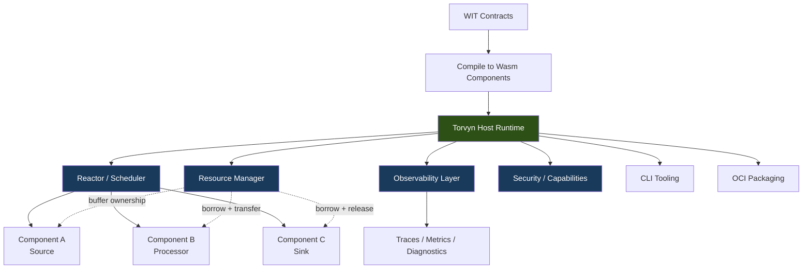
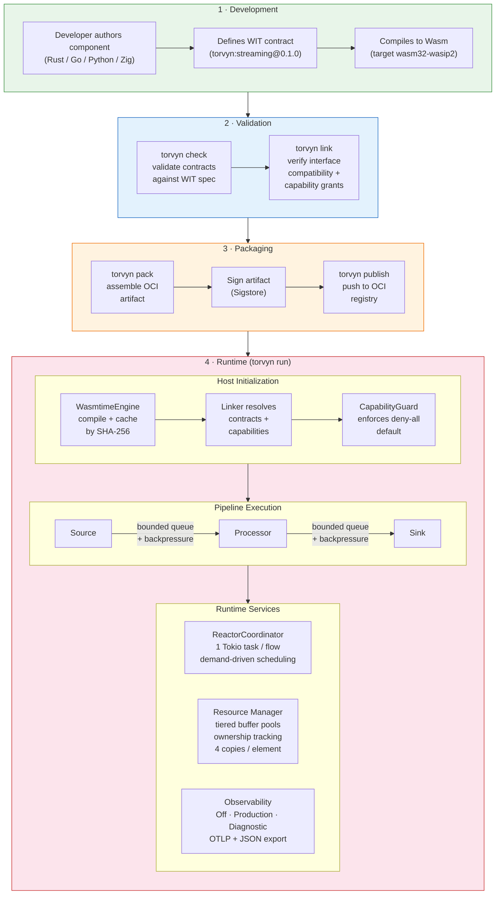
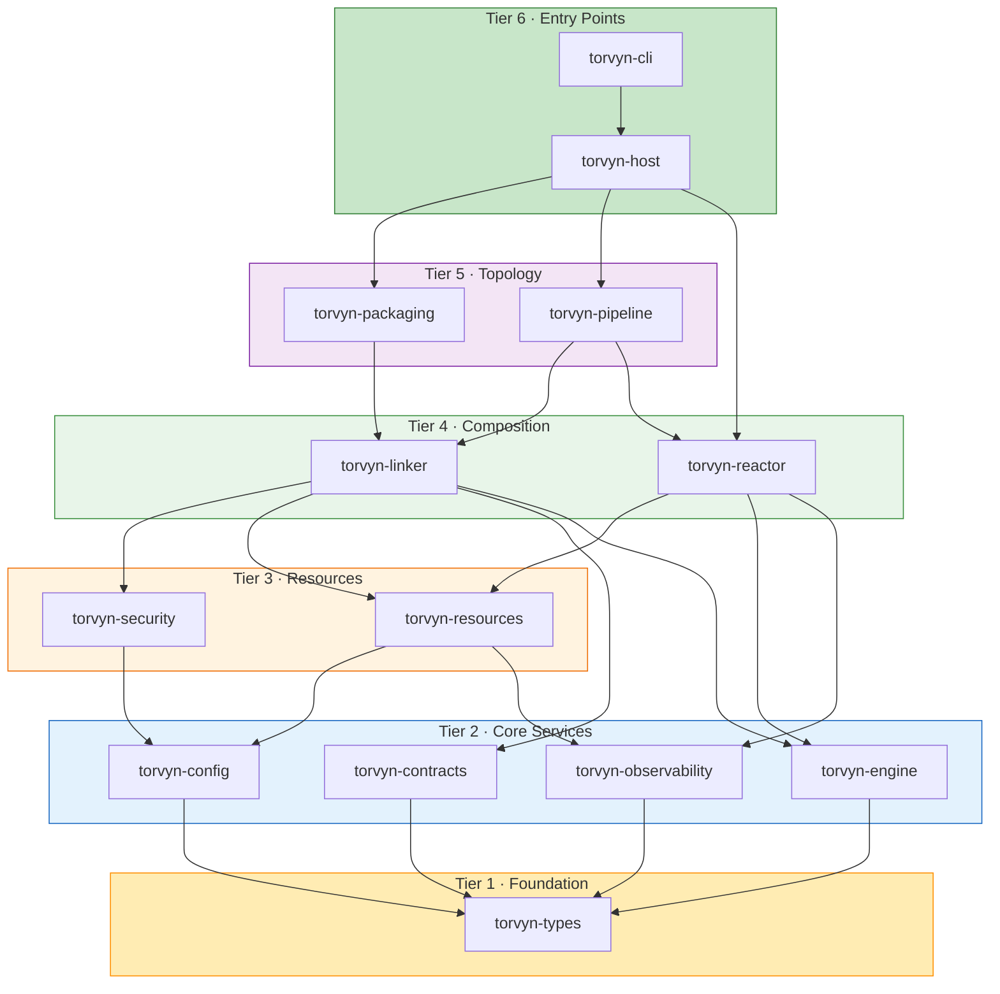
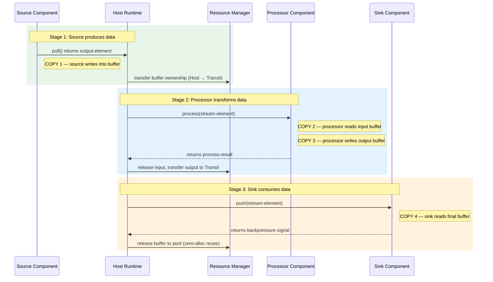
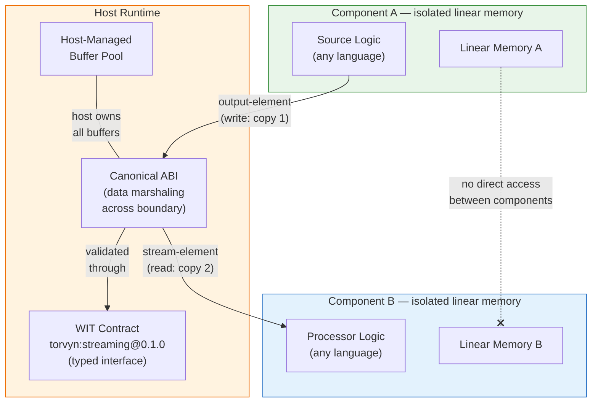
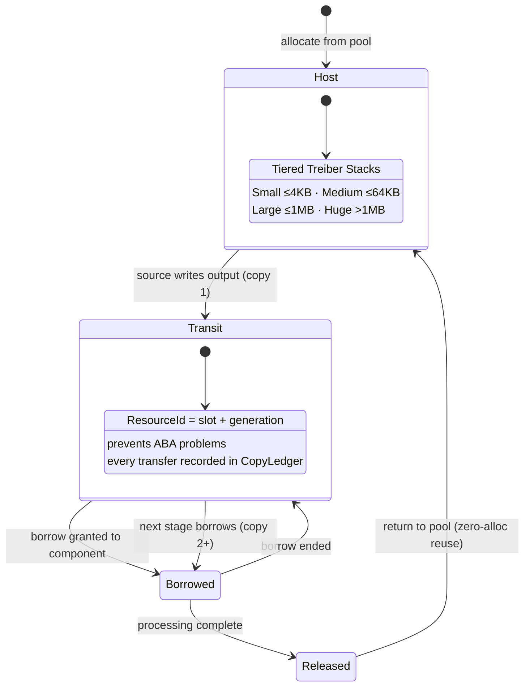

<div align="center">

# Torvyn

**The contract-first runtime for safe, observable, low-copy reactive streaming.**

[](https://github.com/torvyn/torvyn/actions/workflows/ci.yml)
[](https://crates.io/crates/torvyn)
[](https://docs.rs/torvyn)
[](#license)
[](#minimum-supported-rust-version)

[Documentation](https://torvyn.github.io/torvyn/) · [API Reference](https://docs.rs/torvyn) · [Getting Started](documents/getting-started.md) · [Architecture](documents/ARCHITECTURE.md) · [FAQ](documents/FAQ.md) · [Contributing](CONTRIBUTING.md)

</div>

---

## What is Torvyn?

Torvyn is an ownership-aware reactive component runtime for building safe, low-latency, polyglot streaming pipelines. It composes sandboxed WebAssembly components into pipelines on a single node, using typed WIT contracts with explicit ownership semantics. The runtime manages all buffer memory, enforces backpressure, tracks every data copy, and exports fine-grained observability. Components can be written in any language that compiles to WebAssembly Components.

## Why Torvyn?

Modern infrastructure teams face a persistent trade-off. Traditional microservices provide isolation and deployment flexibility, but every service boundary introduces serialization overhead, network stack costs, buffer allocations, and observability stitching — even when services run on the same node. In-process plugin systems eliminate that boundary overhead, but sacrifice safety: memory issues at FFI boundaries, weak isolation, language lock-in, and poor resource governance become the new costs. Teams are forced to choose between performance and safety.

This gap is growing. AI-native pipelines, edge stream processing, event-driven data planes, and real-time inference chains all demand fine-grained, low-latency composition. Containers are too heavy per stage. Message brokers add unnecessary hops. Ad hoc pipeline libraries lack contracts, observability, and security. The tooling landscape is fragmented across message brokers, actor systems, async runtimes, RPC layers, and service meshes — none designed as a unified ownership-aware runtime.

Torvyn fills this gap. It replaces heavy service boundaries with contract-defined component boundaries backed by WebAssembly sandboxing. Every component interaction is explicitly typed through WIT interfaces. Data ownership is tracked by the host runtime — copies are bounded, measurable, and operationally visible. Backpressure is built into stream semantics. Capability-based isolation means every component runs with only the permissions it has been granted. And every stream, resource handoff, queueing point, and failure is traceable through production-grade OpenTelemetry integration. The result: the safety of capability-based sandboxing, the composability of typed interfaces, and performance competitive with in-process systems.

## Architecture



The runtime is structured as a workspace of focused crates with no circular dependencies. `torvyn-types` is the universal leaf; `torvyn-host` and `torvyn-cli` are the top-level binaries. See [ARCHITECTURE.md](documents/ARCHITECTURE.md) for the full crate graph, data flow diagrams, and design rationale.

### Project Lifecycle

From authoring a component to observing it in production:



### Crate Dependency Graph



### Stream Element Hot Path

Every data element traverses this path through a Source → Processor → Sink pipeline, producing exactly **4 measured payload copies** per element. All copies are instrumented by the resource manager's copy ledger.



### Wasm Component Isolation

Each component runs in its own isolated linear memory. Data crosses boundaries through the Canonical ABI, validated against WIT contracts. Components cannot access each other's memory.



### Buffer Ownership State Machine

All byte buffers are allocated, tracked, and pooled by the host. Components access them through opaque handles with explicit borrow/own semantics.



## Quick Start

```bash
# Install the Torvyn CLI
cargo install torvyn-cli

# Create a new project with a starter pipeline
torvyn init my-pipeline --template full-pipeline
cd my-pipeline

# Validate contracts and check compatibility
torvyn check

# Run the pipeline locally with tracing enabled
torvyn run

# View latency, throughput, and copy accounting
torvyn bench
```

The starter template creates a two-component pipeline (Source to Sink) with WIT contracts, a pre-built Rust implementation, and a working configuration. `torvyn run` launches the pipeline with live diagnostics. `torvyn bench` reports latency percentiles, throughput, queue pressure, and per-element copy counts.

> **Prerequisites:** Rust 1.91+, `wasm32-wasip2` target (`rustup target add wasm32-wasip2`), Wasmtime 21+.

## Key Features

- **Contract-first composition** — WIT interface definitions specify data exchange, ownership rules, and error models. Compatibility is validated before runtime.
- **Ownership-aware resources** — Host-managed byte buffers with explicit create / borrow / transfer / release lifecycle. Every copy is instrumented.
- **Reactive backpressure** — Bounded queues with high/low watermark flow control and credit-based demand propagation. Slow consumers cannot cause unbounded queue growth.
- **Capability-based security** — Deny-all-by-default sandboxing. Each component receives only the permissions explicitly granted.
- **Production-grade observability** — Three-level system (Off / Production / Diagnostic) with explicit overhead budgets. Native OpenTelemetry export for traces and metrics.
- **Polyglot components** — Write components in any language targeting WebAssembly Components. Rust-first, with planned support for Go, Python, and more.
- **OCI packaging** — Package and distribute components as OCI-compatible artifacts with signed provenance.
- **CLI-first workflow** — `init`, `check`, `link`, `run`, `trace`, `bench`, `pack`, `publish`, `doctor`.

## Performance

Torvyn treats benchmarks as product features. All performance claims are backed by reproducible methodology published in the repository.

| Metric | Target | Notes |
|--------|--------|-------|
| Per-element runtime overhead | < 5 us | Excludes component execution time |
| Observability overhead (Production level) | < 500 ns per element | Counters + histograms only |
| Copy accounting | Exactly 4 copies per element (Source-Processor-Sink) | Read/write per stage boundary |
| Pipeline startup | Sub-second for cached components | Wasmtime compilation cached via `ComponentTypeId` |

Benchmark comparisons against same-node gRPC, process boundaries, and conventional plugin approaches are published in [`benches/`](benches/) and tracked in CI to catch regressions. See `torvyn bench --help` for details on running benchmarks locally.

> **Note:** These are design targets for v0.1. Actual measurements will be published with each release once the benchmark suite is operational.

## Status

Torvyn is in **active development (Phase 0)**. The high-level and low-level designs are complete. Implementation is underway.

| Component | Status |
|-----------|--------|
| Core type system (`torvyn-types`) | Complete |
| WIT contracts (`torvyn-contracts`) | Complete |
| Configuration (`torvyn-config`) | Complete |
| Wasm engine integration (`torvyn-engine`) | Complete |
| Observability (`torvyn-observability`) | Complete |
| Resource manager (`torvyn-resources`) | Complete |
| Security (`torvyn-security`) | Complete |
| Reactor / scheduler (`torvyn-reactor`) | Complete |
| Linker (`torvyn-linker`) | Complete |
| Pipeline (`torvyn-pipeline`) | Complete |
| Packaging (`torvyn-packaging`) | Complete |
| Host runtime (`torvyn-host`) | Complete |
| CLI (`torvyn-cli`) | Complete |
| Integration tests | Complete |
| Benchmark suite | Complete |

**What works today:** All core crates implemented, CLI commands, integration tests, benchmark suite.
**What is next:** OSS infrastructure, first public release, community feedback.

See [ROADMAP.md](documents/ROADMAP.md) for the full phased plan.

## Documentation

- **[Documentation Site](https://torvyn.github.io/torvyn/)** — Guides, tutorials, examples, and architecture docs
- **[API Reference (docs.rs)](https://docs.rs/torvyn)** — Generated Rust API documentation
- [Getting Started](https://torvyn.github.io/torvyn/docs/getting-started/quickstart.html) — Install, create, and run your first pipeline
- [Core Concepts](https://torvyn.github.io/torvyn/docs/concepts/overview.html) — Contracts, resources, streams, capabilities, flows
- [Architecture Guide](documents/ARCHITECTURE.md) — Crate structure, data flows, design decisions
- [CLI Reference](https://torvyn.github.io/torvyn/docs/reference/cli.html) — All commands and options
- [FAQ](FAQ.md) — Common questions and honest answers

## Contributing

Torvyn welcomes contributions. Whether you are fixing a typo, reporting a bug, improving documentation, or implementing a feature — your participation makes the project better.

Start with [CONTRIBUTING.md](CONTRIBUTING.md) for guidelines on code style, testing, commit conventions, and the review process. For larger changes, open a Discussion or Issue first so the community can provide early feedback.

## Community

- [GitHub Discussions](https://github.com/torvyn/torvyn/discussions) — Questions, ideas, and general conversation
- [Issue Tracker](https://github.com/torvyn/torvyn/issues) — Bug reports and feature requests
- [Roadmap](documents/ROADMAP.md) — What is planned and how to influence priorities

## License

Torvyn is licensed under the [Apache License, Version 2.0](LICENSE).

Copyright 2025 Torvyn Contributors.

### Contribution

Unless you explicitly state otherwise, any contribution intentionally submitted for inclusion in Torvyn by you, as defined in the Apache-2.0 license, shall be licensed under the Apache License 2.0, without any additional terms or conditions.

## Minimum Supported Rust Version

The current MSRV is **Rust 1.91**. This is enforced in CI and will only be raised in minor or major version bumps, never in patch releases.
