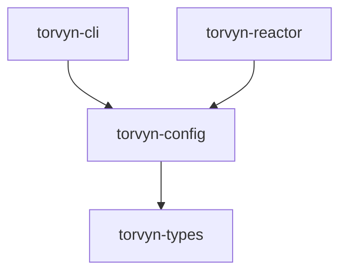

# torvyn-config

[](https://crates.io/crates/torvyn-config)
[](https://docs.rs/torvyn-config)
[](https://github.com/torvyn/torvyn/blob/main/LICENSE)

Configuration parsing, validation, and schema definitions for the [Torvyn](https://github.com/torvyn/torvyn) reactive streaming runtime.

## Overview

`torvyn-config` implements the **two-configuration-context model** that separates component authoring concerns from pipeline deployment concerns:

1. **Component Manifest** (`Torvyn.toml`) — lives in a component project root. Contains project metadata, component declarations, build/test configuration, and optional inline pipeline definitions.

2. **Pipeline Definition** — either `[flow.*]` tables inline in `Torvyn.toml` or a standalone `pipeline.toml`. Defines flow topology, per-component overrides, scheduling, backpressure, and resource limits.

The crate handles TOML parsing, environment variable interpolation, configuration merging, and structural validation before any runtime component sees the data.

## Position in the Architecture

`torvyn-config` sits at **Tier 2 (Core Services)** and depends only on `torvyn-types`.



## Modules

| Module | Responsibility |
|--------|---------------|
| `manifest` | `ProjectMetadata`, `ComponentManifest`, `ComponentDecl`, `BuildConfig`, `TestConfig`, `RegistryConfig` |
| `pipeline` | `PipelineDefinition`, `FlowDef`, `NodeDef`, `EdgeDef` |
| `runtime` | `RuntimeConfig`, `SchedulingConfig`, `BackpressureConfig`, `ObservabilityConfig`, `SecurityConfig`, `CapabilityGrant` |
| `loader` | `load_config()`, `load_manifest()`, `load_pipeline()`, `ResolvedConfig` |
| `validate` | `validate_manifest()`, `validate_pipeline()` — structural and semantic checks |
| `merge` | Merge functions for layered configuration (defaults + file + env overrides) |
| `env` | `collect_env_overrides()`, `interpolate_env()` — `TORVYN_*` environment variable support |
| `error` | `ConfigParseError`, `ConfigErrors` — rich diagnostics with source locations |

## Usage

```rust
use torvyn_config::{load_config, load_manifest, load_pipeline};

// Load and validate a full configuration (manifest + pipeline)
let config = load_config("./Torvyn.toml")?;
println!("Project: {}", config.manifest.torvyn.name);

for (name, flow) in &config.flows {
    println!("Flow: {name} — {} nodes, {} edges",
        flow.nodes.len(), flow.edges.len());
}

// Or load components independently
let manifest = load_manifest("./Torvyn.toml")?;
let pipeline = load_pipeline("./pipeline.toml")?;
```

### Environment Variable Overrides

All configuration values can be overridden via `TORVYN_`-prefixed environment variables:

```bash
TORVYN_RUNTIME_MAX_FUEL=500000 \
TORVYN_SCHEDULING_TICK_MS=5 \
  torvyn run pipeline.toml
```

## Feature Flags

| Feature | Default | Description |
|---------|---------|-------------|
| `json` | Yes | Enables JSON serialization of configuration structures via `serde_json` |
| `env` | Yes | Enables environment variable interpolation and overrides |

## License

Licensed under the Apache License, Version 2.0. See [LICENSE](https://github.com/torvyn/torvyn/blob/main/LICENSE) for details.

Part of the [Torvyn](https://github.com/torvyn/torvyn) project.
