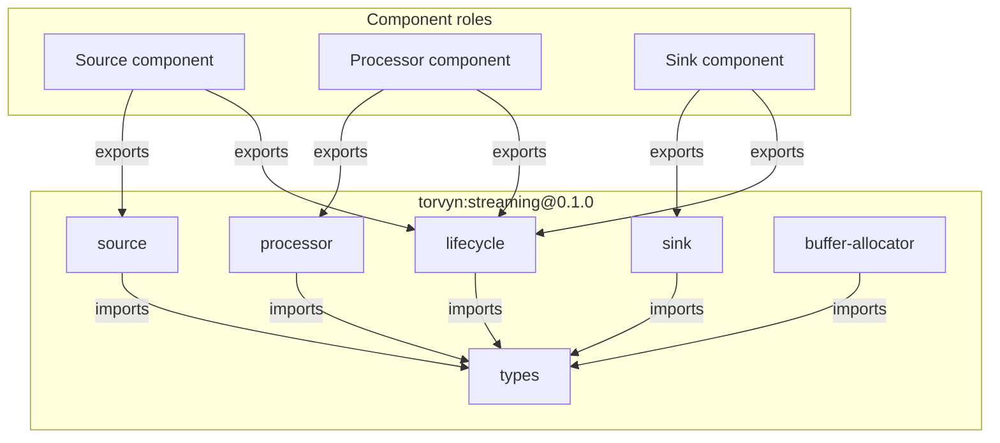
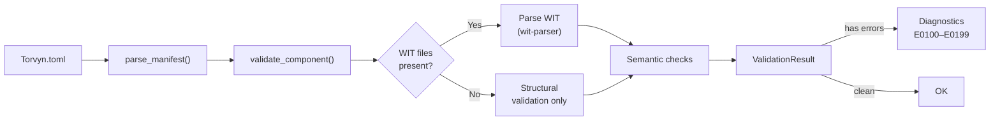

# torvyn-contracts

[](https://crates.io/crates/torvyn-contracts)
[](https://docs.rs/torvyn-contracts)
[](https://github.com/torvyn/torvyn/blob/main/LICENSE)

WIT contracts and validation for the [Torvyn](https://github.com/torvyn/torvyn) reactive streaming runtime.

## Overview

`torvyn-contracts` is the contract layer for Torvyn. It bundles the canonical WIT (WebAssembly Interface Types) definitions for `torvyn:streaming@0.1.0`, provides single-component validation (`torvyn check`), version compatibility checking, and multi-component link validation (`torvyn link`).

All diagnostics use structured error codes in the range **E0100--E0199**, with source locations and actionable fix suggestions.

## Position in the Architecture

`torvyn-contracts` sits at **Tier 2 (Core Services)** and depends only on `torvyn-types`.

## WIT Package Structure

The bundled `torvyn:streaming@0.1.0` package defines the interfaces that every Torvyn component must implement or import:



## Validation Pipeline



## Error Code Ranges

| Range | Category |
|-------|----------|
| E0100--E0109 | WIT parse errors |
| E0110--E0119 | Manifest errors |
| E0120--E0139 | Semantic validation errors |
| E0140--E0159 | Compatibility errors |
| E0160--E0179 | Link errors |

## Key Types and Functions

| Export | Description |
|--------|-------------|
| `validate_component()` | Full single-component validation against WIT contracts |
| `parse_manifest()` | Parse and extract component declaration from `Torvyn.toml` |
| `check_compatibility()` | Semver-aware compatibility check between component versions |
| `validate_pipeline()` | Multi-component link validation for pipeline definitions |
| `wit_streaming_path()` | Returns the filesystem path to the bundled canonical WIT files |
| `ValidationResult` | Accumulated diagnostics with `is_ok()`, `format_all()` |
| `Diagnostic` | Structured error/warning with `ErrorCode`, source location, and fix suggestion |
| `CompatibilityReport` | Result of a version compatibility check with `CompatibilityVerdict` |
| `ParsedPackage`, `ParsedWorld`, `ParsedInterface` | Parsed WIT AST types |

## Usage

```rust
use std::path::Path;
use torvyn_contracts::{validate_component, WitParserImpl};

let parser = WitParserImpl::new();
let result = validate_component(Path::new("my-component/"), &parser);

if result.is_ok() {
    println!("Component passed all contract checks.");
} else {
    eprintln!("{}", result.format_all());
}
```

## Feature Flags

| Feature | Default | Description |
|---------|---------|-------------|
| `wit-parser-backend` | Yes | Enables full WIT parsing via the `wit-parser` crate. Without this, only structural validation is available. |
| `serde` | Yes | Enables serialization of diagnostic and report types |

## License

Licensed under the Apache License, Version 2.0. See [LICENSE](https://github.com/torvyn/torvyn/blob/main/LICENSE) for details.

Part of the [Torvyn](https://github.com/torvyn/torvyn) project.
