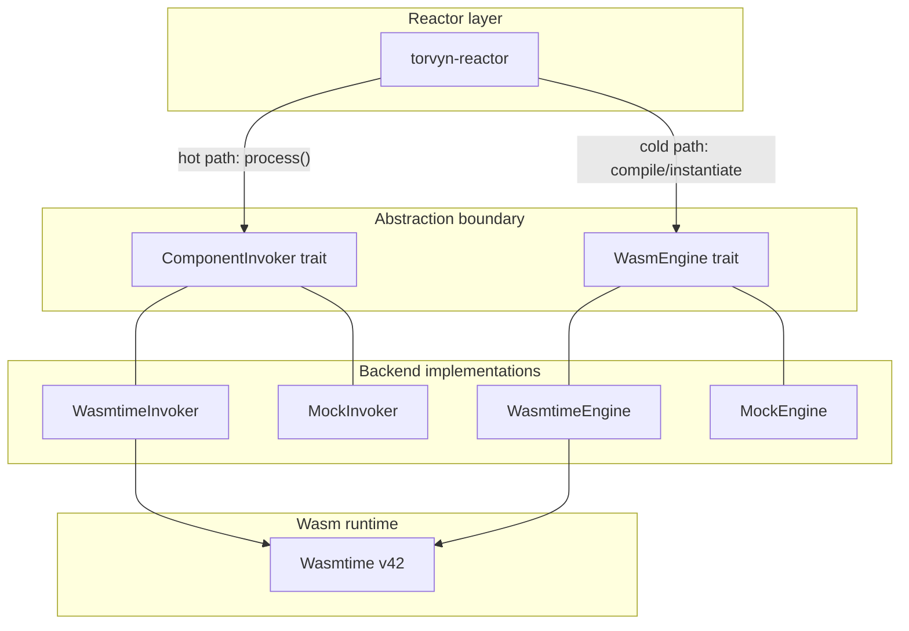

# torvyn-engine

[](https://crates.io/crates/torvyn-engine)
[](https://docs.rs/torvyn-engine)
[](https://github.com/torvyn/torvyn/blob/main/LICENSE)

Wasm engine abstraction and component invocation layer for the [Torvyn](https://github.com/torvyn/torvyn) reactive streaming runtime.

## Overview

`torvyn-engine` provides the abstraction boundary between the Torvyn reactor and the underlying WebAssembly runtime. All Wasm interactions -- compilation, instantiation, fuel management, memory limits, and hot-path invocation -- go through two core traits: `WasmEngine` and `ComponentInvoker`. The default backend is [Wasmtime](https://wasmtime.dev/) v42 with Component Model support.

This design insulates the rest of the Torvyn codebase from Wasmtime-specific APIs, making it possible to swap backends or use mock implementations for testing without touching reactor logic.

## Position in the Architecture

`torvyn-engine` sits at **Tier 2 (Core Services)** and depends only on `torvyn-types`.

## Engine Abstraction Layers



## Key Types and Traits

| Export | Description |
|--------|-------------|
| `WasmEngine` | Trait for cold-path operations: compile, instantiate, configure fuel/memory limits |
| `ComponentInvoker` | Trait for hot-path typed invocation: `process()`, `poll_source()`, `deliver_sink()` |
| `WasmtimeEngine` | Wasmtime-backed `WasmEngine` implementation |
| `WasmtimeInvoker` | Wasmtime-backed `ComponentInvoker` implementation |
| `CompiledComponent` | Handle to a compiled Wasm component, shareable across instances |
| `ComponentInstance` | Live instance with its own store, fuel budget, and memory |
| `CompiledComponentCache` | SHA-256-keyed cache for compiled components with optional disk persistence |
| `StreamElement` / `OutputElement` | Input and output types for the processing hot path |
| `ProcessResult` / `InvocationResult` | Return types carrying output elements and execution metadata |
| `WasmtimeEngineConfig` | Configuration: compilation strategy, fuel limits, memory caps, epoch interruption |
| `CompilationStrategy` | Enum: `Cranelift` (optimized) or `Winch` (fast compile) |
| `EngineError` | Structured error type for all engine operations |

## Modules

| Module | Contents |
|--------|----------|
| `traits` | `WasmEngine` and `ComponentInvoker` trait definitions |
| `wasmtime_engine` | `WasmtimeEngine` implementation (feature-gated) |
| `wasmtime_invoker` | `WasmtimeInvoker` implementation (feature-gated) |
| `cache` | `CompiledComponentCache` with in-memory and disk-backed storage |
| `config` | `WasmtimeEngineConfig`, `CompilationStrategy` |
| `types` | `CompiledComponent`, `ComponentInstance`, `StreamElement`, `ProcessResult`, etc. |
| `error` | `EngineError` variants |
| `mock` | `MockEngine` and `MockInvoker` for testing (feature-gated) |

## Usage

```rust
use torvyn_engine::{
    WasmEngine, WasmtimeEngine, WasmtimeEngineConfig,
    ComponentInvoker, WasmtimeInvoker,
};
use std::path::Path;

#[tokio::main]
async fn main() -> Result<(), Box<dyn std::error::Error>> {
    let config = WasmtimeEngineConfig::default();
    let engine = WasmtimeEngine::new(config)?;

    // Cold path: compile and instantiate
    let compiled = engine.compile(Path::new("my_component.wasm")).await?;
    let instance = engine.instantiate(&compiled).await?;

    // Hot path: invoke via ComponentInvoker
    let invoker = WasmtimeInvoker::new(&instance)?;
    let result = invoker.process(stream_element).await?;
    Ok(())
}
```

## Feature Flags

| Feature | Default | Description |
|---------|---------|-------------|
| `wasmtime-backend` | Yes | Enables the Wasmtime v42 backend with Component Model and Cranelift |
| `mock` | No | Enables `MockEngine` and `MockInvoker` for unit testing downstream crates |
| `tracing-support` | No | Enables structured logging of compilation, instantiation, and invocation via `tracing` |

## License

Licensed under the Apache License, Version 2.0. See [LICENSE](https://github.com/torvyn/torvyn/blob/main/LICENSE) for details.

Part of the [Torvyn](https://github.com/torvyn/torvyn) project.
