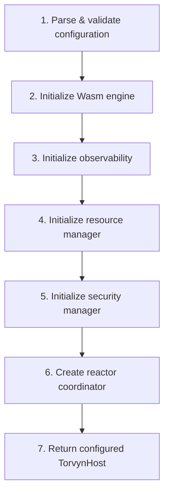
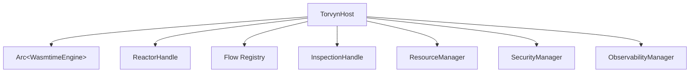

# torvyn-host

[](https://crates.io/crates/torvyn-host)
[](https://docs.rs/torvyn-host)
[](https://github.com/torvyn/torvyn/blob/main/LICENSE)

Runtime orchestration shell for the [Torvyn](https://github.com/torvyn/torvyn) streaming runtime.

## Overview

`torvyn-host` is a thin orchestration layer that coordinates startup, flow registration, signal handling, and graceful shutdown for the Torvyn runtime. It owns no complex domain logic itself -- it delegates to subsystem crates (`torvyn-engine`, `torvyn-reactor`, `torvyn-pipeline`, `torvyn-security`, etc.) and composes them into a running host process.

The host is constructed via a **staged builder** that enforces correct initialization order at compile time.

## Position in the Architecture

This crate sits at **Tier 6 (Entry Point)** in the Torvyn layered architecture. It depends on all subsystem crates and serves as the programmatic entry point for running Torvyn pipelines. All code in this crate is **cold path** -- hot-path element processing lives in `torvyn-reactor`.

## Host Lifecycle

```mermaid
stateDiagram-v2
    [*] --> Ready : HostBuilder::build()
    Ready --> Running : host.run()
    Running --> Running : processing elements
    Running --> ShuttingDown : signal / all flows done / error
    ShuttingDown --> Stopped : drain complete
    Stopped --> [*]
```

## Builder Initialization Sequence

The `HostBuilder` follows a strict initialization order:



## Ownership Structure



## Key Types

| Type | Purpose |
|------|---------|
| `TorvynHost` | The running host instance; owns all subsystem handles |
| `HostBuilder` | Staged builder for constructing a configured host |
| `HostConfig` | Validated runtime configuration |
| `HostStatus` | Current host state (`Ready`, `Running`, `ShuttingDown`, `Stopped`) |
| `FlowRecord` | Metadata for a registered flow |
| `InspectionHandle` | Handle for querying runtime state (flows, metrics, health) |
| `FlowSummary` | Snapshot of a flow's current status and statistics |
| `ShutdownOutcome` | Result of the graceful shutdown sequence |

## Error Types

| Type | Purpose |
|------|---------|
| `HostError` | Top-level error for host operations |
| `StartupError` | Errors during host initialization, tagged with `StartupStage` |
| `FlowError` | Errors during flow registration or execution |

## Feature Flags

| Feature | Default | Description |
|---------|---------|-------------|
| `signal` | Yes | Enables Unix signal handling (SIGINT/SIGTERM) for graceful shutdown |

## Usage

```rust
use torvyn_host::{HostBuilder, HostError};

#[tokio::main]
async fn main() -> Result<(), HostError> {
    let mut host = HostBuilder::new()
        .with_config_file("Torvyn.toml")
        .build()
        .await?;

    // Run until completion or signal
    host.run().await
}
```

### Programmatic flow registration

```rust
use torvyn_host::{HostBuilder, HostConfig};

#[tokio::main]
async fn main() -> Result<(), Box<dyn std::error::Error>> {
    let config = HostConfig::from_file("Torvyn.toml")?;
    let mut host = HostBuilder::new()
        .with_config(config)
        .build()
        .await?;

    // Query runtime state
    let handle = host.inspection_handle();
    for flow in handle.list_flows() {
        println!("{}: {:?}", flow.id, flow.state);
    }

    host.run().await?;
    Ok(())
}
```

## Modules

| Module | Purpose |
|--------|---------|
| `builder` | `HostBuilder` and `HostConfig` |
| `host` | `TorvynHost`, `HostStatus`, `FlowRecord` |
| `startup` | Startup sequence logic |
| `shutdown` | Graceful shutdown and `ShutdownOutcome` |
| `inspection` | `InspectionHandle` and `FlowSummary` |
| `signal` | Unix signal handling (feature-gated) |
| `error` | `HostError`, `StartupError`, `FlowError`, `StartupStage` |

## Repository

This crate is part of the [Torvyn](https://github.com/torvyn/torvyn) project.
See the main repository for architecture documentation and contribution guidelines.
