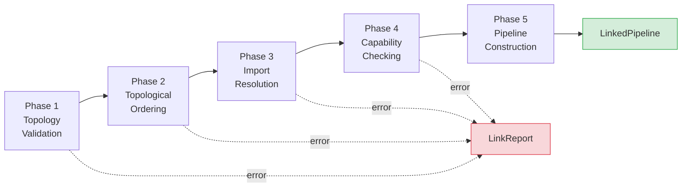

# torvyn-linker

[](https://crates.io/crates/torvyn-linker)
[](https://docs.rs/torvyn-linker)
[](https://github.com/torvyn/torvyn/blob/main/LICENSE)

Component linking and pipeline composition for the
[Torvyn](https://github.com/torvyn/torvyn) streaming runtime.

## Overview

`torvyn-linker` performs static, ahead-of-execution linking of component
pipelines. Before any data flows, the linker validates the entire pipeline
graph, resolves imports against exports, checks capabilities, and produces a
fully resolved `LinkedPipeline` that the reactor can execute without further
resolution steps.

Linking is a pure, deterministic operation: the same inputs always produce the
same `LinkedPipeline` or the same set of diagnostics. This makes pipeline
composition testable and reproducible.

## Position in the Architecture

**Tier 4 — Composition.** Bridges component definitions and the execution
engine.

| Dependency | Role |
|---|---|
| `torvyn-types` | Core type definitions |
| `torvyn-contracts` | Contract schemas for import/export type checking |
| `torvyn-engine` | Component metadata and instance descriptors |
| `torvyn-resources` | Resource requirement declarations |
| `torvyn-security` | Capability checking during the link phase |

## Five-Phase Linking Pipeline



**Phase 1 — Topology Validation.** Checks for cycles, disconnected subgraphs,
and malformed edges.

**Phase 2 — Topological Ordering.** Produces a deterministic execution order
respecting data dependencies.

**Phase 3 — Import Resolution.** Matches each component's declared imports to
the exports of upstream components, verifying contract compatibility.

**Phase 4 — Capability Checking.** Ensures every component has the security
capabilities it requires, as determined by `torvyn-security`.

**Phase 5 — Pipeline Construction.** Assembles the final `LinkedPipeline` with
all connections, resource requirements, and metadata resolved.

If any phase fails, the linker produces a `LinkReport` containing structured
`LinkDiagnostic` entries with location, severity, and suggested fixes.

## Key Types

| Type | Description |
|---|---|
| `PipelineLinker` | Entry point — accepts a topology and produces a `LinkedPipeline` |
| `PipelineTopology` | Input graph of nodes and edges |
| `TopologyNode` / `TopologyEdge` | Graph primitives |
| `ComponentResolution` | Resolved component metadata |
| `ImportResolution` | Matched import-to-export binding |
| `PipelineResolution` | Aggregate resolution state across all components |
| `LinkedPipeline` | Fully resolved, ready-to-execute pipeline |
| `LinkedComponent` | A component with all imports and capabilities resolved |
| `LinkedConnection` | A validated, typed connection between two linked components |
| `LinkerError` | Structured error type for linking failures |
| `LinkReport` | Collection of `LinkDiagnostic` entries from a linking attempt |
| `LinkDiagnostic` | Single diagnostic with location, severity, and message |

## Modules

| Module | Purpose |
|---|---|
| `linker` | `PipelineLinker` and the five-phase algorithm |
| `topology` | `PipelineTopology`, `TopologyNode`, `TopologyEdge` |
| `resolver` | Import resolution and contract matching |
| `linked_pipeline` | `LinkedPipeline`, `LinkedComponent`, `LinkedConnection` |
| `error` | `LinkerError`, `LinkReport`, `LinkDiagnostic` |

## Usage

```rust
use torvyn_linker::{PipelineLinker, PipelineTopology};

let topology = PipelineTopology::builder()
    .add_node("csv-reader", csv_reader_component)
    .add_node("transformer", transform_component)
    .add_node("parquet-writer", parquet_writer_component)
    .add_edge("csv-reader", "transformer", "records")?
    .add_edge("transformer", "parquet-writer", "transformed")?
    .build()?;

let linker = PipelineLinker::new(&resolver, &capability_set);
match linker.link(&topology) {
    Ok(linked) => {
        println!("linked {} components", linked.components().len());
        // hand off to reactor for execution
    }
    Err(report) => {
        for diag in report.diagnostics() {
            eprintln!("{}: {}", diag.severity(), diag.message());
        }
    }
}
```

## Repository

This crate is part of the [Torvyn](https://github.com/torvyn/torvyn) workspace.
See the root repository for build instructions, the full architecture guide,
and contribution guidelines.
