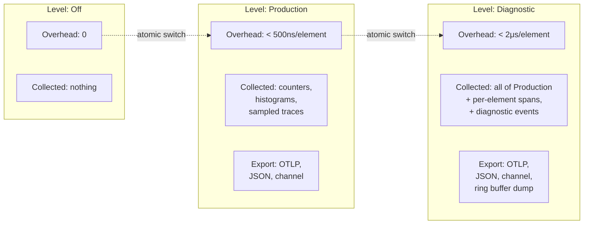

# torvyn-observability

[](https://crates.io/crates/torvyn-observability)
[](https://docs.rs/torvyn-observability)
[](https://github.com/torvyn/torvyn/blob/main/LICENSE)

Tracing, metrics, diagnostics, and runtime inspection for the [Torvyn](https://github.com/torvyn/torvyn) reactive streaming runtime.

## Overview

`torvyn-observability` provides the full observability subsystem for Torvyn. It implements the `EventSink` trait from `torvyn-types` for hot-path recording and manages three internal subsystems: **metrics** (pre-allocated counters, gauges, and histograms), **tracing** (trace context propagation, sampling, and span ring buffers), and **events** (structured diagnostic events for lifecycle, performance, error, security, and resource state transitions).

The central design constraint is that observability overhead on the hot path must stay within explicit budgets, enforced by the three-level system described below.

## Position in the Architecture

`torvyn-observability` sits at **Tier 2 (Core Services)** and depends only on `torvyn-types`.

## Observability Levels



Level switching is **atomic** and does not require restarting flows. The `ObservabilityCollector` checks the current level on every event and short-circuits when the level is below the event's threshold.

## Key Types

| Export | Description |
|--------|-------------|
| `ObservabilityCollector` | Central orchestrator; implements `EventSink`, owns the metrics registry and event channel |
| `FlowObserver` | Per-flow handle given to the reactor for scoped metrics and trace recording |
| `MetricsRegistry` | Pre-allocated, lock-free metrics storage scoped by flow, component, and stream |
| `Counter` | Monotonic counter (e.g., elements processed, errors) |
| `Gauge` | Point-in-time value (e.g., buffer occupancy, active instances) |
| `Histogram` | Distribution recorder with configurable bucket boundaries (e.g., processing latency) |
| `SpanRingBuffer` | Fixed-capacity ring buffer for retroactive span export on error |
| `FlowTraceContext` | Per-flow W3C-compatible trace context with propagation support |
| `Sampler` / `SamplingDecision` | Configurable trace sampling (rate-based, always-on, always-off) |
| `ObservabilityConfig` | Configuration struct for levels, sampling rates, export targets |
| `DiagnosticEvent` | Structured event with `EventCategory` and typed `EventPayload` |
| `BenchmarkReport` | Output of the built-in overhead micro-benchmark |

## Modules

| Module | Contents |
|--------|----------|
| `collector` | `ObservabilityCollector`, `FlowObserver` |
| `config` | `ObservabilityConfig`, `TracingConfig`, `MetricsConfig`, `ExportConfig` |
| `metrics` | `Counter`, `Gauge`, `Histogram`, `MetricsRegistry`, `FlowMetricsSnapshot`, pool and flow metric helpers |
| `tracer` | `SpanRingBuffer`, `Sampler`, `SamplingDecision`, `FlowTraceContext`, `CompactSpanRecord`, `TraceFlags` |
| `events` | `DiagnosticEvent`, `EventCategory`, `EventPayload` |
| `export` | Export backends: `channel`, `otlp`, `json` |
| `bench` | Built-in micro-benchmark for measuring per-element overhead at each level |

## Usage

```rust
use torvyn_observability::{ObservabilityCollector, ObservabilityConfig};
use torvyn_types::ObservabilityLevel;

// Create a collector at Production level
let config = ObservabilityConfig {
    level: ObservabilityLevel::Production,
    ..Default::default()
};
let collector = ObservabilityCollector::new(config);

// Obtain a per-flow observer for the reactor
let observer = collector.flow_observer("ingest-pipeline");

// Record metrics on the hot path
observer.record_element_processed("csv-parser", latency_ns);
observer.record_backpressure("csv-parser", signal);

// Switch to Diagnostic level at runtime (atomic, no restart needed)
collector.set_level(ObservabilityLevel::Diagnostic);
```

## License

Licensed under the Apache License, Version 2.0. See [LICENSE](https://github.com/torvyn/torvyn/blob/main/LICENSE) for details.

Part of the [Torvyn](https://github.com/torvyn/torvyn) project.
