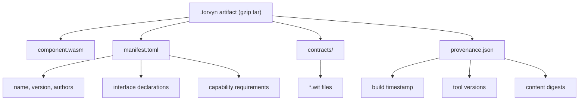

# torvyn-packaging

[](https://crates.io/crates/torvyn-packaging)
[](https://docs.rs/torvyn-packaging)
[](https://github.com/torvyn/torvyn/blob/main/LICENSE)

OCI artifact assembly, signing, and distribution for [Torvyn](https://github.com/torvyn/torvyn) streaming components.

## Overview

`torvyn-packaging` implements the packaging layer for the Torvyn runtime. It assembles compiled WebAssembly components, WIT contracts, manifests, and provenance records into distributable `.torvyn` artifacts (gzip-compressed tar archives conforming to the OCI artifact specification).

The crate provides the full artifact lifecycle: packing, unpacking, inspection, signing, caching, resolution, and registry interaction.

## Position in the Architecture

This crate sits at **Tier 5 (Topology and Distribution)** in the Torvyn layered architecture. It depends on `torvyn-types` for identity types and `torvyn-config` for manifest schema definitions. It is consumed primarily by `torvyn-cli` (the `pack`, `inspect`, and `publish` subcommands) and by `torvyn-host` for artifact resolution at startup.

## Artifact Structure



## Pack / Unpack / Inspect / Publish Workflow

```mermaid
flowchart LR
    subgraph Developer
        SRC["Source + WIT + Manifest"]
    end

    SRC -->|"pack()"| PKG["`.torvyn` artifact"]
    PKG -->|"inspect()"| RPT["InspectionResult"]
    PKG -->|"sign()"| SIG["Signed artifact"]
    SIG -->|"RegistryClient::push()"| REG["OCI Registry"]
    REG -->|"resolve()"| RES["ResolvedArtifact"]
    RES -->|"unpack()"| OUT["ArtifactContents"]

    PKG -->|"cache()"| CACHE["ArtifactCache"]
    CACHE -->|"resolve()"| RES
```

## Modules

| Module | Purpose |
|--------|---------|
| `artifact` | Core `pack()` and `unpack()` functions, `PackInput`, `PackOutput`, `ArtifactContents` |
| `manifest` | `ArtifactManifest` and `WitPackageRef` types |
| `inspection` | `inspect()` function and `InspectionResult` |
| `signing` | `SigningProvider` trait, `SignatureInfo`, `SigningMethod` |
| `provenance` | `ProvenanceRecord` generation and verification |
| `oci` | `OciReference` parsing, `RegistryClient` trait |
| `cache` | `ArtifactCache` and `CacheConfig` for local artifact storage |
| `resolution` | `resolve()` function, `ResolvedArtifact`, `ResolutionSource` |
| `digest` | `ContentDigest` (SHA-256 content addressing) |
| `media_types` | OCI media type constants for Torvyn artifacts |
| `error` | `PackagingDetailError` with structured diagnostics |

## Key Types and Traits

- **`pack(input: PackInput) -> Result<PackOutput>`** -- Assembles a `.torvyn` artifact from compiled Wasm, WIT files, and metadata.
- **`unpack(path) -> Result<ArtifactContents>`** -- Extracts an artifact back into its constituent parts.
- **`inspect(path) -> Result<InspectionResult>`** -- Reads artifact metadata without full extraction.
- **`resolve(reference) -> Result<ResolvedArtifact>`** -- Resolves an OCI reference to a local artifact, consulting cache and registry.
- **`RegistryClient`** -- Async trait for OCI registry push/pull operations.
- **`SigningProvider`** -- Trait abstracting artifact signing (local keys, Sigstore).
- **`ArtifactCache`** -- Content-addressed local cache with configurable eviction.

## Feature Flags

| Feature | Default | Description |
|---------|---------|-------------|
| `oci-registry` | No | Enables the OCI registry client implementation |
| `sigstore` | No | Enables Sigstore-based artifact signing |

## Usage

```rust
use torvyn_packaging::{pack, inspect, PackInput};
use std::path::PathBuf;

// Pack a component into a distributable artifact
let input = PackInput {
    wasm_path: PathBuf::from("target/wasm32-wasip2/release/my_component.wasm"),
    wit_dir: PathBuf::from("wit/"),
    manifest_path: PathBuf::from("Torvyn.toml"),
    output_dir: PathBuf::from(".torvyn/artifacts/"),
    sign: false,
};

let output = pack(input)?;
println!("Artifact: {} ({})", output.artifact_path.display(), output.digest);

// Inspect the artifact
let info = inspect(&output.artifact_path)?;
println!("Component: {} v{}", info.manifest.name, info.manifest.version);
```

## Repository

This crate is part of the [Torvyn](https://github.com/torvyn/torvyn) project.
See the main repository for architecture documentation and contribution guidelines.
