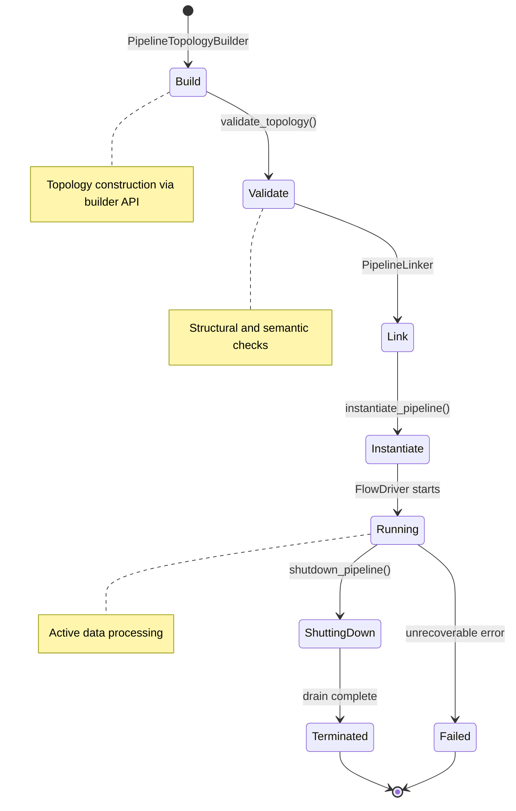

# torvyn-pipeline

[](https://crates.io/crates/torvyn-pipeline)
[](https://docs.rs/torvyn-pipeline)
[](https://github.com/torvyn/torvyn/blob/main/LICENSE)

Pipeline topology construction, validation, and instantiation for the
[Torvyn](https://github.com/torvyn/torvyn) streaming runtime.

## Overview

`torvyn-pipeline` is Torvyn's orchestration layer. It manages the full pipeline
lifecycle — from topology construction through validation, instantiation,
execution, and shutdown. This crate is the primary integration point between the
linker, the reactor, and the host runtime.

Where `torvyn-linker` resolves a static pipeline graph and `torvyn-reactor`
executes individual flows, `torvyn-pipeline` owns the end-to-end lifecycle and
coordinates these subsystems.

## Position in the Architecture

**Tier 5 — Topology.** The highest composition layer before the host binary.

| Dependency | Role |
|---|---|
| `torvyn-types` | Core type definitions |
| `torvyn-linker` | Static linking of the pipeline graph |
| `torvyn-reactor` | Flow scheduling and execution |
| `torvyn-config` | Pipeline-level configuration |

## Pipeline Lifecycle



## Key Types

| Type | Description |
|---|---|
| `PipelineTopology` | Directed graph of nodes and edges representing the pipeline |
| `TopologyNode` / `TopologyEdge` | Graph primitives with associated configuration |
| `NodeConfig` / `EdgeConfig` | Per-node and per-edge runtime settings |
| `PipelineTopologyBuilder` | Fluent builder for constructing topologies |
| `PipelineHandle` | Control handle for a running pipeline (status, shutdown) |
| `ValidationReport` | Structured output from `validate_topology()` |
| `PipelineError` | Comprehensive error type covering all lifecycle stages |

## Key Functions

| Function | Description |
|---|---|
| `flow_def_to_topology()` | Converts a declarative flow definition into a `PipelineTopology` |
| `validate_topology()` | Runs structural and semantic validation, producing a `ValidationReport` |
| `instantiate_pipeline()` | Links, allocates resources, and submits the pipeline to the reactor |
| `shutdown_pipeline()` | Initiates graceful shutdown: stops sources, drains in-flight data, releases resources |

## Modules

| Module | Purpose |
|---|---|
| `topology` | `PipelineTopology`, `TopologyNode`, `TopologyEdge` |
| `builder` | `PipelineTopologyBuilder` fluent API |
| `validate` | Topology validation rules and `ValidationReport` |
| `convert` | `flow_def_to_topology()` and format conversions |
| `instantiate` | `instantiate_pipeline()` — linking, resource allocation, reactor submission |
| `shutdown` | `shutdown_pipeline()` — graceful drain and cleanup |
| `handle` | `PipelineHandle` — runtime control surface |
| `error` | `PipelineError` definitions |

## Usage

```rust
use torvyn_pipeline::{
    PipelineTopologyBuilder, validate_topology, instantiate_pipeline,
    shutdown_pipeline,
};

// 1. Build
let topology = PipelineTopologyBuilder::new()
    .add_node("ingest", ingest_config)
    .add_node("enrich", enrich_config)
    .add_node("store", store_config)
    .add_edge("ingest", "enrich", edge_config)?
    .add_edge("enrich", "store", edge_config)?
    .build()?;

// 2. Validate
let report = validate_topology(&topology);
if !report.is_ok() {
    return Err(report.into());
}

// 3. Instantiate and run
let handle = instantiate_pipeline(topology, &runtime_context).await?;

// 4. Later, shut down gracefully
shutdown_pipeline(handle).await?;
```

## Repository

This crate is part of the [Torvyn](https://github.com/torvyn/torvyn) workspace.
See the root repository for build instructions, the full architecture guide,
and contribution guidelines.
