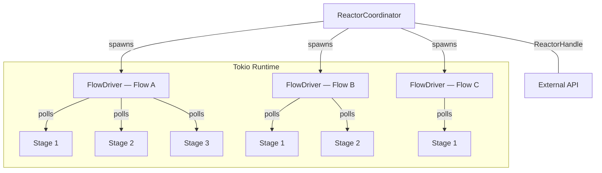
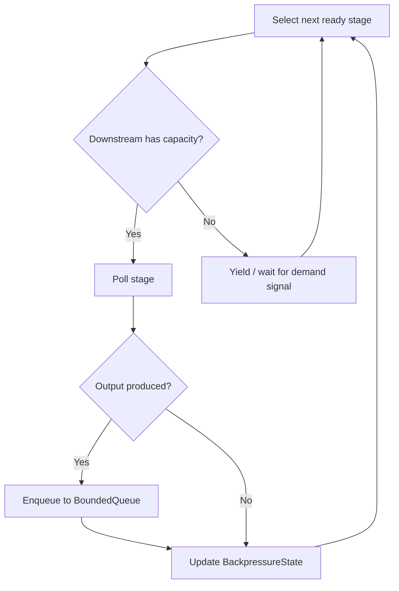

# torvyn-reactor

[](https://crates.io/crates/torvyn-reactor)
[](https://docs.rs/torvyn-reactor)
[](https://github.com/torvyn/torvyn/blob/main/LICENSE)

Stream scheduling, backpressure, and flow lifecycle for the
[Torvyn](https://github.com/torvyn/torvyn) streaming runtime.

## Overview

`torvyn-reactor` is Torvyn's execution engine. It schedules component stages
within data-flow graphs, enforces backpressure between stages, and manages the
full lifecycle of a flow from instantiation through completion or cancellation.

The reactor is built on Tokio but adds domain-specific scheduling: each flow
runs as a single Tokio task, and within that task a demand-driven scheduler
determines which stage to poll next. This design avoids per-stage task overhead
while preserving fairness and backpressure propagation.

## Position in the Architecture

**Tier 4 — Composition.** Orchestrates component execution using lower-tier
primitives.

| Dependency | Role |
|---|---|
| `torvyn-types` | Core type definitions |
| `torvyn-engine` | Component instance interface (`ComponentInstance` trait) |
| `torvyn-resources` | Buffer acquisition and release during stage execution |
| `torvyn-observability` | Metrics and span propagation |

## Reactor Architecture



## Demand-Driven Scheduling Loop

Each `FlowDriver` runs a tight scheduling loop. Stages are polled only when
downstream capacity exists, preventing unbounded buffering.



## Key Types

| Type | Description |
|---|---|
| `FlowDriver` | Executes a single flow as one Tokio task |
| `FlowDriverHandle` | Control handle for an in-flight flow (cancel, inspect) |
| `ReactorHandle` | External API to the reactor coordinator |
| `FlowTopology` | Directed graph of stages and stream connections |
| `StageDefinition` | Metadata and configuration for a single stage |
| `StreamConnection` | Typed edge between two stages |
| `SchedulingPolicy` / `DemandDrivenPolicy` | Pluggable scheduling strategies |
| `BackpressureState` | Per-connection pressure level (Normal, Elevated, Critical) |
| `BoundedQueue` | Fixed-capacity inter-stage channel |
| `FlowConfig` / `StreamConfig` | Runtime tuning (queue depth, watermarks, timeouts) |
| `FlowCancellation` / `CancellationReason` | Structured cancellation with cause tracking |
| `FlowError` | Comprehensive error type for flow execution failures |
| `ReactorEvent` | Event stream for external observers |
| `ReactorMetrics` / `FlowCompletionStats` | Throughput, latency, and utilization metrics |

## Modules

| Module | Purpose |
|---|---|
| `flow_driver` | `FlowDriver` implementation and scheduling loop |
| `handle` | `FlowDriverHandle` and `ReactorHandle` |
| `coordinator` | `ReactorCoordinator` — spawns and supervises flows |
| `scheduling` | `SchedulingPolicy` trait and built-in policies |
| `demand` | Demand signaling between stages |
| `backpressure` | `BackpressureState` and propagation logic |
| `queue` | `BoundedQueue` implementation |
| `stream` | Stream connection and typed channel management |
| `topology` | `FlowTopology`, `StageDefinition`, `StreamConnection` |
| `cancellation` | `FlowCancellation` and graceful shutdown protocol |
| `fairness` | Cross-flow fairness and starvation prevention |
| `config` | `FlowConfig` and `StreamConfig` |
| `metrics` | `ReactorMetrics` and `FlowCompletionStats` |
| `events` | `ReactorEvent` stream |
| `error` | `FlowError` definitions |

## Usage

```rust
use torvyn_reactor::{ReactorHandle, FlowTopology, FlowConfig};

// Build a flow topology
let topology = FlowTopology::builder()
    .add_stage(source_stage)
    .add_stage(transform_stage)
    .add_stage(sink_stage)
    .connect("source", "transform")?
    .connect("transform", "sink")?
    .build()?;

// Submit to the reactor
let flow_handle = reactor.submit(topology, FlowConfig::default()).await?;

// Observe completion
let stats = flow_handle.completion().await?;
println!("processed {} records in {:?}", stats.records, stats.elapsed);
```

## Repository

This crate is part of the [Torvyn](https://github.com/torvyn/torvyn) workspace.
See the root repository for build instructions, the full architecture guide,
and contribution guidelines.
