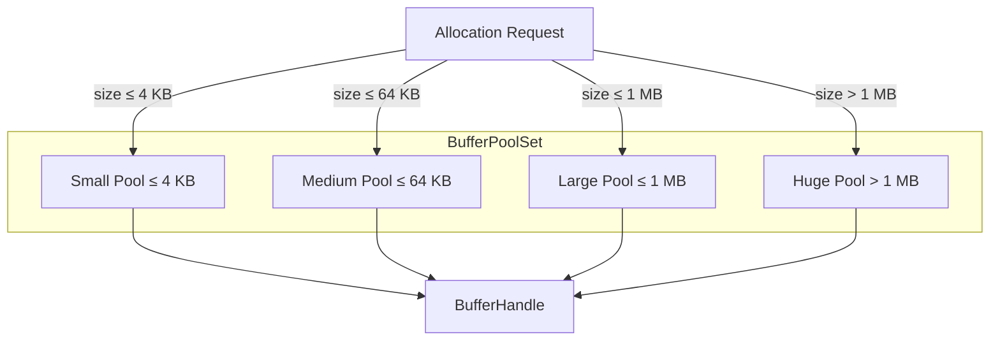

# torvyn-resources

[](https://crates.io/crates/torvyn-resources)
[](https://docs.rs/torvyn-resources)
[](https://github.com/torvyn/torvyn/blob/main/LICENSE)

Buffer pools, ownership tracking, and copy accounting for the
[Torvyn](https://github.com/torvyn/torvyn) streaming runtime.

## Overview

`torvyn-resources` is the foundation of Torvyn's ownership-aware, low-copy
promise. Components never allocate buffers directly — they receive opaque
`BufferHandle` values from the host. Every buffer has a tracked owner, every
copy is accounted for, and every transition through the system is auditable.

The crate provides a tiered buffer pool, an ownership state machine, and
per-flow copy accounting that together enforce Torvyn's resource guarantees at
the type level.

## Position in the Architecture

**Tier 3 — Resource Management.** Sits between the foundational types and the
execution engine.

| Dependency | Role |
|---|---|
| `torvyn-types` | Core type definitions (`BufferHandle`, `FlowId`, etc.) |
| `torvyn-config` | Runtime configuration for pool sizes and budgets |
| `torvyn-observability` | Metrics export for pool utilization and copy counts |

## Buffer Ownership State Machine

Every buffer follows a strict ownership lifecycle. The four numbered copy
points are the only places where data may be duplicated.

```mermaid
stateDiagram-v2
    [*] --> Pool: allocate
    Pool --> Host: ① host_acquire
    Host --> Transit: ② host_to_component
    Transit --> Borrowed: component_borrow
    Borrowed --> Transit: component_return
    Transit --> Host: ③ component_to_host
    Host --> Pool: ④ release
    Pool --> [*]: drain

    note right of Host: Owner = OwnerId::Host
    note right of Transit: Owner = OwnerId::Transit
    note right of Borrowed: Owner = OwnerId::Component
```

## Tiered Buffer Pool Architecture

Buffers are allocated from size-tiered pools to minimise internal fragmentation
and keep hot-path allocations lock-free.



## Key Types

| Type | Description |
|---|---|
| `DefaultResourceManager` | Top-level facade — pool allocation, ownership, and accounting |
| `ResourceTable` / `ResourceEntry` | Maps handles to metadata (owner, flags, content type) |
| `BufferPoolSet` | Collection of tiered pools keyed by `PoolTier` |
| `PoolTier` | `Small`, `Medium`, `Large`, `Huge` |
| `TierConfig` | Per-tier capacity, watermark, and pre-allocation settings |
| `OwnerId` | `Host`, `Component(ComponentId)`, `Transit` |
| `BufferFlags` / `ContentType` | Bitflags and MIME-style content markers attached to buffers |
| `FlowResourceStats` | Live counters for a single flow's buffer and copy usage |
| `FlowCopyStatsSnapshot` | Point-in-time snapshot of per-flow copy accounting |
| `ResourceManagerConfig` | Declarative config covering pool sizes, budgets, and watermarks |
| `ResourceInspection` | Diagnostic view into current pool and ownership state |

## Modules

| Module | Purpose |
|---|---|
| `handle` | Opaque buffer handle types |
| `table` | Resource table mapping handles to entries |
| `buffer` | Low-level buffer representation |
| `pool` | Per-tier pool implementation |
| `ownership` | Ownership state machine and transition validation |
| `accounting` | Copy-point counters and budget enforcement |
| `budget` | Per-flow and global resource budgets |
| `manager` | `DefaultResourceManager` orchestration |

## Usage

```rust
use torvyn_resources::{DefaultResourceManager, ResourceManagerConfig, PoolTier};

// Build a resource manager from config
let config = ResourceManagerConfig::default();
let mut mgr = DefaultResourceManager::new(config);

// Acquire a buffer from the small-tier pool
let handle = mgr.acquire(128, PoolTier::Small)?;

// Transfer to a component (copy point ②)
mgr.transfer_to_component(handle, component_id)?;

// When the component is done, reclaim and release
mgr.reclaim_from_component(handle)?;
mgr.release(handle)?;
```

## Repository

This crate is part of the [Torvyn](https://github.com/torvyn/torvyn) workspace.
See the root repository for build instructions, the full architecture guide,
and contribution guidelines.
