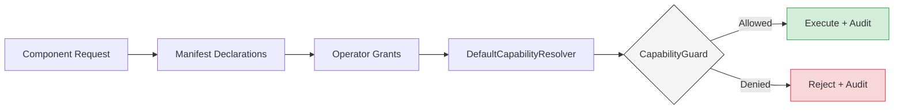

# torvyn-security

[](https://crates.io/crates/torvyn-security)
[](https://docs.rs/torvyn-security)
[](https://github.com/torvyn/torvyn/blob/main/LICENSE)

Capability model, sandboxing, and audit logging for the
[Torvyn](https://github.com/torvyn/torvyn) streaming runtime.

## Overview

`torvyn-security` implements a deny-all-by-default, fail-closed security model.
Every operation a component performs — filesystem access, network calls, buffer
pool usage — must be explicitly permitted through a typed capability. All
permission decisions are logged to an audit trail, whether they succeed or fail.

The crate defines 20 typed capabilities covering both WASI standard permissions
and Torvyn-specific resource scopes. Capabilities are declared in component
manifests, narrowed by operator grants, and enforced at runtime through
zero-cost guard checks on the hot path.

## Position in the Architecture

**Tier 3 — Resource Management.** Enforces security policy across the runtime.

| Dependency | Role |
|---|---|
| `torvyn-types` | Core type definitions (`ComponentId`, `FlowId`, etc.) |
| `torvyn-config` | Security policy configuration |

## Capability Resolution Flow



Resolution is a three-layer intersection:

1. **Component manifest** — declares what the component *needs*.
2. **Operator grants** — declares what the operator *allows*.
3. **Resolved set** — the intersection, cached per-component for hot-path
   lookups via `HotPathCapabilities`.

Any capability not present in both the manifest and the operator grants is
denied. There is no implicit permission and no ambient authority.

## Key Types

| Type | Description |
|---|---|
| `Capability` | Enum of 20 typed capabilities (e.g., `FsRead`, `NetConnect`, `PoolAllocate`) |
| `PathScope` / `NetScope` / `PoolScope` | Scoping types that narrow a capability to specific resources |
| `ComponentCapabilities` | Capabilities declared in a component manifest |
| `OperatorGrants` | Capabilities the operator is willing to grant |
| `ResolvedCapabilitySet` | Intersection of manifest and grants — the effective policy |
| `DefaultCapabilityResolver` | Computes resolved sets from manifests and grants |
| `CapabilityGuard` | Runtime check point — returns `Allow` or `Deny` |
| `HotPathCapabilities` | Pre-resolved, cache-friendly capability lookup for the fast path |
| `SandboxConfig` / `SandboxConfigurator` | WASI sandbox configuration |
| `DefaultSandboxConfigurator` | Translates resolved capabilities into `WasiConfiguration` |
| `AuditEvent` / `AuditEventKind` | Structured audit log entries |
| `AuditSink` | Trait for pluggable audit backends (file, network, custom) |
| `TenantId` | Multi-tenant isolation identifier |

## Feature Flags

| Flag | Default | Description |
|---|---|---|
| `serde` | **on** | Enables `Serialize`/`Deserialize` on public types |
| `audit-file` | **on** | Enables the filesystem-backed `AuditSink` implementation |

## Modules

| Module | Purpose |
|---|---|
| `capability` | `Capability` enum and scope types |
| `resolver` | `DefaultCapabilityResolver` and resolution logic |
| `guard` | `CapabilityGuard` and `HotPathCapabilities` |
| `manifest` | Manifest-level capability declarations |
| `sandbox` | WASI sandbox configuration and application |
| `audit` | Audit event types and `AuditSink` trait |
| `tenant` | Multi-tenant isolation primitives |
| `error` | Security-specific error types |

## Usage

```rust
use torvyn_security::{
    DefaultCapabilityResolver, OperatorGrants, Capability, PathScope,
};

// Operator grants filesystem read within /data
let mut grants = OperatorGrants::deny_all();
grants.allow(Capability::FsRead(PathScope::new("/data")));

// Resolve against the component manifest
let resolver = DefaultCapabilityResolver::new();
let resolved = resolver.resolve(&manifest_caps, &grants);

// Guard a runtime operation
if resolved.check(Capability::FsRead(PathScope::new("/data/input.csv"))).is_allowed() {
    // proceed
}
```

## Repository

This crate is part of the [Torvyn](https://github.com/torvyn/torvyn) workspace.
See the root repository for build instructions, the full architecture guide,
and contribution guidelines.
