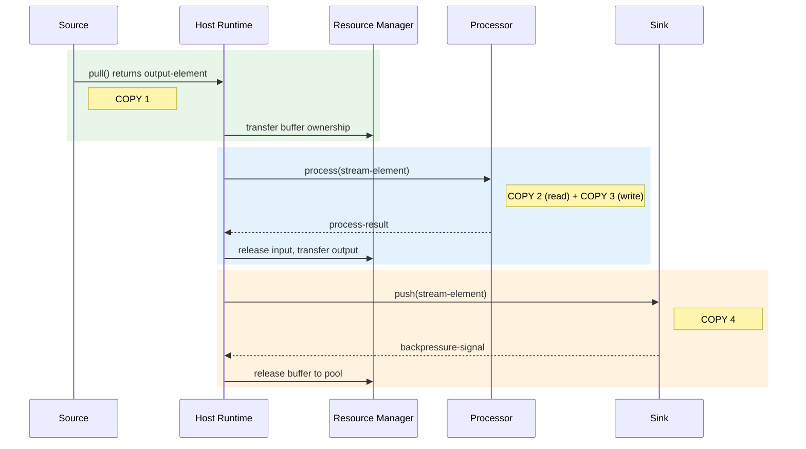
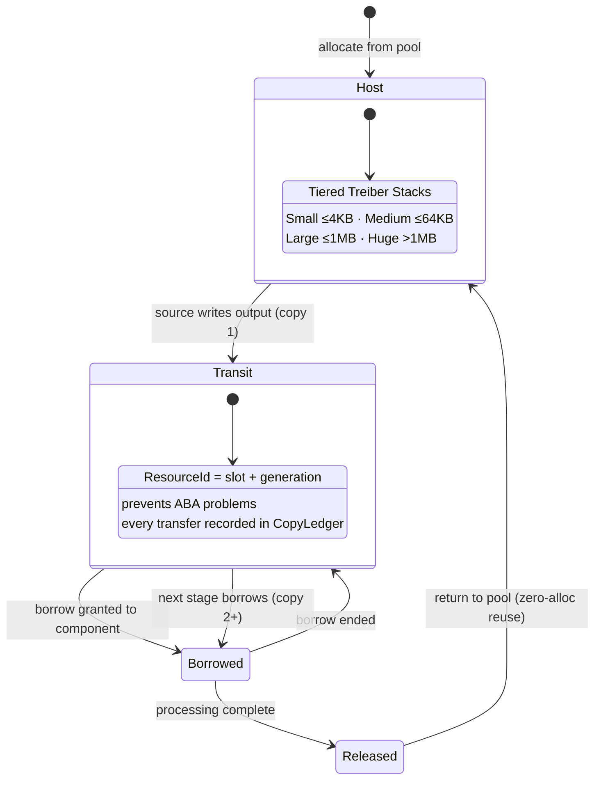
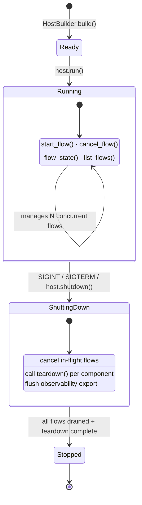

# torvyn

[](https://crates.io/crates/torvyn)
[](https://docs.rs/torvyn)
[](https://github.com/torvyn/torvyn/blob/main/LICENSE)

**Ownership-aware reactive streaming runtime for WebAssembly components.**

## Overview

`torvyn` is the umbrella crate for the Torvyn project. It re-exports the entire public API from all subsystem crates, providing a single dependency for applications that want the full Torvyn runtime.

Torvyn composes sandboxed WebAssembly components into low-latency, single-node streaming pipelines with contract-first composition, host-managed resource ownership, and reactive backpressure.

For finer-grained dependency control, use the individual `torvyn-*` crates directly.

## Subsystem Architecture

```mermaid
graph TD
    TORVYN["torvyn (umbrella)"]

    TORVYN --> TYPES["torvyn-types<br/><i>Identity types, errors, state machines</i>"]
    TORVYN --> CONFIG["torvyn-config<br/><i>Configuration parsing & validation</i>"]
    TORVYN --> CONTRACTS["torvyn-contracts<br/><i>WIT contract loading & validation</i>"]
    TORVYN --> ENGINE["torvyn-engine<br/><i>Wasm engine & component invocation</i>"]
    TORVYN --> RESOURCES["torvyn-resources<br/><i>Buffer pools & ownership tracking</i>"]
    TORVYN --> SECURITY["torvyn-security<br/><i>Capability model & sandboxing</i>"]
    TORVYN --> OBS["torvyn-observability<br/><i>Metrics, tracing, OTLP export</i>"]
    TORVYN --> REACTOR["torvyn-reactor<br/><i>Stream scheduling & backpressure</i>"]
    TORVYN --> LINKER["torvyn-linker<br/><i>Component linking & composition</i>"]
    TORVYN --> PIPELINE["torvyn-pipeline<br/><i>Pipeline topology construction</i>"]
    TORVYN --> PACKAGING["torvyn-packaging<br/><i>OCI artifact assembly & distribution</i>"]
    TORVYN --> HOST["torvyn-host<br/><i>Runtime orchestration</i>"]
```



## How It Works

### Pipeline Data Flow

Every element flows through a Source → Processor → Sink pipeline with exactly **4 measured copies** per element. The host runtime manages all buffer memory; components never allocate directly.



### Buffer Ownership Lifecycle

All byte buffers are host-managed with explicit ownership states. Components access buffers through opaque handles with borrow/transfer semantics. Tiered pools (4 KB / 64 KB / 1 MB / huge) enable zero-allocation reuse.



### Host Lifecycle

The `TorvynHost` follows a strict state machine from initialization through graceful shutdown.



## Re-exported Modules

| Module | Crate | Description |
|--------|-------|-------------|
| `types` | `torvyn-types` | Identity types, error enums, state machines, and shared traits |
| `config` | `torvyn-config` | Configuration parsing, validation, and schema definitions |
| `contracts` | `torvyn-contracts` | WIT contract loading, validation, and compatibility checking |
| `engine` | `torvyn-engine` | Wasm engine abstraction and component invocation |
| `resources` | `torvyn-resources` | Buffer pools, ownership tracking, and copy accounting |
| `security` | `torvyn-security` | Capability model, sandboxing, and audit logging |
| `observability` | `torvyn-observability` | Metrics, tracing, OTLP export, and benchmark reporting |
| `reactor` | `torvyn-reactor` | Stream scheduling, backpressure, and flow lifecycle |
| `linker` | `torvyn-linker` | Component linking and pipeline composition |
| `pipeline` | `torvyn-pipeline` | Pipeline topology construction, validation, and instantiation |
| `packaging` | `torvyn-packaging` | OCI artifact assembly, signing, and distribution |
| `host` | `torvyn-host` | Runtime orchestration -- the main entry point for running Torvyn |

## Prelude

The `torvyn::prelude` module provides convenient glob imports for the most commonly used types:

```rust
use torvyn::prelude::*;
```

This imports identity types (`FlowId`, `StreamId`, `BufferHandle`, ...), core enums (`FlowState`, `BackpressureSignal`, ...), error types, the `EventSink` trait, host runtime types (`HostBuilder`, `TorvynHost`, ...), and engine traits.

## Feature Flags

| Feature | Default | Description |
|---------|---------|-------------|
| `cli` | Yes | Includes the `torvyn` binary. Disable for library-only usage. |

To use Torvyn as a library without pulling in CLI dependencies:

```toml
[dependencies]
torvyn = { version = "0.1", default-features = false }
```

## Quick Start

### As a library

```rust
use torvyn::prelude::*;

#[tokio::main]
async fn main() -> Result<(), torvyn::host::HostError> {
    let mut host = HostBuilder::new()
        .with_config_file("Torvyn.toml")
        .build()
        .await?;

    host.run().await
}
```

### As a CLI tool

```bash
cargo install torvyn

# Scaffold a new project
torvyn init my-pipeline --template full-pipeline

# Validate, build, and run
cd my-pipeline
torvyn check
cargo component build --release
torvyn run
```

### Working with individual subsystems

```rust
use torvyn::config::RuntimeConfig;
use torvyn::contracts::ContractValidator;
use torvyn::engine::WasmEngine;
use torvyn::types::FlowId;

// Each re-exported module gives full access to the subsystem API
let config = RuntimeConfig::from_file("Torvyn.toml")?;
let flow_id = FlowId::new("my-flow");
```

## Minimum Supported Rust Version

The MSRV for this crate is **1.91**.

## License

Licensed under the Apache License, Version 2.0. See [LICENSE](https://github.com/torvyn/torvyn/blob/main/LICENSE) for details.

## Documentation

- **[Documentation Site](https://torvyn.github.io/torvyn/)** — Guides, tutorials, examples, and architecture docs
- **[API Reference (docs.rs)](https://docs.rs/torvyn)** — Generated Rust API documentation
- [Getting Started](https://torvyn.github.io/torvyn/docs/getting-started/quickstart.html) — Quickstart guide
- [Architecture](https://torvyn.github.io/torvyn/docs/architecture/overview.html) — Design decisions and crate structure
- [CLI Reference](https://torvyn.github.io/torvyn/docs/reference/cli.html) — All commands and options

## Repository

This crate is part of the [Torvyn](https://github.com/torvyn/torvyn) project.
See the main repository for architecture documentation and contribution guidelines.
