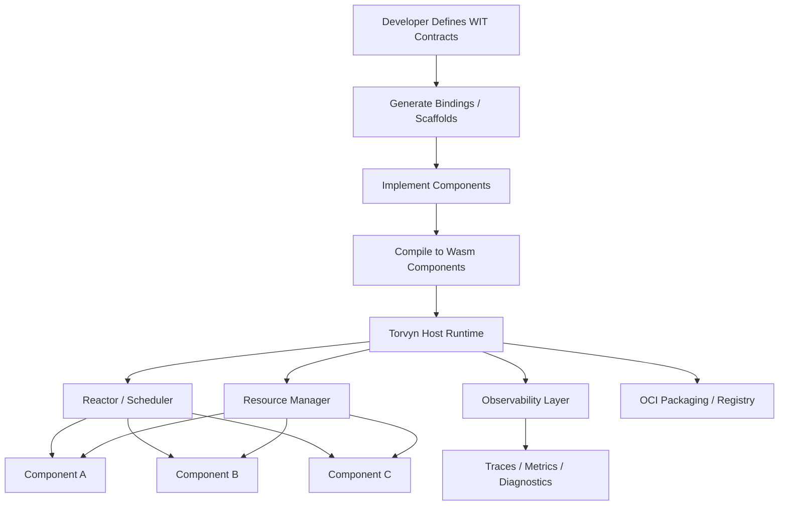
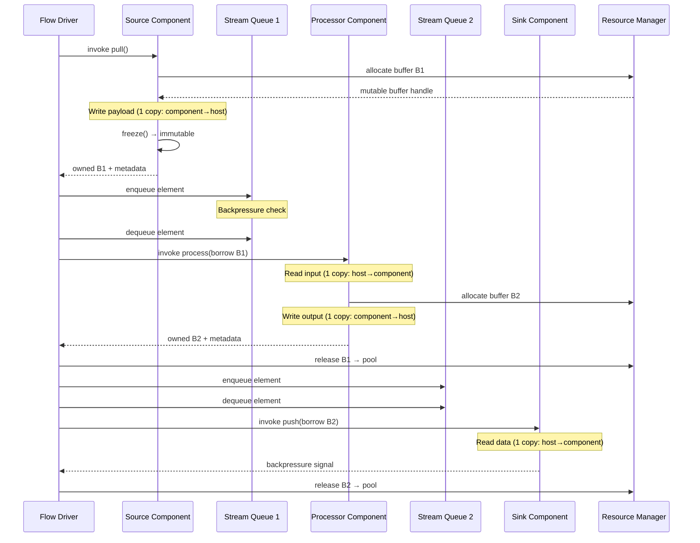
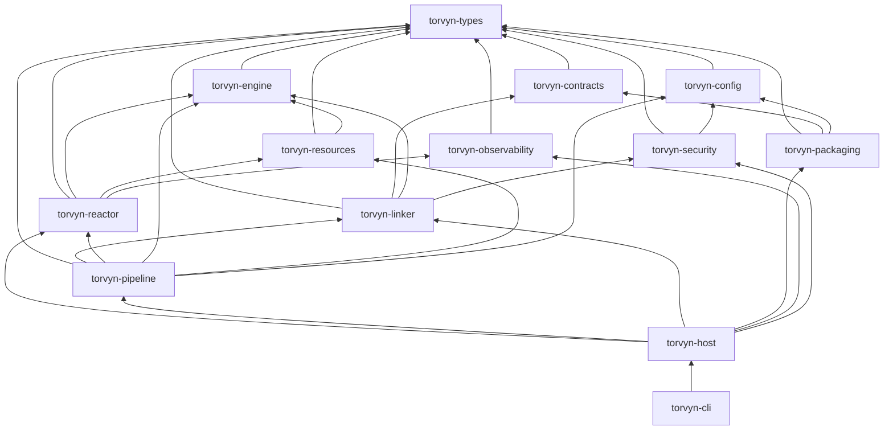
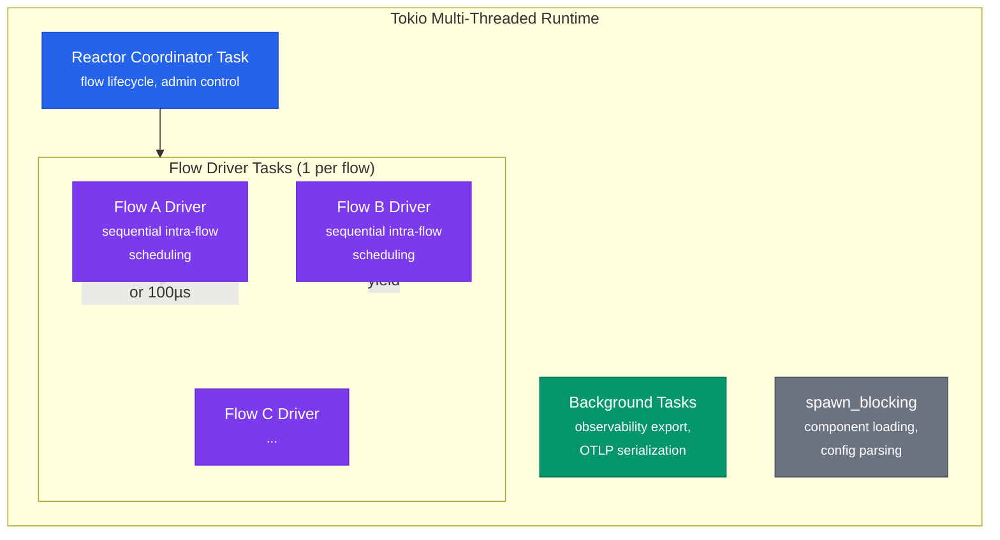
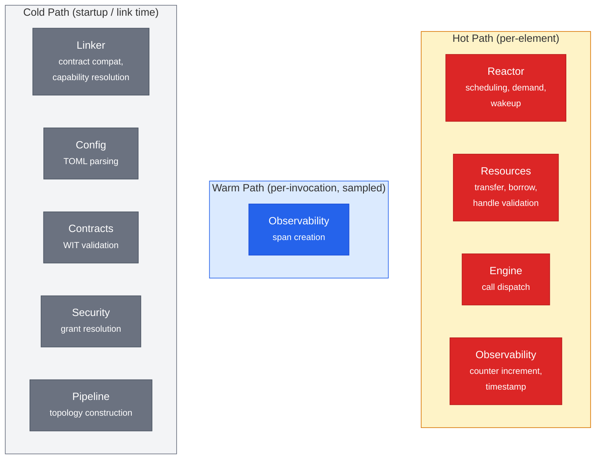

# Architecture Overview

This document provides a detailed technical overview of Torvyn's internal architecture. It is intended for experienced engineers evaluating Torvyn for adoption, potential contributors, and operators who need to understand the runtime's internal structure for capacity planning and troubleshooting.

## System Context

Torvyn is a single-process runtime that hosts multiple concurrent streaming flows. Each flow is a directed acyclic graph of WebAssembly components connected by bounded, backpressure-aware stream queues. The runtime is written in Rust, uses Tokio for async I/O and task scheduling, and uses Wasmtime as the WebAssembly execution engine.

```
┌─────────────────────────────────────────────────────────────────┐
│                     Torvyn Host Process                          │
│                                                                 │
│  ┌────────────┐  ┌────────────┐  ┌──────────────────────────┐  │
│  │  Reactor    │  │ Resource   │  │ Host Lifecycle Manager   │  │
│  │ (scheduler, │  │ Manager    │  │ (load, link, instantiate │  │
│  │  demand,    │  │ (buffers,  │  │  Wasm components)        │  │
│  │  backpress) │  │  pools,    │  │                          │  │
│  └──────┬──────┘  │  ownership)│  └────────────┬─────────────┘  │
│         │         └──────┬─────┘               │                │
│         │  EventSink     │  EventSink          │ EventSink      │
│         ▼                ▼                     ▼                │
│  ┌──────────────────────────────────────────────────────────┐   │
│  │              Observability Collector                      │   │
│  │  ┌────────┐  ┌───────────────┐  ┌───────────────────┐   │   │
│  │  │ Tracer │  │ Metrics Agg.  │  │ Event Recorder    │   │   │
│  │  └───┬────┘  └───────┬───────┘  └──────┬────────────┘   │   │
│  └──────┼───────────────┼──────────────────┼────────────────┘   │
│         │               │                  │                    │
│         ▼               ▼                  ▼                    │
│  ┌──────────────────────────────────────────────────────────┐   │
│  │              Export / Inspection Layer                     │   │
│  │  OTLP gRPC  │ Prometheus /metrics │ Inspection API │ File│   │
│  └──────────────────────────────────────────────────────────┘   │
└─────────────────────────────────────────────────────────────────┘
```

## Architecture Diagram



## Data Flow Diagram

The following diagram shows the lifecycle of a single stream element as it passes through a Source → Processor → Sink pipeline:



## Crate Dependency Graph



## Crate-by-Crate Description

Torvyn is organized as a Cargo workspace of focused crates. Each crate has a clear responsibility boundary and explicit dependencies.

### `torvyn-types` — Shared Identity and Error Types

The leaf crate with zero internal dependencies. Defines all shared identifiers (`ComponentId`, `FlowId`, `ResourceId`, `StreamId`, `BufferHandle`), the `ProcessError` enum (Rust mapping of the WIT `process-error` variant), the `ComponentRole` enum (Source, Processor, Sink, Filter, Router), and basic configuration types. Every other crate depends on this one.

### `torvyn-config` — Configuration Parsing and Validation

Parses and validates `Torvyn.toml` manifests and pipeline definitions. Handles the configuration layering model (CLI flags > environment variables > project manifest > global user config > built-in defaults). Depends on `torvyn-types`.

### `torvyn-contracts` — WIT Loading and Validation

Loads WIT package files, validates syntax and semantics using the `wit-parser` crate from the Bytecode Alliance toolchain, and implements the compatibility checking algorithm for version resolution. Provides the validation pipeline that `torvyn check` executes. Depends on `torvyn-types`.

### `torvyn-engine` — Wasm Engine Abstraction

Provides the `WasmEngine` trait (compile, instantiate, call) and the `WasmtimeEngine` implementation. Also defines the `ComponentInvoker` trait with typed invocation methods (`invoke_pull`, `invoke_process`, `invoke_push`) that the reactor uses to call component code. This crate is on the hot path for every component invocation. Depends on `torvyn-types`.

### `torvyn-resources` — Resource Manager and Buffer Pools

Implements the resource table (dense slab with generation counters), the four-state ownership model (Pooled → Owned → Borrowed/Leased → Pooled), tiered buffer pools (Small 256B, Medium 4 KiB, Large 64 KiB, Huge 1 MiB), copy accounting, and per-component memory budget enforcement. Hot-path modules include the resource table, handle validation, state transitions, and transfer logic. Depends on `torvyn-types` and `torvyn-engine`.

### `torvyn-security` — Capability Model and Sandboxing

Implements the capability taxonomy, the `SandboxConfigurator` that produces per-component Wasm sandbox configurations, the `CapabilityGuard` for runtime enforcement, and the audit event subsystem. Depends on `torvyn-types` and `torvyn-contracts`.

### `torvyn-observability` — Tracing, Metrics, and Diagnostics

Implements the `EventSink` trait for non-blocking event recording, the trace context model (W3C-compatible), pre-allocated metric structures, the three-level observability system, and OTLP export. Provides the inspection API (HTTP server on Unix domain socket or localhost TCP). Depends on `torvyn-types`.

### `torvyn-linker` — Component Linking and Composition

Implements contract compatibility checking, capability resolution (intersecting component requirements with operator grants), and topology validation (DAG structure, role consistency, port name matching). Used by `torvyn link` and implicitly by `torvyn run`. Depends on `torvyn-types`, `torvyn-engine`, `torvyn-contracts`, and `torvyn-security`.

### `torvyn-reactor` — Stream Scheduling and Backpressure

Implements the flow driver (one Tokio task per flow), the demand propagation model, the scheduling policy interface, the backpressure state machine, cancellation and timeout handling, and cooperative yield logic. This is the execution heartbeat of the runtime. Depends on `torvyn-types`, `torvyn-engine`, `torvyn-resources`, and `torvyn-observability`.

### `torvyn-pipeline` — Pipeline Topology and Instantiation

Constructs pipeline topologies from configuration, instantiates component graphs, and registers flows with the reactor. Depends on most other crates.

### `torvyn-host` — Runtime Binary Entry Point

The main host process binary. A thin orchestration shell that wires together all subsystems, manages startup and shutdown sequences, and exposes the runtime's programmatic API. Depends on everything above.

### `torvyn-cli` — Developer CLI Binary

The `torvyn` command-line tool. Implements all 11 subcommands (init, check, link, build, run, trace, bench, pack, publish, inspect, doctor). Built with `clap` for argument parsing, `miette` for diagnostic error rendering, and `indicatif` for progress display. Depends on library crates from the workspace.

## Data Flow: Processing a Single Stream Element

The following describes the complete data flow for a single element through a Source → Processor → Sink pipeline. This is the hot path that determines Torvyn's per-element performance.

**Step 1: Source produces an element.** The flow driver (reactor) invokes `source.pull()` via the `ComponentInvoker`. The source component allocates a mutable buffer (host call to `buffer-allocator.allocate`), writes payload data into it (one copy: component → host), calls `freeze()` to convert it to an immutable buffer, and returns the owned buffer handle along with element metadata.

**Step 2: Element enters the stream queue.** The flow driver receives the output element, assigns the `element-meta.sequence` and `element-meta.timestamp-ns` fields, and enqueues it into the Source→Processor stream queue. If the queue is full, the backpressure policy is applied.

**Step 3: Processor transforms the element.** The flow driver dequeues the element and invokes `processor.process()` with a borrowed buffer handle. The processor reads the input (one copy: host → component), allocates a new output buffer, writes transformed data (one copy: component → host), and returns the new owned buffer handle with updated metadata.

**Step 4: Input buffer is released.** The borrow on the input buffer is automatically released when `process()` returns. The host releases the input buffer back to the pool.

**Step 5: Output element enters the next queue.** The flow driver enqueues the processor's output into the Processor→Sink stream queue.

**Step 6: Sink consumes the element.** The flow driver dequeues the element and invokes `sink.push()` with a borrowed buffer handle. The sink reads the data (one copy: host → component), performs its output operation (write to file, send to network, etc.), and returns a backpressure signal.

**Step 7: Output buffer is released.** The borrow on the output buffer is released and the buffer returns to the pool.

**Total per-element: 4 payload copies, all instrumented.** Steps 2, 4, 5, and 7 are handle-only operations with zero payload copying.

## Concurrency Model



Torvyn uses Tokio's multi-threaded work-stealing runtime with no custom OS threads.

- **One Tokio task per flow** (the flow driver). Intra-flow scheduling is sequential within the flow driver — pipeline stages within a flow execute in dependency order, not in parallel. This keeps related work cache-local and gives the reactor control over intra-flow scheduling policy.
- **One reactor coordinator task** for flow lifecycle management, flow creation and teardown, and administrative control (operator commands like pause, cancel, inspect).
- **Export background tasks** for observability data serialization and delivery.
- **`tokio::spawn_blocking`** for filesystem I/O (component loading, configuration parsing).

Inter-flow fairness is provided by Tokio's work-stealing scheduler. Intra-flow fairness is provided by the reactor's cooperative yield mechanism: the flow driver yields to Tokio after processing a configurable batch of elements (default: 32) or after a configurable time quantum (default: 100 microseconds), whichever comes first.

Wasmtime's fuel mechanism provides cooperative preemption within Wasm execution, preventing a single component invocation from monopolizing a thread.

**Trade-off:** The task-per-flow model means a single flow cannot utilize multiple OS threads simultaneously for different stages. For Torvyn's initial target of same-node pipelines, this is acceptable — the bottleneck is typically Wasm execution speed per stage, not parallelism within a single flow. Parallel stage execution within a flow is deferred to a future phase.

## Hot Path vs. Cold Path



| Module | Path | Reason |
|--------|------|--------|
| Reactor (scheduling, demand, wakeup) | **Hot** | Executes per element |
| Resources (transfer, borrow, handle validation) | **Hot** | Buffer handoff per element crossing |
| Engine (call dispatch) | **Hot** | Every component invocation |
| Observability (counter increment, timestamp) | **Hot** | Per-element metric updates |
| Observability (span creation) | **Warm** | Per-invocation when tracing is sampled |
| Linker | **Cold** | Once at pipeline startup |
| Config | **Cold** | Once at host startup |
| Contracts (validation) | **Cold** | At check/link time only |
| Security (grant resolution) | **Cold** | At link time; enforcement checks are hot but simple |
| Pipeline (topology construction) | **Cold** | Once per flow |

Hot-path code must be lock-free, allocation-free, and branchless where possible. Cold-path code may allocate, may block, and may acquire locks.

## Performance Characteristics and Design Trade-Offs

**Wasm boundary cost.** Every component invocation crosses the Wasm boundary via the Component Model's canonical ABI. This adds overhead compared to a direct function call (approximately 100-500 nanoseconds per invocation depending on parameter complexity). This is the cost of isolation. For workloads where sub-microsecond per-element latency is critical, fewer pipeline stages means fewer boundary crossings.

**Copy cost vs. isolation.** The split between host memory (where buffers live) and component linear memory (where computation happens) means that reading or writing payload data always involves a copy. The design prioritizes safety and measurability over eliminating every copy. Components that need to inspect only metadata operate at zero payload copy cost.

**Task-per-flow vs. task-per-component.** Task-per-flow keeps intra-flow scheduling simple and cache-friendly but limits intra-flow parallelism. Task-per-component would enable parallel stage execution within a flow but at the cost of higher Tokio task overhead and more complex scheduling. The current design is the right trade-off for same-node pipelines with moderate stage counts.

**Pre-allocated metrics vs. dynamic metrics.** Pre-allocating all metric storage at flow creation time means the hot path never allocates and never looks up metric handles in a hash map. The trade-off is that metric storage is fixed-size and cannot accommodate arbitrary custom metrics from components. Custom component metrics are supported through the `torvyn:runtime/metrics` capability, which uses a separate (slower) path.
