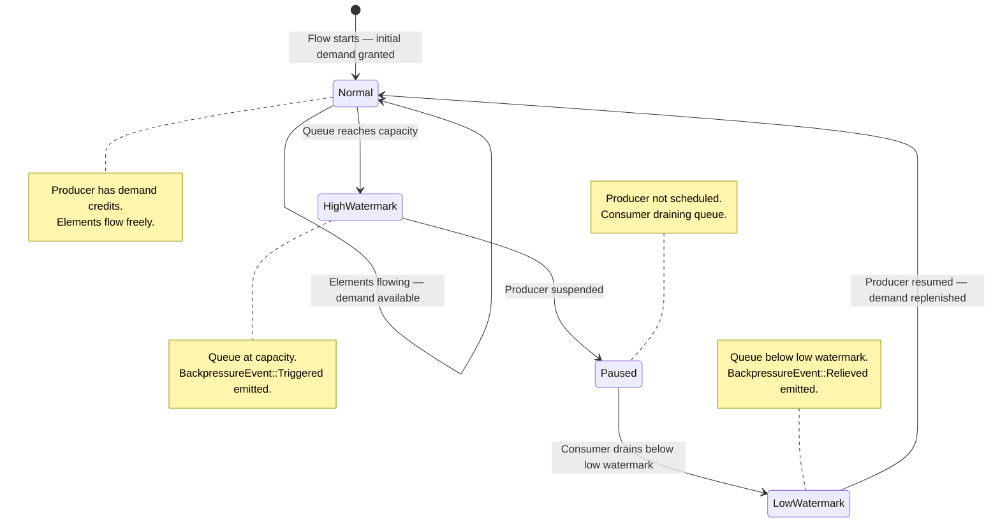
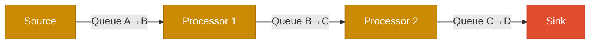
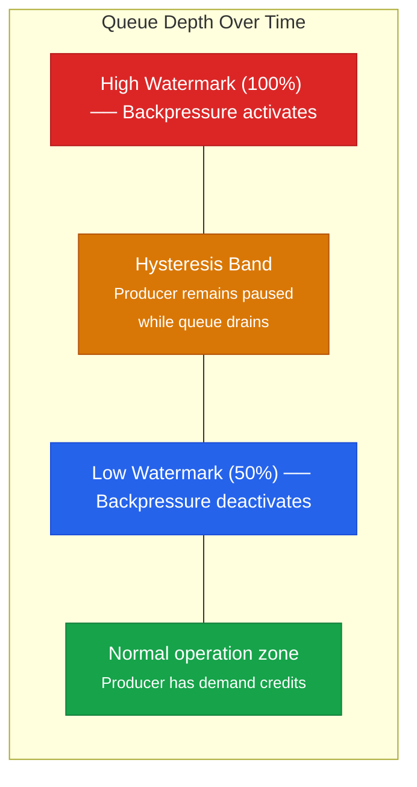
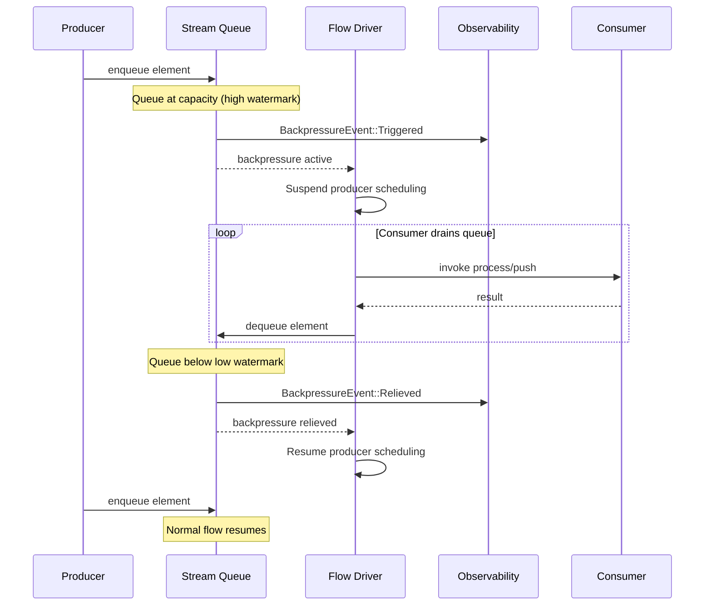
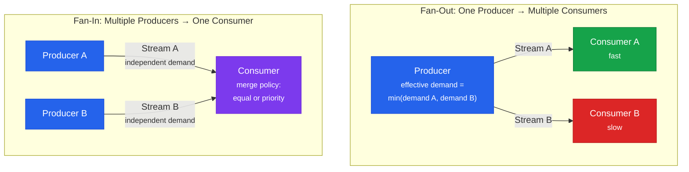

# Backpressure

## What Is Backpressure and Why It Matters

Backpressure is the mechanism by which a slow consumer tells a fast producer to slow down. In any streaming system where stages process data at different speeds, backpressure prevents unbounded queue growth, memory exhaustion, and cascading failures.

Without backpressure, a producer that outpaces its consumer fills an ever-growing queue until the system runs out of memory. With backpressure, the queue has a bounded capacity, and when that capacity is reached, the producer is suspended until the consumer catches up. Memory usage becomes deterministic and bounded.

In Torvyn, backpressure is not optional. It is built into the stream semantics and the reactor's scheduling model. Every stream connection between components has a bounded queue with a configurable backpressure policy. The runtime enforces these policies automatically — components do not need to implement backpressure logic themselves.

## How Torvyn Implements Backpressure

Torvyn uses a credit-based demand model, inspired by the Reactive Streams specification's `request(n)` pattern and TCP's sliding window. Each stream maintains a demand counter: the number of elements the consumer is willing to accept.

When a consumer processes an element, it replenishes one demand credit. When a producer enqueues an element, it consumes one demand credit. A producer with zero demand credits must not produce — this is the backpressure trigger.

When a flow starts, the reactor grants each stream an initial demand equal to the stream's queue capacity. This allows the pipeline to fill up without waiting for explicit demand signals, avoiding a cold-start latency penalty.

Demand propagation follows the pipeline graph from consumer to producer. In a multi-stage pipeline (A → B → C → D), if D (the sink) is slow, the backpressure cascades through the entire pipeline: queue C→D fills, C is suspended, queue B→C fills, B is suspended, queue A→B fills, A (the source) is suspended. The entire pipeline is now backpressured, with bounded queue depths at every stage.

### Backpressure State Machine

The following diagram shows the backpressure state transitions for a single stream:



### Demand Propagation in Multi-Stage Pipelines

In a multi-stage pipeline, backpressure cascades upstream through the entire graph:



When the Sink (D) is slow: Queue C→D fills → C is suspended → Queue B→C fills → B is suspended → Queue A→B fills → Source (A) is suspended. The entire pipeline is backpressured with bounded queue depths at every stage.

### The High/Low Watermark Mechanism

Backpressure uses hysteresis to prevent rapid oscillation between pressured and unpressured states:

- **Backpressure activates** when the queue reaches capacity (the high watermark, effectively 100%).
- **Backpressure deactivates** when the queue drops below the low watermark (default: 50% of capacity).

Without this hysteresis, a system where the consumer is only slightly slower than the producer would oscillate between backpressured and normal on every single element. The watermark gap provides a stability band.



The sequence of events during a backpressure episode:

1. The producer component returns a new element.
2. The flow driver attempts to enqueue the element into the downstream stream's queue.
3. The queue is at capacity. Backpressure is triggered.
4. An observability event is emitted: `BackpressureEvent::Triggered`.
5. The producer is no longer eligible for scheduling. The flow driver focuses on executing downstream stages to drain the queue.
6. When the consumer processes enough elements for the queue to drop below the low watermark, the stream exits backpressure.
7. An observability event is emitted: `BackpressureEvent::Relieved`.
8. The producer is eligible for scheduling again.



### Fan-Out and Fan-In Behavior



For fan-out topologies (one producer, multiple consumers), the producer's effective demand is the minimum across all downstream streams by default. This ensures the producer does not outrun the slowest consumer. An alternative `IndependentPerBranch` mode allows faster consumers to pull ahead.

For fan-in topologies (multiple producers, one consumer), each upstream stream maintains independent demand. The consumer grants demand based on its merge policy (equal allocation across branches or priority-based).

## Configuring Backpressure Policies

Each stream in a pipeline can be configured with a `BackpressurePolicy` that dictates behavior when the queue is full:

| Policy | Behavior | Data Loss | Use Case |
|--------|----------|-----------|----------|
| `Block` (default) | Suspend the producer until the consumer frees capacity. | None | Correctness-critical pipelines where every element must be processed. |
| `DropOldest` | Remove the oldest element in the queue to make room. | Yes (oldest) | Real-time workloads where freshness matters more than completeness (e.g., live sensor data). |
| `DropNewest` | Reject the new element. The producer continues. | Yes (newest) | Rate-limiting scenarios where the latest burst can be safely discarded. |
| `Error` | Return an error to the producer, propagated as a `ProcessError`. | None (but stops) | Pipelines where backpressure indicates a fundamental problem that should halt processing. |
| `RateLimit { max_elements_per_second }` | Delay the producer to maintain a maximum throughput. | None | Pipelines that need predictable throughput without suspension. |

Policies are configured per-stream in the pipeline definition within `Torvyn.toml`:

```toml
[runtime.backpressure]
default_queue_depth = 64
default_policy = "block"
low_watermark_ratio = 0.5

# Override for a specific stream
[flow.main.edges.transform-to-sink.backpressure]
queue_depth = 256
policy = "drop-oldest"
low_watermark_ratio = 0.25
```

## Observing Backpressure in Production

Torvyn exposes several metrics and diagnostic tools for understanding backpressure behavior:

**Per-stream metrics:**
- `stream.backpressure.events` — Total number of backpressure episodes on this stream.
- `stream.backpressure.duration_ns` — Total time spent in backpressure.
- `stream.queue.current_depth` — Current queue depth (a gauge).
- `stream.queue.peak_depth` — Maximum queue depth observed.

**In `torvyn bench` reports:** The scheduling section shows total backpressure events and queue peak across all streams. A pipeline with zero backpressure events under sustained load typically means the source is slower than the pipeline's processing capacity. Frequent backpressure events indicate a consumer bottleneck.

**In `torvyn trace` output:** With `--show-backpressure`, trace output highlights backpressure events inline with element processing, showing which stream triggered, how long the producer was suspended, and how many elements were drained before the pressure was relieved.

**Via the inspection API:** The `GET /flows/{flow_id}` endpoint returns current queue depths and backpressure state for every stream in the flow.

## Common Backpressure Patterns and Anti-Patterns

**Pattern: End-to-end bounded memory.** With the `Block` policy, total pipeline memory is deterministic: `Σ(queue_capacity × max_element_size)` for all streams. This is the recommended default for production pipelines where correctness matters more than drop tolerance.

**Pattern: Fresh-data preference.** For live data feeds (sensor streams, market data), use `DropOldest` to ensure the consumer always processes the most recent data when it falls behind.

**Pattern: Backpressure-driven autoscaling.** Monitor `stream.backpressure.duration_ns` over time. Sustained backpressure on a specific stream indicates that the downstream component is the bottleneck. This metric can drive operational decisions about resource allocation.

**Anti-pattern: Unbounded queues.** Setting `queue_depth` to an extremely large value (e.g., 1,000,000) effectively disables backpressure and returns to the failure mode of unbounded queue growth. If you find yourself setting very large queue depths, reconsider whether the pipeline topology or component performance should be addressed instead.

**Anti-pattern: Ignoring backpressure metrics.** Backpressure events are not errors — they are a healthy signal that the system is self-regulating. However, persistent backpressure indicates a capacity imbalance. Monitor and investigate pipelines where backpressure events are sustained.

**Anti-pattern: Over-aggressive watermarks.** Setting the low watermark very high (e.g., 0.95) reduces the hysteresis band and can cause rapid oscillation. The default of 0.5 provides a stable equilibrium for most workloads.
