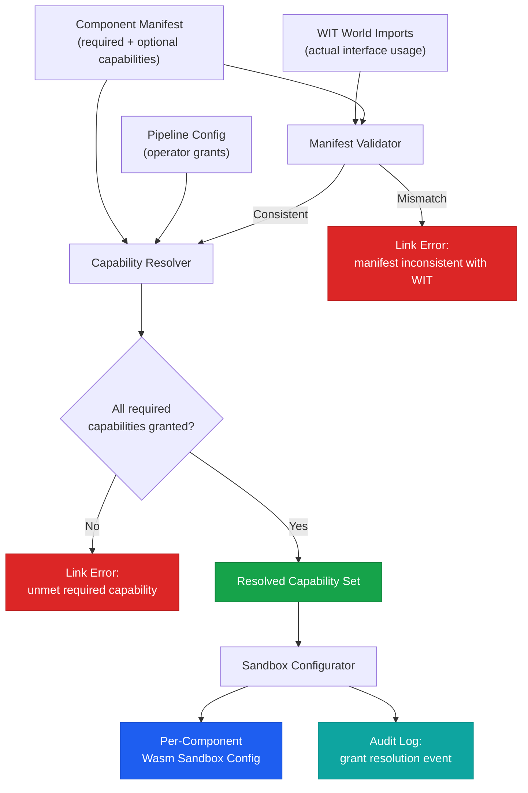

# Capabilities and Security

## What Are Capabilities?

In Torvyn, a capability is a specific permission to perform an action or access a resource. Capabilities govern what a component is allowed to do beyond pure computation on the data provided through its stream interface.

A Torvyn component that has been granted no capabilities can receive stream elements, read payload data, perform computation, produce output elements, and return results. It cannot read files, open network connections, access the system clock, generate random numbers, or interact with any system service. Every additional permission requires an explicit capability grant.

This model is often called "deny-all by default" or "principle of least privilege." It is the security foundation of Torvyn.

## The Deny-All-by-Default Model

The security design is governed by five principles:

**Deny-all by default.** A component with no capability grants can do nothing beyond pure computation on data provided through its stream interface. Every capability must be explicitly granted.

**Fail closed.** If the capability system encounters an ambiguous state — a grant that cannot be resolved, a policy that cannot be evaluated — the default behavior is to deny the operation.

**Static over dynamic.** Catch capability violations at link time (`torvyn link`) rather than at runtime wherever possible. A runtime capability violation is a defect in the static validation pipeline.

**Least privilege.** Operators should grant the minimum capability set needed. Tooling warns when a component requests capabilities that appear excessive for its declared interface type.

**Audit everything.** Every capability exercise, every denial, every grant resolution is recorded as a structured audit event. The audit log is the security team's interface to Torvyn.

## Declaring Capabilities in Component Manifests

Components declare their capability requirements in `Torvyn.toml`:

```toml
[component]
name = "my-transform"
version = "0.2.0"

[capabilities.required]
# WASI capabilities this component needs to function
wasi-filesystem-read = true
wasi-clocks = true

[capabilities.optional]
# Capabilities that enhance functionality but are not required
wasi-random = true
# Explicitly declare capabilities not needed (aids auditing)
wasi-network-egress = false

[capabilities.torvyn]
# Torvyn-specific resource requirements
max-buffer-size = "16MiB"
max-memory = "64MiB"
buffer-pool-access = "default"
```

The manifest serves two purposes. First, it informs operators what the component needs, enabling informed trust decisions. Second, it enables bidirectional validation: the host checks that the manifest is consistent with the component's actual WIT imports. If a component's WIT world imports `wasi:filesystem/preopens` but the manifest does not declare `wasi-filesystem-read = true`, this is a link-time error. If the manifest declares `wasi-network-egress = false` but the WIT world imports `wasi:sockets/tcp`, this is also an error. No component can silently gain capabilities it did not declare.

## Capability Taxonomy

Capabilities are organized into domains:

**WASI-aligned capabilities** map to standard WASI interfaces: filesystem read/write (scoped to directory subtrees), TCP connect/listen, UDP, HTTP outgoing, wall clock, monotonic clock, cryptographic random, insecure random, environment variables, stdout, stderr.

**Torvyn-specific capabilities** govern resource and stream access: buffer pool allocation, named pool access, backpressure signal emission, flow metadata inspection, runtime diagnostics query, and custom metrics emission.

Many capabilities require scoping. A filesystem read permission is meaningless without knowing which paths are accessible. A network connect permission can be scoped to specific host patterns and port ranges. Scoping rules are directional: a grant with a broader scope satisfies a request with a narrower scope, but never the reverse.

## Capability Resolution Flow

At link time, `torvyn link` resolves the effective capability set for each component by intersecting what the component requests with what the operator grants:



## Granting Capabilities in Pipeline Configuration

The pipeline operator specifies capability grants in the flow definition:

```toml
[security]
default_capability_policy = "deny-all"

[security.grants.my-transform]
capabilities = [
    "wasi:filesystem/read:/data/input",
    "wasi:clocks/wall-clock",
    "wasi:random/random",
]

[security.grants.my-sink]
capabilities = [
    "wasi:filesystem/write:/data/output",
]
```

At link time, `torvyn link` computes the intersection of the component's required capabilities and the operator's grants. If any required capability is not granted, linking fails with a clear error message identifying the unmet capability. Optional capabilities that are not granted are silently skipped — the component should handle their absence gracefully.

## Auditing Capabilities in Deployed Pipelines

Every security-relevant event produces a structured audit record:

- **Capability exercises:** Each time a component uses a granted capability (opens a file, makes a network connection), the exercise is recorded with the component ID, capability identifier, and timestamp.
- **Capability denials:** Each time a component attempts an operation it has not been granted, the denial is recorded. In a properly validated pipeline, runtime denials should never occur (they would have been caught at link time). A runtime denial indicates either a validation gap or a dynamic capability request.
- **Grant resolution events:** The full capability resolution result for each component is logged at pipeline startup, creating a complete audit trail of what each component was authorized to do.

The `torvyn inspect` command can display the capability profile of any component or artifact, showing required capabilities, optional capabilities, and the effective grants in a specific pipeline configuration.

## Security Implications and Best Practices

**Treat capability grants as security policy.** Reviewing a pipeline's `[security.grants]` section should be part of the deployment review process, just as reviewing IAM policies is part of cloud deployment review.

**Use scoped grants.** Grant `wasi:filesystem/read:/data/input` rather than `wasi:filesystem/read` (which grants access to the entire filesystem). Narrower scopes reduce blast radius.

**Audit capability exercises in production.** The `capability.exercises` and `capability.denials` metrics provide ongoing visibility into what components are actually doing with their granted permissions.

**Verify third-party components before granting capabilities.** Use `torvyn inspect` to examine what capabilities a component requests before adding it to your pipeline. A stateless transform that requests network egress deserves scrutiny.

**Separate concerns across components.** Rather than granting filesystem read and write to a single component, consider splitting into a reader component (read-only filesystem access) and a writer component (write-only access). Each component has a smaller capability surface, and a vulnerability in the reader cannot lead to data modification.
