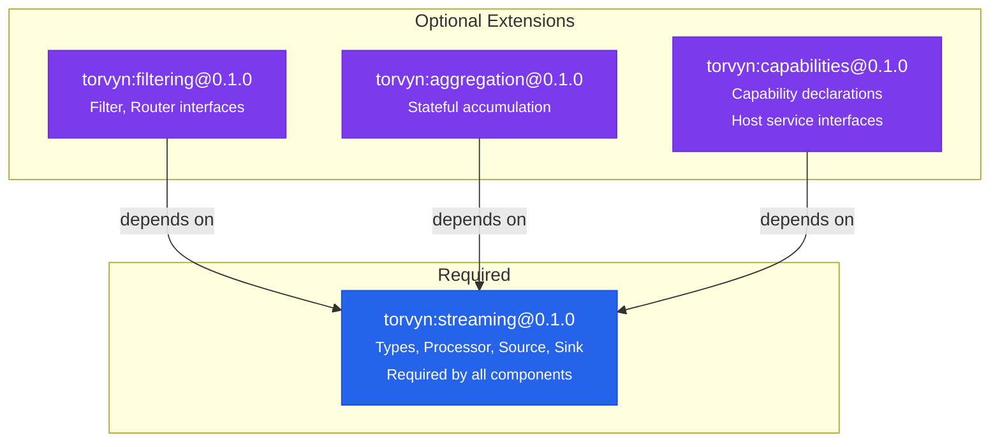
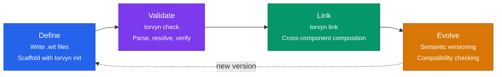
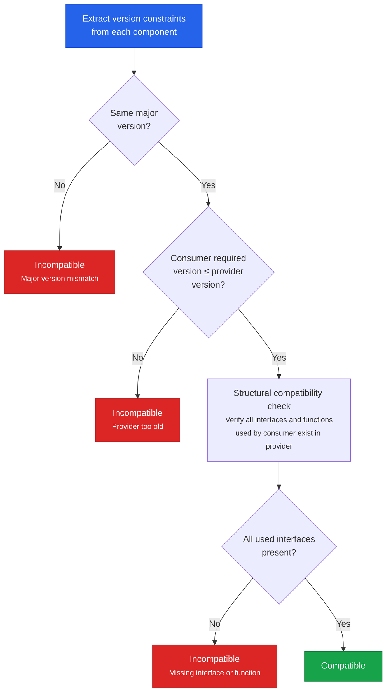

# Contracts and WIT Interfaces

## What Are WIT Contracts?

WIT (WebAssembly Interface Types) is the interface description language of the WebAssembly Component Model. In Torvyn, WIT contracts define every interaction between components and between components and the host runtime. A contract specifies what data a component expects to receive, what data it produces, what host services it requires, and what ownership rules govern the data exchange.

Contracts are the center of Torvyn's design. They serve as the single source of truth for component compatibility, security requirements, versioning, and composition rules. If two components have compatible contracts, they can be composed into a pipeline regardless of the language they were written in. If their contracts are incompatible, `torvyn link` will reject the composition before any code runs.

WIT contracts are:

- **Explicit.** Every parameter type, return type, and ownership semantic is visible in the interface definition. There are no hidden assumptions or implicit behaviors.
- **Statically validatable.** Compatibility can be checked at link time without running any component code. Contract violations become compile-time or validation-time errors, not runtime surprises.
- **Human-readable.** WIT is designed for humans to read and write. Contracts are documentation, not just machine metadata.
- **Language-neutral.** A WIT contract defines an interface that can be implemented in Rust, Go, Python, Zig, or any other language with WebAssembly Component Model support.
- **Evolvable.** The versioning model supports compatible contract evolution without breaking existing components.

## How Torvyn Uses Contracts for Composition

Torvyn defines a set of WIT packages that establish the streaming contract surface:

**`torvyn:streaming@0.1.0`** — The core package, containing types for stream elements, buffers, flow contexts, error models, and the primary processing interfaces (Processor, Source, Sink). Every Torvyn component depends on this package.

**`torvyn:filtering@0.1.0`** — Extension package for filter and router interfaces. Components that make accept/reject or routing decisions use these interfaces.

**`torvyn:aggregation@0.1.0`** — Extension package for stateful accumulation. Components that ingest many elements and emit aggregated results use this interface.

**`torvyn:capabilities@0.1.0`** — Capability declaration types and host-provided service interfaces.

The core package is versioned together and forms the minimum viable contract surface. Extension packages are versioned independently and are optional. This separation means the core can be stabilized faster, components that only need basic streaming do not pay the conceptual cost of learning aggregation or routing, and extension packages can evolve at their own pace.



When you create a Torvyn component, you define a WIT `world` that specifies which interfaces your component imports (host services it requires) and exports (capabilities it provides to the pipeline):

```wit
package my-namespace:my-component@0.1.0;

world my-transform {
    // Import the types and buffer allocation interface from the host
    import torvyn:streaming/types@0.1.0;
    import torvyn:streaming/buffer-allocator@0.1.0;

    // Export the processor interface — this is what the component does
    export torvyn:streaming/processor@0.1.0;

    // Optionally export lifecycle hooks for initialization and teardown
    export torvyn:streaming/lifecycle@0.1.0;
}
```

This world declaration is the component's contract with the runtime. The host reads it to understand what the component needs and what it provides, the linker uses it to verify compatibility with other components in the pipeline, and the security system uses it to validate capability declarations.

## The Contract Lifecycle

Contracts in Torvyn follow a four-stage lifecycle: define, validate, link, evolve.



### Define

The developer writes WIT interface definitions in `.wit` files within the component's `wit/` directory. The `torvyn init` command scaffolds the correct structure and vendors the appropriate Torvyn WIT packages into `wit/deps/`. The component's `world.wit` file declares which interfaces the component imports and exports.

### Validate

`torvyn check` validates the contract:
1. All `.wit` files parse without syntax errors.
2. All `use` statements and package references resolve correctly.
3. The component's world exports at least one Torvyn processing interface.
4. If the manifest declares capabilities, they correspond to interfaces the component actually imports.
5. Version constraints are internally consistent.

Validation requires only the component's own files. It does not need access to other components in the pipeline.

### Link

`torvyn link` validates composition across multiple components:
1. For each connection in the pipeline topology, the upstream component's output type is compatible with the downstream component's input type.
2. Every required capability is granted by the pipeline configuration.
3. The pipeline graph is a valid DAG with correct role assignments (sources have no inputs, sinks have no outputs, etc.).
4. All components' contract version ranges have a non-empty intersection.
5. Router port names match actual downstream component names in the topology.

Linking catches the class of errors that occur when independently developed components are composed for the first time.

### Evolve

Contracts evolve through semantic versioning. Torvyn's versioning rules are strict:

**Breaking changes (major version bump):** Removing a type, function, or interface. Changing a function's parameter or return types. Removing a field from a record. Removing a case from a variant or enum. Changing ownership semantics (borrow → own or vice versa). Renaming any public type, function, or interface.

**Compatible changes (minor version bump):** Adding a new function to an existing interface. Adding a new interface to a package. Adding a new case to a variant (consumers must handle unknown variants).

**Patch changes:** Documentation updates. Clarifications that do not change behavior.

The `torvyn link` command performs structural compatibility checking when components target different minor versions of the same contract package, verifying that the specific interfaces and functions used by each component are available in the other's version.

## Versioning and Compatibility Rules

Each compiled Wasm component embeds metadata recording the exact WIT package version it was compiled against and the minimum compatible version it requires from imports. This metadata is immutable once the component is compiled.

The compatibility checking algorithm works as follows:



1. **Extract version constraints** from each component's embedded metadata.
2. **Compute version intersection** for each shared package. Same major version: compatible if the consumer's required version ≤ the provider's version. Different major versions: incompatible.
3. **Structural compatibility check.** Even within compatible version ranges, verify that specific interfaces used by the consumer are present in the provider. This catches cases where a consumer uses a function added in a minor version that the provider does not yet implement.
4. **Report results** with detailed diagnostics if incompatible.

## Examples of Well-Designed Contracts

A well-designed Torvyn contract follows these principles:

**Use borrowed handles for input, owned handles for output.** The Processor interface exemplifies this: input stream elements carry `borrow<buffer>` (the component reads but does not own), while output elements carry owned buffers (ownership transfers to the runtime).

**Separate read-only and mutable access.** The split between `buffer` (immutable, read-only) and `mutable-buffer` (writable, single-owner) makes mutation boundaries explicit and eliminates the need for copy-on-write complexity.

**Use variants for results that have multiple meaningful outcomes.** The `process-result` variant distinguishes between `emit(output-element)` (produced output) and `drop` (consumed input without output). This is essential for filters and aggregators.

**Use typed error categories.** The `process-error` variant provides `invalid-input`, `unavailable`, `internal`, `deadline-exceeded`, and `fatal` — each triggering different runtime behavior (retry, skip, terminate). This is richer than a flat error string and enables programmatic error handling.

**Keep metadata as records, resources as handles.** Element metadata (`element-meta`) is a record because it is small and cheap to copy. Buffers and flow contexts are resources because they have identity, host-managed lifecycle, and should not be copied at every boundary.

## Common Contract Design Mistakes

**Embedding payload bytes in records.** If you define a record containing `list<u8>` for payload data, every cross-component transfer copies the full byte content. Use a `buffer` resource handle instead, which transfers as an integer (the handle) while the payload bytes remain in host memory.

**Using `own<T>` when `borrow<T>` suffices.** If a component only needs to read data during a function call and does not need to store or modify it, use `borrow<T>`. Borrows have lower overhead and clearer lifetime semantics.

**Creating monolithic interfaces.** Splitting functionality across focused interfaces (Processor, Filter, Router, Aggregator) rather than a single large interface enables better observability (the runtime can report filter rates vs. transform rates), better optimization (filters do not allocate output buffers), and easier composition.

**Ignoring version evolution.** Designing a record that will likely need new fields without using `option<T>` wrappers means that adding fields later requires a major version bump. Consider which fields might be extended and wrap them accordingly from the start.

**Declaring capabilities you do not need.** Every declared capability is a trust surface. Request the minimum set. Do not declare `wasi:filesystem/write` if your component only reads. The security system validates capability declarations against WIT imports, so false declarations are caught, but unnecessary requests add friction for operators reviewing capability grants.
