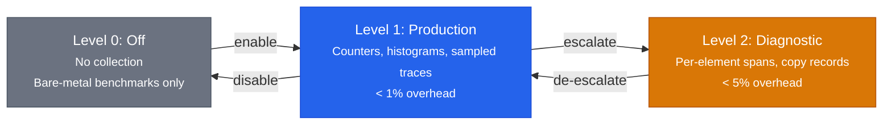
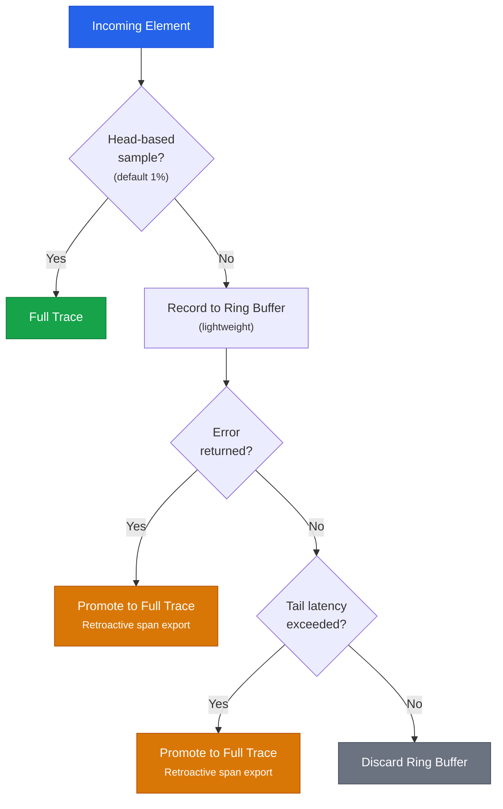
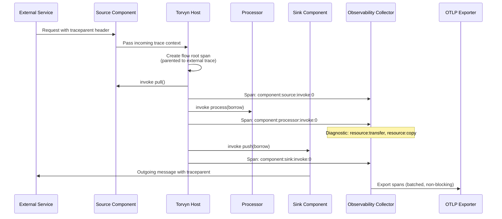
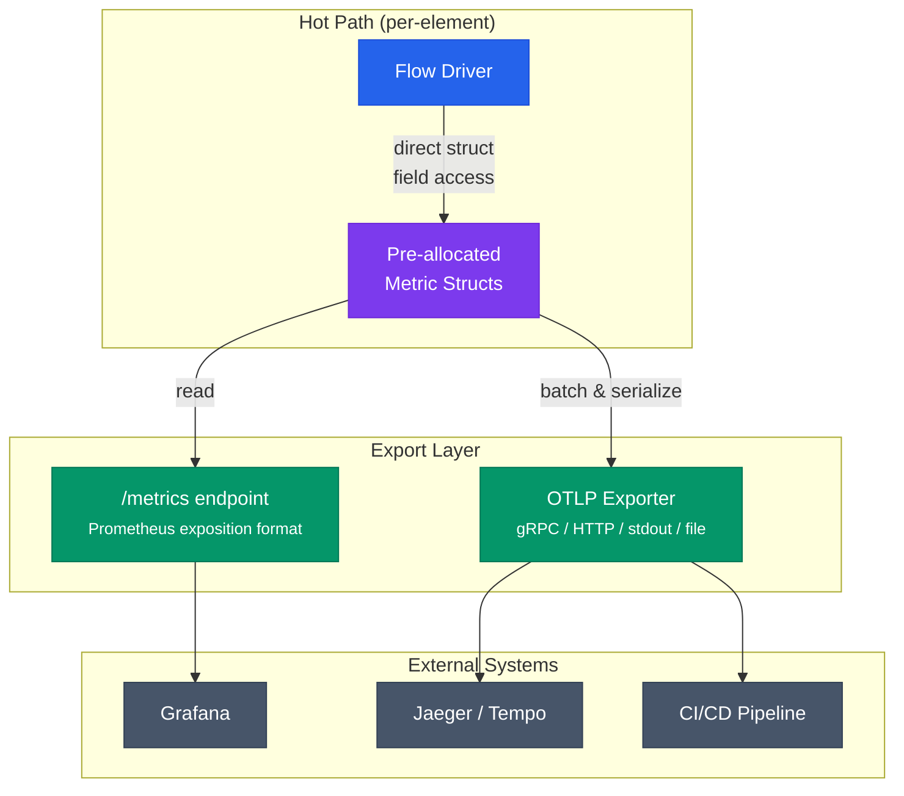

# Observability

Torvyn treats observability as a design primitive, not an afterthought. Every stream, resource handoff, queueing point, backpressure event, and failure is measurable. The goal is to make Torvyn the most introspectable streaming runtime available — not by volume of data emitted, but by the precision and actionability of the insights it provides.

## Torvyn's Three-Level Observability Model

The observability system supports three operational levels, configurable at startup and adjustable at runtime without restarting flows:



Level transitions are atomic and do not require restarting flows or pipelines.

### Level 0: Off

Nothing is collected. This level exists for bare-metal benchmarks that measure raw runtime overhead without any observability instrumentation. It is not recommended for any deployment other than performance characterization.

### Level 1: Production (default)

Flow-level counters, latency histograms, error counts, resource pool summaries, and trace context propagation with sampled span export. This level is designed to be always-on in every production deployment with negligible overhead.

**Target overhead:** < 1% throughput reduction, < 500 nanoseconds per element.

Sampling strategy at Production level:
- **Head-based sampling:** A configurable fraction of flows are fully traced (default: 1%). All invocations within a sampled flow produce spans.
- **Error-triggered sampling:** If any component returns an error, the entire flow's trace is promoted to full sampling, including retroactive span export from a ring buffer.
- **Tail-latency sampling:** If a flow's end-to-end latency exceeds a configurable threshold, it is promoted to full sampling.

This adaptive approach ensures that interesting traces (errors, slow flows) are always captured without incurring full tracing overhead on every element.



### Level 2: Diagnostic

All of Production level, plus per-element span events, per-copy accounting records, per-backpressure event records, and queue depth snapshots. This level provides complete visibility into every data movement in the pipeline.

**Target overhead:** < 5% throughput reduction, < 2 microseconds per element.

Level transitions are atomic. Switching from Production to Diagnostic does not require restarting flows or pipelines. This means operators can escalate observability on a running system when investigating a problem.

## Tracing: How Trace Context Propagates Through Pipelines

Every flow in Torvyn carries a `TraceContext` containing a W3C Trace ID (128-bit), a current span ID (64-bit), a parent span ID, and trace flags. The host runtime creates a new span for each component invocation and updates the trace context automatically. Components do not need to implement trace propagation — it is invisible to them unless they choose to read the current trace ID for their own purposes.

The span hierarchy Torvyn generates:

```
flow:{flow_id}                              [Flow-level root span]
├── component:{component_id}:invoke:{seq}   [Per-invocation span]
│   ├── resource:transfer:{id}              [Diagnostic only]
│   └── resource:copy:{id}                  [Diagnostic only]
├── component:{component_id}:invoke:{seq+1}
│   └── ...
├── backpressure:{stream_id}                [Diagnostic only]
└── ...
```

When a pipeline ingests data from an external source (HTTP request, Kafka message), the source component can extract an incoming W3C `traceparent` header and pass it to the host. The flow's root span will then be parented to the external trace, enabling end-to-end distributed tracing across Torvyn and non-Torvyn services. Similarly, sink components can inject the current trace ID into outgoing messages.



Traces are exported via OTLP (OpenTelemetry Protocol), supporting gRPC, HTTP, stdout (JSON), file output, and in-process channels for CLI tool integration. Export runs in a dedicated background task and never blocks the hot path.

## Metrics: What Is Available and How to Access Them

Torvyn's metrics are pre-allocated at flow creation time and use direct struct field access on the hot path (no hash-map lookups, no dynamic registration). The export layer translates internal metric structures into Prometheus exposition format and OTLP metrics for external consumption.

**Per-flow metrics:** `flow.elements.total` (elements processed), `flow.elements.errors` (errors), `flow.latency` (end-to-end latency histogram), `flow.copies.total` (copy operations), `flow.copies.bytes` (bytes copied).

**Per-component metrics:** `component.invocations` (call count), `component.errors` (error count), `component.processing_time` (latency histogram per invocation), `component.fuel_consumed` (Wasm fuel if metering is enabled), `component.memory_current` (linear memory gauge).

**Per-stream metrics:** `stream.elements.transferred`, `stream.backpressure.events`, `stream.backpressure.duration_ns`, `stream.queue.current_depth`, `stream.queue.wait_time` (histogram).

**Resource pool metrics:** `pool.capacity`, `pool.available`, `pool.allocated`, `pool.returned`, `pool.fallback_count`, `pool.exhaustion_events`.

**System-level metrics:** `system.flows.active`, `system.components.active`, `system.memory.total`, `system.scheduler.wakeups`, `system.scheduler.idle_ns`.

Metrics are accessible through two mechanisms. **Pull (Prometheus):** The runtime inspection API serves a `/metrics` endpoint in Prometheus exposition format, scrapable by any Prometheus-compatible monitoring system. **Push (OTLP):** Metrics are batched and exported via OTLP at configurable intervals (default: 15 seconds).



## Benchmarking: How to Use `torvyn bench`

`torvyn bench` is a first-class tool for performance analysis. It runs a pipeline under sustained load and produces a structured report covering throughput, latency distribution, per-component breakdown, resource utilization, and scheduling behavior.

A benchmark report includes:
- Throughput in elements per second and bytes per second.
- Latency percentiles (p50, p90, p95, p99, p999, max).
- Per-component latency breakdown (which stage is slowest).
- Queue occupancy statistics (mean depth, peak depth, backpressure events).
- Buffer allocation and reuse statistics (allocations, pool hits, fallback allocations, copy counts and breakdown by reason).
- Scheduling statistics (wakeup counts per component, idle time).
- Memory usage (peak and mean across all components).

Benchmark results can be saved as named baselines and compared across runs using `--compare`, enabling regression detection in CI/CD pipelines.

## Integration with External Tools

**Grafana:** Import Torvyn's Prometheus metrics and build dashboards showing flow throughput, latency percentiles, queue depths, pool utilization, and backpressure activity over time.

**Jaeger / Tempo:** Point Torvyn's OTLP trace export to a Jaeger or Grafana Tempo endpoint. View per-element traces showing the path through each component, timing at each stage, and resource events. Error-promoted and tail-latency-promoted traces provide insight into the worst-performing flows.

**CI/CD integration:** Use `torvyn bench --report-format json` to produce machine-readable benchmark results. Compare against a baseline (`--compare baseline.json`) and fail the pipeline if latency regressions exceed a threshold.

## Interpreting Benchmark Reports

A benchmark report is most useful when you know what to look for:

- **If p99 latency is much higher than p50:** Look for occasional backpressure events or garbage collection in component code. The per-component breakdown will show which stage introduces the tail.
- **If throughput is lower than expected:** Check queue peak depth. If queues are consistently full, the bottleneck is downstream. If queues are rarely full but throughput is low, the bottleneck is the source or the scheduler yield frequency.
- **If copy count is high:** Check the copy reason breakdown. `MetadataMarshal` copies are unavoidable but tiny. If `PayloadRead` or `PayloadWrite` counts seem excessive, investigate whether any component is reading payload unnecessarily (a filter that reads the full payload when metadata-only filtering would suffice).
- **If pool fallback allocations are high:** The buffer pool is undersized for the workload. Increase pool sizes for the tier(s) showing high fallback rates.
