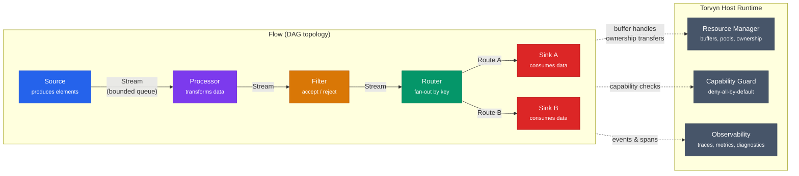

# What Is Torvyn?

Torvyn is an ownership-aware reactive streaming runtime for building safe, low-latency, polyglot pipelines. It composes sandboxed WebAssembly components into streaming data pipelines on a single node, using typed contracts to define every interaction and host-managed resources to track every byte of data movement.

Torvyn combines several ideas into a single cohesive system: WebAssembly component boundaries for portability and isolation, WIT (WebAssembly Interface Types) for precise interface contracts, a Rust host runtime for performance and memory safety, async stream scheduling for reactive flow control, host-managed resources for explicit ownership transfer, capability-based sandboxing for security, and industrial tooling for adoption and operation.

The central insight behind Torvyn is that most systems do not fail because a single technology is missing. They fail because the stack is too fragmented. Torvyn is opinionated about the full path from contract definition through deployment:

```
contract → build → compose → validate → run → trace → benchmark → package → deploy
```

That full-path coherence is one of its core differentiators.


## The Problem Torvyn Solves

Modern infrastructure increasingly consists of streaming processors, local inference modules, edge functions, event transformers, policy engines, protocol adapters, data enrichers, and autonomous agent tooling. These systems need to be fast enough for real-time workloads, safe enough for multi-tenant execution, modular enough for rapid iteration, observable enough for regulated production environments, and portable enough to run across diverse infrastructure.

Current systems force teams to choose among low latency, isolation, portability, polyglot interoperability, and operational simplicity. No widely adopted execution model simultaneously provides all of these.

**Traditional microservices** provide isolation and deployment flexibility, but impose heavy boundary overhead. Each service boundary introduces serialization and deserialization, multiple buffer allocations, network stack overhead, retries and backoff complexity, observability stitching, schema drift, and nontrivial operational cost. Even when services run on the same node, teams often still pay the full cost of remote-style communication patterns. Systems become modular in theory but expensive in practice.

**Containers** are excellent for deployment packaging and isolation, but they introduce too much friction for extremely fine-grained, low-latency pipelines. Startup time, memory footprint, orchestration overhead, and resource granularity become limiting factors when a design calls for dozens or hundreds of small pipeline stages on a single node.

**In-process plugin models** are fast but often unsafe. They reduce boundary overhead by running everything in a single process, but create risks including memory unsafety in extension code, undefined behavior at FFI boundaries, weak isolation between plugins, poor resource governance, versioning fragility, and language lock-in. These models are attractive for performance but brittle at industrial scale.

**Reactive streaming** is everywhere, but the tooling landscape is fragmented across message brokers, stream processors, actor systems, async runtimes, RPC layers, service meshes, and ad hoc pipeline libraries. Teams assemble streaming systems using many layers that were not designed as a unified, ownership-aware runtime.

**AI-native workloads** amplify these problems. Local inference pipelines combine token streams, embeddings, policy filters, retrieval stages, model adapters, tracing layers, content guards, caching logic, and downstream delivery systems. These workloads do not always need full remote-distributed infrastructure between each stage. They need safe local composition, deterministic streaming behavior, and high-throughput modular execution.

Torvyn is designed to fill this gap.

## How Torvyn Compares to Existing Approaches

| Dimension | Microservices | Containers | In-Process Plugins | Actor Systems | **Torvyn** |
|---|---|---|---|---|---|
| Isolation | Process-level | OS-level | None or minimal | Logical only | Wasm sandbox per component |
| Boundary overhead | High (network) | Moderate (IPC) | None | Low (message passing) | Low (host-managed handles) |
| Contract enforcement | Schema (often lax) | None at runtime | None or ad hoc | Protocol-level | Typed WIT, validated at link time |
| Polyglot support | Independent binaries | Independent images | Language-locked (FFI) | Varies | Any language → Wasm component |
| Ownership tracking | None | None | Manual | Message ownership | Host-enforced, every copy measured |
| Backpressure | Application-level | Application-level | None | Mailbox-based | Built into stream semantics |
| Observability | Per-service traces | Per-container logs | Application-dependent | Actor traces | Per-element, per-copy, per-queue |
| Packaging | Container images | Container images | Library artifacts | Varies | OCI-compatible artifacts |

Torvyn does not replace microservices or containers for every workload. It targets the specific and painful category of problems where traditional service boundaries add overhead without proportional benefit: same-node streaming pipelines, edge-local stream processing, ultra-low-latency component graphs, secure plugin ecosystems, local inference and dataflow composition, and high-frequency internal service chaining where network boundaries are unnecessary.

## Key Concepts

Torvyn's developer experience revolves around six core concepts:

**Contracts** are WIT interface definitions that specify how components exchange data. Contracts make ownership rules explicit (borrow vs. own), define error models, declare capability requirements, and enable static compatibility checking before any code runs. In Torvyn, the contract is the center of the product.

**Components** are sandboxed WebAssembly modules that implement one or more Torvyn interfaces. A component can be a Source (data producer), Processor (transform), Sink (data consumer), Filter (accept/reject), Router (fan-out), or Aggregator (stateful accumulation). Components can be written in any language that compiles to WebAssembly Components — Rust, Go, Python, Zig, and others.

**Streams** are typed connections between components through which `stream-element` records flow. Each stream has a bounded queue and a configurable backpressure policy. Streams carry both the data payload (as a host-managed buffer handle) and flow metadata (trace context, deadlines, sequence numbers).

**Resources** are host-managed byte buffers that components access through opaque handles. The host allocates buffers from tiered pools, tracks ownership state (Pooled, Owned, Borrowed, Leased), enforces access rules, and instruments every data copy. Components never directly share memory — all data movement is mediated and measured by the host.

**Capabilities** are declared permissions that control what each component can access. Torvyn follows a deny-all-by-default model: a component with no capability grants can do nothing beyond pure computation on data provided through its stream interface. Filesystem access, network access, clock access, and other system services require explicit grants from the pipeline operator.

**Flows** are instantiated pipeline topologies: a directed acyclic graph of components connected by streams, executing as a unit. A flow has its own lifecycle, its own resource budget, its own observability context, and its own backpressure domain.

The following diagram illustrates how these concepts compose into a running flow:



## When to Use Torvyn

Torvyn is a strong fit for:

- **Same-node streaming pipelines** where multiple processing stages need to operate on data with minimal latency and no network overhead between stages.
- **Edge-local stream processing** where compute resources are constrained and portability across different edge hardware is important.
- **Secure plugin ecosystems** where third-party or untrusted code must be executed with strong isolation and explicit capability boundaries.
- **AI inference pipelines** that chain preprocessing, model invocation, post-processing, policy enforcement, and delivery stages on a single node.
- **Event-driven data transformation** where data flows through a sequence of enrichment, filtering, and routing stages.
- **High-frequency internal service chaining** where teams have co-located services communicating over the network that could benefit from in-process composition without sacrificing isolation.

## When Not to Use Torvyn

Torvyn is not the right tool for every problem. Being explicit about this makes the project stronger and more trustworthy.

**Do not use Torvyn when you need a distributed orchestrator.** Torvyn operates on a single node. If your pipeline spans multiple machines and needs distributed coordination, consensus, or fault tolerance across nodes, use a distributed streaming system (Kafka Streams, Flink, etc.) or a container orchestrator (Kubernetes). Torvyn may eventually expand to multi-node topologies, but this is not a current capability.

**Do not use Torvyn when network service boundaries provide genuine value.** If independent deployment, independent scaling, and organizational team autonomy are your primary concerns, microservices remain the right architecture. Torvyn is valuable when the overhead of those boundaries exceeds their organizational benefit.

**Do not use Torvyn for simple request-response APIs.** Torvyn is designed for streaming dataflow. If your workload is fundamentally request-response with no streaming semantics, a standard HTTP server or RPC framework is simpler and more appropriate.

**Do not use Torvyn when you need guaranteed zero-copy transfer.** Torvyn minimizes copies and tracks every one that occurs, but WebAssembly's memory isolation model means that some copies are unavoidable when a component needs to read or transform payload data. If your workload requires absolute zero-copy data movement, you need shared-memory approaches that operate outside the Wasm sandbox model.

**Do not use Torvyn when the WebAssembly component ecosystem does not support your language.** While WebAssembly is polyglot in principle, component model tooling maturity varies by language. Rust support is production-grade. Support for Go, Python, and other languages is maturing but should be evaluated before committing to production use. Torvyn's Phase 0 targets Rust-first; polyglot support expands in subsequent phases.
