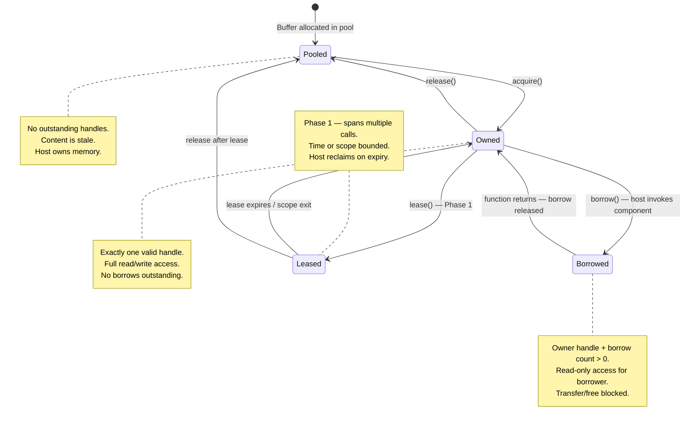
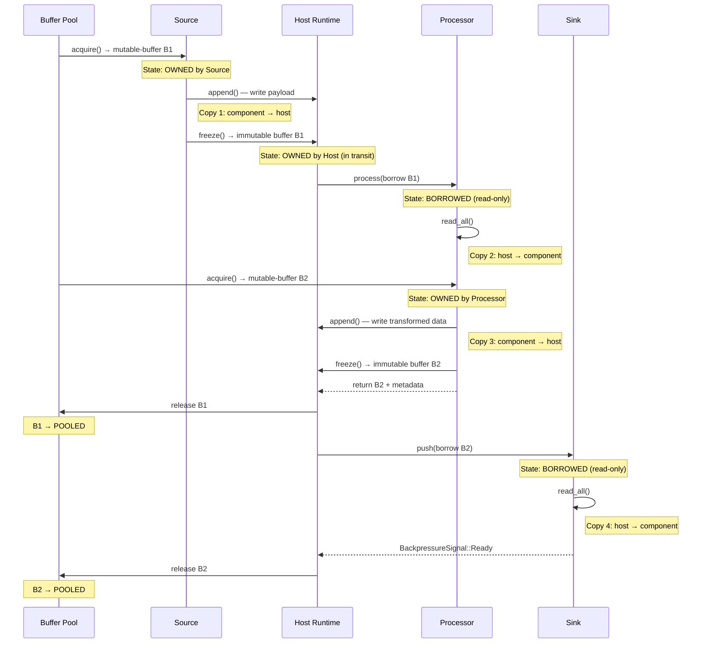
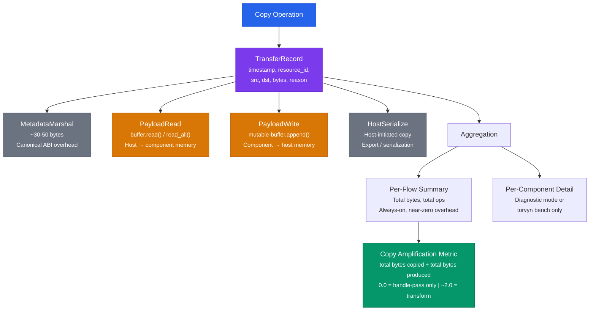

# The Ownership Model

## Why Ownership Matters in Streaming Systems

In any system where data flows through multiple processing stages, a fundamental question arises: who is responsible for each piece of data at each point in time? Who can read it? Who can modify it? When is it safe to recycle the underlying memory?

Traditional streaming systems often leave these questions implicit. A buffer is allocated, passed through a chain of functions, and eventually freed — with the programmer responsible for ensuring that no stage uses the buffer after it has been freed, that no two stages write to the same buffer concurrently, and that buffers are returned to pools promptly. When these invariants are violated, the result is use-after-free bugs, data corruption, memory leaks, and undefined behavior.

Torvyn makes ownership explicit and enforced. Every buffer in the system has exactly one owner at any given time. Ownership can be transferred, but never duplicated. Borrows are tracked with lifetimes scoped to function calls. The type system and runtime checks together make it impossible for two components to hold conflicting access to the same buffer. Every allocation, every copy, every borrow, every transfer is instrumented.

This is what "ownership-aware" means. It is not a marketing term. It is a specific, verifiable property of the runtime: the resource manager knows, at all times, who owns what.

## The Four Resource States

Every host-managed buffer in Torvyn exists in one of four states. These states form a finite state machine with well-defined transitions and invariants.

### Pooled

The buffer is not in active use. It resides in a buffer pool, ready for allocation. No component and no active flow references it. The host owns the underlying memory, and the buffer's content is considered stale. No entity can read or write the buffer's payload while it is in this state.

**Invariants:** No outstanding handles exist in any component's handle space. The buffer slot in the resource table is either vacant or marked as pooled.

### Owned

Exactly one entity — either the host or a specific component instance — holds exclusive ownership. The owner has full read and write access. No other entity may read, write, or free the buffer. Ownership can be transferred (moved) to another entity, after which the original owner's handle becomes invalid.

**Invariants:** Exactly one valid handle exists. The owner field in the resource table matches the entity holding the handle. No borrows are outstanding (ownership cannot be transferred while borrows exist).

### Borrowed

One entity owns the buffer. One or more other entities hold read-only borrow handles. Borrows are scoped to a single host-to-component function call — they are created when the host invokes a component function that takes a `borrow<buffer>` parameter, and they are automatically released when the function returns. This aligns directly with WIT's `borrow<T>` semantics.

**Invariants:** The owner handle remains valid. A borrow count > 0 is recorded. The borrow count decrements to zero when the component function returns. Ownership transfer and free are blocked while borrows are outstanding.

### Leased

A component holds a time-bounded or scope-bounded lease on a buffer. A lease is more flexible than a borrow — it can span multiple function calls within a single processing stage — but is still tracked and reclaimed by the host when the lease expires. Read-only leases allow shared access; mutable leases provide exclusive access.

**Invariants:** The lease has an explicit scope (stage boundary or time deadline). The host reclaims leases on scope exit, timeout, or component termination. Mutable leases block all other access.

> **Note:** Leased state support is planned for Phase 1. Phase 0 uses only Pooled, Owned, and Borrowed states, which are sufficient for the single-call-per-element processor model.

## Ownership State Machine

The following state diagram shows all valid transitions between the four resource states:



## How Buffers Move Through a Pipeline

Consider a simple three-stage pipeline: Source → Processor → Sink. The following sequence diagram summarizes the buffer ownership transitions and copy points for a single element:



Here is the same lifecycle shown in detail with memory layouts:

```
                 HOST MEMORY                    COMPONENT MEMORY
                 ═══════════                    ════════════════

 1. Source produces data
    ┌──────────────┐
    │ Buffer B1    │ ◄── Source calls allocate(), gets mutable-buffer
    │ [empty]      │     State: OWNED by Source
    └──────────────┘
           │
           ▼
    ┌──────────────┐                         ┌─────────────────┐
    │ Buffer B1    │     copy ──────────────► │ Source linear    │
    │ [payload]    │     ◄── Source writes    │ memory: payload │
    └──────────────┘         bytes via        │ data            │
           │                 mutable-buffer   └─────────────────┘
           │                 .append()
           ▼                 (1 copy: component → host)
    ┌──────────────┐
    │ Buffer B1    │ ◄── Source calls freeze(), returns owned buffer
    │ [immutable]  │     State: OWNED by Host (in transit)
    └──────────────┘

 2. Host passes buffer to Processor as borrow
    ┌──────────────┐
    │ Buffer B1    │ ◄── State: BORROWED (Processor has read-only borrow)
    │ [immutable]  │
    └──────────────┘
           │
           │  Processor calls buffer.read()
           │                                 ┌─────────────────┐
           ├── copy ────────────────────────►│ Processor linear│
           │   (1 copy: host → component)    │ memory: input   │
           │                                 └─────────────────┘
           │
           │  Processor allocates new output buffer
    ┌──────────────┐
    │ Buffer B2    │ ◄── State: OWNED by Processor
    │ [mutable]    │
    └──────────────┘
           │
           │  Processor writes transformed data
           │                                 ┌─────────────────┐
           │◄── copy ◄──────────────────────│ Processor linear│
           │    (1 copy: component → host)   │ memory: output  │
           │                                 └─────────────────┘
           ▼
    ┌──────────────┐
    │ Buffer B2    │ ◄── Processor freezes and returns B2
    │ [immutable]  │     State: OWNED by Host (in transit)
    └──────────────┘
    ┌──────────────┐
    │ Buffer B1    │ ◄── Borrow released when process() returns
    │ [immutable]  │     State: OWNED by Host → released to POOL
    └──────────────┘

 3. Host passes buffer to Sink as borrow
    ┌──────────────┐
    │ Buffer B2    │ ◄── State: BORROWED (Sink has read-only borrow)
    │ [immutable]  │
    └──────────────┘
           │
           │  Sink calls buffer.read-all()
           │                                 ┌─────────────────┐
           ├── copy ────────────────────────►│ Sink linear     │
           │   (1 copy: host → component)    │ memory: data    │
           │                                 └─────────────────┘
           ▼
    ┌──────────────┐
    │ Buffer B2    │ ◄── Borrow released → OWNED by Host → POOL
    └──────────────┘

 Total payload copies: 4 (source write, processor read, processor write, sink read)
 All copies instrumented. All ownership transitions tracked.
```

## What "Ownership-Aware" Means vs. "Zero-Copy"

Torvyn is deliberately not marketed as "zero-copy." The WebAssembly Component Model imposes real memory isolation between components. Each component has its own linear memory. The host has its own address space. When a component needs to read or transform data, the bytes must exist in that component's linear memory at some point.

"Ownership-aware" means something more precise and more useful:

- **The runtime knows who owns every buffer at all times.** There is never ambiguity about which entity is responsible for a buffer.
- **Every copy is intentional, measured, and attributed.** You can run `torvyn bench` and see exactly how many bytes were copied, at which component boundary, and for what reason.
- **Unnecessary copies are eliminated.** When a buffer passes through a component that only inspects metadata (content-type, size, sequence number), no payload copy occurs. The component receives an opaque handle, and the payload bytes never leave host memory. This is the handle-pass fast path — Torvyn's most valuable optimization.
- **Copies that cannot be eliminated are bounded and predictable.** The maximum number of copies per pipeline stage is known at design time from the contract: a processor that reads and writes payload data incurs exactly two copies (read + write). This is a fixed, measurable cost.

This is a more industrially credible foundation than promising universal zero-copy behavior. Where true zero-copy transfer is possible (handle passing, metadata-only routing), Torvyn uses it. Where copies are unavoidable (reading payload bytes into component memory), Torvyn ensures they are bounded, measurable, predictable, and operationally visible.

## How Copy Accounting Works

Every copy operation in Torvyn produces a `TransferRecord` that captures when the copy occurred, what resource was copied, the source and destination entities, the number of bytes, and why the copy was performed.



Copy reasons include:

- **MetadataMarshal** — The canonical ABI marshaled metadata (small, fixed-size, ~30-50 bytes) into component linear memory during a function call.
- **PayloadRead** — A component called `buffer.read()` or `buffer.read-all()`, pulling payload bytes from host memory into component memory.
- **PayloadWrite** — A component wrote data into a mutable buffer, copying bytes from component memory to host memory.
- **HostSerialize** — The host initiated a copy for serialization or export purposes.

These records are aggregated at two levels. Per-flow summaries (total bytes copied, total copy operations, breakdown by reason) are maintained on every element with near-zero overhead. Per-component detailed records are available when running in diagnostic mode or during benchmarking.

The copy amplification metric — the ratio of total payload bytes copied to total payload bytes produced — provides a single number that characterizes pipeline efficiency. A metadata-routing pipeline might achieve 0.0 (no payload copies at all). A transform-heavy pipeline typically shows close to 2.0 (one read + one write per stage). Values significantly above 2.0 per stage indicate unnecessary copying that should be investigated.

## Performance Implications and Optimization Strategies

**Use metadata-only routing where possible.** Filters, routers, and priority classifiers often need only the element's content-type, size, or sequence number to make a decision. These metadata fields are available without reading the payload. If your component can operate on metadata alone, it operates on the handle-pass fast path with zero payload copies.

**Prefer streaming reads over full reads.** For large payloads, calling `buffer.read(offset, len)` with a smaller window (e.g., 4 KiB at a time) limits linear memory usage. For small payloads, a single `buffer.read-all()` is more efficient (one host call instead of many).

**Pre-allocate output buffers at the right size.** When calling `buffer-allocator.allocate(capacity-hint)`, providing an accurate capacity hint lets the pool system select the best-fit buffer tier, avoiding waste (oversized buffers) and reallocation (undersized buffers).

**Monitor pool reuse rate.** The `pool_reuse_rate` metric (returned buffers / allocated buffers) indicates how effectively buffers are being recycled. A rate below 80% suggests that buffers are being lost to fallback allocation, which typically means the pool is undersized for the workload. Adjust pool sizes in the host configuration.

**Monitor copy amplification.** Use `torvyn bench` to measure the copy amplification metric for your pipeline. If a component is producing more copies than expected, review whether it is reading payload bytes unnecessarily or whether a metadata-only routing path is possible.
