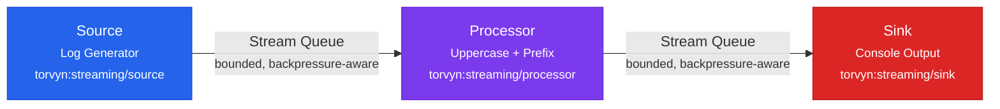
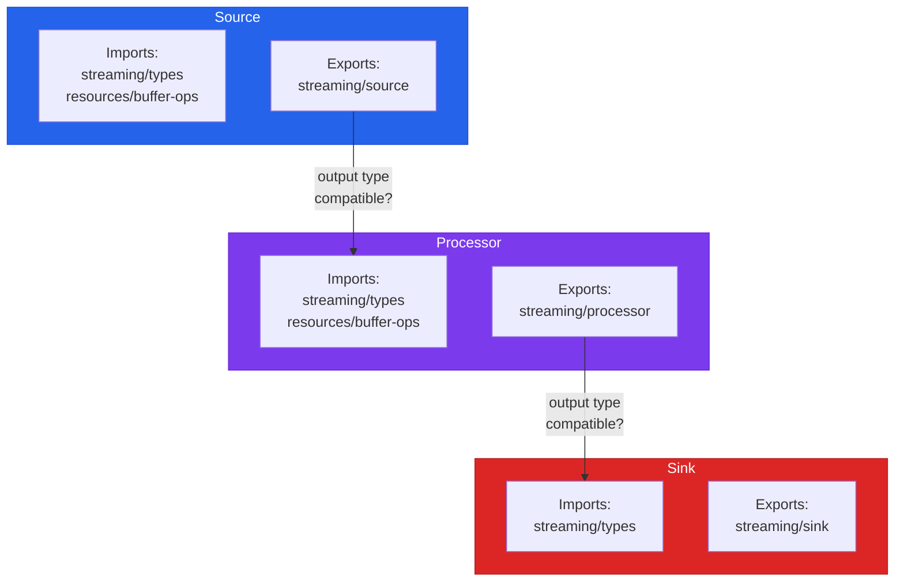

# Your First Pipeline

This tutorial walks you through building a multi-component streaming pipeline from scratch. You will define WIT contracts for three components — a source, a processor, and a sink — implement each one, wire them together in a pipeline configuration, and observe the result.

**Prerequisites:** Complete the [Quickstart](quickstart.md) first. You should be comfortable with `torvyn init`, `torvyn check`, and `cargo component build`.

**Time required:** 20–30 minutes.

## What You Will Build

A pipeline that:

1. **Source** — generates timestamped log-style messages.
2. **Processor** — converts each message to uppercase and prepends a sequence number.
3. **Sink** — prints each processed message to stdout.

Along the way, you will see how Torvyn's typed contracts enforce compatibility between components, how buffers flow through the pipeline, and how tracing reveals per-component behavior.



## Step 1: Scaffold the Project

Use the `full-pipeline` template to create a multi-component project:

```bash
torvyn init log-pipeline --template full-pipeline
cd log-pipeline
```

Expected output:

```
  ✓ Created project "log-pipeline" with template "fullpipeline"

  log-pipeline
  ├── Torvyn.toml
  ├── components/
  │   ├── source/
  │   │   ├── Cargo.toml
  │   │   ├── wit/world.wit
  │   │   └── src/lib.rs
  │   └── transform/
  │       ├── Cargo.toml
  │       ├── wit/world.wit
  │       └── src/lib.rs
  ├── .gitignore
  └── README.md
```

The template gives us a source and a transform. We will add a custom sink and modify all three components to match our log-processing scenario.

## Step 2: Define the WIT Contracts

Each component's WIT contract declares what it imports and exports. Let us examine each one.

### Source Contract

Open `components/source/wit/world.wit`:

```wit
package source:component;

world source {
    import torvyn:streaming/types@0.1.0;
    import torvyn:resources/buffer-ops@0.1.0;
    export torvyn:streaming/source@0.1.0;
}
```

This contract declares a **source** component: it imports the Torvyn type system and buffer allocator, and exports the `source` interface. The `source` interface requires implementing a `pull` function that the runtime calls repeatedly to fetch the next element. When there are no more elements, `pull` returns `None` to signal end of stream.

### Processor Contract

Open `components/transform/wit/world.wit`:

```wit
package transform:component;

world transform {
    import torvyn:streaming/types@0.1.0;
    import torvyn:resources/buffer-ops@0.1.0;
    export torvyn:streaming/processor@0.1.0;
}
```

A **processor** imports the same foundations and exports the `processor` interface. The runtime calls `process` once per element, passing a borrowed reference to the input. The processor returns either `emit(output-element)` with a new owned buffer, or `drop` to filter the element out.

### Sink Contract

We need to create the sink component. Create the directory structure:

```bash
mkdir -p components/sink/wit
mkdir -p components/sink/src
```

Create `components/sink/wit/world.wit`:

```wit
package sink:component;

world sink {
    import torvyn:streaming/types@0.1.0;
    export torvyn:streaming/sink@0.1.0;
}
```

A **sink** imports the type system (it does not need the buffer allocator because it consumes data rather than producing new buffers) and exports the `sink` interface. The runtime calls `push` for each element arriving at the sink.

Notice the key difference: sinks do not import `buffer-ops` because they do not allocate output buffers. They receive borrowed references to input data, read what they need during the `push` call, and return. This is part of Torvyn's ownership-aware design — each component declares only the capabilities it requires.



Create `components/sink/Cargo.toml`:

```toml
[package]
name = "sink"
version = "0.1.0"
edition = "2021"

[lib]
crate-type = ["cdylib"]

[dependencies]
wit-bindgen = "0.36"

[package.metadata.component]
package = "sink:component"
```

## Step 3: Implement Each Component

### Source: Timestamped Log Generator

Replace the contents of `components/source/src/lib.rs`:

```rust
// Source component: generates timestamped log messages.

wit_bindgen::generate!({
    world: "source",
    path: "wit",
});

use exports::torvyn::streaming::source::Guest;
use torvyn::streaming::types::{OutputElement, ElementMeta, ProcessError, BackpressureSignal};
use torvyn::resources::buffer_ops;

struct LogSource;

static mut COUNTER: u64 = 0;

// Simulated log messages.
const MESSAGES: &[&str] = &[
    "connection accepted from 10.0.1.42",
    "request received: GET /api/status",
    "database query completed in 12ms",
    "response sent: 200 OK",
    "connection accepted from 10.0.1.87",
    "request received: POST /api/events",
    "authentication succeeded for user admin",
    "event stored: id=evt_38f71a",
    "response sent: 201 Created",
    "connection closed: 10.0.1.42",
];

impl Guest for LogSource {
    fn pull() -> Result<Option<OutputElement>, ProcessError> {
        let count = unsafe {
            COUNTER += 1;
            COUNTER
        };

        // End the stream after 100 elements.
        if count > 100 {
            return Ok(None);
        }

        // Cycle through the simulated log messages.
        let msg_index = ((count - 1) as usize) % MESSAGES.len();
        let message = format!("[ts={}] {}", count * 1_000_000, MESSAGES[msg_index]);

        // Allocate a buffer and write the message into it.
        let buf = buffer_ops::allocate(message.len() as u64)
            .map_err(|_| ProcessError::Internal("buffer allocation failed".into()))?;
        buf.append(message.as_bytes())
            .map_err(|_| ProcessError::Internal("buffer write failed".into()))?;
        buf.set_content_type("text/plain");

        let output_buf = buf.freeze();

        Ok(Some(OutputElement {
            meta: ElementMeta {
                sequence: 0,       // Runtime assigns the actual sequence number.
                timestamp_ns: 0,   // Runtime assigns the actual timestamp.
                content_type: "text/plain".into(),
            },
            payload: output_buf,
        }))
    }

    fn notify_backpressure(
        _signal: BackpressureSignal,
    ) {
        // This simple source ignores backpressure signals.
        // A production source might pause an upstream connection.
    }
}

export!(LogSource);
```

Key details:

- The source allocates a `mutable-buffer` via `buffer_ops::allocate`, writes data into it with `append`, then calls `freeze()` to convert it into an immutable `buffer`. Ownership of the frozen buffer transfers to the runtime when `pull` returns.
- The `sequence` and `timestamp_ns` fields in `ElementMeta` are set to 0 because the runtime overwrites them with authoritative values. Component-provided values are advisory only.
- The source returns `Ok(None)` to signal end of stream after 100 elements.

### Processor: Uppercase with Sequence Prefix

Replace the contents of `components/transform/src/lib.rs`:

```rust
// Transform component: converts text to uppercase and prepends a line number.

wit_bindgen::generate!({
    world: "transform",
    path: "wit",
});

use exports::torvyn::streaming::processor::{Guest, ProcessResult};
use torvyn::streaming::types::{StreamElement, OutputElement, ElementMeta, ProcessError};
use torvyn::resources::buffer_ops;

struct UppercaseTransform;

impl Guest for UppercaseTransform {
    fn process(input: StreamElement) -> Result<ProcessResult, ProcessError> {
        // Read the input buffer contents.
        let data = input.payload.read_all();
        let text = String::from_utf8_lossy(&data);

        // Transform: uppercase and prepend the sequence number.
        let transformed = format!("[{:04}] {}", input.meta.sequence, text.to_uppercase());

        // Allocate an output buffer and write the transformed data.
        let out_buf = buffer_ops::allocate(transformed.len() as u64)
            .map_err(|_| ProcessError::Internal("buffer allocation failed".into()))?;
        out_buf.append(transformed.as_bytes())
            .map_err(|_| ProcessError::Internal("buffer write failed".into()))?;
        out_buf.set_content_type("text/plain");

        let frozen = out_buf.freeze();

        Ok(ProcessResult::Emit(OutputElement {
            meta: ElementMeta {
                sequence: input.meta.sequence,
                timestamp_ns: input.meta.timestamp_ns,
                content_type: "text/plain".into(),
            },
            payload: frozen,
        }))
    }
}

export!(UppercaseTransform);
```

Key details:

- `input.payload.read_all()` copies the buffer contents from host memory into the component's linear memory. The resource manager records this as a measured copy. This is one of the copies that `torvyn trace` and `torvyn bench` will report.
- A new output buffer is allocated, written, and frozen. The old input buffer handle is dropped when `process` returns — the host reclaims it (or returns it to the buffer pool).
- The processor uses `input.meta.sequence` to access the runtime-assigned sequence number.

### Sink: Console Output

Create `components/sink/src/lib.rs`:

```rust
// Sink component: prints each element to stdout.

wit_bindgen::generate!({
    world: "sink",
    path: "wit",
});

use exports::torvyn::streaming::sink::Guest;
use torvyn::streaming::types::{StreamElement, BackpressureSignal, ProcessError};

struct ConsoleSink;

impl Guest for ConsoleSink {
    fn push(element: StreamElement) -> Result<BackpressureSignal, ProcessError> {
        // Read the buffer contents.
        let data = element.payload.read_all();
        let text = String::from_utf8_lossy(&data);

        // Print to stdout.
        println!("{text}");

        // Signal that we are ready for more data.
        Ok(BackpressureSignal::Ready)
    }

    fn complete() -> Result<(), ProcessError> {
        // Flush is a no-op for stdout in this example.
        // A production sink writing to a file or network would flush here.
        Ok(())
    }
}

export!(ConsoleSink);
```

Key details:

- The sink receives a `StreamElement` with borrowed handles. It reads the payload during the `push` call. After `push` returns, the borrowed handle is no longer valid — the sink must not store it.
- The `push` function returns a `BackpressureSignal`. Returning `Ready` tells the runtime to continue delivering elements. Returning `Pause` would cause the runtime to pause upstream delivery until the sink signals readiness again. This is Torvyn's built-in backpressure mechanism.
- The `complete` function is called once when the upstream flow is finished. Sinks should flush any buffered data here.

## Step 4: Configure the Pipeline

Replace the contents of `Torvyn.toml` with the full pipeline configuration:

```toml
[torvyn]
name = "log-pipeline"
version = "0.1.0"
description = "A three-stage log processing pipeline"
contract_version = "0.1.0"

[[component]]
name = "source"
path = "components/source"
language = "rust"

[[component]]
name = "transform"
path = "components/transform"
language = "rust"

[[component]]
name = "sink"
path = "components/sink"
language = "rust"

# Pipeline topology: source → transform → sink
[flow.main]
description = "Generate logs, uppercase them, and print to console"

[flow.main.nodes.source]
component = "file://./components/source/target/wasm32-wasip2/debug/source.wasm"
interface = "torvyn:streaming/source"

[flow.main.nodes.transform]
component = "file://./components/transform/target/wasm32-wasip2/debug/transform.wasm"
interface = "torvyn:streaming/processor"

[flow.main.nodes.sink]
component = "file://./components/sink/target/wasm32-wasip2/debug/sink.wasm"
interface = "torvyn:streaming/sink"

[[flow.main.edges]]
from = { node = "source", port = "output" }
to = { node = "transform", port = "input" }

[[flow.main.edges]]
from = { node = "transform", port = "output" }
to = { node = "sink", port = "input" }
```

The `[flow.main]` section defines the pipeline topology. Each node names a compiled component and the interface it implements. The `[[flow.main.edges]]` array wires them together: source → transform → sink.

## Step 5: Build and Run

Build all three components:

```bash
cd components/source && cargo component build --target wasm32-wasip2 && cd ../..
cd components/transform && cargo component build --target wasm32-wasip2 && cd ../..
cd components/sink && cargo component build --target wasm32-wasip2 && cd ../..
```

Validate the pipeline:

```bash
torvyn check
```

Expected output:

```
  ✓ Manifest valid (Torvyn.toml)
  ✓ Contracts valid (3 components)
  ✓ Component "source" declared correctly
  ✓ Component "transform" declared correctly
  ✓ Component "sink" declared correctly

  All checks passed.
```

Verify that the components can compose correctly:

```bash
torvyn link
```

Expected output:

```
  ✓ Flow "main": source → transform → sink
  ✓ All interfaces compatible
  ✓ Topology valid (DAG, connected, role-consistent)

  Link check passed.
```

`torvyn link` statically verifies that the WIT interfaces of connected components are compatible. It checks that the output type of the source is compatible with the input type of the transform, and so on. It also validates the topology: the graph must be a directed acyclic graph (DAG), fully connected, and each node's declared interface must match its role in the graph.

Now run the pipeline:

```bash
torvyn run --limit 10
```

Expected output:

```
▶ Running flow "main" (limit: 10 elements)

[0000] [TS=1000000] CONNECTION ACCEPTED FROM 10.0.1.42
[0001] [TS=2000000] REQUEST RECEIVED: GET /API/STATUS
[0002] [TS=3000000] DATABASE QUERY COMPLETED IN 12MS
[0003] [TS=4000000] RESPONSE SENT: 200 OK
[0004] [TS=5000000] CONNECTION ACCEPTED FROM 10.0.1.87
[0005] [TS=6000000] REQUEST RECEIVED: POST /API/EVENTS
[0006] [TS=7000000] AUTHENTICATION SUCCEEDED FOR USER ADMIN
[0007] [TS=8000000] EVENT STORED: ID=EVT_38F71A
[0008] [TS=9000000] RESPONSE SENT: 201 CREATED
[0009] [TS=10000000] CONNECTION CLOSED: 10.0.1.42

  ── Summary ──────────────
  Flow:        main
  Elements:    10
  Duration:    0.05s
  Throughput:  ~200 elem/s
```

Each log message was generated by the source, uppercased and sequence-numbered by the transform, and printed by the sink.

## Step 6: Observe with Tracing

Run the pipeline with full tracing to see per-element behavior:

```bash
torvyn trace --limit 3 --show-backpressure
```

The trace output shows how each element flows through the three stages, the latency at each stage, buffer allocation and copy events, and whether any backpressure occurred. This level of visibility is a core Torvyn design goal: every stream element, resource handoff, and scheduling event is observable.

## What You Have Learned

In this tutorial you:

- Defined WIT contracts for three different component roles: source, processor, and sink.
- Implemented each component in Rust, working with Torvyn's buffer ownership model: allocate → write → freeze → transfer.
- Configured a multi-component pipeline topology in `Torvyn.toml`.
- Used `torvyn link` to statically verify interface compatibility before running anything.
- Observed the running pipeline and traced individual element flow.

The key concepts demonstrated:

- **Contract-first design** — the WIT contract defines what each component can do before any code is written.
- **Ownership-aware buffers** — mutable buffers are frozen before transfer; borrowed handles are valid only during a single call.
- **Backpressure signaling** — sinks explicitly signal whether they are ready for more data.
- **Static composition verification** — `torvyn link` catches interface mismatches before runtime.

## Next Steps

- [Token Streaming Pipeline](../tutorials/token-streaming-pipeline.md) — build an AI token streaming pipeline with content policy filtering.
- [Event Enrichment Pipeline](../tutorials/event-enrichment-pipeline.md) — build a multi-stage enrichment pipeline with resource ownership accounting.
- [Custom Component Guide](../tutorials/custom-component-guide.md) — write a component from scratch without templates.
