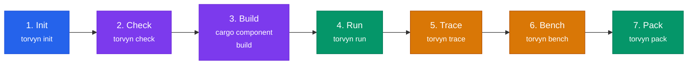

# Quickstart

This tutorial walks you through the complete Torvyn developer workflow in about ten minutes. You will scaffold a project, explore its structure, build it, run it, trace its execution, benchmark it, and package it.

**Prerequisites:** A working Torvyn installation. If you have not installed Torvyn yet, follow the [Installation Guide](installation.md) first.

**Time required:** 10 minutes.



## Step 1: Create a New Project

Use `torvyn init` to scaffold a new project. The `--template transform` flag creates a single-component stateless transform — the simplest useful Torvyn component.

```bash
torvyn init my-transform --template transform
```

Expected output:

```
  ✓ Created project "my-transform" with template "transform"

  my-transform
  ├── Torvyn.toml
  ├── Cargo.toml
  ├── wit/world.wit
  ├── src/lib.rs
  ├── .gitignore
  └── README.md

  Next steps:
    cd my-transform
    torvyn check              # Validate contracts and manifest
    torvyn build              # Compile to WebAssembly component
    torvyn run --limit 10     # Run and see output
```

Move into the project directory:

```bash
cd my-transform
```

## Step 2: Explore the Project Structure

The scaffolded project contains five files. Each serves a specific role:

**`Torvyn.toml`** — The project manifest. This is the central configuration file that identifies the project, declares its components, and defines pipeline topology.

```toml
[torvyn]
name = "my-transform"
version = "0.1.0"
contract_version = "0.1.0"

[[component]]
name = "my-transform"
path = "."
language = "rust"
```

The `[torvyn]` table declares the project name and version. The `contract_version` field indicates which version of the Torvyn streaming contracts this component targets. The `[[component]]` array declares one component, rooted at the current directory, written in Rust.

**`Cargo.toml`** — Standard Rust project manifest. The key detail is `crate-type = ["cdylib"]`, which tells the compiler to produce a WebAssembly module rather than a native binary.

**`wit/world.wit`** — The WIT (WebAssembly Interface Type) contract for this component. This file is explored in the next step.

**`src/lib.rs`** — The component implementation. This is where your logic lives.

**`.gitignore`** — Ignores build artifacts (`target/`, `.torvyn/`, `*.wasm`).

## Step 3: Read the WIT Contract

Open `wit/world.wit`:

```wit
package my-transform:component;

world my-transform {
    import torvyn:streaming/types@0.1.0;
    import torvyn:resources/buffer-ops@0.1.0;
    export torvyn:streaming/processor@0.1.0;
}
```

This contract says three things:

1. **This component imports `torvyn:streaming/types`** — it uses the core Torvyn types: buffers, stream elements, element metadata, and error types. These are host-managed resources, meaning the Torvyn runtime provides them and the component interacts through opaque handles.

2. **This component imports `torvyn:resources/buffer-ops`** — it can allocate new buffers through the host's buffer allocator. The host manages buffer pooling and tracks every allocation for observability.

3. **This component exports `torvyn:streaming/processor`** — it implements the `process` function, which receives a stream element and produces either a new output element or a drop signal.

In Torvyn, the WIT contract is the center of the design. It defines what a component can do, what it requires, and how it interacts with the runtime. Contracts are checked statically before any code runs.

## Step 4: Look at the Implementation

Open `src/lib.rs`:

```rust
wit_bindgen::generate!({
    world: "my-transform",
    path: "wit",
});

use exports::torvyn::streaming::processor::{Guest, ProcessResult};
use torvyn::streaming::types::{StreamElement, ProcessError};

struct MyTransform;

impl Guest for MyTransform {
    fn process(input: StreamElement) -> Result<ProcessResult, ProcessError> {
        // Pass-through: emit the input unchanged
        Ok(ProcessResult::Emit(input))
    }
}

export!(MyTransform);
```

The `wit_bindgen::generate!` macro reads the WIT contract and generates Rust types and traits that correspond to the imported and exported interfaces. Your component implements the `Guest` trait, which requires a `process` function.

The generated template is a pass-through: it receives each stream element and emits it unchanged. In a real component, you would read the input buffer, transform the data, allocate a new output buffer, and return the result.

The `StreamElement` that arrives in `process` contains:

- `input.meta` — element metadata: a monotonic sequence number, a wall-clock timestamp, and a content type string.
- `input.payload` — a borrowed handle to an immutable buffer in host memory. You can read its contents with `input.payload.read(offset, len)` or `input.payload.read_all()`.
- `input.context` — a borrowed handle to the flow context, providing trace IDs and deadline information.

## Step 5: Validate the Project

Before compiling, run `torvyn check` to validate the project structure, manifest, and contracts:

```bash
torvyn check
```

Expected output:

```
  ✓ Manifest valid (Torvyn.toml)
  ✓ Contracts valid (1 interface file)
  ✓ Component "my-transform" declared correctly

  All checks passed.
```

`torvyn check` performs static analysis only — it does not compile or execute anything. It catches manifest errors, malformed WIT files, undeclared dependencies, and version mismatches before you spend time building.

If there are problems, `torvyn check` provides precise diagnostic messages with file paths, line numbers, and suggested fixes, following the same ergonomic principles as the Rust compiler's error output.

## Step 6: Build the Component

Compile the component to a WebAssembly module:

```bash
cargo component build --target wasm32-wasip2
```

Expected output:

```
   Compiling my-transform v0.1.0 (/path/to/my-transform)
    Finished `dev` profile [unoptimized + debuginfo] target(s) in X.XXs
```

The compiled component is at `target/wasm32-wasip2/debug/my_transform.wasm`.

> **Note:** `cargo component build` wraps the standard `cargo build` with additional steps to produce a WebAssembly component (not just a core module). The component embeds its WIT interface metadata, which the Torvyn runtime uses for contract validation at load time.

## Step 7: Run the Component

To run a component, you need a pipeline definition. For a single transform component, create a minimal pipeline by adding flow configuration to your `Torvyn.toml`. Append the following:

```toml
[flow.main]
description = "Pass-through transform with built-in test source"

[flow.main.nodes.transform]
component = "file://./target/wasm32-wasip2/debug/my_transform.wasm"
interface = "torvyn:streaming/processor"
```

Now run the pipeline with a limited number of elements:

```bash
torvyn run --limit 10
```

Expected output:

```
▶ Running flow "main" (limit: 10 elements)

Hello, Torvyn! (1)
Hello, Torvyn! (2)
Hello, Torvyn! (3)
Hello, Torvyn! (4)
Hello, Torvyn! (5)
Hello, Torvyn! (6)
Hello, Torvyn! (7)
Hello, Torvyn! (8)
Hello, Torvyn! (9)
Hello, Torvyn! (10)

  ── Summary ──────────────
  Flow:        main
  Elements:    10
  Duration:    0.03s
  Throughput:  ~333 elem/s
```

`torvyn run` loads the compiled component into the Torvyn host runtime, instantiates it inside a WebAssembly sandbox, connects it to a built-in test source (which generates numbered greeting messages), and drives data through the pipeline. The `--limit 10` flag stops the pipeline after 10 elements.

## Step 8: Trace the Execution

`torvyn trace` runs the same pipeline with full diagnostic tracing enabled. It shows you exactly what happens to each element as it flows through the pipeline:

```bash
torvyn trace --limit 3
```

Expected output:

```
▶ Tracing flow "main" (limit: 3 elements)

  elem-0  ┬─ source         pull     4.2µs
          ├─ transform      process  1.8µs  B001 (19B, borrowed)
          └─ sink           push     0.9µs
          total: 6.9µs

  elem-1  ┬─ source         pull     2.1µs
          ├─ transform      process  1.5µs  B002 (19B, borrowed)
          └─ sink           push     0.8µs
          total: 4.4µs

  elem-2  ┬─ source         pull     2.0µs
          ├─ transform      process  1.4µs  B003 (19B, borrowed)
          └─ sink           push     0.7µs
          total: 4.1µs

  ── Trace Summary ────────
  Elements traced:  3
  Avg latency:      5.1µs (p50: 4.4µs, p99: 6.9µs)
  Copies:           0
  Buffer reuse:     0%
  Backpressure:     0 events
```

Each trace entry shows the component name, the operation it performed, the wall-clock duration, and (when relevant) which buffer was accessed and how. This is one of Torvyn's design priorities: making performance and data flow visible rather than opaque.

The "Copies: 0" line confirms that this pass-through transform did not trigger any buffer copies — the element's buffer handle was borrowed, not copied. The resource manager tracks every copy, and `torvyn trace` reports the total.

## Step 9: Benchmark the Pipeline

`torvyn bench` runs the pipeline under sustained load and produces a performance report:

```bash
torvyn bench --duration 5s
```

Expected output:

```
▶ Benchmarking flow "main" (warmup: 2s, duration: 5s)

  ── Throughput ───────────
  Elements/s:     128,450
  Bytes/s:        2.4 MiB/s

  ── Latency (µs) ────────
  p50:            3.2
  p90:            4.8
  p95:            5.9
  p99:            12.1
  p999:           48.3
  max:            210.5

  ── Per-Component Latency (µs, p50) ──
  source:         1.4
  transform:      1.2
  sink:           0.6

  ── Resources ────────────
  Buffer allocs:  642,250
  Pool reuse rate: 94.2%
  Total copies:   0
  Peak memory:    1.2 MiB

  ── Scheduling ───────────
  Total wakeups:  642,250
  Backpressure:   0 events
  Queue peak:     4 / 256
```

The benchmark report includes latency percentiles (not just averages — tail latency matters), per-component breakdowns, resource usage including buffer allocation behavior and copy counts, and scheduling metrics like backpressure events and queue utilization. The 2-second warmup period is excluded from measurements to avoid cold-start effects.

> **Note:** The numbers shown above are illustrative. Actual performance depends on your hardware, the complexity of your component logic, and the data being processed. Torvyn's benchmarking methodology is designed to produce reproducible results — run the same benchmark multiple times and compare.

## Step 10: Package the Component

`torvyn pack` packages your compiled component as an OCI-compatible artifact for distribution:

```bash
torvyn pack
```

Expected output:

```
  ✓ Contracts valid ✓
  ✓ Packed: my-transform-0.1.0.tar (12.4 KiB)

  Artifact: .torvyn/artifacts/my-transform-0.1.0.tar

  Artifact contents:
    component.wasm    11.2 KiB
    manifest.json     0.3 KiB
    contracts/        0.9 KiB
```

The packaged artifact contains the compiled WebAssembly component, the project manifest metadata, and the WIT contract definitions. This artifact can be pushed to a Torvyn-compatible OCI registry with `torvyn publish`, shared with other teams, or deployed to production environments.

## What You Have Built

In ten minutes you have:

1. **Scaffolded** a Torvyn project with a typed WIT contract and a working implementation.
2. **Validated** the project structure and contracts statically.
3. **Compiled** Rust to a WebAssembly component.
4. **Executed** the component inside the sandboxed Torvyn runtime.
5. **Traced** element-level flow to see exactly where time was spent and how buffers were used.
6. **Benchmarked** the pipeline with latency percentiles, throughput, and resource accounting.
7. **Packaged** the component as a distributable artifact.

This is the full Torvyn workflow: **contract → build → validate → run → trace → benchmark → package**.

## Next Steps

- [Your First Pipeline](your-first-pipeline.md) — build a multi-component pipeline with a source, processor, and sink from scratch.
- [Token Streaming Pipeline](../tutorials/token-streaming-pipeline.md) — build an AI token streaming pipeline with filtering and backpressure.
- [Architecture Guide](../concepts/architecture.md) — understand how the Torvyn host runtime, reactor, and resource manager work together.
- [WIT Contract Reference](../reference/wit-contracts.md) — full reference for all Torvyn WIT interfaces.
