# Torvyn Architecture Guide

An architectural overview of Torvyn for engineers evaluating adoption or contribution. This document covers the crate structure, data flows, design rationale, and subsystem internals — all illustrated with diagrams.

## Table of Contents

- [What Torvyn Is](#what-torvyn-is)
- [Project Overview](#project-overview)
- [Crate Architecture](#crate-architecture)
- [Key Data Flows](#key-data-flows)
  - [Stream Element Processing — Hot Path](#stream-element-processing--hot-path)
  - [Pipeline Startup — Cold Path](#pipeline-startup--cold-path)
- [Design Decisions](#design-decisions)
  - [1. WebAssembly Component Model for Isolation](#1-webassembly-component-model-for-isolation)
  - [2. Task-per-Flow Reactor Model](#2-task-per-flow-reactor-model)
  - [3. Host-Managed Resources with Explicit Ownership](#3-host-managed-resources-with-explicit-ownership)
  - [4. Deny-All-by-Default Security](#4-deny-all-by-default-security)
  - [5. Three-Level Observability with Overhead Budgets](#5-three-level-observability-with-overhead-budgets)
  - [6. Concurrency Model](#6-concurrency-model)
- [Subsystem Deep Dives](#subsystem-deep-dives)
  - [Contracts and WIT](#contracts-and-wit)
  - [Host Runtime](#host-runtime)
  - [Resource Manager and Ownership](#resource-manager-and-ownership)
  - [Reactor and Scheduling](#reactor-and-scheduling)
  - [Observability and Diagnostics](#observability-and-diagnostics)
  - [Security and Capability Model](#security-and-capability-model)
  - [CLI Tooling](#cli-tooling)
  - [Packaging and Distribution](#packaging-and-distribution)

---

## What Torvyn Is

Torvyn is a reactive streaming runtime that composes sandboxed WebAssembly components into low-latency pipelines on a single node. Components communicate through typed WIT contracts with explicit ownership semantics. The runtime manages all buffer memory, enforces backpressure, tracks every data copy, and exports fine-grained observability.

Six concepts define the programming model:

| Concept | Role |
|---|---|
| **Contracts** | WIT interfaces defining data exchange and ownership |
| **Components** | Sandboxed Wasm modules implementing Torvyn interfaces |
| **Streams** | Typed connections with bounded queues and backpressure |
| **Resources** | Host-managed byte buffers accessed through opaque handles |
| **Capabilities** | Declared permissions controlling component access |
| **Flows** | Instantiated pipeline topologies executing as a unit |

---

## Project Overview

From authoring a component to observing it in production — every stage of the Torvyn lifecycle and the runtime subsystems involved:

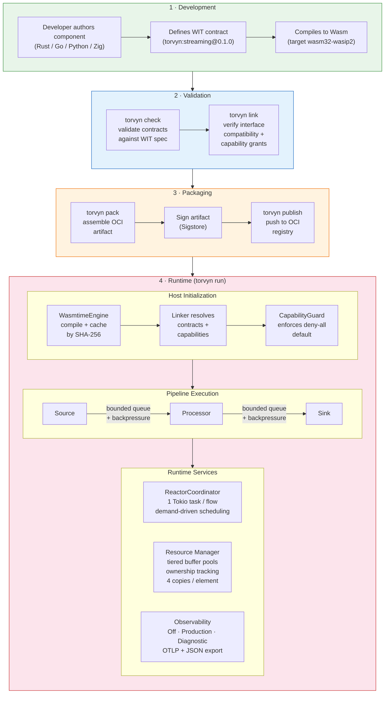
```mermaid
graph TB
    subgraph DEV ["1 · Development"]
        direction LR
        D1["Developer authors component\n(Rust / Go / Python / Zig)"]
        D2["Defines WIT contract\n(torvyn:streaming@0.1.0)"]
        D3["Compiles to Wasm\n(target wasm32-wasip2)"]
        D1 --> D2 --> D3
    end

    subgraph VAL ["2 · Validation"]
        direction LR
        V1["torvyn check\nvalidate contracts\nagainst WIT spec"]
        V2["torvyn link\nverify interface\ncompatibility +\ncapability grants"]
        V1 --> V2
    end

    subgraph PKG ["3 · Packaging"]
        direction LR
        P1["torvyn pack\nassemble OCI\nartifact"]
        P2["Sign artifact\n(Sigstore)"]
        P3["torvyn publish\npush to OCI\nregistry"]
        P1 --> P2 --> P3
    end

    subgraph RUN ["4 · Runtime  (torvyn run)"]
        direction TB

        subgraph INIT_PHASE ["Host Initialization"]
            direction LR
            R1["WasmtimeEngine\ncompile + cache\nby SHA-256"]
            R2["Linker resolves\ncontracts +\ncapabilities"]
            R3["CapabilityGuard\nenforces deny-all\ndefault"]
            R1 --> R2 --> R3
        end

        subgraph EXEC_PHASE ["Pipeline Execution"]
            direction LR
            E1["Source"]
            E2["Processor"]
            E3["Sink"]
            E1 -->|"bounded queue\n+ backpressure"| E2 -->|"bounded queue\n+ backpressure"| E3
        end

        subgraph SVC_PHASE ["Runtime Services"]
            direction LR
            S1["ReactorCoordinator\n1 Tokio task / flow\ndemand-driven scheduling"]
            S2["Resource Manager\ntiered buffer pools\nownership tracking\n4 copies / element"]
            S3["Observability\nOff · Production · Diagnostic\nOTLP + JSON export"]
        end

        INIT_PHASE --> EXEC_PHASE
        EXEC_PHASE --> SVC_PHASE
    end

    DEV --> VAL --> PKG --> RUN

    style DEV fill:#e8f5e9,stroke:#388e3c
    style VAL fill:#e3f2fd,stroke:#1565c0
    style PKG fill:#fff3e0,stroke:#ef6c00
    style RUN fill:#fce4ec,stroke:#c62828
```

---

## Crate Architecture

Torvyn is a Cargo workspace of 13 crates arranged in six build tiers. No circular dependencies exist — the graph is strictly acyclic, enabling maximum parallel compilation. Arrows point from a crate to its dependency.

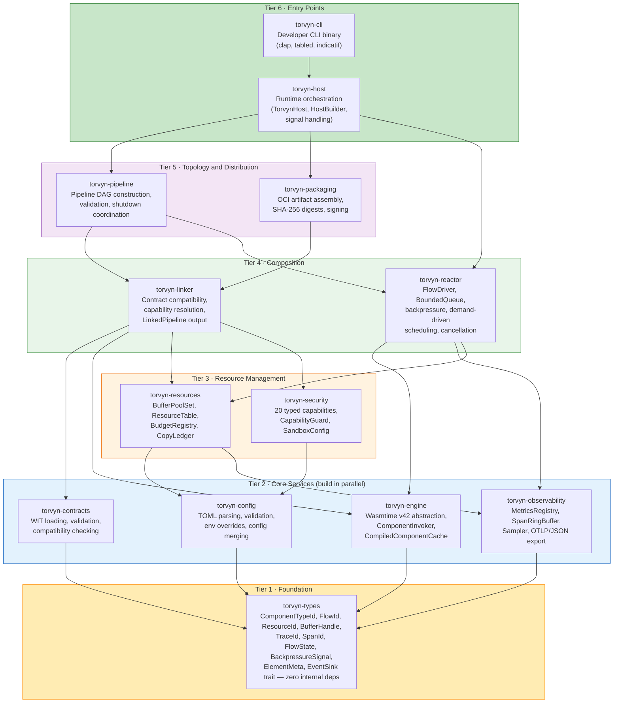
```mermaid
graph TB
    subgraph T6 ["Tier 6 · Entry Points"]
        CLI["torvyn-cli\nDeveloper CLI binary\n(clap, tabled, indicatif)"]
        HOST["torvyn-host\nRuntime orchestration\n(TorvynHost, HostBuilder,\nsignal handling)"]
    end

    subgraph T5 ["Tier 5 · Topology and Distribution"]
        PIPELINE["torvyn-pipeline\nPipeline DAG construction,\nvalidation, shutdown coordination"]
        PACKAGING["torvyn-packaging\nOCI artifact assembly,\nSHA-256 digests, signing"]
    end

    subgraph T4 ["Tier 4 · Composition"]
        LINKER["torvyn-linker\nContract compatibility,\ncapability resolution,\nLinkedPipeline output"]
        REACTOR["torvyn-reactor\nFlowDriver, BoundedQueue,\nbackpressure, demand-driven\nscheduling, cancellation"]
    end

    subgraph T3 ["Tier 3 · Resource Management"]
        RESOURCES["torvyn-resources\nBufferPoolSet, ResourceTable,\nBudgetRegistry, CopyLedger"]
        SECURITY["torvyn-security\n20 typed capabilities,\nCapabilityGuard, SandboxConfig"]
    end

    subgraph T2 ["Tier 2 · Core Services  (build in parallel)"]
        CONFIG["torvyn-config\nTOML parsing, validation,\nenv overrides, config merging"]
        CONTRACTS["torvyn-contracts\nWIT loading, validation,\ncompatibility checking"]
        ENGINE["torvyn-engine\nWasmtime v42 abstraction,\nComponentInvoker,\nCompiledComponentCache"]
        OBS["torvyn-observability\nMetricsRegistry, SpanRingBuffer,\nSampler, OTLP/JSON export"]
    end

    subgraph T1 ["Tier 1 · Foundation"]
        TYPES["torvyn-types\nComponentTypeId, FlowId, ResourceId, BufferHandle,\nTraceId, SpanId, FlowState, BackpressureSignal,\nElementMeta, EventSink trait — zero internal deps"]
    end

    CLI --> HOST
    HOST --> PIPELINE
    HOST --> PACKAGING
    HOST --> REACTOR
    PIPELINE --> LINKER
    PIPELINE --> REACTOR
    PACKAGING --> LINKER
    LINKER --> CONTRACTS
    LINKER --> ENGINE
    LINKER --> RESOURCES
    LINKER --> SECURITY
    REACTOR --> ENGINE
    REACTOR --> OBS
    REACTOR --> RESOURCES
    RESOURCES --> CONFIG
    RESOURCES --> OBS
    SECURITY --> CONFIG
    CONFIG --> TYPES
    CONTRACTS --> TYPES
    ENGINE --> TYPES
    OBS --> TYPES

    style T1 fill:#ffecb3,stroke:#ff8f00
    style T2 fill:#e3f2fd,stroke:#1565c0
    style T3 fill:#fff3e0,stroke:#ef6c00
    style T4 fill:#e8f5e9,stroke:#388e3c
    style T5 fill:#f3e5f5,stroke:#7b1fa2
    style T6 fill:#c8e6c9,stroke:#2e7d32
```

---

## Key Data Flows

### Stream Element Processing — Hot Path

Every data element traverses this path through a Source → Processor → Sink pipeline. The pipeline produces exactly **4 measured payload copies** per element: the source writes into a buffer (1), the processor reads the input buffer (2) and writes into an output buffer (3), and the sink reads the final buffer (4). All copies are instrumented by the resource manager's copy ledger.

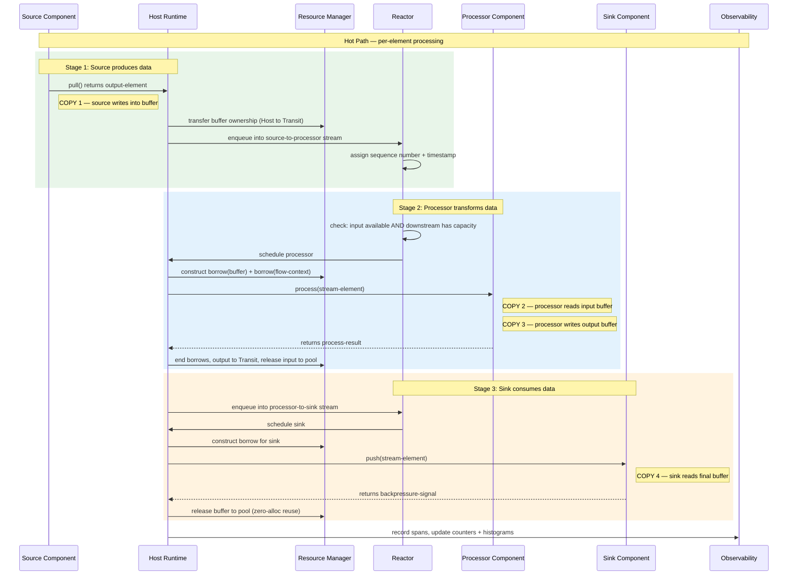
```mermaid
sequenceDiagram
    participant S as Source Component
    participant H as Host Runtime
    participant RM as Resource Manager
    participant R as Reactor
    participant P as Processor Component
    participant K as Sink Component
    participant O as Observability

    Note over S,O: Hot Path — per-element processing

    rect rgb(232, 245, 233)
        Note over S,H: Stage 1: Source produces data
        S->>H: pull() returns output-element
        Note right of S: COPY 1 — source writes into buffer
        H->>RM: transfer buffer ownership (Host to Transit)
        H->>R: enqueue into source-to-processor stream
        R->>R: assign sequence number + timestamp
    end

    rect rgb(227, 242, 253)
        Note over R,P: Stage 2: Processor transforms data
        R->>R: check: input available AND downstream has capacity
        R->>H: schedule processor
        H->>RM: construct borrow(buffer) + borrow(flow-context)
        H->>P: process(stream-element)
        Note right of P: COPY 2 — processor reads input buffer
        Note right of P: COPY 3 — processor writes output buffer
        P-->>H: returns process-result
        H->>RM: end borrows, output to Transit, release input to pool
    end

    rect rgb(255, 243, 224)
        Note over R,K: Stage 3: Sink consumes data
        H->>R: enqueue into processor-to-sink stream
        R->>H: schedule sink
        H->>RM: construct borrow for sink
        H->>K: push(stream-element)
        Note right of K: COPY 4 — sink reads final buffer
        K-->>H: returns backpressure-signal
        H->>RM: release buffer to pool (zero-alloc reuse)
    end

    H->>O: record spans, update counters + histograms
```

### Pipeline Startup — Cold Path

Before any data flows, the runtime validates contracts, links components, compiles Wasm, and wires up the pipeline topology. Compilation results are cached by `ComponentTypeId` (SHA-256 of the Wasm binary) so subsequent starts skip recompilation.

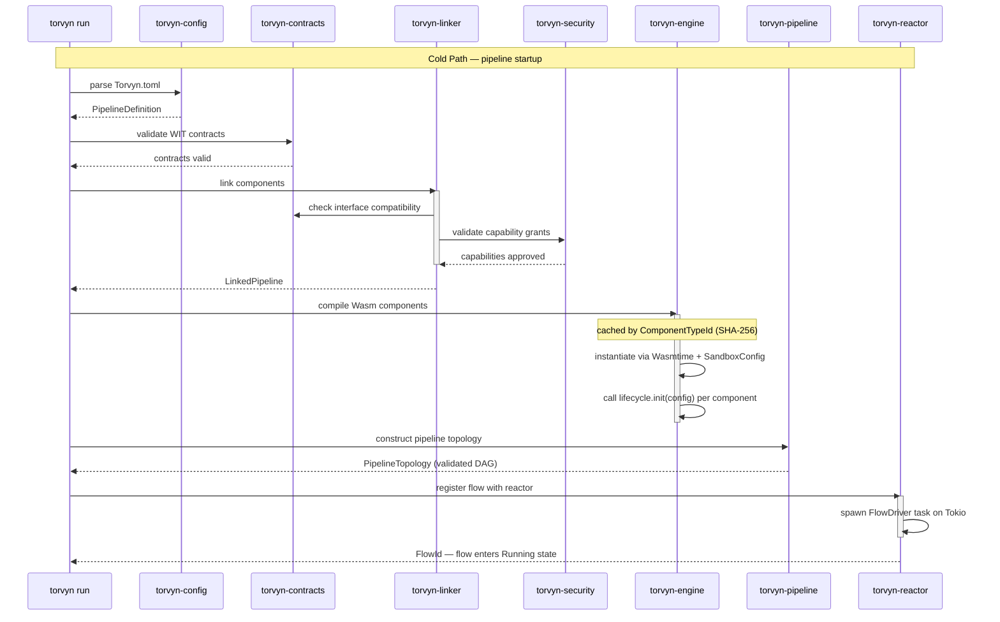
```mermaid
sequenceDiagram
    participant CLI as torvyn run
    participant CFG as torvyn-config
    participant CON as torvyn-contracts
    participant LNK as torvyn-linker
    participant SEC as torvyn-security
    participant ENG as torvyn-engine
    participant PLN as torvyn-pipeline
    participant RCT as torvyn-reactor

    Note over CLI,RCT: Cold Path — pipeline startup

    CLI->>CFG: parse Torvyn.toml
    CFG-->>CLI: PipelineDefinition

    CLI->>CON: validate WIT contracts
    CON-->>CLI: contracts valid

    CLI->>LNK: link components
    activate LNK
    LNK->>CON: check interface compatibility
    LNK->>SEC: validate capability grants
    SEC-->>LNK: capabilities approved
    deactivate LNK
    LNK-->>CLI: LinkedPipeline

    CLI->>ENG: compile Wasm components
    activate ENG
    Note over ENG: cached by ComponentTypeId (SHA-256)
    ENG->>ENG: instantiate via Wasmtime + SandboxConfig
    ENG->>ENG: call lifecycle.init(config) per component
    deactivate ENG

    CLI->>PLN: construct pipeline topology
    PLN-->>CLI: PipelineTopology (validated DAG)

    CLI->>RCT: register flow with reactor
    activate RCT
    RCT->>RCT: spawn FlowDriver task on Tokio
    deactivate RCT
    RCT-->>CLI: FlowId — flow enters Running state
```

---

## Design Decisions

### 1. WebAssembly Component Model for Isolation

**Decision:** Use Wasmtime's Component Model implementation for component sandboxing.

**Rationale:** Wasm Components provide memory isolation, typed interfaces (WIT), and language neutrality without the overhead of OS process boundaries or containers. Each component runs in its own linear memory space. The Component Model's resource types map directly to Torvyn's ownership model — strong isolation with performance closer to in-process calls than to RPC.

**Trade-off:** Wasm boundary crossings are not free — data must be copied through the canonical ABI. Torvyn accepts this cost and makes it measurable rather than promising zero-copy where it is not achievable.

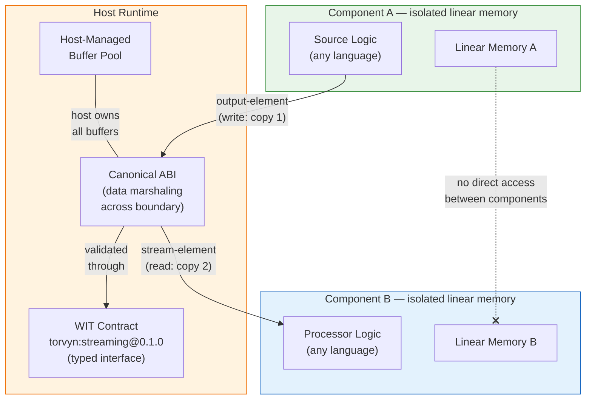
```mermaid
graph TB
    subgraph COMP_A ["Component A — isolated linear memory"]
        A_CODE["Source Logic\n(any language)"]
        A_MEM["Linear Memory A"]
    end

    subgraph HOST ["Host Runtime"]
        WIT["WIT Contract\ntorvyn:streaming@0.1.0\n(typed interface)"]
        ABI["Canonical ABI\n(data marshaling\nacross boundary)"]
        BUF["Host-Managed\nBuffer Pool"]
    end

    subgraph COMP_B ["Component B — isolated linear memory"]
        B_CODE["Processor Logic\n(any language)"]
        B_MEM["Linear Memory B"]
    end

    A_CODE -->|"output-element\n(write: copy 1)"| ABI
    ABI -->|"validated\nthrough"| WIT
    ABI -->|"stream-element\n(read: copy 2)"| B_CODE
    BUF ---|"host owns\nall buffers"| ABI
    A_MEM -.-x|"no direct access\nbetween components"| B_MEM

    style COMP_A fill:#e8f5e9,stroke:#388e3c
    style COMP_B fill:#e3f2fd,stroke:#1565c0
    style HOST fill:#fff3e0,stroke:#ef6c00
```

### 2. Task-per-Flow Reactor Model

**Decision:** Each flow (instantiated pipeline) runs as a single Tokio task. Intra-flow scheduling is sequential within the flow driver.

**Rationale:** This mirrors the task-slot model used by Apache Flink. It avoids cross-task synchronization for the common case (pipeline processing) while using Tokio's work-stealing scheduler for inter-flow fairness. Cooperative yield and Wasmtime's fuel mechanism prevent any single flow or component from monopolizing a thread.

**Trade-off:** A CPU-intensive single-stage flow could temporarily affect other flows sharing the same Tokio worker. Fuel-based preemption and yield heuristics mitigate this.

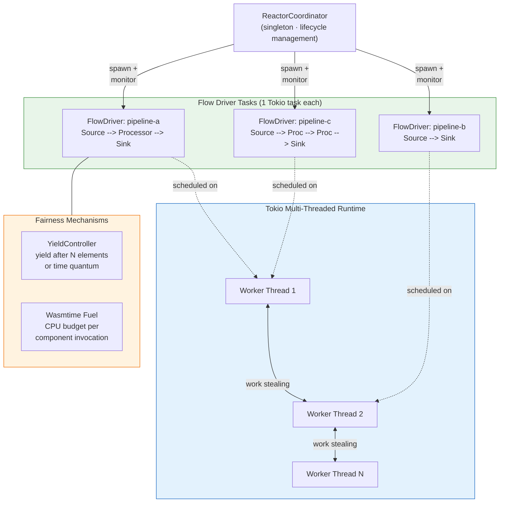
```mermaid
graph TD
    subgraph TOKIO ["Tokio Multi-Threaded Runtime"]
        W1["Worker Thread 1"]
        W2["Worker Thread 2"]
        WN["Worker Thread N"]
        W1 <-->|"work stealing"| W2
        W2 <-->|"work stealing"| WN
    end

    RC["ReactorCoordinator\n(singleton · lifecycle management)"]

    subgraph FLOWS ["Flow Driver Tasks  (1 Tokio task each)"]
        F1["FlowDriver: pipeline-a\nSource --> Processor --> Sink"]
        F2["FlowDriver: pipeline-b\nSource --> Sink"]
        F3["FlowDriver: pipeline-c\nSource --> Proc --> Proc --> Sink"]
    end

    RC -->|"spawn +\nmonitor"| F1
    RC -->|"spawn +\nmonitor"| F2
    RC -->|"spawn +\nmonitor"| F3

    F1 -.->|"scheduled on"| W1
    F2 -.->|"scheduled on"| W2
    F3 -.->|"scheduled on"| W1

    subgraph FAIRNESS ["Fairness Mechanisms"]
        YIELD["YieldController\nyield after N elements\nor time quantum"]
        FUEL["Wasmtime Fuel\nCPU budget per\ncomponent invocation"]
    end

    F1 --- FAIRNESS

    style TOKIO fill:#e3f2fd,stroke:#1565c0
    style FLOWS fill:#e8f5e9,stroke:#388e3c
    style FAIRNESS fill:#fff3e0,stroke:#ef6c00
```

### 3. Host-Managed Resources with Explicit Ownership

**Decision:** All byte buffers are allocated, tracked, and pooled by the host runtime. Components access them through opaque handles and borrow/own semantics.

**Rationale:** Centralizing resource management lets the runtime enforce ownership invariants, pool buffers for reuse, and instrument every copy. Components cannot leak memory or access buffers they do not own. The split `buffer` (immutable) / `mutable-buffer` (writable) model prevents concurrent mutation.

**Trade-off:** Components cannot share mutable memory directly. Every cross-component data transfer involves at least one copy through the canonical ABI. Torvyn makes this cost visible and bounded rather than hidden.

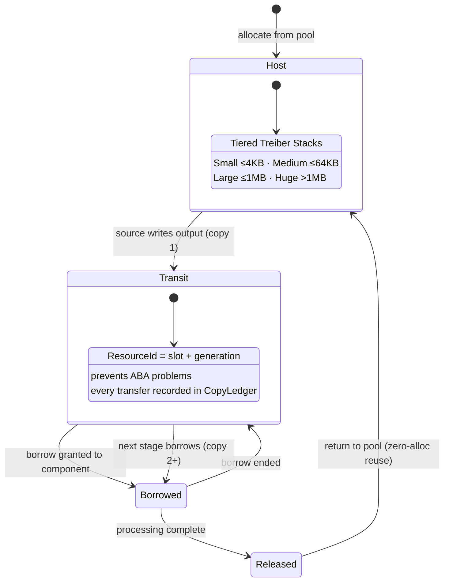
```mermaid
stateDiagram-v2
    [*] --> Host : allocate from pool

    Host --> Transit : source writes output (copy 1)
    Transit --> Borrowed : borrow granted to component
    Borrowed --> Transit : borrow ended
    Transit --> Borrowed : next stage borrows (copy 2+)
    Borrowed --> Released : processing complete

    Released --> Host : return to pool (zero-alloc reuse)

    state Host {
        [*] --> BufferPool
        BufferPool : Tiered Treiber Stacks
        BufferPool : Small ≤4KB · Medium ≤64KB
        BufferPool : Large ≤1MB · Huge >1MB
    }

    state Transit {
        [*] --> Tracked
        Tracked : ResourceId = slot + generation
        Tracked : prevents ABA problems
        Tracked : every transfer recorded in CopyLedger
    }
```

### 4. Deny-All-by-Default Security

**Decision:** Components start with zero capabilities and must be explicitly granted each permission (filesystem, network, clocks, etc.) through manifest declarations validated against operator-controlled policies.

**Rationale:** A deny-all default is safer than an allow-all default. It makes the security posture auditable — you can inspect exactly what each component is permitted to do. This aligns with the principle of least privilege and enables multi-tenant execution with clear constraints.

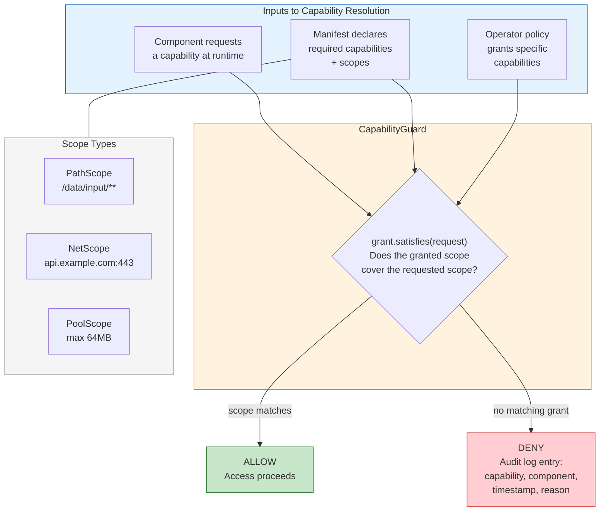
```mermaid
flowchart TD
    subgraph INPUT ["Inputs to Capability Resolution"]
        direction TB
        REQ["Component requests\na capability at runtime"]
        DECL["Manifest declares\nrequired capabilities\n+ scopes"]
        GRANT["Operator policy\ngrants specific\ncapabilities"]
    end

    subgraph CHECK ["CapabilityGuard"]
        SATISFIES{"grant.satisfies(request)\nDoes the granted scope\ncover the requested scope?"}
    end

    REQ --> SATISFIES
    DECL --> SATISFIES
    GRANT --> SATISFIES

    SATISFIES -->|"scope matches"| ALLOW["ALLOW\nAccess proceeds"]
    SATISFIES -->|"no matching grant"| DENY["DENY\nAudit log entry:\ncapability, component,\ntimestamp, reason"]

    subgraph SCOPES ["Scope Types"]
        direction LR
        PS["PathScope\n/data/input/**"]
        NS["NetScope\napi.example.com:443"]
        OS["PoolScope\nmax 64MB"]
    end

    DECL --- SCOPES

    style INPUT fill:#e3f2fd,stroke:#1565c0
    style CHECK fill:#fff3e0,stroke:#ef6c00
    style ALLOW fill:#c8e6c9,stroke:#2e7d32
    style DENY fill:#ffcdd2,stroke:#c62828
    style SCOPES fill:#f5f5f5,stroke:#9e9e9e
```

### 5. Three-Level Observability with Overhead Budgets

**Decision:** Observability has three levels — Off, Production, and Diagnostic — each with an explicit overhead budget. Switching between levels is atomic and requires no restart.

**Rationale:** Systems software must be observable in production, but observability that degrades performance is self-defeating. By budgeting overhead per level, operators can make informed trade-offs. The hot-path / cold-path separation ensures production-level metrics never allocate on the element processing path.

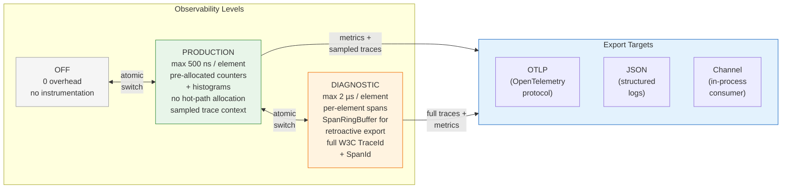
```mermaid
graph LR
    subgraph LEVELS ["Observability Levels"]
        direction TB
        OFF["OFF\n0 overhead\nno instrumentation"]
        PROD["PRODUCTION\nmax 500 ns / element\npre-allocated counters\n+ histograms\nno hot-path allocation\nsampled trace context"]
        DIAG["DIAGNOSTIC\nmax 2 µs / element\nper-element spans\nSpanRingBuffer for\nretroactive export\nfull W3C TraceId\n+ SpanId"]
    end

    OFF <-->|"atomic\nswitch"| PROD
    PROD <-->|"atomic\nswitch"| DIAG

    subgraph EXPORT ["Export Targets"]
        OTLP["OTLP\n(OpenTelemetry\nprotocol)"]
        JSON["JSON\n(structured\nlogs)"]
        CHAN["Channel\n(in-process\nconsumer)"]
    end

    PROD -->|"metrics +\nsampled traces"| EXPORT
    DIAG -->|"full traces +\nmetrics"| EXPORT

    style OFF fill:#f5f5f5,stroke:#9e9e9e
    style PROD fill:#e8f5e9,stroke:#388e3c
    style DIAG fill:#fff3e0,stroke:#ef6c00
    style EXPORT fill:#e3f2fd,stroke:#1565c0
```

### 6. Concurrency Model

**Decision:** Torvyn uses Tokio's multi-threaded work-stealing runtime exclusively. There are no custom OS threads.

**Rationale:** One Tokio task per flow (the "flow driver"), one reactor coordinator task for lifecycle management, and background tasks for observability export. `spawn_blocking` is reserved for filesystem I/O during component loading and config parsing — keeping the async executor free from blocking operations.

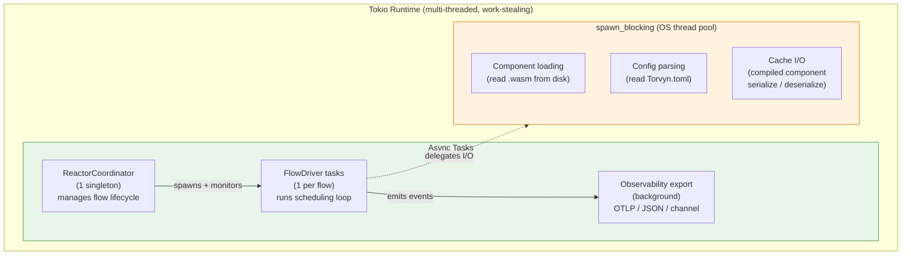
```mermaid
graph TD
    subgraph TOKIO ["Tokio Runtime  (multi-threaded, work-stealing)"]
        subgraph ASYNC_TASKS ["Async Tasks"]
            RC["ReactorCoordinator\n(1 singleton)\nmanages flow lifecycle"]
            FD["FlowDriver tasks\n(1 per flow)\nruns scheduling loop"]
            OX["Observability export\n(background)\nOTLP / JSON / channel"]
        end

        subgraph BLOCKING ["spawn_blocking  (OS thread pool)"]
            BL1["Component loading\n(read .wasm from disk)"]
            BL2["Config parsing\n(read Torvyn.toml)"]
            BL3["Cache I/O\n(compiled component\nserialize / deserialize)"]
        end
    end

    RC -->|"spawns + monitors"| FD
    FD -->|"emits events"| OX
    FD -.->|"delegates I/O"| BLOCKING

    style ASYNC_TASKS fill:#e8f5e9,stroke:#388e3c
    style BLOCKING fill:#fff3e0,stroke:#ef6c00
```

---

## Subsystem Deep Dives

### Contracts and WIT

The `torvyn:streaming@0.1.0` WIT package defines the typed interfaces that all components must implement. Contracts are validated at build time (`torvyn check`) and at link time (`torvyn link`) before any Wasm code executes. The WIT package is bundled inside the `torvyn-contracts` crate, backed by the `wit-parser` crate.

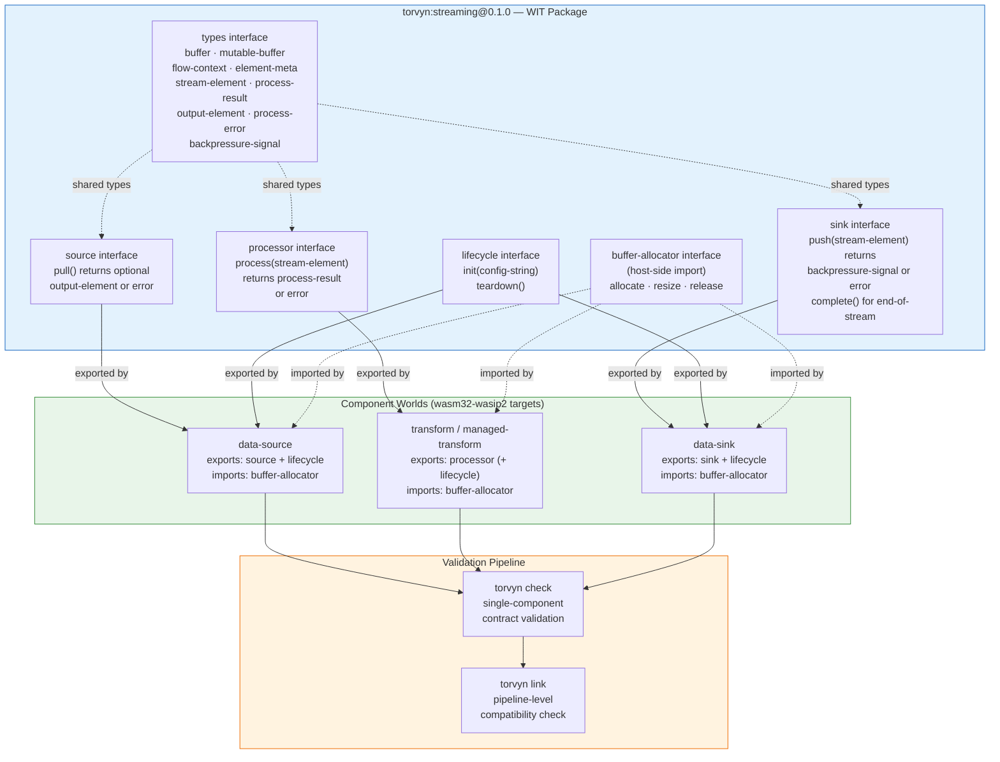
```mermaid
graph TD
    subgraph PKG ["torvyn:streaming@0.1.0  —  WIT Package"]
        TYPES["types interface\nbuffer · mutable-buffer\nflow-context · element-meta\nstream-element · process-result\noutput-element · process-error\nbackpressure-signal"]

        SOURCE_IF["source interface\npull() returns optional\noutput-element or error"]

        PROC_IF["processor interface\nprocess(stream-element)\nreturns process-result\nor error"]

        SINK_IF["sink interface\npush(stream-element) returns\nbackpressure-signal or error\ncomplete() for end-of-stream"]

        LIFE_IF["lifecycle interface\ninit(config-string)\nteardown()"]

        ALLOC_IF["buffer-allocator interface\n(host-side import)\nallocate · resize · release"]
    end

    subgraph WORLDS ["Component Worlds  (wasm32-wasip2 targets)"]
        DS["data-source\nexports: source + lifecycle\nimports: buffer-allocator"]
        DT["transform / managed-transform\nexports: processor (+ lifecycle)\nimports: buffer-allocator"]
        DK["data-sink\nexports: sink + lifecycle\nimports: buffer-allocator"]
    end

    subgraph VALIDATION ["Validation Pipeline"]
        CHK["torvyn check\nsingle-component\ncontract validation"]
        LNK["torvyn link\npipeline-level\ncompatibility check"]
        CHK --> LNK
    end

    SOURCE_IF -->|"exported by"| DS
    LIFE_IF -->|"exported by"| DS
    ALLOC_IF -.->|"imported by"| DS

    PROC_IF -->|"exported by"| DT
    ALLOC_IF -.->|"imported by"| DT

    SINK_IF -->|"exported by"| DK
    LIFE_IF -->|"exported by"| DK
    ALLOC_IF -.->|"imported by"| DK

    TYPES -.->|"shared types"| SOURCE_IF
    TYPES -.->|"shared types"| PROC_IF
    TYPES -.->|"shared types"| SINK_IF

    DS --> CHK
    DT --> CHK
    DK --> CHK

    style PKG fill:#e3f2fd,stroke:#1565c0
    style WORLDS fill:#e8f5e9,stroke:#388e3c
    style VALIDATION fill:#fff3e0,stroke:#ef6c00
```

### Host Runtime

The `torvyn-host` crate is the top-level orchestrator. `TorvynHost` owns the Wasm engine, reactor handle, and flow registry. It is constructed via a builder and transitions through a strict lifecycle state machine. Signal handling (SIGINT / SIGTERM) triggers graceful shutdown with flow draining.

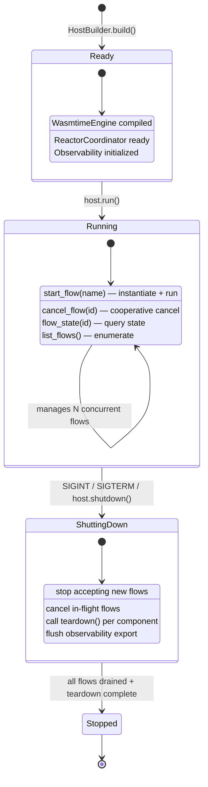
```mermaid
stateDiagram-v2
    [*] --> Ready : HostBuilder.build()

    Ready --> Running : host.run()
    Running --> ShuttingDown : SIGINT / SIGTERM / host.shutdown()
    ShuttingDown --> Stopped : all flows drained + teardown complete
    Stopped --> [*]

    state Ready {
        [*] --> Configured
        Configured : WasmtimeEngine compiled
        Configured : ReactorCoordinator ready
        Configured : Observability initialized
    }

    state Running {
        [*] --> FlowMgmt
        FlowMgmt : start_flow(name) — instantiate + run
        FlowMgmt : cancel_flow(id) — cooperative cancel
        FlowMgmt : flow_state(id) — query state
        FlowMgmt : list_flows() — enumerate
        FlowMgmt --> FlowMgmt : manages N concurrent flows
    }

    state ShuttingDown {
        [*] --> Draining
        Draining : stop accepting new flows
        Draining : cancel in-flight flows
        Draining : call teardown() per component
        Draining : flush observability export
    }
```

The host holds these subsystems via `Arc` for safe sharing across Tokio tasks:

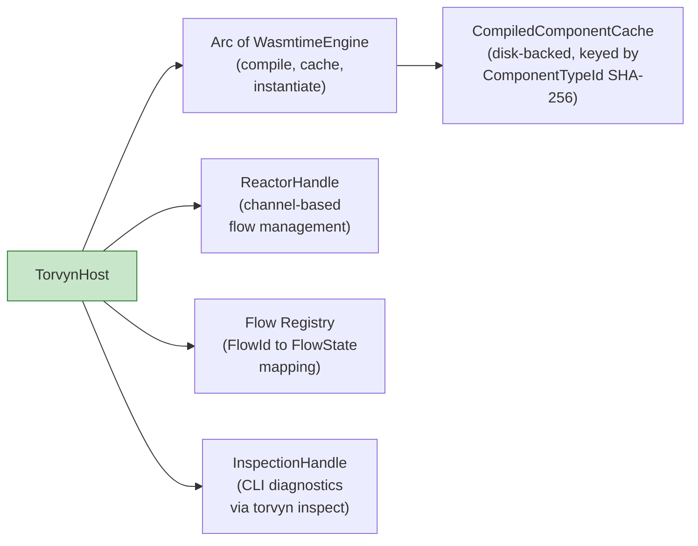
```mermaid
graph LR
    HOST["TorvynHost"]

    HOST --> ENG["Arc of WasmtimeEngine\n(compile, cache,\ninstantiate)"]
    HOST --> REACT["ReactorHandle\n(channel-based\nflow management)"]
    HOST --> REG["Flow Registry\n(FlowId to FlowState\nmapping)"]
    HOST --> INSP["InspectionHandle\n(CLI diagnostics\nvia torvyn inspect)"]

    ENG --> CACHE["CompiledComponentCache\n(disk-backed, keyed by\nComponentTypeId SHA-256)"]

    style HOST fill:#c8e6c9,stroke:#2e7d32
```

### Resource Manager and Ownership

The `torvyn-resources` crate manages all buffer memory. Components never allocate directly — they receive opaque `BufferHandle` values from the host. The `DefaultResourceManager` exposes a `&self` API (interior mutability via `parking_lot::Mutex`) so it can be shared across tasks via `Arc`.

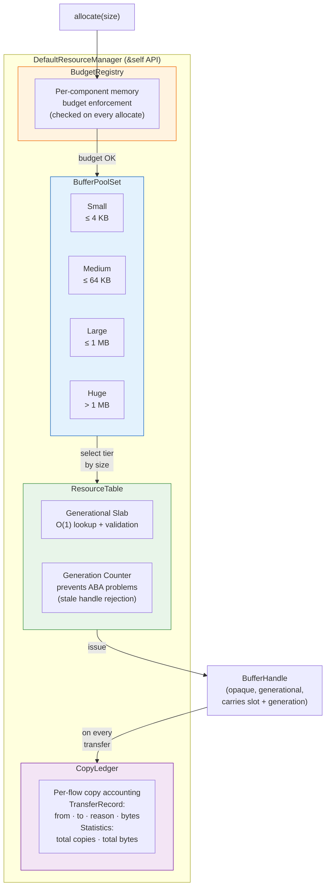
```mermaid
graph TD
    subgraph RM ["DefaultResourceManager  (&self API)"]
        subgraph POOL ["BufferPoolSet"]
            direction LR
            S["Small\n≤ 4 KB"]
            M["Medium\n≤ 64 KB"]
            L["Large\n≤ 1 MB"]
            H["Huge\n> 1 MB"]
        end

        subgraph TABLE ["ResourceTable"]
            SLAB["Generational Slab\nO(1) lookup + validation"]
            GEN["Generation Counter\nprevents ABA problems\n(stale handle rejection)"]
        end

        subgraph BUDGET ["BudgetRegistry"]
            BUD["Per-component memory\nbudget enforcement\n(checked on every allocate)"]
        end

        subgraph LEDGER ["CopyLedger"]
            COPY["Per-flow copy accounting\nTransferRecord:\n  from · to · reason · bytes\nStatistics:\n  total copies · total bytes"]
        end
    end

    REQ["allocate(size)"] --> BUD
    BUD -->|"budget OK"| POOL
    POOL -->|"select tier\nby size"| TABLE
    TABLE -->|"issue"| HANDLE["BufferHandle\n(opaque, generational,\ncarries slot + generation)"]
    HANDLE -->|"on every\ntransfer"| LEDGER

    style POOL fill:#e3f2fd,stroke:#1565c0
    style TABLE fill:#e8f5e9,stroke:#388e3c
    style BUDGET fill:#fff3e0,stroke:#ef6c00
    style LEDGER fill:#f3e5f5,stroke:#7b1fa2
```

Buffer ownership follows a strict state machine with four measured copy points per Source → Processor → Sink pipeline:

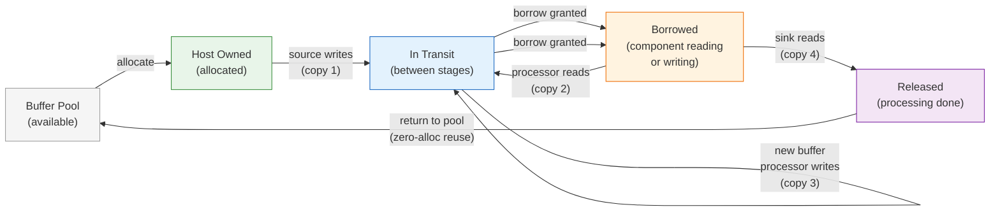
```mermaid
graph LR
    POOL_STATE["Buffer Pool\n(available)"]
    HOST_STATE["Host Owned\n(allocated)"]
    TRANSIT_STATE["In Transit\n(between stages)"]
    BORROW_STATE["Borrowed\n(component reading\nor writing)"]
    RELEASED_STATE["Released\n(processing done)"]

    POOL_STATE -->|"allocate"| HOST_STATE
    HOST_STATE -->|"source writes\n(copy 1)"| TRANSIT_STATE
    TRANSIT_STATE -->|"borrow granted"| BORROW_STATE
    BORROW_STATE -->|"processor reads\n(copy 2)"| TRANSIT_STATE
    TRANSIT_STATE -->|"new buffer\nprocessor writes\n(copy 3)"| TRANSIT_STATE
    TRANSIT_STATE -->|"borrow granted"| BORROW_STATE
    BORROW_STATE -->|"sink reads\n(copy 4)"| RELEASED_STATE
    RELEASED_STATE -->|"return to pool\n(zero-alloc reuse)"| POOL_STATE

    style POOL_STATE fill:#f5f5f5,stroke:#9e9e9e
    style HOST_STATE fill:#e8f5e9,stroke:#388e3c
    style TRANSIT_STATE fill:#e3f2fd,stroke:#1565c0
    style BORROW_STATE fill:#fff3e0,stroke:#ef6c00
    style RELEASED_STATE fill:#f3e5f5,stroke:#7b1fa2
```

### Reactor and Scheduling

The `torvyn-reactor` crate is the execution engine. The `ReactorCoordinator` manages flow lifecycle while each `FlowDriver` runs as an independent Tokio task executing its scheduling loop. Scheduling is demand-driven: consumers are processed first, and sources only pull when downstream demand credits exist.

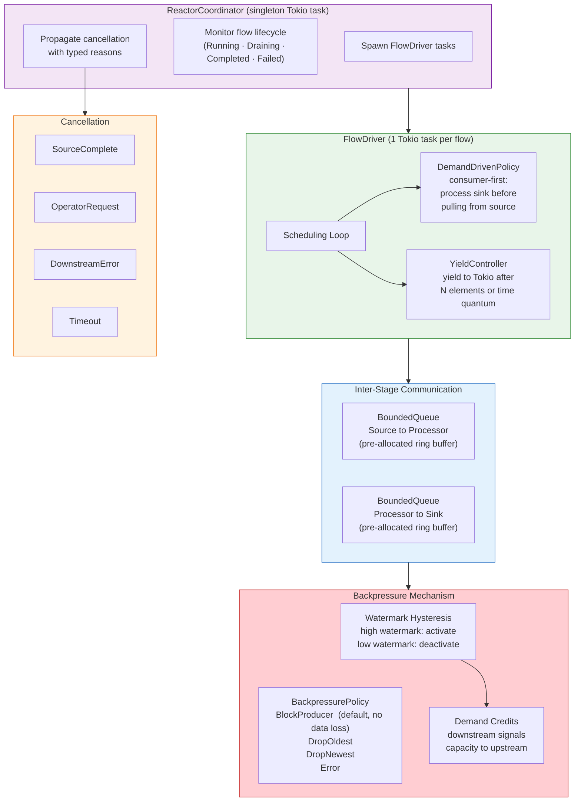
```mermaid
graph TD
    subgraph COORD ["ReactorCoordinator  (singleton Tokio task)"]
        SPAWN["Spawn FlowDriver tasks"]
        MONITOR["Monitor flow lifecycle\n(Running · Draining · Completed · Failed)"]
        CANCEL_PROP["Propagate cancellation\nwith typed reasons"]
    end

    subgraph DRIVER ["FlowDriver  (1 Tokio task per flow)"]
        LOOP["Scheduling Loop"]
        DDP["DemandDrivenPolicy\nconsumer-first:\nprocess sink before\npulling from source"]
        YC["YieldController\nyield to Tokio after\nN elements or time quantum"]
        LOOP --> DDP
        LOOP --> YC
    end

    subgraph QUEUES ["Inter-Stage Communication"]
        Q1["BoundedQueue\nSource to Processor\n(pre-allocated ring buffer)"]
        Q2["BoundedQueue\nProcessor to Sink\n(pre-allocated ring buffer)"]
    end

    subgraph BP ["Backpressure Mechanism"]
        WATER["Watermark Hysteresis\nhigh watermark: activate\nlow watermark: deactivate"]
        POLICY["BackpressurePolicy\nBlockProducer  (default, no data loss)\nDropOldest\nDropNewest\nError"]
        CREDIT["Demand Credits\ndownstream signals\ncapacity to upstream"]
    end

    subgraph CANCEL ["Cancellation"]
        direction LR
        CR1["SourceComplete"]
        CR2["OperatorRequest"]
        CR3["DownstreamError"]
        CR4["Timeout"]
    end

    COORD --> DRIVER
    DRIVER --> QUEUES
    QUEUES --> BP
    WATER --> CREDIT
    BP --- POLICY
    CANCEL_PROP --> CANCEL

    style COORD fill:#f3e5f5,stroke:#7b1fa2
    style DRIVER fill:#e8f5e9,stroke:#388e3c
    style QUEUES fill:#e3f2fd,stroke:#1565c0
    style BP fill:#ffcdd2,stroke:#c62828
    style CANCEL fill:#fff3e0,stroke:#ef6c00
```

### Observability and Diagnostics

The `torvyn-observability` crate provides a three-level instrumentation system. The `ObservabilityCollector` implements the `EventSink` trait called by the reactor on every element. Metrics are pre-allocated per flow to avoid hot-path allocation. Traces use a `SpanRingBuffer` for retroactive export — spans are stored in a ring buffer and can be exported after the fact for debugging.

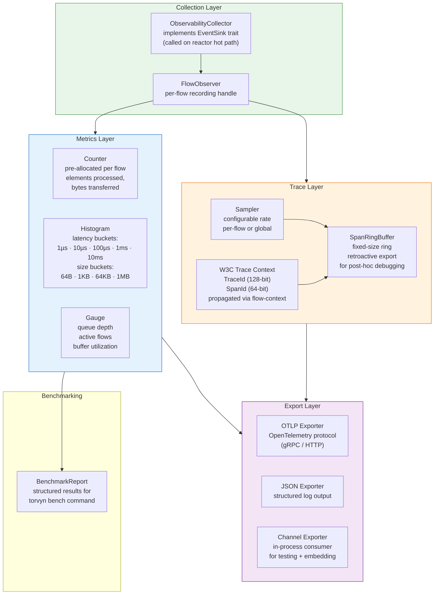
```mermaid
graph TD
    subgraph COLLECT ["Collection Layer"]
        ES["ObservabilityCollector\nimplements EventSink trait\n(called on reactor hot path)"]
        FO["FlowObserver\nper-flow recording handle"]
        ES --> FO
    end

    subgraph METRICS ["Metrics Layer"]
        direction LR
        CTR["Counter\npre-allocated per flow\nelements processed,\nbytes transferred"]
        HIST["Histogram\nlatency buckets:\n1µs · 10µs · 100µs · 1ms · 10ms\nsize buckets:\n64B · 1KB · 64KB · 1MB"]
        GAUGE["Gauge\nqueue depth\nactive flows\nbuffer utilization"]
    end

    subgraph TRACING ["Trace Layer"]
        CTX["W3C Trace Context\nTraceId (128-bit)\nSpanId (64-bit)\npropagated via flow-context"]
        SAMPLE["Sampler\nconfigurable rate\nper-flow or global"]
        RING["SpanRingBuffer\nfixed-size ring\nretroactive export\nfor post-hoc debugging"]
    end

    subgraph EXPORT ["Export Layer"]
        direction LR
        OTLP["OTLP Exporter\nOpenTelemetry protocol\n(gRPC / HTTP)"]
        JSON_EX["JSON Exporter\nstructured log output"]
        CHAN_EX["Channel Exporter\nin-process consumer\nfor testing + embedding"]
    end

    subgraph BENCH ["Benchmarking"]
        BR["BenchmarkReport\nstructured results for\ntorvyn bench command"]
    end

    FO --> METRICS
    FO --> TRACING
    SAMPLE --> RING
    CTX --> RING
    METRICS --> EXPORT
    TRACING --> EXPORT
    METRICS --> BR

    style COLLECT fill:#e8f5e9,stroke:#388e3c
    style METRICS fill:#e3f2fd,stroke:#1565c0
    style TRACING fill:#fff3e0,stroke:#ef6c00
    style EXPORT fill:#f3e5f5,stroke:#7b1fa2
```

### Security and Capability Model

The `torvyn-security` crate implements a deny-all-by-default capability system. There are 20 typed capabilities spanning WASI-aligned permissions (filesystem, network, clocks) and Torvyn-specific permissions (resource pools, stream operations). Every capability has an associated scope that narrows what is permitted. The `CapabilityGuard` checks whether a granted capability's scope covers the requested scope using `satisfies()` logic.

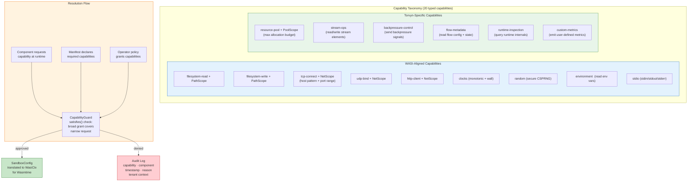
```mermaid
graph TD
    subgraph TAXONOMY ["Capability Taxonomy  (20 typed capabilities)"]
        subgraph WASI ["WASI-Aligned Capabilities"]
            direction TB
            FS_R["filesystem-read + PathScope"]
            FS_W["filesystem-write + PathScope"]
            TCP["tcp-connect + NetScope\n(host pattern + port range)"]
            UDP["udp-bind + NetScope"]
            HTTP["http-client + NetScope"]
            CLK["clocks  (monotonic + wall)"]
            RND["random  (secure CSPRNG)"]
            ENV_CAP["environment  (read env vars)"]
            STDIO["stdio  (stdin/stdout/stderr)"]
        end

        subgraph TORVYN ["Torvyn-Specific Capabilities"]
            direction TB
            POOL_CAP["resource-pool + PoolScope\n(max allocation budget)"]
            STREAM_CAP["stream-ops\n(read/write stream elements)"]
            BP_CAP["backpressure-control\n(send backpressure signals)"]
            FLOW_CAP["flow-metadata\n(read flow config + state)"]
            INSPECT_CAP["runtime-inspection\n(query runtime internals)"]
            METRIC_CAP["custom-metrics\n(emit user-defined metrics)"]
        end
    end

    subgraph RESOLUTION ["Resolution Flow"]
        direction TB
        COMP_REQ["Component requests\ncapability at runtime"]
        MANIFEST_DECL["Manifest declares\nrequired capabilities"]
        OP_POLICY["Operator policy\ngrants capabilities"]
        GUARD["CapabilityGuard\nsatisfies() check:\nbroad grant covers\nnarrow request"]
    end

    COMP_REQ --> GUARD
    MANIFEST_DECL --> GUARD
    OP_POLICY --> GUARD

    GUARD -->|"approved"| SANDBOX["SandboxConfig\ntranslated to WasiCtx\nfor Wasmtime"]
    GUARD -->|"denied"| AUDIT["Audit Log\ncapability · component\ntimestamp · reason\ntenant context"]

    style WASI fill:#e3f2fd,stroke:#1565c0
    style TORVYN fill:#e8f5e9,stroke:#388e3c
    style RESOLUTION fill:#fff3e0,stroke:#ef6c00
    style SANDBOX fill:#c8e6c9,stroke:#2e7d32
    style AUDIT fill:#ffcdd2,stroke:#c62828
```

### CLI Tooling

The `torvyn-cli` crate provides the `torvyn` binary built with `clap` derive macros. It covers the full development lifecycle from scaffolding to production operation. Output supports both human-readable format (terminal tables via `tabled`, progress bars via `indicatif`) and machine-readable JSON.

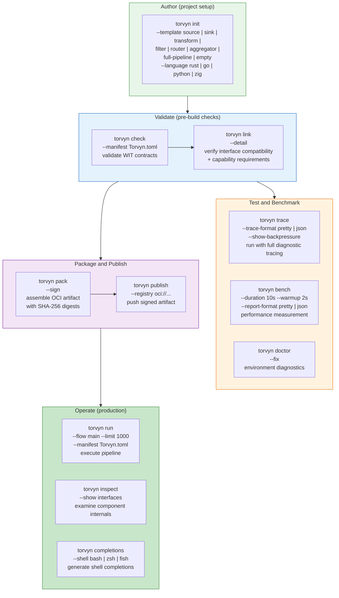
```mermaid
graph TD
    subgraph AUTHOR ["Author  (project setup)"]
        INIT["torvyn init\n--template source | sink | transform |\nfilter | router | aggregator |\nfull-pipeline | empty\n--language rust | go | python | zig"]
    end

    subgraph VALIDATE ["Validate  (pre-build checks)"]
        CHECK["torvyn check\n--manifest Torvyn.toml\nvalidate WIT contracts"]
        LINK["torvyn link\n--detail\nverify interface compatibility\n+ capability requirements"]
        CHECK --> LINK
    end

    subgraph TEST_BENCH ["Test and Benchmark"]
        TRACE["torvyn trace\n--trace-format pretty | json\n--show-backpressure\nrun with full diagnostic tracing"]
        BENCH["torvyn bench\n--duration 10s --warmup 2s\n--report-format pretty | json\nperformance measurement"]
        DOCTOR["torvyn doctor\n--fix\nenvironment diagnostics"]
    end

    subgraph SHIP ["Package and Publish"]
        PACK["torvyn pack\n--sign\nassemble OCI artifact\nwith SHA-256 digests"]
        PUB["torvyn publish\n--registry oci://...\npush signed artifact"]
        PACK --> PUB
    end

    subgraph OPERATE ["Operate  (production)"]
        RUN["torvyn run\n--flow main --limit 1000\n--manifest Torvyn.toml\nexecute pipeline"]
        INSPECT["torvyn inspect\n--show interfaces\nexamine component internals"]
        COMP["torvyn completions\n--shell bash | zsh | fish\ngenerate shell completions"]
    end

    AUTHOR --> VALIDATE
    VALIDATE --> TEST_BENCH
    VALIDATE --> SHIP
    SHIP --> OPERATE

    style AUTHOR fill:#e8f5e9,stroke:#388e3c
    style VALIDATE fill:#e3f2fd,stroke:#1565c0
    style TEST_BENCH fill:#fff3e0,stroke:#ef6c00
    style SHIP fill:#f3e5f5,stroke:#7b1fa2
    style OPERATE fill:#c8e6c9,stroke:#2e7d32
```

### Packaging and Distribution

The `torvyn-packaging` crate handles OCI-compatible artifact assembly, content-addressing, and registry interaction. Components, contracts, and metadata are assembled into a `TorvynArtifact`, hashed with SHA-256, packed as OCI layers, and optionally signed via Sigstore. A `RegistryClient` async trait abstracts push/pull operations. Pulled artifacts are stored in a content-addressed local cache.

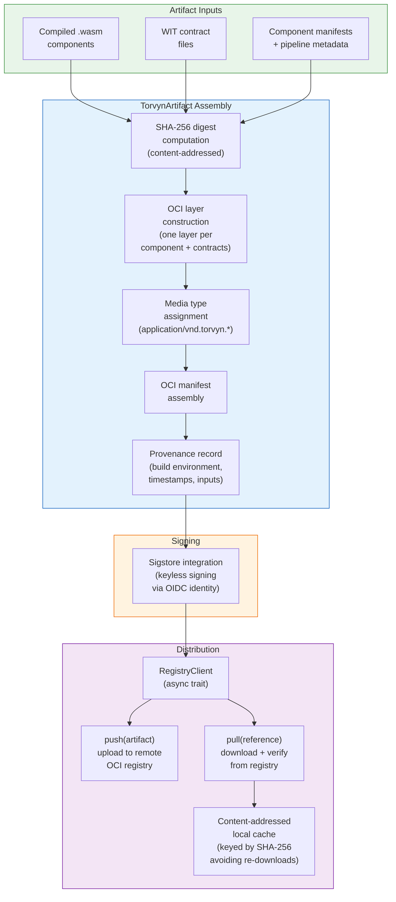
```mermaid
graph TD
    subgraph INPUTS ["Artifact Inputs"]
        direction LR
        WASM["Compiled .wasm\ncomponents"]
        WIT_FILES["WIT contract\nfiles"]
        META["Component manifests\n+ pipeline metadata"]
    end

    subgraph ASSEMBLY ["TorvynArtifact Assembly"]
        HASH["SHA-256 digest\ncomputation\n(content-addressed)"]
        LAYERS["OCI layer\nconstruction\n(one layer per\ncomponent + contracts)"]
        MEDIA_TYPE["Media type\nassignment\n(application/vnd.torvyn.*)"]
        MANIFEST["OCI manifest\nassembly"]
        PROV["Provenance record\n(build environment,\ntimestamps, inputs)"]
    end

    subgraph SIGNING ["Signing"]
        SIG["Sigstore integration\n(keyless signing\nvia OIDC identity)"]
    end

    subgraph DIST ["Distribution"]
        CLIENT["RegistryClient\n(async trait)"]
        PUSH["push(artifact)\nupload to remote\nOCI registry"]
        PULL["pull(reference)\ndownload + verify\nfrom registry"]
        CACHE["Content-addressed\nlocal cache\n(keyed by SHA-256\navoiding re-downloads)"]
    end

    WASM --> HASH
    WIT_FILES --> HASH
    META --> HASH
    HASH --> LAYERS
    LAYERS --> MEDIA_TYPE
    MEDIA_TYPE --> MANIFEST
    MANIFEST --> PROV
    PROV --> SIG
    SIG --> CLIENT
    CLIENT --> PUSH
    CLIENT --> PULL
    PULL --> CACHE

    style INPUTS fill:#e8f5e9,stroke:#388e3c
    style ASSEMBLY fill:#e3f2fd,stroke:#1565c0
    style SIGNING fill:#fff3e0,stroke:#ef6c00
    style DIST fill:#f3e5f5,stroke:#7b1fa2
```
