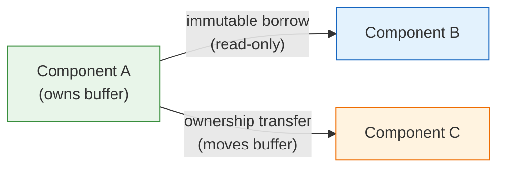
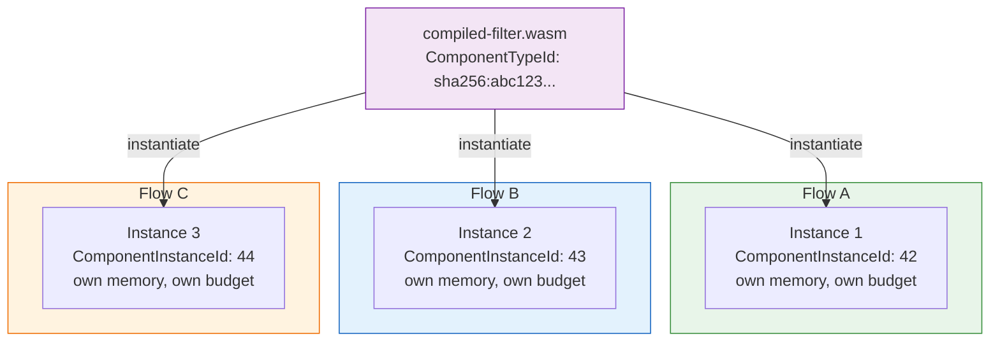
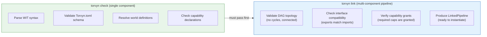
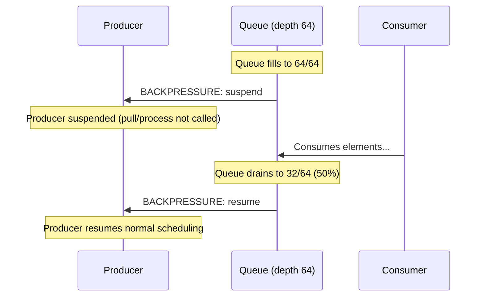
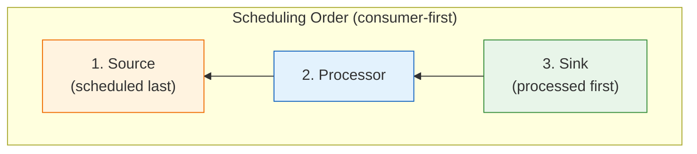
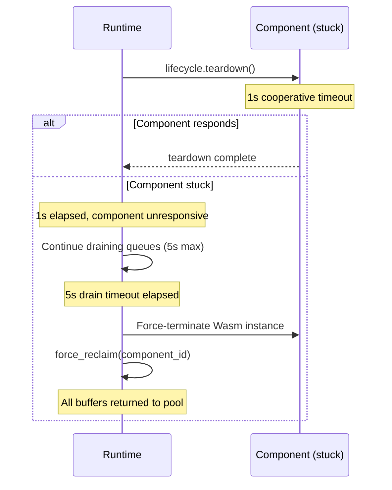
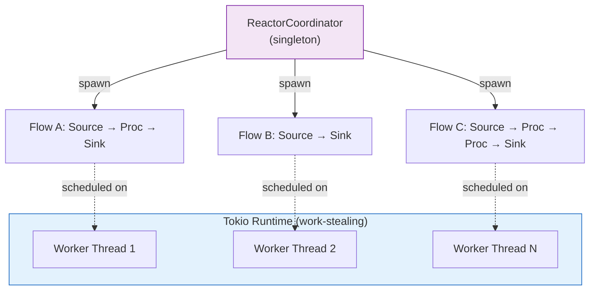

# Torvyn FAQ

Answers to the questions users actually ask. This document is honest about limitations, specific about defaults, and cites sources for every claim.

> **Companion documents:** [Getting Started](getting-started.md) | [Concepts](concepts.md) | [CLI Reference](cli-reference.md) | [Architecture](ARCHITECTURE.md)

---

## Table of Contents

- [Getting Started](#getting-started)
- [Architecture and Design](#architecture-and-design)
- [Contracts and WIT](#contracts-and-wit)
- [Buffers and Ownership](#buffers-and-ownership)
- [Backpressure and Flow Control](#backpressure-and-flow-control)
- [Error Handling](#error-handling)
- [Performance](#performance)
- [Security and Capabilities](#security-and-capabilities)
- [Configuration](#configuration)
- [Multi-Pipeline and Scheduling](#multi-pipeline-and-scheduling)
- [Ecosystem and Language Support](#ecosystem-and-language-support)
- [Packaging and Distribution](#packaging-and-distribution)
- [Troubleshooting](#troubleshooting)

---

## Getting Started

### What's the difference between `torvyn init` and writing Torvyn.toml manually?

`torvyn init` scaffolds a complete, ready-to-build project. It generates:

- A valid `Torvyn.toml` manifest
- A `Cargo.toml` with the correct dependencies and build target
- WIT contract files in `wit/torvyn-streaming/` (types, processor/source/sink, buffer-allocator, lifecycle, world)
- An implementation stub in `src/lib.rs` that compiles out of the box
- `.gitignore` and `README.md`

You can always write `Torvyn.toml` manually. The minimum valid manifest is:

```toml
[torvyn]
name = "my-component"
version = "0.1.0"
contract_version = "0.1.0"
```

But `torvyn init` saves you from having to remember the correct WIT package structure, the required Cargo features, and the component world boilerplate. For your first project, use `torvyn init`. For subsequent projects where you want full control, start from the manifest.

**Templates available:**

| Template | What it generates |
|----------|-------------------|
| `source` | Data producer (no input, one output) |
| `sink` | Data consumer (one input, no output) |
| `transform` (default) | Stateless 1:1 transformer |
| `filter` | Accept/reject gate |
| `router` | Multi-output dispatcher |
| `aggregator` | Stateful windowed accumulator |
| `full-pipeline` | Complete Source + Processor + Sink with inline flow definition |
| `empty` | Minimal skeleton for experienced users |

```bash
# Example: create a filter component in Go
torvyn init my-filter --template filter --language go
```

**Name validation rules:** 1--64 characters, `[a-zA-Z0-9_-]` only, cannot start with a hyphen or digit.

> **Source:** [crates/torvyn-cli/src/commands/init.rs](../crates/torvyn-cli/src/commands/init.rs).

---

### What does `torvyn doctor` check and can it fix issues automatically?

`torvyn doctor` verifies your development environment against Torvyn's requirements. It checks:

| Check | What it verifies | Auto-fixable? |
|-------|------------------|---------------|
| **Rust compiler** | `rustc` is installed and accessible | No (install from [rustup.rs](https://rustup.rs)) |
| **Wasm target** | `wasm32-wasip2` target is installed | Yes (`rustup target add wasm32-wasip2`) |
| **cargo-component** | Component build tool is installed | Yes (`cargo install cargo-component`) |
| **wasm-tools** | WIT parsing and manipulation tool | Yes (`cargo install wasm-tools`) |
| **Torvyn.toml** | Project manifest exists in current directory | No (run `torvyn init`) |

Run `torvyn doctor --fix` to automatically install missing targets and tools. Items that cannot be auto-fixed include suggestions for manual resolution.

```bash
# Check everything
torvyn doctor

# Attempt automatic fixes
torvyn doctor --fix
```

**Example output (failure):**
```
  Rust Toolchain
  ✓ rustc 1.78.0
  ✗ wasm32-wasip2 target NOT installed
      fix: Run `rustup target add wasm32-wasip2`
  ✓ cargo-component 0.1.0

  1 error(s), 0 warning(s). Run `torvyn doctor --fix` to attempt automatic repair.
```

> **Source:** [crates/torvyn-cli/src/commands/doctor.rs](../crates/torvyn-cli/src/commands/doctor.rs).

---

### What's the minimum project structure needed to run a pipeline?

**Single-component project:**

```
my-project/
├── Torvyn.toml              # Manifest (required)
├── Cargo.toml               # Rust build file
├── wit/
│   └── torvyn-streaming/    # WIT contracts
│       ├── types.wit
│       ├── processor.wit     # (or source.wit / sink.wit)
│       ├── buffer-allocator.wit
│       ├── lifecycle.wit
│       └── world.wit
└── src/
    └── lib.rs               # Component implementation
```

**Multi-component pipeline:**

```
my-pipeline/
├── Torvyn.toml              # Declares [[component]] entries + [flow.*]
├── components/
│   ├── source/
│   │   ├── Cargo.toml
│   │   ├── wit/
│   │   └── src/lib.rs
│   ├── processor/
│   │   ├── Cargo.toml
│   │   ├── wit/
│   │   └── src/lib.rs
│   └── sink/
│       ├── Cargo.toml
│       ├── wit/
│       └── src/lib.rs
└── .torvyn/                 # Auto-generated at runtime
    ├── cache/               # Compilation cache
    ├── artifacts/           # Packaged components
    └── bench/               # Benchmark results
```

The `full-pipeline` template generates the multi-component structure: `torvyn init my-pipeline --template full-pipeline`.

---

## Architecture and Design

### Can components share mutable state across a flow?

**No, by design.** This is a deliberate architectural decision, not a limitation.

All inter-component data flows through **typed stream connections** via `stream-element` records. Buffers are **immutable when borrowed** across component boundaries (`borrow<buffer>` is read-only). Mutable buffers are **owned exclusively** by one entity at a time.



**Why?** Shared mutable state would require either:
- **Shared memory** --- not available in the WebAssembly Component Model (each component has its own linear memory)
- **Copy-on-write** --- adds complexity without clear benefit when copies are already bounded and measured
- **Locks at component boundaries** --- violates the ownership model and introduces deadlock potential

If components need to coordinate, use stream elements to carry state forward. For aggregation patterns, use the `aggregator` component role which maintains internal state within a single component.

> **Source:** [01_contracts_and_wit_design.md](../docs/design/01_contracts_and_wit_design.md), Section 7.3; [concepts.md](concepts.md), Section 3.1.

---

### Can I use the same component in multiple flows?

**Yes.** A single compiled component binary (`.wasm`) can be instantiated multiple times across different flows. Each instantiation is a completely independent `ComponentInstanceId` with:

- Its own Wasm linear memory (isolated by the sandbox)
- Its own resource budget (independent buffer limits)
- Its own fuel allocation (independent CPU budget)
- Its own lifecycle (separate `init()` / `teardown()` calls)

The compiled native code is cached by `ComponentTypeId` (SHA-256 hash of the `.wasm` binary). The first use compiles and caches; subsequent instantiations skip recompilation and reuse the cached native code.



> **Source:** [crates/torvyn-engine/src/lib.rs](../crates/torvyn-engine/src/lib.rs), `CompiledComponentCache`; [02_host_runtime_design.md](../docs/design/02_host_runtime_design.md).

---

### What's the "world" in WIT and why do I need world.wit?

A WIT **world** defines the complete shape of a component --- exactly what it **exports** (provides) and what it **imports** (requires). The linker uses worlds to verify that all imports are satisfied before the pipeline runs.

```wit
// Example: a processor that needs a clock and buffer allocation
world my-enricher {
    // What this component requires from the host
    import torvyn:streaming/types;
    import torvyn:streaming/buffer-allocator;
    import wasi:clocks/wall-clock;

    // What this component provides
    export torvyn:streaming/processor;
    export torvyn:streaming/lifecycle;
}
```

Torvyn defines standard worlds for each component role:

| World | Exports | Imports |
|-------|---------|---------|
| `data-source` | `source`, `lifecycle` | `types`, `buffer-allocator` |
| `transform` | `processor` | `types`, `buffer-allocator` |
| `managed-transform` | `processor`, `lifecycle` | `types`, `buffer-allocator` |
| `data-sink` | `sink`, `lifecycle` | `types` |
| `content-filter` | `filter`, `lifecycle` | `types` |
| `content-router` | `router`, `lifecycle` | `types` |
| `stream-aggregator` | `aggregator`, `lifecycle` | `types`, `buffer-allocator` |

You can also define **custom worlds** that combine Torvyn interfaces with WASI interfaces (filesystem, network, clocks, etc.). The world is what tells the linker whether your component is compatible with the rest of the pipeline.

> **Source:** [01_contracts_and_wit_design.md](../docs/design/01_contracts_and_wit_design.md), Section 8; [concepts.md](concepts.md), Section 1.5.

---

### What's the difference between `torvyn check` and `torvyn link`?

They validate different things at different levels:



| Aspect | `torvyn check` | `torvyn link` |
|--------|---------------|---------------|
| **Scope** | Single component | Multi-component pipeline |
| **Validates** | WIT syntax, TOML schema, world resolution, capability declarations | Topology (DAG), interface compatibility between components, capability grants |
| **Requires flows** | No | Yes (needs `[flow.*]` in manifest) |
| **Output** | Pass/fail with per-file diagnostics | Per-flow link status with compatibility details |
| **When to use** | After editing WIT or Torvyn.toml | Before running a pipeline |
| **Prerequisite** | None | `check` must pass first |

**Workflow order:** `check` -> `link` -> `run`.

Think of `check` as "does this component make sense on its own?" and `link` as "do these components work together?"

> **Source:** [crates/torvyn-cli/src/commands/check.rs](../crates/torvyn-cli/src/commands/check.rs); [crates/torvyn-cli/src/commands/link.rs](../crates/torvyn-cli/src/commands/link.rs); [crates/torvyn-linker/src/lib.rs](../crates/torvyn-linker/src/lib.rs).

---

### What does "contract version" mean?

A **contract version** is a specific snapshot of the WIT interface definitions that a component was compiled against. It follows semantic versioning (`major.minor.patch`):

| Change Type | Version Bump | Examples |
|-------------|-------------|----------|
| **Breaking** | Major | Removing types/functions, changing signatures, changing ownership semantics (`borrow` to `own`), removing record fields or variant cases |
| **Compatible** | Minor | Adding new functions to existing interfaces, adding new interfaces, adding new variant cases |
| **Cosmetic** | Patch | Documentation updates, tooling fixes |

The `contract_version` field in `Torvyn.toml` declares which version of the `torvyn:streaming` WIT package the component targets. `torvyn link` uses this to verify that connected components are compatible --- even within the same major version, it performs structural compatibility checking to ensure that the specific interfaces used by a consumer actually exist in the provider.

Example: If Component A uses a function added in `torvyn:streaming@0.2.0`, it will not link with a Component B that only knows about `torvyn:streaming@0.1.0`.

> **Source:** [01_contracts_and_wit_design.md](../docs/design/01_contracts_and_wit_design.md), Section 6; [concepts.md](concepts.md), Section 1.6.

---

## Contracts and WIT

### Do I need to write WIT files manually?

**Usually no.** `torvyn init` generates the correct WIT contracts for the template you choose. The standard worlds (`data-source`, `managed-transform`, `data-sink`, `content-filter`, `content-router`, `stream-aggregator`) cover most use cases.

You need to write custom WIT only if your component requires imports beyond what the standard worlds provide --- for example, if a processor needs filesystem access or clock reads. In that case, you define a custom world that combines Torvyn interfaces with WASI interfaces:

```wit
world my-custom-processor {
    import torvyn:streaming/types;
    import torvyn:streaming/buffer-allocator;
    import wasi:filesystem/types;        // Custom: needs file access
    import wasi:clocks/wall-clock;       // Custom: needs timestamps
    export torvyn:streaming/processor;
    export torvyn:streaming/lifecycle;
}
```

> **Source:** [01_contracts_and_wit_design.md](../docs/design/01_contracts_and_wit_design.md), Section 8.

---

### What happens if my WIT contracts have errors?

`torvyn check` catches WIT errors before you ever try to run a pipeline. Errors follow the `rustc`-style format with error codes, source locations, and actionable help text:

```
[E0100] Contract parse error in 'types.wit' at line 42: unexpected token.
        Fix the WIT syntax and re-run `torvyn check`.

[E0101] Component 'my-processor' does not export required interface
        'torvyn:streaming/processor'.
        Ensure the component's world definition includes
        `export torvyn:streaming/processor`.

[E0103] Contract version incompatible: required '0.2.0', provided '0.1.0'.
        Update the component to target the required contract version.
```

Validation occurs in three stages, catching progressively more complex errors:

1. **Parse-time** (E0100--E0109): WIT syntax, manifest format, capability declarations
2. **Semantic** (E0110--E0139): Type consistency, resource usage, version constraints, interface completeness
3. **Composition** (E0140--E0159, E0200--E0299): Interface compatibility, capability satisfaction, topology validation

> **Source:** [crates/torvyn-types/src/error.rs](../crates/torvyn-types/src/error.rs), `ContractError`; [crates/torvyn-contracts/src/lib.rs](../crates/torvyn-contracts/src/lib.rs).

---

## Buffers and Ownership

### Why does Torvyn manage all buffer memory instead of letting components allocate?

Every WebAssembly component has its own **isolated linear memory**. Components cannot directly access each other's memory or the host's memory --- this is a fundamental security property of the Wasm sandbox. Data must be copied across these boundaries.

Torvyn centralizes buffer management in the host for five reasons:

1. **Copy accounting.** The host tracks every data copy (`TransferRecord` with source, destination, byte count, and `CopyReason`). This makes performance visible and measurable.
2. **Pool reuse.** Returned buffers go back to tiered pools, avoiding allocation overhead on the hot path. Pre-allocated pools mean no allocation jitter.
3. **Ownership enforcement.** Every buffer has exactly one owner. The host prevents double-free, use-after-free, and stale handle access using generational indices.
4. **Budget enforcement.** Per-component memory budgets prevent any single component from exhausting host memory through unbounded buffer allocation.
5. **Crash isolation.** If a component crashes, the host cleanly reclaims all buffers that component was holding via `force_reclaim()`.

**The trade-off is explicit:** Cross-component data transfer requires copying through the canonical ABI. Torvyn accepts this cost and makes it measurable rather than promising zero-copy where it is not achievable.

> **Source:** [03_resource_manager_and_ownership.md](../docs/design/03_resource_manager_and_ownership.md), Section 1; [ARCHITECTURE.md](ARCHITECTURE.md), Design Decision 3; [concepts.md](concepts.md), Section 3.1.

---

### What if my component allocates a buffer and never freezes it?

The resource manager tracks every buffer's state. An allocated `mutable-buffer` that is never frozen will stay in the `Owned` state and count against the component's memory budget.

**Leak detection mechanisms:**

1. **Ownership enforcement:** Every buffer has exactly one owner at all times, tracked in the resource table.
2. **Memory budget:** Unfrozen buffers count against the component's budget. If the budget is exhausted, further allocations fail with `ResourceError::BudgetExceeded` (E0306).
3. **Teardown cleanup:** When a flow terminates (normally or abnormally), `release_flow_resources()` cleans up all resources allocated for that flow --- including unfrozen buffers.
4. **Force reclaim on crash:** If a component crashes, `force_reclaim(component_id)` enumerates all resources held by that component, clears borrow counts, and returns buffers to the pool.
5. **Observability:** `live_resource_count()` reports the number of currently allocated buffers. Pool exhaustion and fallback allocation events are tracked in metrics.

In short: unfrozen buffers are not silent leaks. They consume budget, are cleaned up on termination, and are visible in metrics.

> **Source:** [03_resource_manager_and_ownership.md](../docs/design/03_resource_manager_and_ownership.md), Sections 3 and 11; [crates/torvyn-resources/src/lib.rs](../crates/torvyn-resources/src/lib.rs).

---

### How do I handle elements larger than 16 MiB?

The global maximum buffer size is **16 MiB** (`MAX_BUFFER_SIZE_BYTES = 16 * 1024 * 1024`). Attempting to allocate a larger buffer fails with `ResourceError::CapacityExceeded` (E0308).

For payloads exceeding this limit, two strategies are available:

**1. Chunking at the contract level (recommended)**

Divide large data into multiple stream elements, each within the 16 MiB limit. Components process chunks sequentially. Reassembly, if needed, happens at the sink.

```
500 MiB file → Source produces 32 chunks of ≤16 MiB each
             → Processor transforms each chunk independently
             → Sink reassembles or writes chunks sequentially
```

Use `element-meta.content_type` or a custom metadata field to mark chunk boundaries (e.g., `"application/octet-stream; chunk=3/32"`).

**2. External references**

For data that cannot be chunked (e.g., random-access required), pass a small reference (URI, file path, or handle) as the stream element payload. The component reads the actual data on demand through a capability-granted interface (e.g., `wasi:filesystem/read`).

```
Source emits: { payload: "s3://bucket/large-file.bin", content_type: "application/x-reference" }
Processor reads the file via granted filesystem capability
```

**Why the 16 MiB limit?** A hard upper bound prevents a single misbehaving component from exhausting host memory through one allocation. It forces explicit design decisions about large-payload handling.

> **Source:** [crates/torvyn-types/src/constants.rs](../crates/torvyn-types/src/constants.rs), `MAX_BUFFER_SIZE_BYTES`; [03_resource_manager_and_ownership.md](../docs/design/03_resource_manager_and_ownership.md), Section 4.3.

---

### Why exactly 4 copies? Can I reduce that?

In a **Source -> Processor -> Sink** pipeline, every element undergoes exactly **four measured payload copies**:

| Copy | Direction | When |
|------|-----------|------|
| **1** | Source linear memory -> Host buffer | Source writes into `mutable-buffer` via `append()` / `write()` |
| **2** | Host buffer -> Processor linear memory | Processor reads input via `buffer.read()` / `read-all()` |
| **3** | Processor linear memory -> Host buffer | Processor writes output via `mutable-buffer.append()` |
| **4** | Host buffer -> Sink linear memory | Sink reads input via `buffer.read()` / `read-all()` |

**Yes, you can reduce copies.** The count depends on the pipeline shape and what components do:

| Pipeline Shape | Payload Copies | Why |
|---------------|---------------|-----|
| Source -> Sink (no processor) | 2 | Only copies 1 and 4 |
| Source -> Filter -> Sink | 2 (if filter uses metadata only) | Filters that only inspect `element-meta` and `content-type` skip payload reads entirely |
| Source -> Processor -> Sink | 4 | Full read/write per stage boundary |
| Metadata-only routing | 0 | No component calls `buffer.read()` --- only metadata is inspected |

**Filters are the key optimization.** The `filter` interface returns a boolean (`true`/`false`) rather than a new output element. If a filter only examines metadata (sequence number, content-type, timestamp), it triggers **zero payload copies**. This is why filters are a separate interface type --- they have fundamentally different copy characteristics than processors.

The 4-copy count is a consequence of the Wasm memory model: each component has isolated linear memory, so data must cross that boundary. Torvyn makes these copies explicit and measurable rather than hiding them.

> **Source:** [03_resource_manager_and_ownership.md](../docs/design/03_resource_manager_and_ownership.md), Section 6; [ARCHITECTURE.md](ARCHITECTURE.md), "Stream Element Processing --- Hot Path"; [concepts.md](concepts.md), Section 3.5.

---

### What are the buffer pool tiers and how does allocation work?

Buffers are organized into tiered pools to minimize allocation overhead on the hot path:

| Tier | Payload Capacity | Pre-allocated | Intended Use |
|------|-----------------|---------------|--------------|
| **Small** | up to 4 KB | Yes | Metadata, small messages, control signals |
| **Medium** | up to 64 KB | Yes | Typical stream elements, JSON documents |
| **Large** | up to 1 MB | Yes | Binary payloads, image chunks, audio frames |
| **Huge** | above 1 MB | No (on-demand) | Large transfers, batch payloads |

**Allocation flow:**
1. Component requests a buffer via `buffer-allocator.allocate(capacity-hint)`.
2. Host selects the smallest pool tier that fits the requested capacity.
3. Host pops a buffer from that tier's lock-free Treiber stack (O(1)).
4. If the pool is exhausted, the host falls back to the system allocator (`is_fallback = true`).
5. If the system allocator also fails, `ResourceError::AllocationFailed` (E0307) is returned.
6. On release, pooled buffers return to their tier's stack; fallback buffers are deallocated.

Default pool size per tier: **256 buffers** (`DEFAULT_BUFFER_POOL_SIZE`).

> **Source:** [03_resource_manager_and_ownership.md](../docs/design/03_resource_manager_and_ownership.md), Section 5; [crates/torvyn-types/src/constants.rs](../crates/torvyn-types/src/constants.rs).

---

## Backpressure and Flow Control

### What happens if a component ignores a backpressure pause signal?

Components don't need to explicitly handle backpressure --- **the reactor enforces it at the scheduling level.** A source's `pull()` is simply never called when downstream is backpressured. The flow driver controls scheduling, not the component.

Here's what actually happens:

1. Downstream queue fills to capacity (high watermark = 100%).
2. Reactor suspends the upstream component's stage execution --- it stops calling `pull()` on the source.
3. For sources, `notify-backpressure(pause)` is called as an **advisory notification**. The source can use this to pause external polling, but even if it ignores the notification, no harm results because `pull()` won't be called.
4. When the downstream queue drains below the low watermark (50% capacity), the reactor resumes scheduling the upstream component.

**In short:** backpressure is enforced by the reactor, not by components. A component that ignores the `notify-backpressure` callback experiences no adverse effects --- it simply won't be invoked until downstream has capacity.

> **Source:** [04_reactor_and_scheduling.md](../docs/design/04_reactor_and_scheduling.md), Sections 3--5; [concepts.md](concepts.md), Section 5.

---

### What happens when a queue is full and the policy is BlockProducer?

`BlockProducer` is the **default** backpressure policy. When the queue between two components reaches capacity:

1. The reactor detects the queue is full.
2. The producer's stage execution is **suspended** --- the reactor stops calling the producer's function.
3. An observability event `BackpressureEvent::Triggered` is emitted.
4. The consumer continues processing. As it drains the queue, depth decreases.
5. When queue depth drops below the **low watermark** (50% of capacity by default), the reactor resumes scheduling the producer.
6. An observability event `BackpressureEvent::Relieved` is emitted.

**No data is lost** with `BlockProducer`. The producer simply waits. This is why it's the default.



Other policies behave differently:

| Policy | On Queue Full | Data Loss? |
|--------|--------------|------------|
| `BlockProducer` | Suspend producer until space available | No |
| `DropOldest` | Discard oldest element in queue, enqueue new one | Yes |
| `DropNewest` | Discard the new element being produced | Yes |
| `Error` | Return `ReactorError::QueueError` to producer | No (but flow may fail) |

> **Source:** [crates/torvyn-types/src/enums.rs](../crates/torvyn-types/src/enums.rs), `BackpressurePolicy`; [04_reactor_and_scheduling.md](../docs/design/04_reactor_and_scheduling.md), Section 5.

---

### Can I configure queue depth and watermarks per edge?

**Yes.** Queue depth and backpressure policy are configurable at three levels, with narrower overrides taking precedence:

1. **Global default** (in `[runtime.backpressure]`):
   ```toml
   [runtime.backpressure]
   default_queue_depth = 64           # Default: 64
   backpressure_policy = "block-producer"
   ```

2. **Per-flow override** (in `[flow.NAME]`):
   ```toml
   [flow.main]
   default_queue_depth = 128
   ```

3. **Per-edge override** (on individual `[[flow.NAME.edges]]`):
   ```toml
   [[flow.main.edges]]
   from = { node = "source", port = "output" }
   to = { node = "processor", port = "input" }
   queue_depth = 256

     [flow.main.edges.backpressure]
     backpressure_policy = "drop-oldest"
   ```

**Low watermark ratio** is currently a global constant (`DEFAULT_LOW_WATERMARK_RATIO = 0.5`, meaning 50% of capacity). Per-edge watermark configuration is planned for a future release.

> **Source:** [crates/torvyn-types/src/constants.rs](../crates/torvyn-types/src/constants.rs), `DEFAULT_QUEUE_DEPTH`, `DEFAULT_LOW_WATERMARK_RATIO`; [crates/torvyn-config/src/lib.rs](../crates/torvyn-config/src/lib.rs).

---

### How does demand-driven scheduling work?

The reactor uses a **credit-based demand model** inspired by the Reactive Streams specification:

1. When a flow starts, each stream gets **initial demand = queue capacity** (e.g., 64 credits).
2. When a consumer processes an element, it **replenishes one demand credit** on its input stream.
3. When a producer enqueues an element, it **consumes one demand credit** on its output stream.
4. A producer with **zero demand credits** is not scheduled --- this is the backpressure trigger.

The scheduler is **consumer-first**: it walks stages in reverse topological order (sinks before processors before sources). This drains queues faster, reduces memory pressure, and prevents unnecessary buffering.



Demand propagation is **batched** (every 32 elements by default) to prevent "demand storms" in deep pipelines.

> **Source:** [04_reactor_and_scheduling.md](../docs/design/04_reactor_and_scheduling.md), Sections 3--4; [concepts.md](concepts.md), Section 5.5.

---

## Error Handling

### Can a component crash without bringing down the entire flow?

**Currently no (Phase 0).** A component crash --- whether from `ProcessError::Fatal`, a Wasmtime trap, or a timeout --- triggers flow-wide cancellation.

The crash handling sequence:

1. Crash detected (fatal error, panic/trap, or timeout).
2. `CancellationReason` recorded (e.g., `DownstreamError`, `Timeout`).
3. Flow enters **Draining** state: source outputs marked complete, queues drain up to `drain_timeout` (default: 5 seconds).
4. All resources held by the crashed component are force-reclaimed.
5. Flow transitions to **Failed** state with `FlowCompletionStats`.

**Planned for Phase 1+:**
- Per-element error policies (`SkipElement`, `LogAndContinue`, `Retry` with exponential backoff)
- Circuit breaker (disable component after N failures)
- Graceful degradation (substitute default values)

**Current workaround:** Wrap error-prone logic inside the component's `process()` function with try/catch and return `ProcessError::InvalidInput` or `ProcessError::Internal` instead of `ProcessError::Fatal`. Non-fatal errors are logged but do not terminate the flow when the error policy is configured to continue.

> **Source:** [crates/torvyn-types/src/error.rs](../crates/torvyn-types/src/error.rs), `ProcessError`; [04_reactor_and_scheduling.md](../docs/design/04_reactor_and_scheduling.md), Section 6.

---

### What are the error categories and when should I use each?

Torvyn defines five `ProcessError` variants, each triggering different runtime behavior:

| Variant | When to Use | Fatal? | Runtime Response |
|---------|-------------|--------|-----------------|
| `invalid-input(msg)` | Input element was malformed or doesn't match expected schema | No | May retry or skip, depending on error policy |
| `unavailable(msg)` | A required resource or service was unavailable | No | May trigger circuit-breaker logic |
| `internal(msg)` | Unexpected bug inside the component | No | Logged with "consider filing a bug report" |
| `deadline-exceeded` | Component didn't finish within its timeout | No | Feeds into timeout accounting |
| `fatal(msg)` | Component is permanently unable to process further elements | **Yes** | Terminal --- flow is cancelled, no more elements sent |

**Guidelines:**

- Use `invalid-input` when the problem is with the data, not the component. The upstream producer or data source is at fault.
- Use `unavailable` when an external dependency (database, API, filesystem) is unreachable. The error may be transient.
- Use `internal` for bugs in your component. The error message should help a developer diagnose the issue.
- Never return `deadline-exceeded` yourself --- the runtime generates this when your component exceeds its timeout.
- Use `fatal` **only** when the component cannot possibly process any more elements (e.g., disk full, corrupted internal state, license expired). This is irreversible.

> **Source:** [crates/torvyn-types/src/error.rs](../crates/torvyn-types/src/error.rs), `ProcessError`; [01_contracts_and_wit_design.md](../docs/design/01_contracts_and_wit_design.md), Section 3.1.

---

### What happens during teardown if a component is stuck?

Teardown uses a **tiered timeout** approach:

1. **Cooperative cancellation** (default: 1 second, `DEFAULT_COOPERATIVE_CANCEL_TIMEOUT_MS`): The runtime signals the component to stop. Components that implement `lifecycle.teardown()` receive this call.
2. **Drain timeout** (default: 5 seconds, `DEFAULT_DRAIN_TIMEOUT_MS`): The flow continues draining in-flight elements from queues.
3. **Force termination**: If the component hasn't completed within the drain timeout, the runtime terminates its Wasm instance and force-reclaims all resources.



**Resources are always cleaned up.** Even if the component never responds, the host owns all buffer memory and can reclaim it without the component's cooperation. No buffer leaks occur.

> **Source:** [crates/torvyn-types/src/constants.rs](../crates/torvyn-types/src/constants.rs), `DEFAULT_COOPERATIVE_CANCEL_TIMEOUT_MS`, `DEFAULT_DRAIN_TIMEOUT_MS`; [04_reactor_and_scheduling.md](../docs/design/04_reactor_and_scheduling.md), Section 6.5.

---

### What do the error codes mean?

Every Torvyn error includes a code in the format `E0NNN`. The first two digits identify the subsystem:

| Code Range | Subsystem | Examples |
|-----------|-----------|----------|
| **E0001** | I/O | Generic I/O errors |
| **E0100--E0199** | Contracts | WIT parse errors, missing interfaces, type mismatches, version incompatibility, missing packages |
| **E0200--E0299** | Linking | Unresolved imports, interface mismatches, capability denied at link time, cyclic dependencies, compilation failures |
| **E0300--E0399** | Resources | Stale handles, ownership violations, budget exceeded, allocation failures, capacity exceeded, out-of-bounds access |
| **E0400--E0499** | Reactor | Flow not found, invalid flow state, invalid topology, timeouts, shutting down, queue errors |
| **E0500--E0599** | Security | Capability denied, invalid sandbox config, policy violations |
| **E0600--E0699** | Packaging | Invalid artifacts, registry errors, signature failures, missing metadata |
| **E0700--E0799** | Configuration | File not found, TOML parse errors, missing fields, invalid values |
| **E0800--E0899** | Engine | Wasm compilation failures, instantiation failures |

Every error message includes the code, a description, and **actionable remediation advice**. Example:

```
[E0202] Capability denied: component 'secret-reader' requires 'filesystem-read'
        but it was not granted in the pipeline configuration.
        Add the capability to the component's grant list in Torvyn.toml.
```

> **Source:** [crates/torvyn-types/src/error.rs](../crates/torvyn-types/src/error.rs).

---

## Performance

### What are the performance targets and what do "design targets" mean?

Torvyn publishes explicit performance targets:

| Metric | Design Target | Notes |
|--------|--------------|-------|
| Per-element runtime overhead | < 5 us | Excludes component execution time |
| Observability overhead (Production) | < 500 ns per element | Counters + histograms only |
| Observability overhead (Diagnostic) | < 2 us per element | Full per-element spans |
| Copy count per element (Source -> Processor -> Sink) | Exactly 4 | Read/write per stage boundary |
| Pipeline startup (cached components) | Sub-second | Wasmtime compilation cached via `ComponentTypeId` |

**"Design targets" means:**
- These numbers are **budgets** that guide implementation decisions, not guaranteed SLAs.
- They are **validated through benchmarking** (`torvyn bench`) and tracked in CI to catch regressions.
- They represent **trade-off points**: exceeding them would sacrifice other goals (safety, isolation, observability).
- They will be published with **actual measurements** alongside each release once the benchmark suite is operational.

The constants backing these targets are defined in [crates/torvyn-types/src/constants.rs](../crates/torvyn-types/src/constants.rs):
- `MAX_HOT_PATH_NS = 5_000` (5 microseconds)
- `MAX_OBSERVABILITY_PRODUCTION_NS = 500` (500 nanoseconds)
- `MAX_OBSERVABILITY_DIAGNOSTIC_NS = 2_000` (2 microseconds)

> **Source:** [README.md](../README.md), "Performance" section; [crates/torvyn-types/src/constants.rs](../crates/torvyn-types/src/constants.rs).

---

### What's the difference between `torvyn run` and `torvyn trace`?

| Aspect | `torvyn run` | `torvyn trace` |
|--------|-------------|----------------|
| **Purpose** | Execute pipeline normally | Execute with full diagnostic tracing |
| **Observability** | Production level (counters + histograms) | Diagnostic level (per-element spans) |
| **Output** | Aggregate statistics (duration, throughput, errors, peak memory) | Per-element breakdown (per-component latency, buffer management, backpressure events) |
| **Overhead** | Minimal (< 500 ns/element) | Higher (< 2 us/element) |
| **When to use** | Normal execution, CI, production | Debugging bottlenecks, understanding data flow |
| **Trace format** | N/A | `pretty` (tree), `json`, `otlp` |

**Use `run` for normal execution.** Use `trace` when you need to understand where time is spent:

```bash
# Normal execution with 100 elements
torvyn run --limit 100

# Diagnostic tracing with buffer and backpressure details
torvyn trace --limit 100 --show-buffers --show-backpressure

# Export traces to OpenTelemetry collector
torvyn trace --limit 100 --trace-format otlp
```

`trace` output includes per-element data like:
```
Element #42 [total: 1.2ms]
  ├─ source.pull()          280us  B001 (512B, created)
  ├─ processor.process()    650us  B001 → B002 (1024B, created)
  └─ sink.push()            270us  B002 (1024B, consumed)
```

> **Source:** [crates/torvyn-cli/src/commands/run.rs](../crates/torvyn-cli/src/commands/run.rs); [crates/torvyn-cli/src/commands/trace.rs](../crates/torvyn-cli/src/commands/trace.rs).

---

### Can I use `torvyn bench` to compare pipelines?

**Yes.** `torvyn bench` supports baseline comparison:

```bash
# Save a baseline
torvyn bench --duration 30s --baseline my-baseline

# Later, compare against it
torvyn bench --duration 30s --compare my-baseline
```

The benchmark report includes:

| Category | Metrics |
|----------|---------|
| **Throughput** | Elements/sec, bytes/sec |
| **Latency** | p50, p90, p95, p99, p99.9, max |
| **Per-component** | p50 and p99 latency per pipeline stage |
| **Resources** | Buffer allocations, pool reuse %, total copies, peak memory |
| **Scheduling** | Total wakeups, backpressure events, peak queue depth |

Reports can be exported in multiple formats:
```bash
torvyn bench --report-format json > report.json
torvyn bench --report-format markdown > report.md
torvyn bench --report-format csv > report.csv
```

Default benchmark parameters:
- Warmup: 2 seconds (excluded from measurements)
- Measurement: 10 seconds
- Results saved to `.torvyn/bench/<timestamp>.json`

> **Source:** [crates/torvyn-cli/src/commands/bench.rs](../crates/torvyn-cli/src/commands/bench.rs).

---

### How does fuel-based CPU budgeting work?

Torvyn uses Wasmtime's **fuel** mechanism to limit how much CPU time a component can consume per invocation.

**How it works:**
1. Before each invocation, the runtime sets the component's fuel budget (default: 1,000,000 fuel units via `default_fuel_per_invocation` in `[runtime]`).
2. Wasmtime **decrements fuel for every Wasm instruction** executed.
3. If fuel reaches zero before the function returns, Wasmtime **traps** the component with a fuel exhaustion error (mapped to `ProcessError::DeadlineExceeded`).
4. A **wall-clock timeout** (default: 5 seconds, `DEFAULT_COMPONENT_TIMEOUT_MS`) acts as a backstop for cases where the component makes slow I/O calls that don't consume fuel.

**Configuration:**
```toml
[runtime]
default_fuel_per_invocation = 1_000_000   # ~1 fuel per Wasm instruction
```

Per-component overrides in flow definitions:
```toml
[flow.main.nodes.expensive-processor]
component = "heavy-transform"
interface = "torvyn:streaming/processor"
fuel_budget = 5_000_000                   # Higher budget for this component
```

**Trade-off:** Fuel is an approximate proxy for CPU time, not an exact measure. The relationship between fuel units and wall-clock time depends on the component's instruction mix. Use `torvyn bench` to calibrate fuel budgets for your workloads.

> **Source:** [crates/torvyn-engine/src/lib.rs](../crates/torvyn-engine/src/lib.rs); [06_security_and_capability_model.md](../docs/design/06_security_and_capability_model.md), Section 5.3; [crates/torvyn-types/src/constants.rs](../crates/torvyn-types/src/constants.rs), `DEFAULT_COMPONENT_TIMEOUT_MS`.

---

## Security and Capabilities

### What happens if capability validation fails at startup?

The pipeline **does not start**. `torvyn link` collects **all** capability errors (doesn't fail on the first one) and reports them with full context:

```
[E0202] Capability denied: component 'http-enricher' requires 'http-client'
        but it was not granted in the pipeline configuration.
        Add the capability to the component's grant list in Torvyn.toml.

[E0202] Capability denied: component 'file-writer' requires 'filesystem-write'
        but it was not granted in the pipeline configuration.
        Add the capability to the component's grant list in Torvyn.toml.

2 error(s). Pipeline cannot start until all required capabilities are granted.
```

**Three possible outcomes at link time:**

| Situation | Result |
|-----------|--------|
| Missing **required** capability | Link-time error. Pipeline does not start. |
| Missing **optional** capability | Warning. Pipeline starts. Component can query availability at runtime. |
| Granted capability **not requested** by component | Warning. Catches operator misconfiguration. |

**To fix:** Add the required capabilities to the component's grant list in `Torvyn.toml`:

```toml
[security.grants.http-enricher]
capabilities = [
    "http-client:https://api.example.com:443",
    "wall-clock"
]

[security.grants.file-writer]
capabilities = [
    "filesystem-write:/output/*"
]
```

> **Source:** [06_security_and_capability_model.md](../docs/design/06_security_and_capability_model.md), Section 3; [crates/torvyn-types/src/error.rs](../crates/torvyn-types/src/error.rs), `LinkError::CapabilityDenied`.

---

### What capabilities does my component need?

Use `torvyn inspect` to examine a compiled component's capability requirements:

```bash
torvyn inspect my-component.wasm --show capabilities
```

This lists all capabilities the component declares as required and optional. You can also inspect packaged artifacts:

```bash
torvyn inspect my-artifact.torvyn --show capabilities
```

**Capability taxonomy:** Torvyn defines 20 typed capabilities in two categories:

**WASI-aligned capabilities** (enforced via Wasmtime's WasiCtx):

| Capability | Scope | Description |
|-----------|-------|-------------|
| `filesystem-read` | `PathScope` | Read files from a directory subtree |
| `filesystem-write` | `PathScope` | Write files to a directory subtree |
| `tcp-connect` | `NetScope` | Initiate outbound TCP connections |
| `tcp-listen` | `NetScope` | Listen for inbound TCP connections |
| `udp-bind` | `NetScope` | Send/receive UDP datagrams |
| `http-client` | `NetScope` | Make outbound HTTP requests |
| `wall-clock` | --- | Read system wall clock |
| `monotonic-clock` | --- | Read monotonic clock |
| `random` | --- | Cryptographic random bytes |
| `insecure-random` | --- | Non-cryptographic random bytes |
| `environment` | --- | Read environment variables |
| `stdout` | --- | Write to standard output |
| `stderr` | --- | Write to standard error |

**Torvyn-specific capabilities** (enforced via `CapabilityGuard` and hot-path bitmask):

| Capability | Scope | Description |
|-----------|-------|-------------|
| `resource-pool` | `PoolScope` | Allocate buffers from pool |
| `stream-ops` | --- | Read/write stream elements |
| `backpressure-control` | --- | Send backpressure signals |
| `flow-metadata` | --- | Read flow configuration and state |
| `runtime-inspection` | --- | Query runtime diagnostic information |
| `custom-metrics` | --- | Emit user-defined metrics |

> **Source:** [06_security_and_capability_model.md](../docs/design/06_security_and_capability_model.md), Section 2.1; [crates/torvyn-security/src/lib.rs](../crates/torvyn-security/src/lib.rs).

---

### Can I grant capabilities dynamically at runtime?

**No.** Capabilities are **resolved at link time** and frozen before execution. They cannot be added, removed, or modified while a pipeline is running.

**Why?**
- **Static validation.** All capability errors are caught before the pipeline starts, not at runtime when data is flowing.
- **No runtime overhead.** Hot-path capability checks are pre-computed to a single boolean read from an immutable bitmask (`HotPathCapabilities`) --- effectively zero overhead.
- **Auditability.** The exact capability set is frozen and documented before execution. Auditors can review what permissions a pipeline had without reconstructing runtime state.
- **No race conditions.** Granting capabilities while a component is executing could create subtle security holes.

**Planned for Phase 2+:** Dynamic capability delegation is on the roadmap for multi-tenant scenarios where trust boundaries change at runtime.

> **Source:** [06_security_and_capability_model.md](../docs/design/06_security_and_capability_model.md), Section 3; [crates/torvyn-security/src/lib.rs](../crates/torvyn-security/src/lib.rs), `HotPathCapabilities`.

---

### What is deny-all-by-default and why?

A component with **zero capability grants** can do nothing beyond pure computation on data provided through its stream interface. It cannot:

- Read or write files
- Make network connections
- Read the system clock
- Generate random numbers
- Access environment variables
- Write to stdout/stderr
- Allocate buffers beyond its granted pool

Every permission must be **explicitly granted** by the pipeline operator. This is the principle of least privilege applied at the component level.

**Design principles:**
- **Deny-all by default:** Zero permissions is the starting state.
- **Fail closed:** Ambiguous states default to denial.
- **Static over dynamic:** Catch violations at link time, not runtime.
- **Least privilege:** Tooling warns when grants appear excessive.
- **Audit everything:** Every capability exercise and denial is recorded.

> **Source:** [06_security_and_capability_model.md](../docs/design/06_security_and_capability_model.md), Section 1.5; [concepts.md](concepts.md), Section 7.1.

---

## Configuration

### Can I use environment variables in Torvyn.toml?

**Yes.** Configuration values support environment variable interpolation using the `${VAR_NAME}` syntax:

```toml
[torvyn]
name = "my-component"
version = "${APP_VERSION}"

[flow.main.nodes.enricher]
config = '{"api_key": "${ENRICHMENT_API_KEY}"}'

[runtime]
max_memory_per_component = "${MAX_MEM}"
```

**Behavior:**
- Undefined variables produce **errors** (not silent empty strings).
- A `TORVYN_*` environment variable prefix convention maps to config keys: `TORVYN_RUNTIME_WORKER_THREADS=8` overrides `[runtime].worker_threads = 8`.

**Precedence (highest wins):**
1. CLI flags (`--config KEY=VALUE`)
2. Environment variables
3. Config file values
4. Built-in defaults

> **Source:** [crates/torvyn-config/src/lib.rs](../crates/torvyn-config/src/lib.rs).

---

### Can I override component config from the CLI?

**Yes.** Use the `--config` flag with `torvyn run`:

```bash
# Single override
torvyn run --config api_url=https://prod.example.com

# Multiple overrides
torvyn run --config api_url=https://prod.example.com --config batch_size=100
```

CLI overrides take precedence over values in `Torvyn.toml` and environment variables.

For per-node configuration in flow definitions, use the `config` field:

```toml
[flow.main.nodes.enricher]
component = "enricher"
interface = "torvyn:streaming/processor"
config = '{"api_url": "https://api.example.com", "timeout_ms": 5000}'
```

The config string is passed verbatim to the component's `lifecycle.init(config)` function. The format is component-defined, but **JSON is recommended** for interoperability.

> **Source:** [crates/torvyn-cli/src/commands/run.rs](../crates/torvyn-cli/src/commands/run.rs); [crates/torvyn-config/src/lib.rs](../crates/torvyn-config/src/lib.rs).

---

### What format should component config strings use?

**JSON is recommended** for maximum interoperability. The `config` field in `Torvyn.toml` and the argument to `lifecycle.init(config)` is an opaque string --- the runtime passes it through without interpretation. The component decides how to parse it.

```toml
# JSON (recommended)
config = '{"threshold": 0.95, "output_format": "parquet"}'

# Also valid: any string the component understands
config = "threshold=0.95,output_format=parquet"
```

JSON is recommended because:
- Every language with Wasm support has a JSON parser.
- Structured data (nested objects, arrays) is natural.
- `torvyn inspect` can display JSON config in a human-readable format.

> **Source:** [01_contracts_and_wit_design.md](../docs/design/01_contracts_and_wit_design.md), Section 4.5 (lifecycle interface).

---

### What are all the default configuration values?

| Setting | Default | Constant/Source |
|---------|---------|----------------|
| `[runtime].worker_threads` | `0` (auto-detect) | Config |
| `[runtime].max_memory_per_component` | `16 MiB` | Config |
| `[runtime].default_fuel_per_invocation` | `1,000,000` | Config |
| `[runtime].compilation_cache_dir` | `.torvyn/cache` | Config |
| `[runtime.scheduling].policy` | `weighted-fair` | Config |
| `[runtime.scheduling].default_priority` | `5` | Config |
| `[runtime.backpressure].default_queue_depth` | **64** | `DEFAULT_QUEUE_DEPTH` |
| `[runtime.backpressure].backpressure_policy` | `block-producer` | `BackpressurePolicy::default()` |
| Low watermark ratio | 0.5 (50%) | `DEFAULT_LOW_WATERMARK_RATIO` |
| Max buffer size | 16 MiB | `MAX_BUFFER_SIZE_BYTES` |
| Buffer pool size per tier | 256 | `DEFAULT_BUFFER_POOL_SIZE` |
| Component invocation timeout | 5,000 ms | `DEFAULT_COMPONENT_TIMEOUT_MS` |
| Drain timeout | 5,000 ms | `DEFAULT_DRAIN_TIMEOUT_MS` |
| Cooperative cancel timeout | 1,000 ms | `DEFAULT_COOPERATIVE_CANCEL_TIMEOUT_MS` |
| Elements per yield (Normal priority) | 32 | `DEFAULT_ELEMENTS_PER_YIELD` |
| Max consecutive elements before yield | 256 | `MAX_CONSECUTIVE_ELEMENTS_BEFORE_YIELD` |
| Hot-path overhead budget | 5,000 ns | `MAX_HOT_PATH_NS` |
| Production observability overhead | 500 ns | `MAX_OBSERVABILITY_PRODUCTION_NS` |
| Diagnostic observability overhead | 2,000 ns | `MAX_OBSERVABILITY_DIAGNOSTIC_NS` |
| `[observability].tracing_enabled` | `true` | Config |
| `[observability].tracing_exporter` | `stdout` | Config |
| `[observability].tracing_sample_rate` | `1.0` | Config |
| `[observability].metrics_enabled` | `true` | Config |
| `[observability].metrics_exporter` | `none` | Config |
| `[security].default_capability_policy` | `deny-all` | Config |
| `[build].release` | `true` | Config |
| `[build].target` | `wasm32-wasip2` | Config |
| `[test].timeout_seconds` | `60` | Config |

> **Source:** [crates/torvyn-types/src/constants.rs](../crates/torvyn-types/src/constants.rs); [crates/torvyn-config/src/lib.rs](../crates/torvyn-config/src/lib.rs).

---

## Multi-Pipeline and Scheduling

### Can I run multiple pipelines concurrently?

**Yes.** Each flow runs as a **separate Tokio task** within the same Torvyn host process. The `ReactorCoordinator` singleton manages all flow lifecycles.



Define multiple flows in `Torvyn.toml`:

```toml
[flow.ingestion]
description = "Ingest and transform data"
# ... nodes and edges

[flow.analytics]
description = "Real-time analytics pipeline"
# ... nodes and edges

[flow.audit]
description = "Audit log pipeline"
# ... nodes and edges
```

Each flow has its own:
- Component instances (isolated memory)
- Stream queues (independent backpressure)
- Lifecycle (can be started/stopped independently)
- Metrics (per-flow counters and histograms)

> **Source:** [04_reactor_and_scheduling.md](../docs/design/04_reactor_and_scheduling.md), Section 1; [concepts.md](concepts.md), Section 9.3.

---

### How does the scheduler ensure fairness between flows?

Fairness operates at two levels:

**Inter-flow fairness** (Tokio + cooperative yielding):

Each flow driver **yields to Tokio** after processing a configurable batch of elements. The batch size depends on the flow's priority:

| Priority | Elements per Yield | Effective CPU Share |
|----------|-------------------|---------------------|
| Critical | 128 | ~4x Normal |
| High | 64 | ~2x Normal |
| **Normal** (default) | **32** | 1x (baseline) |
| Low | 16 | ~0.5x Normal |

After the batch, `tokio::task::yield_now().await` suspends the flow driver, allowing other Tokio tasks (other flows, background exports, etc.) to run. A **hard ceiling** of 256 elements (`MAX_CONSECUTIVE_ELEMENTS_BEFORE_YIELD`) prevents any flow from monopolizing a thread.

**Intra-flow fairness** (demand-driven scheduling):

Within a flow, the scheduler uses a **consumer-first demand-driven** policy. For multi-branch topologies (fan-out, fan-in), branches with demand (downstream has capacity) are served first. This naturally prevents queue buildup.

**Scheduling policy configuration:**
```toml
[runtime.scheduling]
policy = "weighted-fair"    # round-robin, weighted-fair, priority
default_priority = 5        # 1 (low) to 10 (high)
```

Per-flow priority overrides:
```toml
[flow.main.nodes.critical-source]
priority = 9                # Higher priority for this component
```

> **Source:** [04_reactor_and_scheduling.md](../docs/design/04_reactor_and_scheduling.md), Sections 7--8; [crates/torvyn-types/src/constants.rs](../crates/torvyn-types/src/constants.rs), `DEFAULT_ELEMENTS_PER_YIELD`, `MAX_CONSECUTIVE_ELEMENTS_BEFORE_YIELD`.

---

## Ecosystem and Language Support

### What languages can I write components in?

Any language that compiles to **WebAssembly Components** targeting the `wasm32-wasip2` target. Current support:

| Language | Status | Tooling |
|----------|--------|---------|
| **Rust** | Production-ready | `cargo-component` (first-class support) |
| **Go** | Planned (Phase 1) | TinyGo + Component Model bindings |
| **Python** | Planned (Phase 1) | `componentize-py` |
| **Zig** | Planned (Phase 3) | Zig's native Wasm backend |
| **C/C++** | Possible | WASI SDK |
| **JavaScript** | Planned (Phase 3) | `jco` (JavaScript Component Tools) |

Torvyn's contract system (WIT) is **language-agnostic by design**. The WIT interfaces define typed contracts that any language can implement. The host runtime doesn't know or care what language a component was written in --- it only sees the Wasm Component binary.

**Phase 0 (now):** Rust is the only fully supported language with templates, documentation, and tested workflows.

> **Source:** [README.md](../README.md), "Key Features"; [01_contracts_and_wit_design.md](../docs/design/01_contracts_and_wit_design.md), Section 1.

---

### Can I use third-party Wasm components not built for Torvyn?

**Only if they implement the Torvyn WIT interfaces.** A Wasm component must export at least one of the Torvyn world interfaces (`source`, `processor`, `sink`, `filter`, `router`, `aggregator`) to participate in a Torvyn pipeline.

A generic Wasm component that doesn't know about Torvyn's types, buffer protocol, or lifecycle interface cannot be used directly. However, you could write a **Torvyn adapter component** that wraps a generic Wasm module and translates between its interface and Torvyn's.

The `torvyn inspect` command can tell you what interfaces a component exports:

```bash
torvyn inspect third-party.wasm --show interfaces
```

If the output doesn't include `torvyn:streaming/*` exports, the component isn't Torvyn-compatible.

---

### Where do I publish components?

Components are packaged as **OCI-compatible artifacts** and can be published to any OCI-compatible registry:

- **Docker Hub** (`docker.io`)
- **GitHub Container Registry** (`ghcr.io`)
- **Amazon ECR**
- **Google Artifact Registry**
- **Azure Container Registry**
- **Private registries**

```bash
# Package a component
torvyn pack --sign

# Publish to a registry
torvyn publish --registry ghcr.io/my-org/my-component:1.0.0

# Dry-run first
torvyn publish --registry ghcr.io/my-org/my-component:1.0.0 --dry-run
```

**Phase 0 note:** The registry client currently supports local directory publishing (`local:.torvyn/registry`). Full OCI HTTP/S push/pull is planned for Phase 2.

> **Source:** [crates/torvyn-packaging/src/lib.rs](../crates/torvyn-packaging/src/lib.rs); [concepts.md](concepts.md), Section 8.

---

## Packaging and Distribution

### What does `torvyn pack` create?

`torvyn pack` assembles a self-contained, distributable artifact containing:

| Layer | Contents |
|-------|----------|
| `component.wasm` | Compiled WebAssembly Component binary |
| `Torvyn.toml` | Component manifest with metadata |
| `wit/` | WIT interface definitions |
| `provenance.json` | SLSA Level 1 provenance record (build environment, source references, tool versions) |

The artifact format is a **gzip-compressed tar** file with an OCI-compatible manifest. Each layer has a **SHA-256 digest** for integrity verification.

```bash
# Pack all components in the project
torvyn pack

# Pack a specific component
torvyn pack --component my-processor

# Include signing
torvyn pack --sign

# Include WIT source for consumers
torvyn pack --include-source
```

Output: `{name}-{version}.torvyn` in `.torvyn/artifacts/`.

> **Source:** [crates/torvyn-packaging/src/lib.rs](../crates/torvyn-packaging/src/lib.rs).

---

### How does signed provenance work?

Torvyn supports artifact signing via **Sigstore** with SLSA Level 1 provenance records:

**Provenance record contents:**
- Subject name and SHA-256 digest
- Source information: repository URL, git ref, commit hash
- Builder information: Torvyn CLI version, build tool, language version
- WIT packages included
- Timestamp

**Signature verification policies:**

| Policy | Behavior |
|--------|----------|
| `reject` (default) | Unsigned or unverified components are rejected at load time |
| `warn` | Pipeline starts with a prominent warning |
| `allow` | No verification (not recommended for production) |

```bash
# Pack with signing
torvyn pack --sign

# Inspect an artifact's provenance
torvyn inspect my-component.torvyn --show metadata
```

**Phase 0 note:** Signing uses a stub provider. Full Sigstore keyless signing is planned for Phase 2.

> **Source:** [crates/torvyn-packaging/src/lib.rs](../crates/torvyn-packaging/src/lib.rs); [06_security_and_capability_model.md](../docs/design/06_security_and_capability_model.md), Section 7.

---

## Troubleshooting

### My component times out. How do I debug it?

**Default timeout:** 5 seconds per invocation (`DEFAULT_COMPONENT_TIMEOUT_MS`).

**Debugging steps:**

1. **Run with tracing** to see per-component latency:
   ```bash
   torvyn trace --limit 10 --show-buffers
   ```

2. **Check if the timeout is too low** for your workload. Increase it per-component:
   ```toml
   [flow.main.nodes.slow-processor]
   fuel_budget = 5_000_000   # More fuel
   ```

3. **Check if the component does I/O.** Fuel doesn't decrement during WASI calls (filesystem, network). The wall-clock timeout is the backstop. If your component does blocking I/O, the timeout may fire before fuel is exhausted.

4. **Profile with `torvyn bench`:**
   ```bash
   torvyn bench --duration 30s --report-format json
   ```
   Look at `per_component` latency to identify which component is slow.

---

### Pipeline startup is slow. What can I do?

**Wasm compilation is the main startup cost.** Mitigations:

1. **Enable compilation caching** (enabled by default):
   ```toml
   [runtime]
   compilation_cache_dir = ".torvyn/cache"
   ```
   First start compiles and caches. Subsequent starts load cached native code and skip recompilation.

2. **Reuse component binaries.** Compilation is cached by `ComponentTypeId` (SHA-256 hash of the `.wasm` binary). If the binary hasn't changed, recompilation is skipped.

3. **Target startup time:** Sub-second for a three-component pipeline with cached components.

---

### I'm getting E0300 "stale handle" errors. What's wrong?

A stale handle error (`ResourceError::StaleHandle`) means your component is using a buffer handle that has been freed and its slot reused. This typically indicates:

1. **Storing buffer handles beyond a function call.** `borrow<buffer>` handles are only valid during the current `process()`, `push()`, or `pull()` call. Do not store them in component state.

2. **Using a handle after releasing it.** Once you return an `output-element` from `process()`, the buffer handle is no longer yours.

**The fix:** Ensure your component reads all necessary data from the buffer **during the function call** and does not cache buffer handles. The generational handle system (`ResourceId { index, generation }`) catches this at the point of use with O(1) cost.

> **Source:** [crates/torvyn-types/src/error.rs](../crates/torvyn-types/src/error.rs), `ResourceError::StaleHandle`; [crates/torvyn-types/src/identity.rs](../crates/torvyn-types/src/identity.rs), `ResourceId`.

---

### How do I see what's happening inside my pipeline?

**Three approaches, in order of detail:**

1. **`torvyn run`** --- Aggregate statistics:
   ```bash
   torvyn run --limit 1000
   # Output: duration, elements processed, throughput, errors, peak memory
   ```

2. **`torvyn trace`** --- Per-element diagnostics:
   ```bash
   torvyn trace --limit 100 --show-buffers --show-backpressure
   # Output: per-element per-component latency, buffer lifecycle, backpressure events
   ```

3. **OpenTelemetry export** --- Full distributed tracing:
   ```toml
   [observability]
   tracing_exporter = "otlp-grpc"
   tracing_endpoint = "http://localhost:4317"
   tracing_sample_rate = 1.0
   ```
   View traces in Jaeger, Grafana Tempo, or any OTLP-compatible backend.

**Observability levels** can be switched at runtime without restarting flows:

| Level | Overhead | Detail |
|-------|----------|--------|
| Off | 0% | Nothing collected |
| Production (default) | < 500 ns/element | Counters, histograms, sampled traces |
| Diagnostic | < 2 us/element | Full per-element spans, copy accounting, backpressure events |

> **Source:** [crates/torvyn-observability/src/lib.rs](../crates/torvyn-observability/src/lib.rs); [concepts.md](concepts.md), Section 6.

---

### What are the CLI exit codes?

| Code | Meaning | Example |
|------|---------|---------|
| `0` | Success | Command completed without errors |
| `1` | Command execution failure | Validation failed, runtime error, linking error |
| `2` | Usage error | Bad config, missing files, I/O errors |
| `3` | Environment error | Missing tools, wrong versions (e.g., `torvyn doctor` failures) |

> **Source:** [crates/torvyn-cli/src/lib.rs](../crates/torvyn-cli/src/lib.rs).

---

### How do I tune performance for my workload?

**For higher throughput:**
```toml
[runtime]
worker_threads = 8                    # Match CPU core count

[runtime.backpressure]
default_queue_depth = 256             # Larger queues reduce blocking frequency
```

**For lower latency:**
```toml
[runtime.scheduling]
policy = "priority"
default_priority = 9                  # High-priority gets more CPU

[runtime.backpressure]
default_queue_depth = 32              # Smaller queues = tighter feedback loop
```

**For lower memory usage:**
```toml
[runtime]
max_memory_per_component = "8MiB"     # Strict per-component limit

[runtime.backpressure]
default_queue_depth = 16              # Fewer buffered elements
```

**Always benchmark your changes:**
```bash
# Baseline
torvyn bench --duration 30s --baseline before-tuning

# After changes
torvyn bench --duration 30s --compare before-tuning
```

---

## Quick Reference

### Common Workflows

```bash
# New project
torvyn init my-pipeline --template full-pipeline
cd my-pipeline

# Develop cycle
torvyn check                         # Validate contracts + manifest
torvyn link                          # Validate pipeline topology
torvyn run --limit 100               # Quick test run
torvyn trace --limit 10              # Debug with full tracing

# Performance
torvyn bench --duration 30s          # Benchmark
torvyn bench --compare baseline      # Compare against baseline

# Package and distribute
torvyn pack --sign                   # Create signed artifact
torvyn publish --dry-run             # Validate before pushing
torvyn publish                       # Push to registry

# Environment
torvyn doctor                        # Check prerequisites
torvyn doctor --fix                  # Auto-fix missing tools
torvyn completions bash > ~/.bash_completion.d/torvyn
```

### Global CLI Options

| Option | Description |
|--------|-------------|
| `-v` / `--verbose` | Show debug-level messages |
| `-q` / `--quiet` | Errors only (conflicts with `--verbose`) |
| `--format human\|json` | Output format (default: `human`) |
| `--color auto\|always\|never` | Color output control (default: `auto`) |
