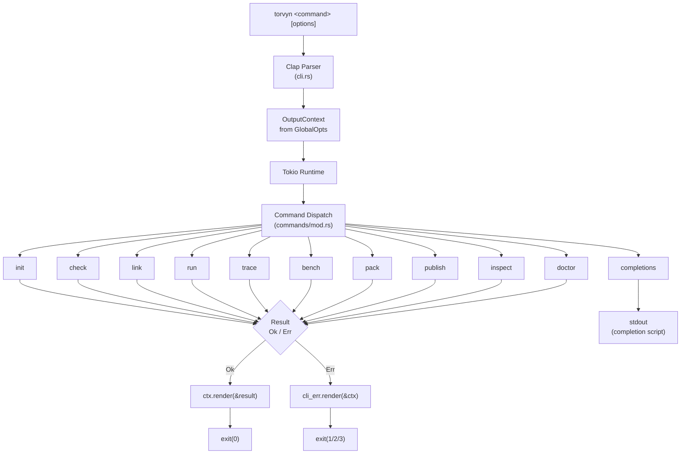
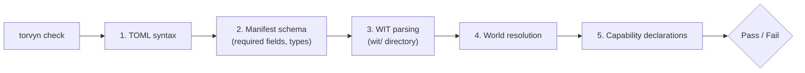
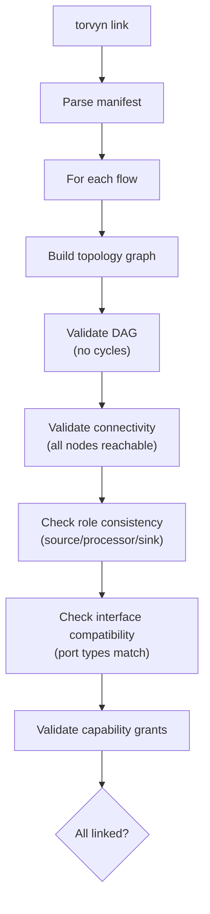
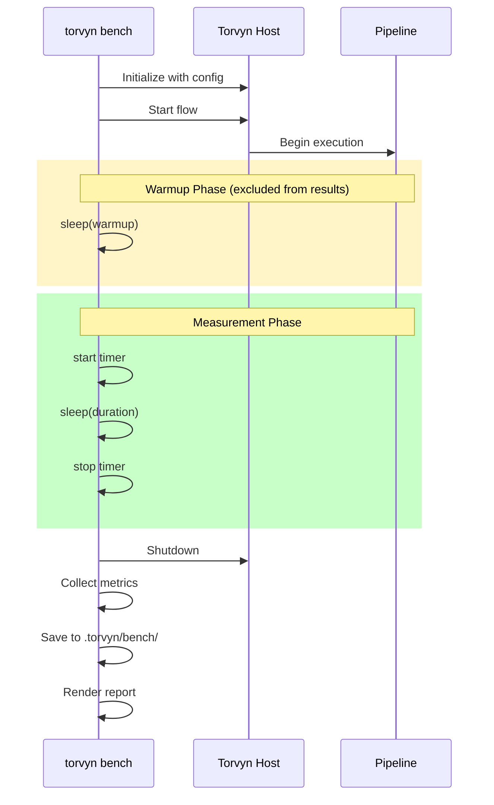
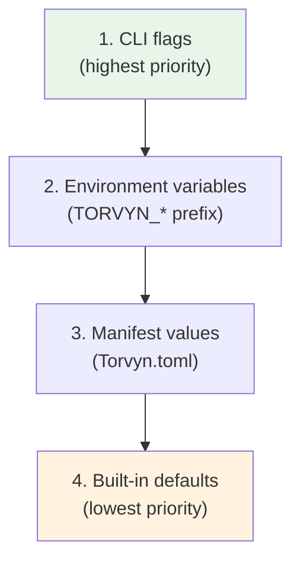
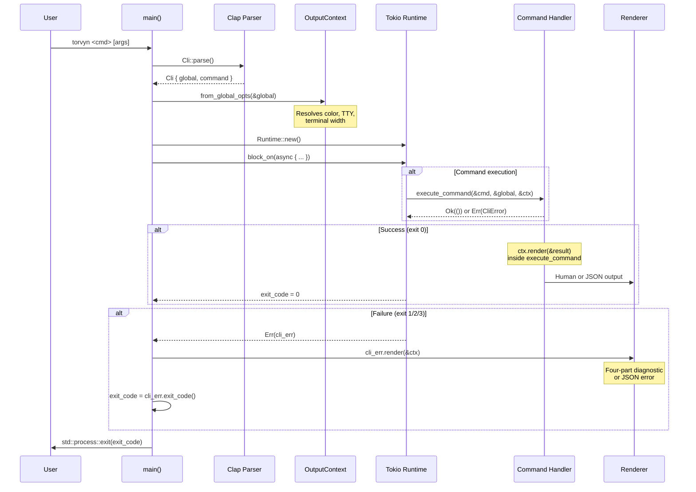

# CLI Reference

Complete reference for the `torvyn` command-line interface, the developer-facing tool for the Torvyn ownership-aware reactive streaming runtime.

**Version:** 0.1.0
**License:** Apache-2.0
**Source:** [`crates/torvyn-cli/`](../crates/torvyn-cli/)
**Binary name:** `torvyn`
**Install:** `cargo install torvyn-cli`

> All information in this document is sourced directly from the Torvyn codebase. Source file references are provided for traceability.

---

## Table of Contents

- [Architecture Overview](#architecture-overview)
- [Global Options](#global-options)
- [Commands](#commands)
  - [`torvyn init`](#torvyn-init)
  - [`torvyn check`](#torvyn-check)
  - [`torvyn link`](#torvyn-link)
  - [`torvyn run`](#torvyn-run)
  - [`torvyn trace`](#torvyn-trace)
  - [`torvyn bench`](#torvyn-bench)
  - [`torvyn pack`](#torvyn-pack)
  - [`torvyn publish`](#torvyn-publish)
  - [`torvyn inspect`](#torvyn-inspect)
  - [`torvyn doctor`](#torvyn-doctor)
  - [`torvyn completions`](#torvyn-completions)
- [Configuration Reference](#configuration-reference)
  - [Torvyn.toml Schema](#torvyntoml-schema)
  - [Environment Variables](#environment-variables)
  - [Configuration Precedence](#configuration-precedence)
- [Output Formats](#output-formats)
  - [Human-Readable Output](#human-readable-output)
  - [JSON Output](#json-output)
- [Error Reference](#error-reference)
  - [Exit Codes](#exit-codes)
  - [Error Categories](#error-categories)
  - [Error Code Ranges](#error-code-ranges)
  - [Diagnostic Format](#diagnostic-format)
- [Shell Completions](#shell-completions)
- [Appendix: Command Lifecycle](#appendix-command-lifecycle)

---

## Architecture Overview

The CLI is structured as a Clap v4.5 derive-based application with a modular command dispatch system. Every command is an async function that produces a structured result type, which is then rendered in either human-readable or JSON format.

<!-- Source: crates/torvyn-cli/src/main.rs -->



**Key design properties:**

- **`#![forbid(unsafe_code)]`** &mdash; the CLI crate contains zero unsafe code.
  <sup>([main.rs:4](../crates/torvyn-cli/src/main.rs#L4))</sup>
- **Cold/Hot path separation** &mdash; all CLI setup (argument parsing, config loading, validation) is on the cold path. Only pipeline execution (`run`, `trace`, `bench`) enters the hot path.
  <sup>([commands/mod.rs:23](../crates/torvyn-cli/src/commands/mod.rs#L23))</sup>
- **Dual output** &mdash; every command result implements both `Serialize` (for JSON) and `HumanRenderable` (for terminal).
  <sup>([output/mod.rs:74](../crates/torvyn-cli/src/output/mod.rs#L74))</sup>

---

## Global Options

These options are available on every subcommand. They are defined in the `GlobalOpts` struct.

<sup>Source: [cli.rs:44&#8211;61](../crates/torvyn-cli/src/cli.rs#L44-L61)</sup>

| Option | Short | Type | Default | Description |
|--------|-------|------|---------|-------------|
| `--verbose` | `-v` | flag | `false` | Show debug-level messages. Mutually exclusive with `--quiet`. |
| `--quiet` | `-q` | flag | `false` | Suppress non-essential output (errors only). Mutually exclusive with `--verbose`. |
| `--format` | &mdash; | `human` \| `json` | `human` | Output format for command results. |
| `--color` | &mdash; | `auto` \| `always` \| `never` | `auto` | Color output control. |

### Color Resolution Logic

When `--color auto` (the default), color is enabled only when **all three** conditions are met:

1. `stdout` is an interactive terminal (TTY).
2. The `NO_COLOR` environment variable is **not** set.
3. The `TERM` environment variable is not set to `"dumb"`.

<sup>Source: [output/mod.rs:49&#8211;57](../crates/torvyn-cli/src/output/mod.rs#L49-L57)</sup>

---

## Commands

### `torvyn init`

Create a new Torvyn project.

```
torvyn init [OPTIONS] [PROJECT_NAME]
```

Scaffolds a complete project with WIT contracts, implementation stubs, a `Torvyn.toml` manifest, and build configuration. The generated project compiles and runs out of the box.

<sup>Source: [commands/init.rs](../crates/torvyn-cli/src/commands/init.rs)</sup>

#### Arguments

| Name | Required | Default | Description |
|------|----------|---------|-------------|
| `PROJECT_NAME` | No | Current directory name | Directory name and project name. |

#### Options

| Option | Short | Type | Default | Description |
|--------|-------|------|---------|-------------|
| `--template` | `-t` | enum | `transform` | Project template to use. See [Templates](#templates). |
| `--language` | `-l` | enum | `rust` | Implementation language. See [Languages](#languages). |
| `--no-git` | &mdash; | flag | `false` | Skip git repository initialization. |
| `--no-example` | &mdash; | flag | `false` | Skip example implementation, generate contract stubs only. |
| `--contract-version` | &mdash; | string | `0.1.0` | Torvyn contract version to target. |
| `--force` | &mdash; | flag | `false` | Overwrite existing directory contents. |

<sup>Source: [cli.rs:282&#8211;311](../crates/torvyn-cli/src/cli.rs#L282-L311)</sup>

#### Templates

<sup>Source: [cli.rs:89&#8211;125](../crates/torvyn-cli/src/cli.rs#L89-L125)</sup>

| Template | Description |
|----------|-------------|
| `source` | Data producer (no input, one output). |
| `sink` | Data consumer (one input, no output). |
| `transform` | Stateless data transformer. **(default)** |
| `filter` | Content filter/guard. |
| `router` | Multi-output router. |
| `aggregator` | Stateful windowed aggregator. |
| `full-pipeline` | Complete multi-component pipeline with source + transform + sink. |
| `empty` | Minimal skeleton for experienced users. |

#### Languages

<sup>Source: [cli.rs:128&#8211;139](../crates/torvyn-cli/src/cli.rs#L128-L139)</sup>

| Language | Support Level |
|----------|---------------|
| `rust` | Primary, fully supported. **(default)** |
| `go` | Via TinyGo, limited support. |
| `python` | Via componentize-py, limited support. |
| `zig` | Experimental. |

#### Name Validation Rules

Project names must satisfy all of the following:

1. Length between 1 and 64 characters (inclusive).
2. Contains only ASCII alphanumeric characters, hyphens (`-`), and underscores (`_`).
3. Does **not** start with a hyphen or a digit.

<sup>Source: [commands/init.rs:159&#8211;191](../crates/torvyn-cli/src/commands/init.rs#L159-L191)</sup>

#### Examples

```bash
# Create a full pipeline project
torvyn init my-pipeline --template full-pipeline

# Create a Rust transform component
torvyn init my-transform

# Create a Go sink without git init
torvyn init data-writer --template sink --language go --no-git

# Target a specific contract version
torvyn init legacy-adapter --contract-version 0.1.0

# Overwrite existing directory
torvyn init my-project --force
```

#### Output

**Human:**

```
✓ Created project "my-pipeline" with template "full-pipeline"

  my-pipeline
  ├── Torvyn.toml
  ├── wit/world.wit
  ├── components/source/src/lib.rs
  ├── components/transform/src/lib.rs
  └── components/sink/src/lib.rs

  Next steps:
    cd my-pipeline
    torvyn check              # Validate contracts and manifest
    torvyn build              # Compile to WebAssembly component
    torvyn run --limit 10     # Run and see output
```

**JSON:**

```json
{
  "success": true,
  "command": "init",
  "data": {
    "project_name": "my-pipeline",
    "template": "fullpipeline",
    "directory": "my-pipeline",
    "files_created": [
      "Torvyn.toml",
      "wit/world.wit",
      "components/source/src/lib.rs",
      "components/transform/src/lib.rs",
      "components/sink/src/lib.rs"
    ],
    "git_initialized": true
  }
}
```

---

### `torvyn check`

Validate contracts, manifest, and project structure.

```
torvyn check [OPTIONS]
```

Performs static analysis: parses WIT contracts, validates the manifest schema, resolves references, and checks capability declarations. Delegates to `torvyn-contracts` for WIT validation and `torvyn-config` for manifest parsing.

<sup>Source: [commands/check.rs](../crates/torvyn-cli/src/commands/check.rs)</sup>

#### Options

| Option | Type | Default | Description |
|--------|------|---------|-------------|
| `--manifest` | path | `./Torvyn.toml` | Path to Torvyn.toml. |
| `--strict` | flag | `false` | Treat warnings as errors. |

<sup>Source: [cli.rs:314&#8211;323](../crates/torvyn-cli/src/cli.rs#L314-L323)</sup>

#### What It Validates



1. **TOML syntax** &mdash; the manifest file parses as valid TOML.
2. **Manifest schema** &mdash; required fields (`torvyn.name`, `torvyn.version`, `torvyn.contract_version`) are present and valid.
3. **WIT parsing** &mdash; all `.wit` files in the `wit/` directory parse successfully.
4. **World resolution** &mdash; world definitions resolve correctly.
5. **Capability declarations** &mdash; declared capabilities are consistent with component interfaces.

In `--strict` mode, both errors **and** warnings cause a non-zero exit.

<sup>Source: [commands/check.rs:215&#8211;219](../crates/torvyn-cli/src/commands/check.rs#L215-L219)</sup>

#### Examples

```bash
# Check the current project
torvyn check

# Check with strict mode (warnings become errors)
torvyn check --strict

# Check a specific manifest
torvyn check --manifest path/to/Torvyn.toml
```

#### Output

**Human (all passing):**

```
✓ Torvyn.toml is valid
✓ WIT contracts parsed (3 file(s), 0 errors)
✓ World definition resolves correctly
✓ Capability declarations consistent

  All checks passed.
```

**Human (with errors):**

```
error[E0201]: Interface 'data-source' not found in world definition
  --> wit/world.wit:12:5
  help: Check that the interface name matches your WIT definition.

warning[E0100]: No wit/ directory found
  --> ./my-project
  help: Create a wit/ directory with your component's world definition.

  1 error(s), 1 warning(s)
```

**JSON:**

```json
{
  "success": true,
  "command": "check",
  "data": {
    "all_passed": true,
    "wit_files_parsed": 3,
    "error_count": 0,
    "warning_count": 0,
    "diagnostics": []
  }
}
```

---

### `torvyn link`

Verify component composition compatibility.

```
torvyn link [OPTIONS]
```

Given a pipeline configuration, verifies that all component interfaces are compatible and the topology is valid (DAG, connected, role-consistent). Delegates to `torvyn-linker` for topology validation.

<sup>Source: [commands/link.rs](../crates/torvyn-cli/src/commands/link.rs)</sup>

#### Options

| Option | Type | Default | Description |
|--------|------|---------|-------------|
| `--manifest` | path | `./Torvyn.toml` | Path to Torvyn.toml with flow definition. |
| `--flow` | string | *all flows* | Specific flow to check (default: validates all flows). |
| `--components` | path | &mdash; | Directory containing compiled `.wasm` components. |
| `--detail` | flag | `false` | Show full interface compatibility details. |

<sup>Source: [cli.rs:326&#8211;343](../crates/torvyn-cli/src/cli.rs#L326-L343)</sup>

#### What It Validates



- **Topology** &mdash; the flow must be a valid Directed Acyclic Graph (DAG) where all nodes are connected.
- **Role consistency** &mdash; components are assigned roles (Source, Processor, Sink, Filter, Router) based on their interface type hints.
- **Interface compatibility** &mdash; output ports must be type-compatible with connected input ports.
- **Capability grants** &mdash; declared capabilities are validated against component requirements.

Port references use `"node:port"` syntax. If no port is specified, `"default"` is assumed.

<sup>Source: [commands/link.rs:258&#8211;263](../crates/torvyn-cli/src/commands/link.rs#L258-L263)</sup>

#### Examples

```bash
# Link all flows in the current project
torvyn link

# Link a specific flow
torvyn link --flow my-pipeline

# Link with detailed interface compatibility output
torvyn link --detail
```

#### Output

**Human:**

```
✓ Flow "my-pipeline" links successfully (3 components, 2 edges, 0 errors)
```

**JSON:**

```json
{
  "success": true,
  "command": "link",
  "data": {
    "all_linked": true,
    "flows": [
      {
        "name": "my-pipeline",
        "linked": true,
        "component_count": 3,
        "edge_count": 2,
        "diagnostics": []
      }
    ]
  }
}
```

---

### `torvyn run`

Execute a pipeline locally.

```
torvyn run [OPTIONS]
```

Instantiates the Torvyn host runtime, loads components, and runs the pipeline. Displays element count, errors, and completion status. Supports graceful shutdown via `Ctrl+C`.

<sup>Source: [commands/run.rs](../crates/torvyn-cli/src/commands/run.rs)</sup>

#### Options

| Option | Type | Default | Description |
|--------|------|---------|-------------|
| `--manifest` | path | `./Torvyn.toml` | Path to Torvyn.toml. |
| `--flow` | string | *first defined flow* | Flow to execute. |
| `--input` | string | &mdash; | Override source input (file path, stdin, or generator). |
| `--output` | string | &mdash; | Override sink output (file path, stdout). |
| `--limit` | integer | &mdash; | Process at most N elements then exit. |
| `--timeout` | duration | &mdash; | Maximum execution time (e.g., `30s`, `5m`). See [Duration Format](#duration-format). |
| `--config` | `KEY=VALUE` | &mdash; | Override component configuration values. Repeatable. |
| `--log-level` | string | `info` | Log verbosity. |

<sup>Source: [cli.rs:346&#8211;379](../crates/torvyn-cli/src/cli.rs#L346-L379)</sup>

#### Duration Format

Duration strings accept the following suffixes:

| Suffix | Unit | Example |
|--------|------|---------|
| `ms` | Milliseconds | `100ms` |
| `s` | Seconds | `30s` |
| `m` | Minutes | `5m` |
| `h` | Hours | `1h` |

<sup>Source: [commands/run.rs:224&#8211;261](../crates/torvyn-cli/src/commands/run.rs#L224-L261)</sup>

#### Shutdown Behavior

The pipeline terminates when **any** of the following occurs:

1. The flow reaches natural completion (source exhausted).
2. The `--limit` element count is reached.
3. The `--timeout` duration expires.
4. The user sends `Ctrl+C` (SIGINT).

In all cases, `host.shutdown()` is called for graceful teardown.

<sup>Source: [commands/run.rs:157&#8211;179](../crates/torvyn-cli/src/commands/run.rs#L157-L179)</sup>

#### Examples

```bash
# Run the default flow
torvyn run

# Run a specific flow with element limit
torvyn run --flow my-pipeline --limit 100

# Run with timeout and custom input
torvyn run --timeout 30s --input data.json

# Override component config
torvyn run --config source.batch_size=50 --config sink.flush_interval=1s
```

#### Output

**Human:**

```
▶ Running flow "my-pipeline"

  ── Summary ─────────────────────────────────────────────────
  Duration:     2.34s
  Elements:     1000
  Throughput:   427 elem/s
  Errors:       0
  Peak memory:  4.2 MiB
```

**JSON:**

```json
{
  "success": true,
  "command": "run",
  "data": {
    "duration_secs": 2.34,
    "elements_processed": 1000,
    "throughput_elem_per_sec": 427.0,
    "error_count": 0,
    "peak_memory_bytes": 4404019,
    "flow_name": "my-pipeline",
    "component_count": 3,
    "edge_count": 2
  }
}
```

---

### `torvyn trace`

Run with full diagnostic tracing.

```
torvyn trace [OPTIONS]
```

Like `run` but with full tracing enabled. Outputs a flow timeline showing per-stage latency, resource transfers, and backpressure events. Sets the observability sampling rate to 100% for complete visibility.

<sup>Source: [commands/trace.rs](../crates/torvyn-cli/src/commands/trace.rs)</sup>

#### Options

| Option | Type | Default | Description |
|--------|------|---------|-------------|
| `--manifest` | path | `./Torvyn.toml` | Path to Torvyn.toml. |
| `--flow` | string | *first defined flow* | Flow to trace. |
| `--input` | string | &mdash; | Override source input. |
| `--limit` | integer | &mdash; | Trace at most N elements. |
| `--output-trace` | path | *stdout* | Write trace data to file. |
| `--trace-format` | `pretty` \| `json` \| `otlp` | `pretty` | Trace output format. |
| `--show-buffers` | flag | `false` | Include buffer content snapshots in trace. |
| `--show-backpressure` | flag | `false` | Highlight backpressure events. |

<sup>Source: [cli.rs:382&#8211;415](../crates/torvyn-cli/src/cli.rs#L382-L415)</sup>

#### Trace Formats

| Format | Description |
|--------|-------------|
| `pretty` | Tree-structured view with ASCII connectors. Human-friendly. **(default)** |
| `json` | JSON trace spans. Machine-parseable. |
| `otlp` | OpenTelemetry Protocol export format. Compatible with Jaeger, Zipkin, etc. |

<sup>Source: [cli.rs:190&#8211;199](../crates/torvyn-cli/src/cli.rs#L190-L199)</sup>

#### Difference from `torvyn run`

| Aspect | `torvyn run` | `torvyn trace` |
|--------|-------------|----------------|
| **Purpose** | Execute pipeline, report summary | Full diagnostic tracing |
| **Observability level** | Production (if enabled) | Diagnostic (always 100% sampling) |
| **Per-element output** | None | Full per-element span tree |
| **Performance overhead** | Minimal | Significant (full instrumentation) |
| **Recommended use** | Production runs, integration testing | Debugging, performance analysis |

#### Examples

```bash
# Trace 5 elements with pretty output
torvyn trace --limit 5

# Trace to a JSON file
torvyn trace --limit 100 --trace-format json --output-trace trace.json

# Trace with buffer and backpressure visibility
torvyn trace --limit 10 --show-buffers --show-backpressure
```

#### Output

**Human (pretty format):**

```
  elem-0  ┬─ csv-source     pull     12.3µs  B001 (512B, created)
          ├─ tokenizer       process  8.7µs   B002 (256B, created)
          └─ json-sink       push     3.1µs
          total: 24.1µs

  elem-1  ┬─ csv-source     pull     11.8µs  B003 (512B, created)
          ├─ tokenizer       process  7.9µs   B004 (256B, created)
          └─ json-sink       push     2.8µs
          total: 22.5µs

  ── Trace Summary ───────────────────────────────────────────
  Elements traced:  2
  Avg latency:      23.3µs (p50: 23.3µs, p99: 24.1µs)
  Copies:           8
  Buffer reuse:     0%
  Backpressure:     0 events
```

**JSON:**

```json
{
  "success": true,
  "command": "trace",
  "data": {
    "elements_traced": 2,
    "avg_latency_us": 23.3,
    "p50_latency_us": 23.3,
    "p99_latency_us": 24.1,
    "total_copies": 8,
    "buffer_reuse_pct": 0.0,
    "backpressure_events": 0,
    "traces": [
      {
        "element_id": 0,
        "spans": [
          {
            "component": "csv-source",
            "operation": "pull",
            "duration_us": 12.3,
            "buffer_info": "B001 (512B, created)"
          }
        ],
        "total_latency_us": 24.1
      }
    ],
    "flow_name": "my-pipeline"
  }
}
```

---

### `torvyn bench`

Benchmark a pipeline.

```
torvyn bench [OPTIONS]
```

Runs the pipeline under sustained load with a warmup period, then produces a performance report with throughput, latency percentiles (p50/p90/p95/p99/p99.9/max), per-component latency, resource metrics, and scheduling statistics.

Results are automatically saved to `.torvyn/bench/` with an ISO 8601 timestamp filename.

<sup>Source: [commands/bench.rs](../crates/torvyn-cli/src/commands/bench.rs)</sup>

#### Options

| Option | Type | Default | Description |
|--------|------|---------|-------------|
| `--manifest` | path | `./Torvyn.toml` | Path to Torvyn.toml. |
| `--flow` | string | *first defined flow* | Flow to benchmark. |
| `--duration` | duration | `10s` | Benchmark measurement duration. |
| `--warmup` | duration | `2s` | Warmup period excluded from results. |
| `--input` | string | &mdash; | Override source input (for reproducible benchmarks). |
| `--report` | path | *stdout* | Write report to file. |
| `--report-format` | enum | `pretty` | Report format. See [Report Formats](#report-formats). |
| `--compare` | path | &mdash; | Compare against a previous benchmark result. |
| `--baseline` | string | &mdash; | Save result as a named baseline for future comparison. |

<sup>Source: [cli.rs:418&#8211;455](../crates/torvyn-cli/src/cli.rs#L418-L455)</sup>

#### Report Formats

| Format | Description |
|--------|-------------|
| `pretty` | Styled terminal table with sections. **(default)** |
| `json` | JSON report. Machine-parseable. |
| `csv` | CSV report for spreadsheet import. |
| `markdown` | Markdown table for documentation embedding. |

<sup>Source: [cli.rs:176&#8211;187](../crates/torvyn-cli/src/cli.rs#L176-L187)</sup>

#### Benchmark Workflow



#### Examples

```bash
# Run a 10-second benchmark with 2-second warmup (defaults)
torvyn bench

# Quick benchmark
torvyn bench --duration 5s --warmup 1s

# Save as named baseline
torvyn bench --baseline v1.0

# Compare against a previous run
torvyn bench --compare .torvyn/bench/2024-01-15T10-30-00.json

# Export as markdown
torvyn bench --report-format markdown --report report.md
```

#### Output

**Human:**

```
▶ Benchmarking flow "my-pipeline" (warmup: 2s, duration: 10s)

  ── Throughput ──────────────────────────────────────────────
  Elements/s:  12500
  Bytes/s:     6.1 MiB

  ── Latency (µs) ───────────────────────────────────────────
  p50:   42.3
  p90:   67.8
  p95:   89.1
  p99:   134.5
  p999:  312.7
  max:   1023.4

  ── Per-Component Latency (µs, p50) ────────────────────────
  csv-source:   15.2
  tokenizer:    18.4
  json-sink:    8.7

  ── Resources ───────────────────────────────────────────────
  Buffer allocs:    125000
  Pool reuse rate:  87.3%
  Total copies:     375000
  Peak memory:      8.2 MiB

  ── Scheduling ──────────────────────────────────────────────
  Total wakeups:        250000
  Backpressure events:  42
  Queue peak:           48 / 64

  Result saved to: .torvyn/bench/2024-01-15T10-30-00.json
```

**JSON:**

```json
{
  "success": true,
  "command": "bench",
  "data": {
    "flow_name": "my-pipeline",
    "warmup_secs": 2.0,
    "measurement_secs": 10.0,
    "throughput": {
      "elements_per_sec": 12500.0,
      "bytes_per_sec": 6400000.0
    },
    "latency": {
      "p50_us": 42.3,
      "p90_us": 67.8,
      "p95_us": 89.1,
      "p99_us": 134.5,
      "p999_us": 312.7,
      "max_us": 1023.4
    },
    "per_component": [
      { "component": "csv-source", "p50_us": 15.2, "p99_us": 45.6 },
      { "component": "tokenizer", "p50_us": 18.4, "p99_us": 52.1 },
      { "component": "json-sink", "p50_us": 8.7, "p99_us": 36.8 }
    ],
    "resources": {
      "buffer_allocs": 125000,
      "pool_reuse_pct": 87.3,
      "total_copies": 375000,
      "peak_memory_bytes": 8598323
    },
    "scheduling": {
      "total_wakeups": 250000,
      "backpressure_events": 42,
      "queue_peak": 48,
      "queue_capacity": 64
    },
    "saved_to": ".torvyn/bench/2024-01-15T10-30-00.json"
  }
}
```

---

### `torvyn pack`

Package as OCI artifact.

```
torvyn pack [OPTIONS]
```

Assembles compiled components, contracts, and metadata into a distributable artifact. The output is a tarball containing the Wasm binary, WIT contracts, and metadata layers.

<sup>Source: [commands/pack.rs](../crates/torvyn-cli/src/commands/pack.rs)</sup>

#### Options

| Option | Type | Default | Description |
|--------|------|---------|-------------|
| `--manifest` | path | `./Torvyn.toml` | Path to Torvyn.toml. |
| `--component` | string | *all in project* | Specific component to pack. |
| `--output` | path | `.torvyn/artifacts/` | Output artifact path. |
| `--tag` | string | *manifest version* | OCI tag. |
| `--include-source` | flag | `false` | Include source WIT contracts in artifact metadata. |
| `--sign` | flag | `false` | Sign artifact (requires signing key configuration). |

<sup>Source: [cli.rs:458&#8211;483](../crates/torvyn-cli/src/cli.rs#L458-L483)</sup>

#### Examples

```bash
# Pack the current project
torvyn pack

# Pack a specific component with a custom tag
torvyn pack --component tokenizer --tag v1.2.3

# Include WIT source and sign
torvyn pack --include-source --sign

# Pack to a custom output directory
torvyn pack --output ./dist/
```

#### Output

**Human:**

```
✓ Packed: my-component:0.1.0
  Artifact:  .torvyn/artifacts/my-component-0.1.0.tar
  Size:      124.5 KiB
  Layers:
    - component (118.2 KiB)
    - contracts (4.1 KiB)
    - metadata (2.2 KiB)
```

**JSON:**

```json
{
  "success": true,
  "command": "pack",
  "data": {
    "name": "my-component",
    "version": "0.1.0",
    "artifact_path": ".torvyn/artifacts/my-component-0.1.0.tar",
    "artifact_size_bytes": 127488,
    "layers": [
      { "name": "component", "size_bytes": 121037 },
      { "name": "contracts", "size_bytes": 4198 },
      { "name": "metadata", "size_bytes": 2253 }
    ]
  }
}
```

---

### `torvyn publish`

Publish to a registry.

```
torvyn publish [OPTIONS]
```

Pushes a packaged artifact to a registry. In Phase 0, only local directory registries are supported (`local:` prefix). If no `--artifact` is specified, the most recently modified `.tar` file in `.torvyn/artifacts/` is used.

<sup>Source: [commands/publish.rs](../crates/torvyn-cli/src/commands/publish.rs)</sup>

#### Options

| Option | Type | Default | Description |
|--------|------|---------|-------------|
| `--artifact` | path | *latest in `.torvyn/artifacts/`* | Path to packed artifact. |
| `--registry` | string | `local:.torvyn/registry` | Target registry URL. |
| `--tag` | string | &mdash; | Override tag. |
| `--dry-run` | flag | `false` | Validate publish without actually pushing. |
| `--force` | flag | `false` | Overwrite existing tag. |

<sup>Source: [cli.rs:486&#8211;507](../crates/torvyn-cli/src/cli.rs#L486-L507)</sup>

#### Examples

```bash
# Publish to local registry (default)
torvyn publish

# Dry run to validate
torvyn publish --dry-run

# Publish a specific artifact
torvyn publish --artifact .torvyn/artifacts/my-component-0.1.0.tar

# Publish to a remote registry (future)
torvyn publish --registry https://registry.example.com

# Force overwrite existing tag
torvyn publish --force
```

#### Output

**Human:**

```
✓ Published: local:.torvyn/registry/.torvyn/registry/my-component-0.1.0.tar
  Digest:  sha256:a1b2c3d4e5f6...
```

**Human (dry run):**

```
✓ Dry run: publish would succeed
  Registry:   local:.torvyn/registry
  Reference:  local:.torvyn/registry/artifact:latest
```

**JSON:**

```json
{
  "success": true,
  "command": "publish",
  "data": {
    "registry": "local:.torvyn/registry",
    "reference": "local:.torvyn/registry/my-component-0.1.0.tar",
    "digest": "sha256:a1b2c3d4e5f6...",
    "dry_run": false
  }
}
```

---

### `torvyn inspect`

Inspect a component or artifact.

```
torvyn inspect [OPTIONS] <TARGET>
```

Displays metadata, interfaces, capabilities, and size information for a compiled `.wasm` file or packaged artifact (`.tar`, `.torvyn`).

<sup>Source: [commands/inspect.rs](../crates/torvyn-cli/src/commands/inspect.rs)</sup>

#### Arguments

| Name | Required | Description |
|------|----------|-------------|
| `TARGET` | Yes | Path to `.wasm` file, OCI artifact, or registry reference. |

#### Options

| Option | Type | Default | Description |
|--------|------|---------|-------------|
| `--show` | enum | `all` | What section to display. |

**`--show` values:**

| Value | Description |
|-------|-------------|
| `all` | Show all available information. **(default)** |
| `interfaces` | Show exported and imported interfaces. |
| `capabilities` | Show required capabilities. |
| `metadata` | Show component metadata (version, authors, etc.). |
| `size` | Show binary size breakdown. |
| `contracts` | Show WIT contract definitions. |
| `benchmarks` | Show embedded benchmark results. |

<sup>Source: [cli.rs:156&#8211;173](../crates/torvyn-cli/src/cli.rs#L156-L173)</sup>

#### Examples

```bash
# Inspect a .wasm file
torvyn inspect target/wasm32-wasip2/release/my_component.wasm

# Inspect a packaged artifact
torvyn inspect .torvyn/artifacts/my-component-0.1.0.tar

# Show only capabilities
torvyn inspect my-component.wasm --show capabilities

# Show only size information
torvyn inspect my-component.wasm --show size
```

#### Output

**Human:**

```
  Component:  my-transform
  Version:    0.1.0
  Size:       118.2 KiB (Wasm), 124.5 KiB (packaged)

  Exports:
    torvyn:streaming/managed-transform@0.1.0

  Imports:
    torvyn:streaming/types@0.1.0
    torvyn:streaming/lifecycle@0.1.0

  Capabilities required:
    ReadBuffer
    WriteBuffer
    AllocateBuffer

  Contract version:  0.1.0
  Built with:        cargo-component 0.16.0
```

**JSON:**

```json
{
  "success": true,
  "command": "inspect",
  "data": {
    "name": "my-transform",
    "version": "0.1.0",
    "size_wasm_bytes": 121037,
    "size_packaged_bytes": 127488,
    "exports": ["torvyn:streaming/managed-transform@0.1.0"],
    "imports": [
      "torvyn:streaming/types@0.1.0",
      "torvyn:streaming/lifecycle@0.1.0"
    ],
    "capabilities_required": [
      "ReadBuffer",
      "WriteBuffer",
      "AllocateBuffer"
    ],
    "contract_version": "0.1.0",
    "build_info": "cargo-component 0.16.0"
  }
}
```

---

### `torvyn doctor`

Check development environment.

```
torvyn doctor [OPTIONS]
```

Verifies required tools, correct versions, and common misconfigurations. Run with `--fix` to attempt automatic repair of missing targets and tools.

<sup>Source: [commands/doctor.rs](../crates/torvyn-cli/src/commands/doctor.rs)</sup>

#### Options

| Option | Type | Default | Description |
|--------|------|---------|-------------|
| `--fix` | flag | `false` | Attempt to fix common issues automatically. |

<sup>Source: [cli.rs:521&#8211;526](../crates/torvyn-cli/src/cli.rs#L521-L526)</sup>

#### Checks Performed

| # | Category | Check | Fix Action (with `--fix`) |
|---|----------|-------|---------------------------|
| 1 | Torvyn CLI | CLI version and currency | &mdash; |
| 2 | Rust Toolchain | `rustc` installed and version | &mdash; |
| 3 | Rust Toolchain | `wasm32-wasip2` target installed | `rustup target add wasm32-wasip2` |
| 4 | Rust Toolchain | `cargo-component` installed | `cargo install cargo-component` |
| 5 | WebAssembly Tools | `wasm-tools` installed | `cargo install wasm-tools` |
| 6 | Project | `Torvyn.toml` exists in current directory | &mdash; (suggests `torvyn init`) |

<sup>Source: [commands/doctor.rs:82&#8211;138](../crates/torvyn-cli/src/commands/doctor.rs#L82-L138)</sup>

#### Examples

```bash
# Check environment
torvyn doctor

# Auto-fix missing tools
torvyn doctor --fix
```

#### Output

**Human:**

```
  Torvyn CLI
✓ torvyn 0.1.0 (up to date)

  Rust Toolchain
✓ rustc rustc 1.82.0 (f6e511eec 2024-10-15)
✓ wasm32-wasip2 target installed
✓ cargo-component cargo-component 0.16.0

  WebAssembly Tools
✓ wasm-tools wasm-tools 1.219.1

  Project
✓ Torvyn.toml found

  All checks passed!
```

**Human (with failures):**

```
  Rust Toolchain
✓ rustc rustc 1.82.0 (f6e511eec 2024-10-15)
✗ wasm32-wasip2 target NOT installed

      fix: Run `rustup target add wasm32-wasip2`

  2 error(s), 0 warning(s). Run `torvyn doctor --fix` to attempt automatic repair.
```

**JSON:**

```json
{
  "success": true,
  "command": "doctor",
  "data": {
    "checks": [
      {
        "category": "Torvyn CLI",
        "name": "torvyn",
        "passed": true,
        "detail": "0.1.0 (up to date)",
        "fix": null
      },
      {
        "category": "Rust Toolchain",
        "name": "wasm32-wasip2 target",
        "passed": false,
        "detail": "NOT installed",
        "fix": "Run `rustup target add wasm32-wasip2`"
      }
    ],
    "all_passed": false,
    "error_count": 1,
    "warning_count": 0
  }
}
```

---

### `torvyn completions`

Generate shell completions.

```
torvyn completions <SHELL>
```

Prints a completion script to stdout for the specified shell. Pipe the output to the appropriate location for your shell.

<sup>Source: [commands/mod.rs:77&#8211;89](../crates/torvyn-cli/src/commands/mod.rs#L77-L89)</sup>

#### Arguments

| Name | Required | Values | Description |
|------|----------|--------|-------------|
| `SHELL` | Yes | `bash`, `zsh`, `fish`, `powershell` | Shell to generate completions for. |

<sup>Source: [cli.rs:141&#8211;153](../crates/torvyn-cli/src/cli.rs#L141-L153)</sup>

#### Installation

```bash
# Bash
torvyn completions bash > ~/.bash_completion.d/torvyn
# or
torvyn completions bash >> ~/.bashrc

# Zsh
torvyn completions zsh > ~/.zfunc/_torvyn
# Ensure ~/.zfunc is in your fpath

# Fish
torvyn completions fish > ~/.config/fish/completions/torvyn.fish

# PowerShell
torvyn completions powershell >> $PROFILE
```

---

## Configuration Reference

### Torvyn.toml Schema

The `Torvyn.toml` file is the project manifest and (optionally) inline pipeline definition. It follows a two-configuration-context model where a single file can contain both component metadata and flow topology.

<sup>Source: [crates/torvyn-config/src/lib.rs:1&#8211;17](../crates/torvyn-config/src/lib.rs#L1-L17)</sup>

#### Complete Schema

```toml
# ──────────────────────────────────────────────────────────────
# [torvyn] — Project metadata (REQUIRED)
# ──────────────────────────────────────────────────────────────
[torvyn]
name = "my-component"                        # REQUIRED. [a-zA-Z0-9_-]+, 1-64 chars.
version = "0.1.0"                            # REQUIRED. Semver string.
contract_version = "0.1.0"                   # REQUIRED. Torvyn contract version.
description = "A streaming component"        # Optional. Human-readable description.
authors = ["Author <email@example.com>"]     # Optional. Author list.
license = "Apache-2.0"                       # Optional. SPDX identifier.
repository = "https://github.com/torvyn/torvyn"  # Optional. Repository URL.

# ──────────────────────────────────────────────────────────────
# [[component]] — Component declarations (multi-component projects)
# ──────────────────────────────────────────────────────────────
[[component]]
name = "tokenizer"                  # REQUIRED. Component name.
path = "components/tokenizer"       # REQUIRED. Relative path to component source root.
language = "rust"                   # Optional. Default: "rust". Values: rust, go, python, zig.
build_command = "cargo build"       # Optional. Custom build command override.
config = '{"batch_size": 100}'      # Optional. JSON config passed to lifecycle.init().

# ──────────────────────────────────────────────────────────────
# [build] — Build configuration
# ──────────────────────────────────────────────────────────────
[build]
release = true                      # Default: true. Build in release mode.
target = "wasm32-wasip2"            # Default: "wasm32-wasip2". Target triple.
extra_args = []                     # Default: []. Extra build arguments.

# ──────────────────────────────────────────────────────────────
# [test] — Test configuration
# ──────────────────────────────────────────────────────────────
[test]
timeout_seconds = 60                # Default: 60. Test timeout.
fixtures_dir = "tests/fixtures"     # Default: "tests/fixtures". Fixtures path.

# ──────────────────────────────────────────────────────────────
# [runtime] — Runtime configuration
# ──────────────────────────────────────────────────────────────
[runtime]
worker_threads = 0                          # Default: 0 (auto-detect). Tokio worker threads.
max_memory_per_component = "16MiB"          # Default: "16MiB". Per-component memory cap.
default_fuel_per_invocation = 1_000_000     # Default: 1,000,000. Fuel budget.
compilation_cache_dir = ".torvyn/cache"     # Default: ".torvyn/cache".

[runtime.scheduling]
policy = "weighted-fair"            # Default: "weighted-fair". Values: round-robin, weighted-fair, priority.
default_priority = 5                # Default: 5. Range: 1 (lowest) to 10 (highest).

[runtime.backpressure]
default_queue_depth = 64            # Default: 64. Max elements in inter-component queue.
backpressure_policy = "block-producer"  # Default: "block-producer". Values: block-producer, drop-oldest, drop-newest, error.

# ──────────────────────────────────────────────────────────────
# [observability] — Observability configuration
# ──────────────────────────────────────────────────────────────
[observability]
tracing_enabled = true              # Default: true.
tracing_exporter = "stdout"         # Default: "stdout". Values: otlp-grpc, otlp-http, stdout, none.
tracing_endpoint = "http://localhost:4317"  # Default. OTLP endpoint.
tracing_sample_rate = 1.0           # Default: 1.0. Range: 0.0 to 1.0.
metrics_enabled = true              # Default: true.
metrics_exporter = "none"           # Default: "none". Values: prometheus, otlp, none.
metrics_endpoint = "0.0.0.0:9090"   # Default. Metrics endpoint.

# ──────────────────────────────────────────────────────────────
# [security] — Security configuration
# ──────────────────────────────────────────────────────────────
[security]
default_capability_policy = "deny-all"  # Default: "deny-all". Values: deny-all, allow-all.

[security.grants.source-component]
capabilities = [
    "filesystem:read:/data/*",
    "network:egress:*"
]

# ──────────────────────────────────────────────────────────────
# [registry] — Registry configuration
# ──────────────────────────────────────────────────────────────
[registry]
default = "https://registry.example.com"   # Optional. Default registry URL.

# ──────────────────────────────────────────────────────────────
# [flow.<name>] — Inline pipeline definitions
# ──────────────────────────────────────────────────────────────
[flow.my-pipeline]
description = "My data pipeline"

[flow.my-pipeline.nodes.source]
component = "path/to/source.wasm"
interface = "torvyn:streaming/source"
config = '{"param": "value"}'

[flow.my-pipeline.nodes.processor]
component = "path/to/processor.wasm"
interface = "torvyn:streaming/processor"

[flow.my-pipeline.nodes.sink]
component = "path/to/sink.wasm"
interface = "torvyn:streaming/sink"

[[flow.my-pipeline.edges]]
from = "source:output"
to = "processor:input"

[[flow.my-pipeline.edges]]
from = "processor:output"
to = "sink:input"
```

<sup>Sources: [manifest.rs](../crates/torvyn-config/src/manifest.rs), [runtime.rs](../crates/torvyn-config/src/runtime.rs)</sup>

#### Memory Size Format

Memory size strings (e.g., `max_memory_per_component`) accept the following suffixes:

| Suffix | Unit | Example |
|--------|------|---------|
| `B` (or none) | Bytes | `1024B`, `1024` |
| `KiB` or `K` | Kibibytes (1024 B) | `512KiB`, `1K` |
| `MiB` or `M` | Mebibytes (1024 KiB) | `16MiB`, `16M` |
| `GiB` or `G` | Gibibytes (1024 MiB) | `1GiB`, `1G` |

Suffix matching is case-insensitive.

<sup>Source: [runtime.rs:368&#8211;400](../crates/torvyn-config/src/runtime.rs#L368-L400)</sup>

### Environment Variables

#### Configuration Overrides (`TORVYN_*`)

Environment variables with the `TORVYN_` prefix are collected and mapped to configuration paths. Underscores in the suffix map to dots in the configuration key.

**Format:** `TORVYN_<SECTION>_<KEY>=<VALUE>`

| Environment Variable | Config Key | Example Value |
|---------------------|------------|---------------|
| `TORVYN_RUNTIME_WORKER_THREADS` | `runtime.worker.threads` | `8` |
| `TORVYN_RUNTIME_MAX_MEMORY_PER_COMPONENT` | `runtime.max.memory.per.component` | `32MiB` |
| `TORVYN_RUNTIME_SCHEDULING_POLICY` | `runtime.scheduling.policy` | `round-robin` |

<sup>Source: [env.rs:97&#8211;110](../crates/torvyn-config/src/env.rs#L97-L110)</sup>

#### Environment Variable Interpolation

Configuration strings support `${VAR_NAME}` syntax for environment variable interpolation. **Undefined variables produce errors** (fail-safe behavior &mdash; no silent empty-string substitution).

```toml
[registry]
default = "https://${REGISTRY_HOST}:${REGISTRY_PORT}"
```

<sup>Source: [env.rs:29&#8211;78](../crates/torvyn-config/src/env.rs#L29-L78)</sup>

#### Terminal Control Variables

| Variable | Effect |
|----------|--------|
| `NO_COLOR` | Disables color output when set to any value. Respected in `--color auto` mode. |
| `TERM` | If set to `"dumb"`, disables color output in `--color auto` mode. |

<sup>Source: [output/mod.rs:53&#8211;55](../crates/torvyn-cli/src/output/mod.rs#L53-L55)</sup>

### Configuration Precedence

Configuration values are resolved in the following order (highest priority first):



1. **CLI flags** &mdash; `--config KEY=VALUE`, `--flow`, `--timeout`, etc.
2. **Environment variables** &mdash; `TORVYN_*` prefix overrides.
3. **Manifest values** &mdash; `Torvyn.toml` file contents.
4. **Built-in defaults** &mdash; hardcoded defaults in the Rust source.

<sup>Source: [env.rs:7&#8211;8](../crates/torvyn-config/src/env.rs#L7-L8)</sup>

---

## Output Formats

### Human-Readable Output

When `--format human` (the default), output goes to **stderr** and uses styled formatting:

| Element | Symbol | Color |
|---------|--------|-------|
| Success | `✓` | Green, bold |
| Failure | `✗` | Red, bold |
| Warning | `warning:` | Yellow, bold |
| Error | `error:` | Red, bold |
| Debug | `debug:` | Dim |
| Help | `help:` | Cyan, bold |
| Header | `──` | Dim rule + Bold title |
| Key-Value | `key:` | Dim key + plain value |
| Tree branch | `├──` / `└──` | Dim connectors |
| Location | `-->` | Dim arrow |

<sup>Source: [output/terminal.rs](../crates/torvyn-cli/src/output/terminal.rs)</sup>

When color is disabled (via `--color never`, `NO_COLOR`, or non-TTY), fallback text is used:

| With Color | Without Color |
|-----------|---------------|
| `✓ message` | `[ok] message` |
| `✗ message` | `[FAIL] message` |
| `── Title ────` | `-- Title ----` |

Progress bars and spinners are displayed only when stdout is a TTY and neither `--quiet` nor `--format json` is active.

<sup>Source: [output/mod.rs:137&#8211;170](../crates/torvyn-cli/src/output/mod.rs#L137-L170)</sup>

### JSON Output

When `--format json`, all output is **pretty-printed JSON to stdout**. The envelope structure is:

```json
{
  "success": true,
  "command": "<command-name>",
  "data": { ... },
  "warnings": ["optional", "warning", "strings"]
}
```

The `warnings` field is omitted when empty.

<sup>Source: [output/mod.rs:179&#8211;190](../crates/torvyn-cli/src/output/mod.rs#L179-L190)</sup>

**Error JSON** uses a different structure:

```json
{
  "error": true,
  "category": "<error-category>",
  "detail": "What went wrong",
  "file": "path/to/file (if applicable)",
  "suggestion": "How to fix it (if applicable)",
  "diagnostics": ["array", "of", "messages (if applicable)"],
  "fix": "Auto-fix command (if applicable)"
}
```

<sup>Source: [errors/mod.rs:138&#8211;209](../crates/torvyn-cli/src/errors/mod.rs#L138-L209)</sup>

---

## Error Reference

### Exit Codes

| Code | Meaning | When |
|------|---------|------|
| **0** | Success | Command completed normally. |
| **1** | Command failed | Validation error, runtime error, contract error, packaging error, security error. |
| **2** | Usage error | Missing manifest, invalid config file, filesystem errors. |
| **3** | Environment error | Missing tools, wrong versions, async runtime initialization failure. |

<sup>Source: [main.rs:20&#8211;24](../crates/torvyn-cli/src/main.rs#L20-L24), [errors/mod.rs:106&#8211;119](../crates/torvyn-cli/src/errors/mod.rs#L106-L119)</sup>

### Error Categories

Each error belongs to a category, which maps to an exit code and determines the fields available in JSON output.

| Category | Exit Code | Additional JSON Fields | Typical Trigger |
|----------|-----------|----------------------|-----------------|
| `config` | 2 | `file`, `suggestion` | Missing `Torvyn.toml`, invalid schema. |
| `contract` | 1 | `diagnostics[]` | WIT parse failure, world resolution error. |
| `link` | 1 | `diagnostics[]` | Topology invalid, interface mismatch. |
| `runtime` | 1 | `context` | Pipeline execution failure, host init failure. |
| `packaging` | 1 | `suggestion` | Artifact not found, pack failure. |
| `security` | 1 | `suggestion` | Capability validation failure. |
| `environment` | 3 | `fix` | Missing tool, wrong version. |
| `io` | 2 | `path` | File read/write error, directory creation failure. |
| `internal` | 1 | &mdash; | Bug in Torvyn. Suggests filing an issue. |
| `not_implemented` | 1 | &mdash; | Command not yet available (Part B). |

<sup>Source: [errors/mod.rs:26&#8211;98](../crates/torvyn-cli/src/errors/mod.rs#L26-L98)</sup>

### Error Code Ranges

Error codes follow a documented range allocation across the Torvyn system:

| Range | Category |
|-------|----------|
| `E0001`&#8211;`E0099` | General CLI errors |
| `E0100`&#8211;`E0199` | Contract errors |
| `E0200`&#8211;`E0299` | Linking errors |
| `E0300`&#8211;`E0399` | Resource errors |
| `E0400`&#8211;`E0499` | Reactor errors |
| `E0500`&#8211;`E0599` | Security errors |
| `E0600`&#8211;`E0699` | Packaging errors |
| `E0700`&#8211;`E0799` | Configuration errors |

<sup>Source: [errors/mod.rs:16&#8211;24](../crates/torvyn-cli/src/errors/mod.rs#L16-L24)</sup>

### Diagnostic Format

All errors in human mode follow a four-part diagnostic format, mandated by the Torvyn design documentation (Doc 07 &sect;5.1):

```
error: <what went wrong>

  --> <where (file path)>

  help: <how to fix it>
```

Each part appears only when relevant data is available. For example, `-->` and `help:` are omitted for categories that don't carry location or suggestion data.

<sup>Source: [errors/diagnostic.rs](../crates/torvyn-cli/src/errors/diagnostic.rs)</sup>

**Example:**

```
error: Manifest not found: ./Torvyn.toml

  --> ./Torvyn.toml

  help: Run this command from a Torvyn project directory, or use --manifest <path>.
```

---

## Shell Completions

The CLI supports tab completion for all commands, subcommands, options, and enum values via `clap_complete`.

### Supported Shells

| Shell | Generation Command | Installation Location |
|-------|-------------------|----------------------|
| Bash | `torvyn completions bash` | `~/.bash_completion.d/torvyn` or append to `~/.bashrc` |
| Zsh | `torvyn completions zsh` | `~/.zfunc/_torvyn` (ensure `~/.zfunc` is in `fpath`) |
| Fish | `torvyn completions fish` | `~/.config/fish/completions/torvyn.fish` |
| PowerShell | `torvyn completions powershell` | Append to `$PROFILE` |

Completions include all subcommand names, flag names, and valid values for enum arguments (e.g., template types, shell types, output formats).

---

## Appendix: Command Lifecycle

This diagram shows the full lifecycle of a CLI invocation, from argument parsing to process exit.



<sup>Source: [main.rs:25&#8211;50](../crates/torvyn-cli/src/main.rs#L25-L50)</sup>

### Async Runtime

All command handlers are `async fn`, even those that perform purely synchronous work. This is by design: commands like `run`, `trace`, and `bench` require `tokio` for pipeline execution, signal handling (`Ctrl+C`), and timeout management. The runtime is initialized as a multi-threaded Tokio runtime with all features enabled.

<sup>Source: [main.rs:31&#8211;37](../crates/torvyn-cli/src/main.rs#L31-L37)</sup>

### Dependencies

The CLI crate depends on the following external and internal crates:

**External:**

| Crate | Version | Purpose |
|-------|---------|---------|
| `clap` | 4.5 | Argument parsing (derive + env features). |
| `clap_complete` | 4.5 | Shell completion generation. |
| `console` | 0.15 | Terminal styling and TTY detection. |
| `indicatif` | 0.17 | Progress bars and spinners. |
| `tabled` | 0.17 | Table output formatting. |
| `serde` | 1 | Serialization (derive feature). |
| `serde_json` | 1 | JSON serialization. |
| `toml` | 0.8 | TOML parsing. |
| `chrono` | 0.4 | Timestamp generation (bench reports). |
| `tokio` | 1.41 | Async runtime (full features). |

**Internal:**

| Crate | Purpose |
|-------|---------|
| `torvyn-types` | Core type definitions and error types. |
| `torvyn-config` | Configuration parsing and validation. |
| `torvyn-contracts` | WIT contract validation. |
| `torvyn-engine` | WebAssembly engine integration. |
| `torvyn-host` | Runtime host (pipeline execution). |
| `torvyn-packaging` | OCI artifact packaging and inspection. |
| `torvyn-linker` | Component linking and topology validation. |

<sup>Source: [Cargo.toml](../crates/torvyn-cli/Cargo.toml)</sup>

---

*This document was generated from the Torvyn codebase at version 0.1.0. All source references point to files under [`crates/torvyn-cli/`](../crates/torvyn-cli/) and [`crates/torvyn-config/`](../crates/torvyn-config/) in the repository.*
