# Torvyn Concepts

A comprehensive guide to the mental model behind Torvyn. This document explains *why* Torvyn works the way it does, not just *how*. After reading this, you should be able to reason about contracts, ownership, streams, backpressure, security, and observability from first principles.

---

## Table of Contents

- [The Six Core Concepts](#the-six-core-concepts)
- [1. Contracts and WIT](#1-contracts-and-wit)
  - [1.1 What WIT Is and Why Torvyn Uses It](#11-what-wit-is-and-why-torvyn-uses-it)
  - [1.2 The `torvyn:streaming@0.1.0` Package](#12-the-torvynstreaming010-package)
  - [1.3 Core Type Definitions](#13-core-type-definitions)
  - [1.4 Core Interface Definitions](#14-core-interface-definitions)
  - [1.5 Component Worlds](#15-component-worlds)
  - [1.6 Contract Versioning and Compatibility](#16-contract-versioning-and-compatibility)
  - [1.7 The Validation Pipeline](#17-the-validation-pipeline)
- [2. Component Roles](#2-component-roles)
  - [2.1 Source](#21-source)
  - [2.2 Processor](#22-processor)
  - [2.3 Sink](#23-sink)
  - [2.4 Filter](#24-filter)
  - [2.5 Router](#25-router)
  - [2.6 Aggregator](#26-aggregator)
  - [2.7 Component Lifecycle](#27-component-lifecycle)
- [3. Ownership and Buffers](#3-ownership-and-buffers)
  - [3.1 Why Host-Managed Buffers](#31-why-host-managed-buffers)
  - [3.2 Buffer Types: Immutable and Mutable](#32-buffer-types-immutable-and-mutable)
  - [3.3 Resource State Machine](#33-resource-state-machine)
  - [3.4 Buffer Pools and Tiers](#34-buffer-pools-and-tiers)
  - [3.5 The Four Measured Copies](#35-the-four-measured-copies)
  - [3.6 Copy Accounting](#36-copy-accounting)
  - [3.7 Generational Handles and ABA Safety](#37-generational-handles-and-aba-safety)
  - [3.8 Memory Budget Enforcement](#38-memory-budget-enforcement)
- [4. Streams and Flows](#4-streams-and-flows)
  - [4.1 What a Flow Is](#41-what-a-flow-is)
  - [4.2 Flow Topology and DAGs](#42-flow-topology-and-dags)
  - [4.3 Stream Elements](#43-stream-elements)
  - [4.4 Element Metadata](#44-element-metadata)
  - [4.5 Flow Lifecycle State Machine](#45-flow-lifecycle-state-machine)
  - [4.6 Defining Flows in Configuration](#46-defining-flows-in-configuration)
- [5. Backpressure](#5-backpressure)
  - [5.1 Why Backpressure Is a Contract-Level Concern](#51-why-backpressure-is-a-contract-level-concern)
  - [5.2 Bounded Queues](#52-bounded-queues)
  - [5.3 Watermark Hysteresis](#53-watermark-hysteresis)
  - [5.4 Backpressure Policies](#54-backpressure-policies)
  - [5.5 Demand-Driven Scheduling](#55-demand-driven-scheduling)
  - [5.6 Multi-Stage Backpressure Propagation](#56-multi-stage-backpressure-propagation)
- [6. Observability](#6-observability)
  - [6.1 Three Levels with Overhead Budgets](#61-three-levels-with-overhead-budgets)
  - [6.2 Metrics](#62-metrics)
  - [6.3 Tracing](#63-tracing)
  - [6.4 Export Targets](#64-export-targets)
  - [6.5 Benchmarking as a Product Feature](#65-benchmarking-as-a-product-feature)
- [7. Security and Capabilities](#7-security-and-capabilities)
  - [7.1 Deny-All-by-Default](#71-deny-all-by-default)
  - [7.2 Capability Taxonomy](#72-capability-taxonomy)
  - [7.3 Capability Scoping](#73-capability-scoping)
  - [7.4 Declaration, Granting, and Resolution](#74-declaration-granting-and-resolution)
  - [7.5 Component Sandboxing](#75-component-sandboxing)
  - [7.6 Audit Logging](#76-audit-logging)
- [8. Packaging and Distribution](#8-packaging-and-distribution)
  - [8.1 OCI-Compatible Artifacts](#81-oci-compatible-artifacts)
  - [8.2 Content-Addressed Storage](#82-content-addressed-storage)
  - [8.3 Signed Provenance](#83-signed-provenance)
- [9. Runtime Architecture](#9-runtime-architecture)
  - [9.1 Crate Architecture and Build Tiers](#91-crate-architecture-and-build-tiers)
  - [9.2 Hot Path vs. Cold Path](#92-hot-path-vs-cold-path)
  - [9.3 The Task-per-Flow Reactor Model](#93-the-task-per-flow-reactor-model)
  - [9.4 Concurrency Model](#94-concurrency-model)
  - [9.5 Pipeline Startup Sequence](#95-pipeline-startup-sequence)
- [10. Identity Types and Error Model](#10-identity-types-and-error-model)
  - [10.1 Identity Types](#101-identity-types)
  - [10.2 Error Hierarchy](#102-error-hierarchy)
- [11. Configuration System](#11-configuration-system)
  - [11.1 Two-Context Configuration Model](#111-two-context-configuration-model)
  - [11.2 Environment Variable Interpolation](#112-environment-variable-interpolation)
- [12. Design Principles](#12-design-principles)

---

## The Six Core Concepts

Torvyn's entire programming model rests on six foundational concepts. Every subsystem, every API, and every CLI command relates back to one or more of these:

| Concept | Role |
|---------|------|
| **Contracts** | WIT interfaces defining data exchange and ownership semantics |
| **Components** | Sandboxed WebAssembly modules implementing Torvyn interfaces |
| **Streams** | Typed connections with bounded queues and backpressure |
| **Resources** | Host-managed byte buffers accessed through opaque handles |
| **Capabilities** | Declared permissions controlling component access |
| **Flows** | Instantiated pipeline topologies executing as a unit |

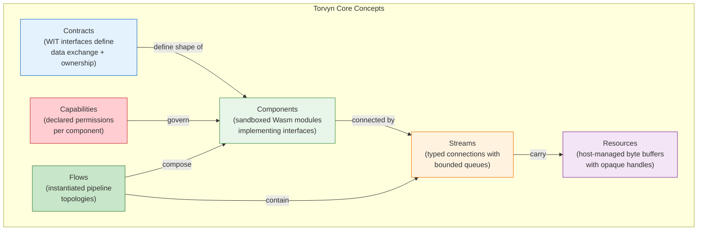

> **Source:** [ARCHITECTURE.md](ARCHITECTURE.md), "What Torvyn Is" section.

---

## 1. Contracts and WIT

### 1.1 What WIT Is and Why Torvyn Uses It

WIT (WebAssembly Interface Types) is an interface description language for WebAssembly components. It defines typed interfaces, data structures, and resource types that components can import and export.

Torvyn uses WIT because it provides:

- **Typed interfaces.** Every function signature, record field, and resource method is statically typed. Compatibility is validated before any code runs.
- **Language neutrality.** WIT interfaces can be implemented in any language that compiles to WebAssembly Components (Rust, Go, Python, Zig, and more).
- **Explicit ownership semantics.** WIT's `own<T>` and `borrow<T>` handle types express whether a component owns or merely borrows a resource. This maps directly to Torvyn's ownership model.
- **Static validation.** Contracts can be checked at build time (`torvyn check`) and at composition time (`torvyn link`), catching errors long before runtime.

**Design principle:** *In Torvyn, the contract is the center of the product.* Whether a buffer is borrowed or owned, whether backpressure is signaled or ignored, whether metadata travels with the element or not --- these semantics are visible in the WIT interface, not hidden in runtime behavior.

> **Source:** [01_contracts_and_wit_design.md](../docs/design/01_contracts_and_wit_design.md), Section 1.

### 1.2 The `torvyn:streaming@0.1.0` Package

The core WIT package is `torvyn:streaming@0.1.0`. It is the minimum contract surface that every Torvyn component depends on. It contains:

| Interface | Purpose |
|-----------|---------|
| `types` | Core type definitions: `buffer`, `mutable-buffer`, `flow-context`, `element-meta`, `stream-element`, `output-element`, `process-result`, `process-error`, `backpressure-signal` |
| `processor` | Stateless 1:1 transform interface (`process` function) |
| `source` | Pull-based data producer interface (`pull` and `notify-backpressure` functions) |
| `sink` | Push-based data consumer interface (`push` and `complete` functions) |
| `lifecycle` | Component initialization and teardown (`init` and `teardown`) |
| `buffer-allocator` | Host-provided buffer allocation service (`allocate` and `clone-into-mutable`) |

Beyond the core package, Torvyn defines extension packages for specialized component patterns:

| Package | Purpose |
|---------|---------|
| `torvyn:filtering@0.1.0` | Filter (accept/reject) and router (multi-output dispatch) interfaces |
| `torvyn:aggregation@0.1.0` | Stateful windowed aggregation interface |
| `torvyn:capabilities@0.1.0` | Capability declaration types and host-provided service interfaces |

**Why separate packages?** The core package can be stabilized faster. Components that only need basic streaming don't pay the conceptual cost of learning aggregation or routing patterns. Extension packages evolve at their own pace without forcing core version bumps.

> **Source:** [01_contracts_and_wit_design.md](../docs/design/01_contracts_and_wit_design.md), Section 2.

### 1.3 Core Type Definitions

The following types form the vocabulary of every Torvyn pipeline:

#### `buffer` (resource)

A host-managed, immutable byte buffer. Components interact with buffers through opaque handles --- the actual memory lives in host space, not in any component's linear memory.

```
resource buffer {
    size: func() -> u64
    content-type: func() -> string
    read: func(offset: u64, len: u64) -> list<u8>
    read-all: func() -> list<u8>
}
```

**Why a resource, not `list<u8>`?** If buffers were value types, every cross-component transfer would copy the full payload into and out of each component's linear memory. With resource handles, the host can transfer ownership by moving a handle (an integer) rather than copying megabytes of data. Components that only need metadata (`size`, `content-type`) never trigger a payload copy.

#### `mutable-buffer` (resource)

A writable buffer obtained from the host via the `buffer-allocator` interface. The lifecycle is: allocate -> write -> freeze -> return as immutable `buffer`.

```
resource mutable-buffer {
    write: func(offset: u64, bytes: list<u8>) -> result<_, buffer-error>
    append: func(bytes: list<u8>) -> result<_, buffer-error>
    size: func() -> u64
    capacity: func() -> u64
    set-content-type: func(content-type: string)
    freeze: func() -> buffer
}
```

**Why a separate type?** Separating mutable and immutable buffers enforces a clear write-then-freeze lifecycle. A buffer is either being written (mutable, single owner) or being read (immutable, can be borrowed by multiple readers). This avoids the need for copy-on-write semantics or interior mutability tracking.

#### `flow-context` (resource)

Carries trace correlation, deadlines, and pipeline-scoped metadata. Created by the runtime and passed to components with each stream element.

```
resource flow-context {
    trace-id: func() -> string      // W3C trace ID (32 hex chars)
    span-id: func() -> string       // W3C span ID (16 hex chars)
    deadline-ns: func() -> u64      // Remaining deadline; 0 = no deadline
    flow-id: func() -> string       // Unique flow identifier
}
```

#### `stream-element` (record with borrows)

The fundamental unit of data flow. Contains borrowed handles to the payload buffer and flow context, plus metadata:

```
record stream-element {
    meta: element-meta              // Copied (small, fixed-size)
    payload: borrow<buffer>         // Borrowed: read during this call only
    context: borrow<flow-context>   // Borrowed: read during this call only
}
```

The borrow semantics ensure components cannot store buffer handles beyond the current function call. The host knows exactly when borrows begin and end.

#### `output-element` (record with ownership)

Produced by sources and processors. The payload buffer is **owned** (transferred to the runtime):

```
record output-element {
    meta: element-meta
    payload: buffer                 // Owned: transferred to runtime
}
```

#### `process-result` (variant)

Distinguishes between producing output and filtering/absorbing input:

```
variant process-result {
    emit(output-element)            // Produced a new element
    drop                            // Consumed input, no output
}
```

The `drop` variant is essential for filters and aggregators that legitimately consume inputs without producing outputs.

#### `process-error` (variant)

A structured error model with five categories, each triggering different runtime behavior:

| Variant | Runtime Response |
|---------|-----------------|
| `invalid-input(string)` | May retry or skip, depending on error policy |
| `unavailable(string)` | May trigger circuit-breaker logic |
| `internal(string)` | Logged, may retry or skip |
| `deadline-exceeded` | Feeds into timeout accounting |
| `fatal(string)` | Terminal --- component is torn down, no more elements sent |

#### `backpressure-signal` (enum)

```
enum backpressure-signal {
    ready    // Consumer accepts more data
    pause    // Consumer requests upstream to pause
}
```

Designed as an enum (not a boolean) to allow future extension (e.g., `rate-limit-to(n)`, `pause-for-duration(ns)`).

> **Source:** [01_contracts_and_wit_design.md](../docs/design/01_contracts_and_wit_design.md), Section 3; [crates/torvyn-types/src/enums.rs](../crates/torvyn-types/src/enums.rs).

### 1.4 Core Interface Definitions

#### Processor Interface

```
interface processor {
    process: func(input: stream-element) -> result<process-result, process-error>
}
```

- **Input:** All handles are *borrowed*. The component must not store them.
- **Output:** The buffer in `output-element` is *owned* by the runtime after the call.
- **Concurrency:** No reentrancy. Calls are ordered by sequence number.
- **Backpressure:** The runtime controls call frequency. If downstream is slow, `process()` simply isn't called.

#### Source Interface

```
interface source {
    pull: func() -> result<option<output-element>, process-error>
    notify-backpressure: func(signal: backpressure-signal)
}
```

- `pull()` returning `ok(none)` signals stream completion (following the iterator pattern).
- Sources receive backpressure through a separate callback because they generate data actively.

#### Sink Interface

```
interface sink {
    push: func(element: stream-element) -> result<backpressure-signal, process-error>
    complete: func() -> result<_, process-error>
}
```

- Sinks return backpressure *inline* with each `push()` because they know their buffer state at acceptance time.
- `complete()` signals end-of-stream, allowing the sink to flush buffered data.

#### Lifecycle Interface

```
interface lifecycle {
    init: func(config: string) -> result<_, process-error>
    teardown: func()
}
```

Called once before processing begins and once during shutdown. Configuration format is component-defined (JSON recommended for interoperability).

> **Source:** [01_contracts_and_wit_design.md](../docs/design/01_contracts_and_wit_design.md), Sections 4.1--4.8.

### 1.5 Component Worlds

A WIT *world* defines the complete set of imports and exports for a component --- its "shape":

| World | Exports | Imports |
|-------|---------|---------|
| `data-source` | `source`, `lifecycle` | `types`, `buffer-allocator` |
| `transform` | `processor` | `types`, `buffer-allocator` |
| `managed-transform` | `processor`, `lifecycle` | `types`, `buffer-allocator` |
| `data-sink` | `sink`, `lifecycle` | `types` |
| `content-filter` | `filter`, `lifecycle` | `types` |
| `content-router` | `router`, `lifecycle` | `types` |
| `stream-aggregator` | `aggregator`, `lifecycle` | `types`, `buffer-allocator` |

Developers can also define **custom worlds** that combine Torvyn interfaces with WASI imports:

```wit
world my-enricher {
    import torvyn:streaming/types;
    import torvyn:streaming/buffer-allocator;
    import wasi:clocks/wall-clock;
    import wasi:random/random;
    export torvyn:streaming/processor;
    export torvyn:streaming/lifecycle;
}
```

**Pipeline topology is not expressed in WIT.** WIT defines what individual components look like; the topology (how they connect, queue depths, backpressure policies, capability grants) is expressed in `Torvyn.toml`.

> **Source:** [01_contracts_and_wit_design.md](../docs/design/01_contracts_and_wit_design.md), Section 8.

### 1.6 Contract Versioning and Compatibility

WIT packages follow semantic versioning:

- **Breaking changes** (major bump): Removing types/functions, changing signatures, changing ownership semantics (`borrow` to `own`), removing record fields or variant cases.
- **Compatible changes** (minor bump): Adding new functions to existing interfaces, adding new interfaces, adding new variant cases.
- **Patch changes**: Documentation updates, tooling fixes.

The `torvyn link` command performs structural compatibility checking: even within compatible version ranges, it verifies that the specific interfaces used by a consumer are present in the provider.

> **Source:** [01_contracts_and_wit_design.md](../docs/design/01_contracts_and_wit_design.md), Section 6.

### 1.7 The Validation Pipeline

Validation occurs at three stages, each catching progressively more complex errors:

```mermaid
graph LR
    subgraph PARSE ["Stage 1: Parse  (torvyn check)"]
        P1["WIT syntax validation"]
        P2["Manifest validation"]
        P3["Capability consistency"]
    end

    subgraph SEMANTIC ["Stage 2: Semantic  (torvyn check)"]
        S1["Resource lifecycle\ncorrectness"]
        S2["Version constraint\nvalidation"]
        S3["Interface\ncompleteness"]
    end

    subgraph COMPOSE ["Stage 3: Composition  (torvyn link)"]
        C1["Interface\ncompatibility"]
        C2["Capability\nsatisfaction"]
        C3["Topology\nvalidation (DAG)"]
    end

    PARSE --> SEMANTIC --> COMPOSE

    style PARSE fill:#e8f5e9,stroke:#388e3c
    style SEMANTIC fill:#e3f2fd,stroke:#1565c0
    style COMPOSE fill:#fff3e0,stroke:#ef6c00
```

Every validation error follows the `rustc`-style format with an error code, source location, explanation, and actionable help text.

> **Source:** [01_contracts_and_wit_design.md](../docs/design/01_contracts_and_wit_design.md), Section 7.

---

## 2. Component Roles

### 2.1 Source

A **source** is a pull-based data producer. It owns its output buffers and produces `output-element` values on demand. The runtime calls `pull()` when downstream has capacity. When the source has no more data, it returns `ok(none)` to signal stream completion.

**Examples:** File reader, Kafka consumer, sensor poller, synthetic event generator.

### 2.2 Processor

A **processor** performs a stateless 1:1 transformation. It borrows the input buffer, reads what it needs, allocates a new output buffer, writes the transformed data, and returns it. The runtime guarantees sequential, ordered invocation.

**Examples:** JSON transformer, compression, encryption, format conversion.

### 2.3 Sink

A **sink** is a push-based terminal consumer. It borrows the input buffer, reads the data during the `push()` call, and returns a backpressure signal. If the sink needs to buffer data internally (e.g., for batched writes), it must copy the payload into its own memory during the call.

**Examples:** Database writer, file output, HTTP poster, metrics emitter.

### 2.4 Filter

A **filter** makes accept/reject decisions without allocating output buffers. It returns `true` (pass) or `false` (drop). This makes filters extremely cheap --- no buffer allocation, no data copying unless the filter inspects payload bytes.

**Examples:** Content-type filter, rate limiter, deduplicator, access control gate.

### 2.5 Router

A **router** dispatches elements to multiple named output ports. It returns a list of port names that should receive the element. An empty list means the element is dropped. Multiple names mean fan-out. The runtime handles providing borrows of the same buffer to multiple downstream components.

**Examples:** Topic router, content-based router, A/B splitter.

### 2.6 Aggregator

An **aggregator** maintains internal state across invocations. It ingests elements via `ingest()` and may emit aggregated results immediately or defer emission to the `flush()` call when the stream completes.

**Examples:** Windowed counter, running average, batch accumulator, session joiner.

### 2.7 Component Lifecycle

Every component follows this lifecycle:

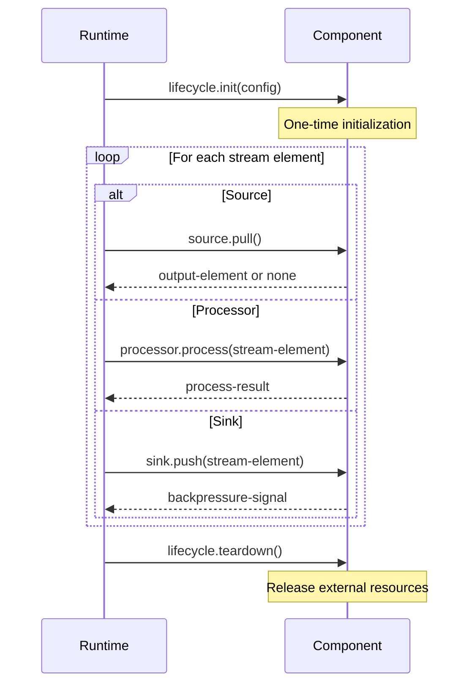

- `init(config)` is called once before any stream processing. Failure prevents the component from participating in the pipeline.
- `teardown()` is best-effort --- the runtime may skip it during forceful shutdown or timeout.

> **Source:** [01_contracts_and_wit_design.md](../docs/design/01_contracts_and_wit_design.md), Sections 4.2--4.8; [crates/torvyn-types/src/enums.rs](../crates/torvyn-types/src/enums.rs), `ComponentRole` enum.

---

## 3. Ownership and Buffers

### 3.1 Why Host-Managed Buffers

Every WebAssembly component has its own linear memory. Components cannot directly access each other's memory or the host's memory. This is a fundamental security property of the Wasm sandbox.

Torvyn centralizes all buffer management in the host runtime:

- **Components never allocate host memory.** They request buffers through the `buffer-allocator` import and receive opaque handles.
- **The host tracks every buffer's owner.** Ownership can be transferred but never duplicated.
- **Every copy is instrumented.** The resource manager records every data movement for observability and benchmarking.
- **Buffers are pooled for reuse.** Returned buffers go back to tiered pools, avoiding allocation overhead on the hot path.

**The trade-off is explicit:** Cross-component data transfer requires copying through the canonical ABI. Torvyn accepts this cost and makes it measurable rather than promising zero-copy where it is not achievable.

> **Source:** [03_resource_manager_and_ownership.md](../docs/design/03_resource_manager_and_ownership.md), Section 1; [ARCHITECTURE.md](ARCHITECTURE.md), Design Decision 3.

### 3.2 Buffer Types: Immutable and Mutable

The type system enforces a strict write-then-freeze lifecycle:


1. Component requests a `mutable-buffer` from the host via `buffer-allocator.allocate(capacity-hint)`.
2. Component writes data using `write()` or `append()`.
3. Component calls `freeze()` to convert it into an immutable `buffer`.
4. The immutable buffer is returned as part of the processing result.

This prevents concurrent mutation without runtime interior mutability tracking.

> **Source:** [01_contracts_and_wit_design.md](../docs/design/01_contracts_and_wit_design.md), Section 3.2.2.

### 3.3 Resource State Machine

Every buffer in the system follows a strict state machine with validated transitions:

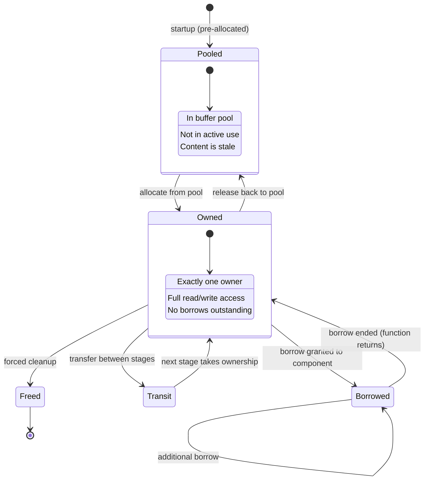

**Illegal transitions produce typed errors.** For example, attempting to transfer a buffer while borrows are outstanding returns `ResourceError::BorrowsOutstanding`. Every violation is logged as a diagnostic event.

The `FlowState` type in `torvyn-types` defines the following legal transitions for flows:

| From | To | Trigger |
|------|----|---------|
| Created | Validated | Contracts and capabilities pass validation |
| Created | Failed | Validation error |
| Validated | Instantiated | Components instantiated, streams connected |
| Instantiated | Running | Start command |
| Running | Draining | Source complete, cancel, error, or timeout |
| Draining | Completed | All queues drained (graceful) |
| Draining | Cancelled | Cancelled by operator |
| Draining | Failed | Drain timeout or unrecoverable error |

> **Source:** [crates/torvyn-types/src/state.rs](../crates/torvyn-types/src/state.rs); [03_resource_manager_and_ownership.md](../docs/design/03_resource_manager_and_ownership.md), Section 3.

### 3.4 Buffer Pools and Tiers

Buffers are organized into tiered pools to minimize allocation overhead:

| Tier | Payload Capacity | Intended Use |
|------|-----------------|--------------|
| **Small** | up to 4 KB | Metadata, small messages, control signals |
| **Medium** | up to 64 KB | Typical stream elements, JSON documents |
| **Large** | up to 1 MB | Binary payloads, image chunks, audio frames |
| **Huge** | above 1 MB | Large transfers, batch payloads |

- Small, Medium, and Large pools are **pre-allocated** at host startup to avoid allocation jitter.
- The Huge pool allocates **on-demand** and caches returned buffers.
- The **global maximum** buffer size is **16 MiB** (`MAX_BUFFER_SIZE_BYTES` constant). Larger payloads must be chunked.

Each pool tier uses a **lock-free Treiber stack** for O(1) push and pop on the hot path, with the generational buffer slot providing natural ABA-problem mitigation.

> **Source:** [03_resource_manager_and_ownership.md](../docs/design/03_resource_manager_and_ownership.md), Section 5; [crates/torvyn-types/src/constants.rs](../crates/torvyn-types/src/constants.rs).

### 3.5 The Four Measured Copies

In a Source -> Processor -> Sink pipeline, every element undergoes exactly **four measured payload copies**:

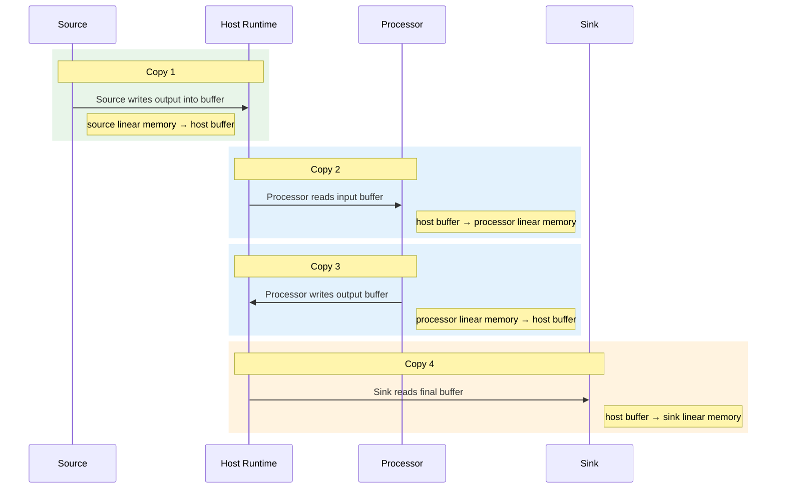

| Copy | Direction | When |
|------|-----------|------|
| **Copy 1** | Source linear memory -> Host buffer | Source calls `mutable-buffer.append()` or `write()` |
| **Copy 2** | Host buffer -> Processor linear memory | Processor calls `buffer.read()` or `read-all()` |
| **Copy 3** | Processor linear memory -> Host buffer | Processor calls `mutable-buffer.append()` on new output buffer |
| **Copy 4** | Host buffer -> Sink linear memory | Sink calls `buffer.read()` or `read-all()` |

**Filters skip copies 3 and 4** because they make accept/reject decisions without allocating output buffers. A pipeline with only metadata-based routing may achieve **zero payload copies** --- components only inspect `element-meta` and `content-type` without ever calling `buffer.read()`.

> **Source:** [ARCHITECTURE.md](ARCHITECTURE.md), "Stream Element Processing --- Hot Path"; [03_resource_manager_and_ownership.md](../docs/design/03_resource_manager_and_ownership.md), Section 6.

### 3.6 Copy Accounting

Every copy operation produces a `TransferRecord`:

```rust
pub struct TransferRecord {
    pub source: ComponentId,
    pub destination: ComponentId,
    pub byte_count: u64,
    pub copy_reason: CopyReason,
    pub timestamp_ns: u64,
}
```

The `CopyReason` enum distinguishes four copy scenarios:

| Reason | When |
|--------|------|
| `HostToComponent` | Data enters component linear memory |
| `ComponentToHost` | Data extracted from component to host buffer |
| `CrossComponent` | Transfer between components via host intermediary |
| `PoolReturn` | Buffer returned to pool |

Per-flow aggregated statistics (`FlowCopyStatsSnapshot`) track total bytes, total operations, and breakdown by reason. The `torvyn bench` command reports these as copy amplification metrics.

> **Source:** [crates/torvyn-types/src/enums.rs](../crates/torvyn-types/src/enums.rs), `CopyReason`; [crates/torvyn-types/src/records.rs](../crates/torvyn-types/src/records.rs), `TransferRecord`.

### 3.7 Generational Handles and ABA Safety

Buffer handles use a **generational index** scheme to prevent ABA problems (where a handle refers to a slot that has been freed and reallocated to a different buffer):

```rust
pub struct ResourceId {
    index: u32,       // Slot in the resource table
    generation: u32,  // Incremented on every reuse
}
```

A handle is valid only if `table[handle.index].generation == handle.generation`. This catches stale handles immediately at the point of use with O(1) lookup cost.

`BufferHandle` is a typed wrapper around `ResourceId`, providing type safety so buffer handles cannot be confused with other resource types.

> **Source:** [crates/torvyn-types/src/identity.rs](../crates/torvyn-types/src/identity.rs), `ResourceId` and `BufferHandle`.

### 3.8 Memory Budget Enforcement

Each component is assigned a memory budget limiting how much host-managed buffer memory it can hold simultaneously. This is separate from Wasmtime's linear memory limiter (which limits the component's own heap):

| Limiter | What it limits | Where enforced |
|---------|---------------|----------------|
| Wasmtime `StoreLimiter` | Component's own linear memory (heap) | Inside Wasmtime, on `memory.grow` |
| Torvyn `MemoryBudget` | Host-managed buffers owned/leased by component | Resource manager, on allocate/transfer |

Both limits are necessary. A component could stay within its linear memory limit while holding many large host buffers, or vice versa.

Budget checks occur on **allocation** and **ownership transfer**. They are **not** performed on borrow operations (borrows are read-only and scoped to function calls).

> **Source:** [03_resource_manager_and_ownership.md](../docs/design/03_resource_manager_and_ownership.md), Section 11.

---

## 4. Streams and Flows

### 4.1 What a Flow Is

A **flow** is an instantiated pipeline topology executing as a unit. It consists of:

- A set of component instances, each fulfilling a role (source, processor, sink, etc.)
- Typed stream connections between them (edges in a directed graph)
- Per-stream configuration (queue depth, backpressure policy)
- A shared lifecycle (the entire flow starts, runs, drains, and completes together)

A single Torvyn host can run **multiple concurrent flows**, each as an independent Tokio task.

### 4.2 Flow Topology and DAGs

A flow's topology is a **directed acyclic graph (DAG)** where:

- **Nodes** are component instances with their interface role and configuration.
- **Edges** are unidirectional stream connections from output ports to input ports.
- Sources have no incoming connections.
- Sinks have no outgoing connections.
- Cycles are not allowed (validated at link time).

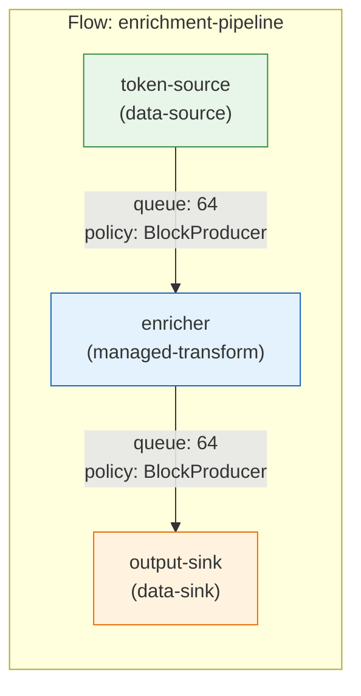

### 4.3 Stream Elements

A stream is the runtime representation of a connection between two components. Each stream maintains:

- A **bounded queue** (ring buffer) holding pending elements
- A **demand counter** tracking downstream capacity
- A **backpressure state** (Normal or Active)
- **Cumulative metrics** (element count, backpressure events, peak queue depth)

Elements in the queue are lightweight references (`StreamElementRef`) containing a `BufferHandle` and `ElementMeta` --- the actual payload stays in the host buffer pool.

### 4.4 Element Metadata

Every stream element carries metadata:

```rust
pub struct ElementMeta {
    pub sequence: u64,         // Monotonic within flow (0-based)
    pub timestamp_ns: u64,     // Wall-clock ns since Unix epoch
    pub content_type: String,  // e.g., "application/json"
}
```

- The **sequence number** is assigned by the runtime and guarantees ordering within a flow.
- The **timestamp** is set when the element enters the pipeline.
- The **content-type** mirrors the buffer's content-type for dispatch without reading the payload.

> **Source:** [crates/torvyn-types/src/records.rs](../crates/torvyn-types/src/records.rs), `ElementMeta`.

### 4.5 Flow Lifecycle State Machine

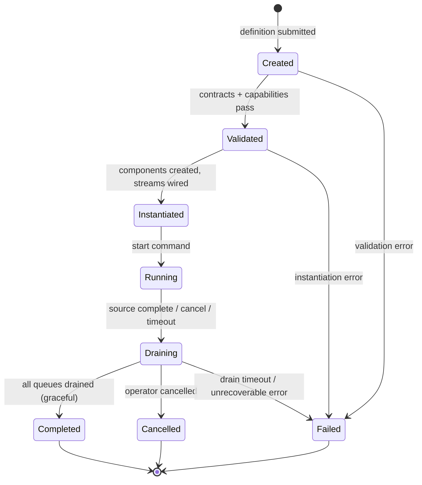

Terminal states (`Completed`, `Cancelled`, `Failed`) carry `FlowCompletionStats` with total duration, elements processed, backpressure events, and per-stream/per-component metrics.

> **Source:** [crates/torvyn-types/src/state.rs](../crates/torvyn-types/src/state.rs), `FlowState`; [04_reactor_and_scheduling.md](../docs/design/04_reactor_and_scheduling.md), Section 10.

### 4.6 Defining Flows in Configuration

Flows are defined in `Torvyn.toml` under `[flow.*]` sections:

```toml
[flow]
name = "enrichment-pipeline"

[[flow.nodes]]
name = "token-source"
role = "source"
artifact = "./target/token_source.wasm"

[[flow.nodes]]
name = "enricher"
role = "processor"
artifact = "./target/enricher.wasm"
config = '{"api": "https://api.example.com"}'

[[flow.nodes]]
name = "output-sink"
role = "sink"
artifact = "./target/output_sink.wasm"

[[flow.edges]]
from = "token-source"
to = "enricher"

[[flow.edges]]
from = "enricher"
to = "output-sink"
```

Per-edge overrides for queue depth and backpressure policy are optional. Defaults come from the runtime configuration.

> **Source:** [crates/torvyn-config/src/lib.rs](../crates/torvyn-config/src/lib.rs), `FlowDef`, `NodeDef`, `EdgeDef`.

---

## 5. Backpressure

### 5.1 Why Backpressure Is a Contract-Level Concern

Backpressure is not bolted onto Torvyn after the fact --- it is built into the stream semantics from the contract layer up:

- The `backpressure-signal` type is defined in WIT.
- Sinks return backpressure signals inline with `push()`.
- Sources receive backpressure through `notify-backpressure()`.
- Queue depths and watermarks are configured per-stream.

This means backpressure behavior is visible, configurable, and observable. A slow consumer cannot cause unbounded queue growth.

### 5.2 Bounded Queues

Every stream between two components has a **bounded queue** (pre-allocated ring buffer):

- **Default depth:** 64 elements (`DEFAULT_QUEUE_DEPTH` constant).
- **Configurable** per-stream or per-flow.
- Elements in the queue are lightweight references, not full buffer copies.

Total pipeline memory is bounded and deterministic: `total_memory <= sum(queue_capacity_i * max_element_size_i)` for all streams `i`.

> **Source:** [crates/torvyn-types/src/constants.rs](../crates/torvyn-types/src/constants.rs), `DEFAULT_QUEUE_DEPTH`.

### 5.3 Watermark Hysteresis

Backpressure uses **high/low watermark hysteresis** to prevent oscillation:

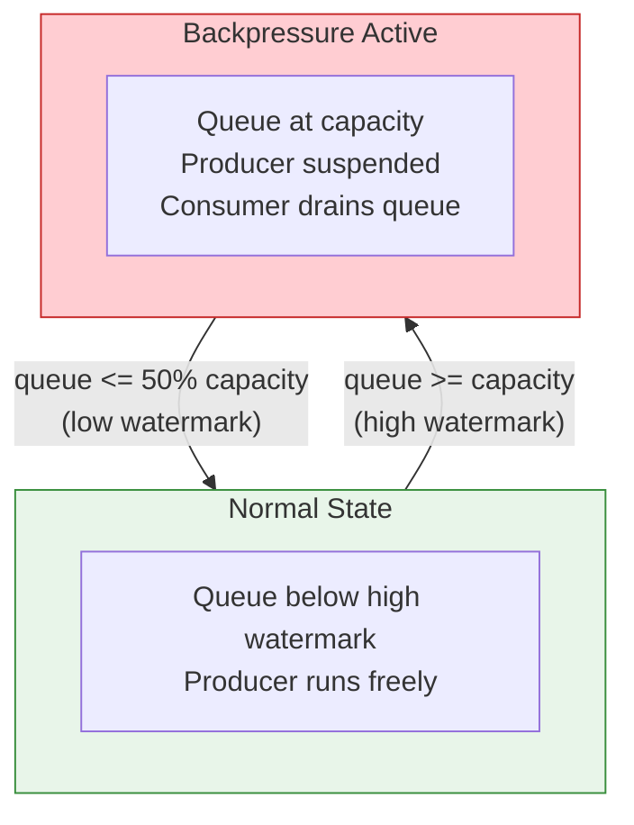

- **High watermark (100%):** Queue reaches capacity -> backpressure activates, producer is paused.
- **Low watermark (50%, configurable):** Queue drops below the low watermark ratio -> backpressure deactivates, producer resumes.

Without hysteresis, the system would oscillate between backpressured and not-backpressured on every element when the consumer is only slightly slower than the producer.

> **Source:** [crates/torvyn-types/src/constants.rs](../crates/torvyn-types/src/constants.rs), `DEFAULT_LOW_WATERMARK_RATIO`; [04_reactor_and_scheduling.md](../docs/design/04_reactor_and_scheduling.md), Section 5.

### 5.4 Backpressure Policies

Each stream is configured with a policy that dictates what happens when the queue is full:

| Policy | Behavior | Data Loss? | Default? |
|--------|----------|------------|----------|
| `BlockProducer` | Suspend the producer until space is available | No | Yes |
| `DropOldest` | Discard the oldest element in the queue | Yes | No |
| `DropNewest` | Discard the new element being produced | Yes | No |
| `Error` | Return an error to the producer | No | No |

`BlockProducer` is the default because it is the only policy that guarantees no data loss and no unbounded queue growth.

> **Source:** [crates/torvyn-types/src/enums.rs](../crates/torvyn-types/src/enums.rs), `BackpressurePolicy`.

### 5.5 Demand-Driven Scheduling

The reactor uses a **credit-based demand model** inspired by the Reactive Streams specification and TCP's sliding window:

1. Each stream maintains a **demand counter**: the number of elements the consumer is willing to accept.
2. When a consumer processes an element, it replenishes one demand credit.
3. When a producer enqueues an element, it consumes one demand credit.
4. A producer with zero demand credits **must not produce** --- this is the backpressure trigger.

The scheduler is **consumer-first**: it processes sinks before pulling from sources, which drains queues faster, reduces memory pressure, and prevents unnecessary buffering.

> **Source:** [04_reactor_and_scheduling.md](../docs/design/04_reactor_and_scheduling.md), Sections 3 and 4.

### 5.6 Multi-Stage Backpressure Propagation

In a multi-stage pipeline (A -> B -> C -> D), backpressure propagates naturally through the demand model:

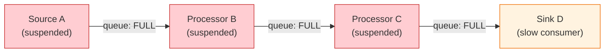

1. D (sink) is slow. Queue C->D fills up.
2. C cannot produce because its output queue is full. C's execution is suspended.
3. Queue B->C fills up. B is suspended.
4. Queue A->B fills up. A (source) is suspended.

The entire pipeline is backpressured with bounded, deterministic memory usage at every stage.

---

## 6. Observability

### 6.1 Three Levels with Overhead Budgets

Observability in Torvyn has three levels, each with an explicit overhead budget. Switching between levels is atomic and requires no restart:

| Level | Overhead Budget | What Is Collected |
|-------|----------------|-------------------|
| **Off** | 0% | Nothing. For pure benchmarks. |
| **Production** (default) | < 500 ns per element | Pre-allocated counters + histograms. No hot-path allocation. Sampled trace context. |
| **Diagnostic** | < 2 us per element | All of Production + per-element spans, per-copy accounting, backpressure events, queue depth snapshots. Full W3C `TraceId` + `SpanId`. |

The overhead budgets are enforced by design: Production-level metrics use pre-allocated structures and never allocate on the element processing path. The `EventSink` trait is the hot-path interface, with all methods designed to be non-blocking and allocation-free.

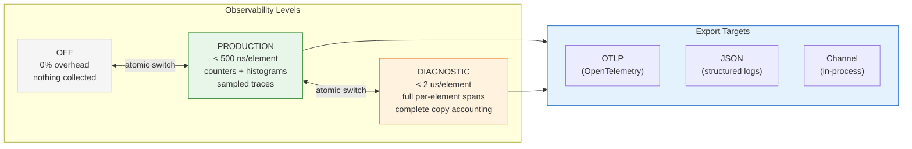

> **Source:** [crates/torvyn-types/src/enums.rs](../crates/torvyn-types/src/enums.rs), `ObservabilityLevel`; [crates/torvyn-types/src/constants.rs](../crates/torvyn-types/src/constants.rs), `MAX_OBSERVABILITY_PRODUCTION_NS`, `MAX_OBSERVABILITY_DIAGNOSTIC_NS`.

### 6.2 Metrics

Metrics are pre-allocated per flow to avoid hot-path allocation:

| Type | Examples |
|------|----------|
| **Counters** | `elements_processed`, `bytes_transferred`, `errors` |
| **Histograms** | Latency (buckets: 1us, 10us, 100us, 1ms, 10ms), payload size (buckets: 64B, 1KB, 64KB, 1MB) |
| **Gauges** | `queue_depth`, `active_flows`, `buffer_utilization` |

The `EventSink` trait is the hot-path recording interface:

```rust
pub trait EventSink: Send + Sync + 'static {
    fn record_invocation(&self, flow_id, component_id, start_ns, end_ns, status);
    fn record_element_transfer(&self, flow_id, stream_id, element_sequence, queue_depth);
    fn record_backpressure(&self, flow_id, stream_id, activated, queue_depth, timestamp_ns);
    fn record_copy(&self, flow_id, resource_id, from, to, bytes, reason);
    fn level(&self) -> ObservabilityLevel;
}
```

A `NoopEventSink` implementation (all methods empty, `level()` returns `Off`) enables zero-cost benchmarking.

> **Source:** [crates/torvyn-types/src/traits.rs](../crates/torvyn-types/src/traits.rs), `EventSink` and `NoopEventSink`.

### 6.3 Tracing

Torvyn uses **W3C Trace Context** for distributed trace correlation:

- `TraceId`: 128-bit identifier (16 bytes), displayed as 32 hex characters.
- `SpanId`: 64-bit identifier (8 bytes), displayed as 16 hex characters.

Trace context is propagated via `flow-context` resources passed to every component. A `SpanRingBuffer` stores spans in a fixed-size ring for **retroactive export** --- spans can be exported after the fact for post-hoc debugging without requiring full diagnostic-level overhead during normal operation.

Sampling is configurable (per-flow or global) with error-promotion and latency-based promotion strategies.

> **Source:** [crates/torvyn-types/src/identity.rs](../crates/torvyn-types/src/identity.rs), `TraceId` and `SpanId`; [crates/torvyn-observability/src/lib.rs](../crates/torvyn-observability/src/lib.rs).

### 6.4 Export Targets

| Target | Protocol | Use Case |
|--------|----------|----------|
| **OTLP** | OpenTelemetry Protocol (gRPC/HTTP) | Production monitoring with Jaeger, Grafana, Datadog |
| **JSON** | Structured log output | Development, CI/CD, log aggregators |
| **Channel** | In-process consumer | Testing, embedding, custom analysis |

### 6.5 Benchmarking as a Product Feature

Torvyn treats benchmarks as product features. The `torvyn bench` command reports:

- **Throughput:** Elements per second, bytes per second
- **Latency percentiles:** p50, p90, p95, p99
- **Per-component latency:** Breakdown by pipeline stage
- **Copy accounting:** Total copies, copy amplification ratio, bytes per copy
- **Queue metrics:** Peak depth, backpressure events, backpressure duration
- **Resource metrics:** Pool utilization, fallback allocation rate

All performance claims are backed by reproducible methodology published in the repository's `benches/` directory and tracked in CI.

| Metric | Design Target |
|--------|--------------|
| Per-element runtime overhead | < 5 us |
| Observability overhead (Production) | < 500 ns per element |
| Copy count per element (Source->Processor->Sink) | Exactly 4 |
| Pipeline startup (cached components) | Sub-second |

> **Source:** [README.md](../README.md), "Performance" section; [crates/torvyn-types/src/constants.rs](../crates/torvyn-types/src/constants.rs), `MAX_HOT_PATH_NS`.

---

## 7. Security and Capabilities

### 7.1 Deny-All-by-Default

A component with no capability grants can do nothing beyond pure computation on data provided through its stream interface. Every permission --- filesystem access, network connections, clock reads, buffer allocation --- must be explicitly granted.

**Design principles:**

- **Deny-all by default.** Zero permissions is the starting state.
- **Fail closed.** Ambiguous states default to denial.
- **Static over dynamic.** Catch capability violations at link time (`torvyn link`) rather than at runtime.
- **Least privilege.** Tooling warns when requests appear excessive.
- **Audit everything.** Every exercise, every denial, every grant is recorded.

> **Source:** [06_security_and_capability_model.md](../docs/design/06_security_and_capability_model.md), Section 1.5.

### 7.2 Capability Taxonomy

Torvyn defines **20 typed capabilities** organized into two categories:

#### WASI-Aligned Capabilities

| Capability | Description |
|-----------|-------------|
| `filesystem-read` + `PathScope` | Read files from a directory subtree |
| `filesystem-write` + `PathScope` | Write files to a directory subtree |
| `tcp-connect` + `NetScope` | Initiate outbound TCP connections |
| `tcp-listen` + `NetScope` | Listen for inbound TCP connections |
| `udp-bind` + `NetScope` | Send/receive UDP datagrams |
| `http-client` + `NetScope` | Make outbound HTTP requests |
| `wall-clock` | Read system wall clock |
| `monotonic-clock` | Read monotonic clock |
| `random` | Cryptographic random bytes (CSPRNG) |
| `insecure-random` | Non-cryptographic random bytes |
| `environment` | Read environment variables |
| `stdout` | Write to standard output |
| `stderr` | Write to standard error |

#### Torvyn-Specific Capabilities

| Capability | Description |
|-----------|-------------|
| `resource-pool` + `PoolScope` | Allocate buffers (max allocation budget) |
| `stream-ops` | Read/write stream elements |
| `backpressure-control` | Send backpressure signals |
| `flow-metadata` | Read flow configuration and state |
| `runtime-inspection` | Query runtime diagnostic information |
| `custom-metrics` | Emit user-defined metrics |

> **Source:** [06_security_and_capability_model.md](../docs/design/06_security_and_capability_model.md), Section 2.1; [crates/torvyn-security/src/lib.rs](../crates/torvyn-security/src/lib.rs), `Capability` enum.

### 7.3 Capability Scoping

Many capabilities are scoped to limit their breadth:

| Scope Type | Example | Semantics |
|-----------|---------|-----------|
| `PathScope` | `/data/input/**` | Access to directory subtree |
| `NetScope` | `api.example.com:443` | Host pattern + port range |
| `PoolScope` | `max 64MB` | Maximum allocation budget |

**Scoping is one-directional:** A broader grant satisfies a narrower request. A grant of `filesystem-read { path: "/data" }` satisfies a request for `filesystem-read { path: "/data/input" }`. A narrow grant never satisfies a broad request.

> **Source:** [06_security_and_capability_model.md](../docs/design/06_security_and_capability_model.md), Section 2.3.

### 7.4 Declaration, Granting, and Resolution

Capabilities flow through a three-step process:

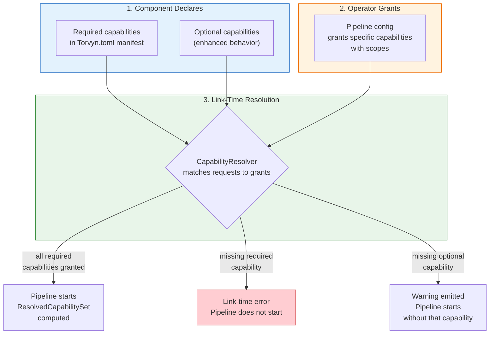

- **Missing required capability:** Link-time error. Pipeline does not start.
- **Missing optional capability:** Warning. Pipeline starts; component can query availability at runtime.
- **Unused grant:** Warning. Catches operator misconfiguration.

> **Source:** [06_security_and_capability_model.md](../docs/design/06_security_and_capability_model.md), Section 3.

### 7.5 Component Sandboxing

Torvyn provides three dimensions of component isolation:

| Dimension | Mechanism | Enforced By | Overhead |
|-----------|-----------|-------------|----------|
| **Memory** | Wasm linear memory boundaries | Wasmtime | ~0 (hardware bounds checking) |
| **CPU** | Fuel-based budgeting + timeouts | Wasmtime fuel + Tokio timeout | ~2-5% of Wasm execution |
| **Resources** | Per-component memory budgets | Torvyn Resource Manager | Negligible (counter check) |
| **Capabilities** | Deny-all + explicit grants | WasiCtx + CapabilityGuard | Zero for WASI; ~0 for Torvyn hot-path |

**CPU budgeting** uses Wasmtime's fuel mechanism: each component is assigned fuel units that decrement as Wasm instructions execute. When fuel is exhausted, execution is suspended. A wall-clock timeout acts as a backstop.

**Hot-path capability checks** are pre-computed to a single boolean read from an immutable `HotPathCapabilities` bitmask --- effectively zero overhead.

> **Source:** [06_security_and_capability_model.md](../docs/design/06_security_and_capability_model.md), Section 5; [crates/torvyn-security/src/lib.rs](../crates/torvyn-security/src/lib.rs), `HotPathCapabilities`.

### 7.6 Audit Logging

Every security-relevant action is recorded as a structured `AuditEvent`:

| Category | Events |
|----------|--------|
| **Lifecycle** | `ComponentLoaded`, `ComponentInstantiated`, `ComponentTerminated`, `FlowStarted`, `FlowTerminated` |
| **Capability** | `CapabilityGrantResolved`, `CapabilityDeniedAtLink`, `CapabilityExercised`, `CapabilityDeniedAtRuntime` |
| **Security** | `SandboxViolation`, `SignatureVerificationFailed`, `UnsignedComponentLoaded` |

Events are emitted to an `AuditSink` trait with built-in implementations for stdout (JSON) and file (rotating log). Hot-path capability exercises are recorded as **aggregated counters** rather than individual events to stay within overhead budgets. Cold-path exercises and all denials are recorded individually.

> **Source:** [06_security_and_capability_model.md](../docs/design/06_security_and_capability_model.md), Section 8; [crates/torvyn-security/src/lib.rs](../crates/torvyn-security/src/lib.rs), `AuditSink`, `AuditEvent`.

---

## 8. Packaging and Distribution

### 8.1 OCI-Compatible Artifacts

Components are packaged as **OCI-compatible artifacts** using `torvyn pack`:

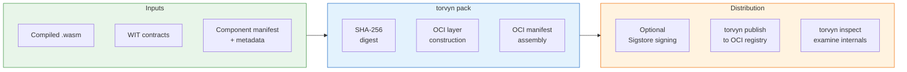

Each artifact contains the compiled Wasm binary, WIT contracts, component manifest, and provenance metadata. Media types use the `application/vnd.torvyn.*` namespace.

### 8.2 Content-Addressed Storage

Artifacts are content-addressed using **SHA-256 digests**. The `ComponentTypeId` type is a 32-byte SHA-256 hash of the compiled component binary, used for:

- **Compilation caching:** Wasmtime compilation results are cached by `ComponentTypeId`. Subsequent starts with the same component skip recompilation.
- **Artifact integrity:** Pulled artifacts are verified against their published digest.
- **Local caching:** Downloaded artifacts are stored in a content-addressed local cache.

> **Source:** [crates/torvyn-types/src/identity.rs](../crates/torvyn-types/src/identity.rs), `ComponentTypeId`; [crates/torvyn-packaging/src/lib.rs](../crates/torvyn-packaging/src/lib.rs).

### 8.3 Signed Provenance

Torvyn supports artifact signing via **Sigstore** (keyless OIDC or key-based) with GPG as a fallback. Provenance records following the **SLSA** framework capture build environment, source references, timestamps, and tool versions.

The host can enforce signature verification policies:

| Policy | Behavior |
|--------|----------|
| `reject` (default) | Unsigned/unverified components are rejected |
| `warn` | Pipeline starts with a prominent warning |
| `allow` | No verification (not recommended for production) |

> **Source:** [06_security_and_capability_model.md](../docs/design/06_security_and_capability_model.md), Section 7.

---

## 9. Runtime Architecture

### 9.1 Crate Architecture and Build Tiers

Torvyn is a Cargo workspace of **13 crates** arranged in **six build tiers** with no circular dependencies:

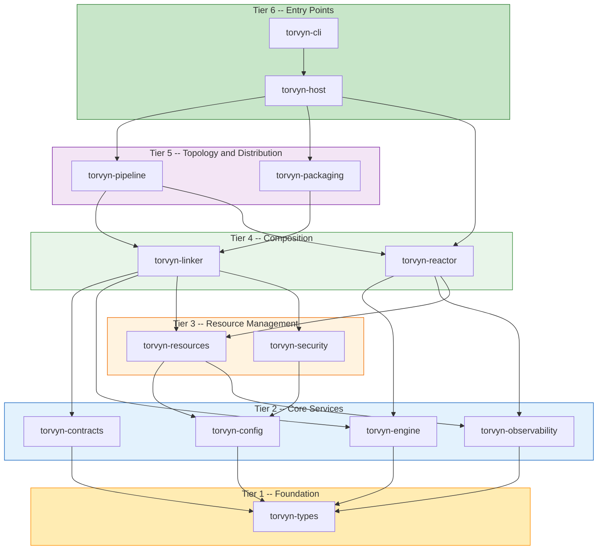

| Tier | Crates | Purpose |
|------|--------|---------|
| 1 | `torvyn-types` | Foundation types, zero internal dependencies, `#![forbid(unsafe_code)]` |
| 2 | `torvyn-config`, `torvyn-contracts`, `torvyn-engine`, `torvyn-observability` | Core services (build in parallel) |
| 3 | `torvyn-resources`, `torvyn-security` | Resource management and capabilities |
| 4 | `torvyn-linker`, `torvyn-reactor` | Component linking and scheduling |
| 5 | `torvyn-pipeline`, `torvyn-packaging` | Topology and distribution |
| 6 | `torvyn-host`, `torvyn-cli` | Entry points |

> **Source:** [ARCHITECTURE.md](ARCHITECTURE.md), "Crate Architecture"; [Cargo.toml](../Cargo.toml).

### 9.2 Hot Path vs. Cold Path

Torvyn explicitly separates hot-path (per-element) code from cold-path (startup/teardown) code:

| Path | When | Performance Constraint | Examples |
|------|------|----------------------|----------|
| **Hot** | Every stream element | < 5 us total host overhead | Reactor scheduling, queue enqueue/dequeue, copy accounting, `EventSink` recording |
| **Cold** | Startup, teardown, diagnostics | No strict budget (sub-second target) | Config parsing, WIT validation, Wasm compilation, component instantiation, flow creation |

Hot-path code **never allocates** and **never blocks**. Observability on the hot path uses pre-allocated structures only.

> **Source:** [crates/torvyn-types/src/constants.rs](../crates/torvyn-types/src/constants.rs), `MAX_HOT_PATH_NS`.

### 9.3 The Task-per-Flow Reactor Model

Each flow runs as a **single Tokio task**. Intra-flow scheduling is sequential within the flow driver. Tokio's work-stealing scheduler handles inter-flow fairness.

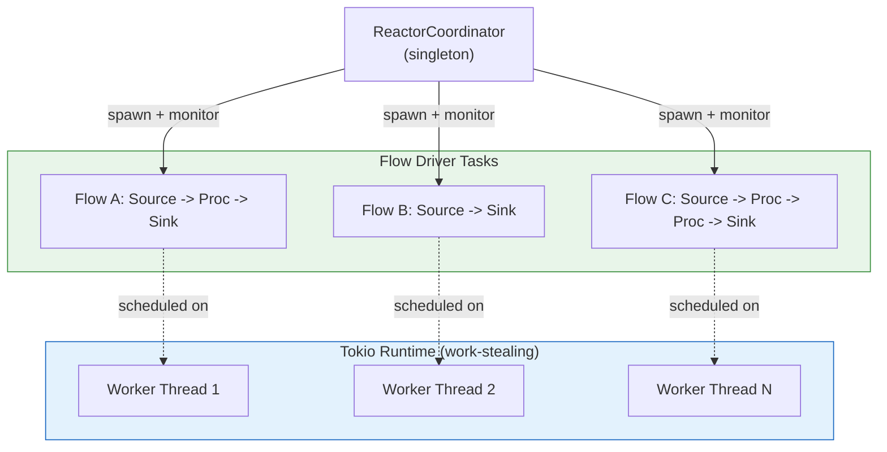

**Why task-per-flow, not task-per-component?** Task-per-component would create excessive Tokio task overhead for deep pipelines. Task-per-flow gives the reactor control over intra-flow scheduling while Tokio handles inter-flow distribution. This mirrors Apache Flink's task-slot model.

**Cooperative yield** ensures fairness: flow drivers yield to Tokio after a configurable batch of elements (default: 32, `DEFAULT_ELEMENTS_PER_YIELD`) or time quantum, with a hard ceiling of 256 elements (`MAX_CONSECUTIVE_ELEMENTS_BEFORE_YIELD`).

> **Source:** [04_reactor_and_scheduling.md](../docs/design/04_reactor_and_scheduling.md), Sections 1 and 3; [ARCHITECTURE.md](ARCHITECTURE.md), Design Decision 2.

### 9.4 Concurrency Model

Torvyn uses **Tokio's multi-threaded work-stealing runtime exclusively**. No custom OS threads.

| Task Type | Purpose |
|-----------|---------|
| ReactorCoordinator (async, singleton) | Flow lifecycle management |
| FlowDriver (async, 1 per flow) | Scheduling loop, hot path |
| Observability export (async, background) | OTLP/JSON/channel export |
| Component loading (spawn_blocking) | Read .wasm from disk |
| Config parsing (spawn_blocking) | Read Torvyn.toml |
| Cache I/O (spawn_blocking) | Compiled component serialize/deserialize |

Within a flow, **all stream state is owned by the flow driver task** --- no shared mutable access to stream queues. Cross-flow communication uses Tokio channels (message-passing, not shared memory).

> **Source:** [ARCHITECTURE.md](ARCHITECTURE.md), Design Decision 6; [04_reactor_and_scheduling.md](../docs/design/04_reactor_and_scheduling.md), Section 9.

### 9.5 Pipeline Startup Sequence

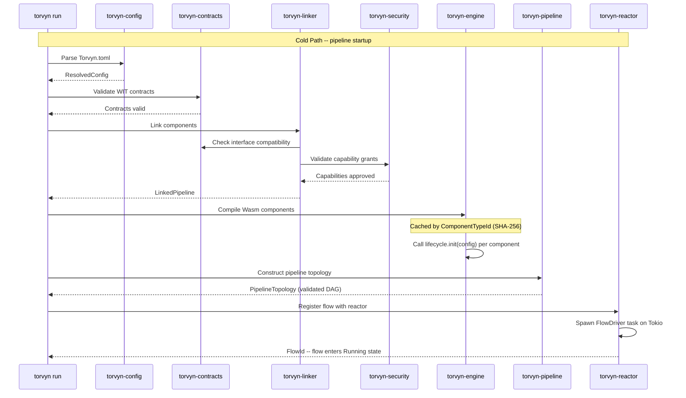

Compilation results are cached by `ComponentTypeId` (SHA-256 hash of the Wasm binary), so subsequent starts skip recompilation.

> **Source:** [ARCHITECTURE.md](ARCHITECTURE.md), "Pipeline Startup --- Cold Path".

---

## 10. Identity Types and Error Model

### 10.1 Identity Types

Every entity in the Torvyn runtime has a unique, typed identifier:

| Type | Size | Purpose | Path Marker |
|------|------|---------|-------------|
| `ComponentTypeId` | `[u8; 32]` (SHA-256) | Content-addressed compiled artifact identifier | Cold |
| `ComponentInstanceId` (alias: `ComponentId`) | `u64` | Runtime instance identifier (monotonic, never reused) | Cold |
| `FlowId` | `u64` | Pipeline execution instance | Cold |
| `StreamId` | `u64` | Data connection between components | Warm |
| `ResourceId` | `{ index: u32, generation: u32 }` | Generational buffer slot (ABA-safe) | Hot |
| `BufferHandle` | `ResourceId` (newtype) | Typed wrapper for buffer resources | Hot |
| `TraceId` | `[u8; 16]` | W3C 128-bit trace ID | Warm |
| `SpanId` | `[u8; 8]` | W3C 64-bit span ID | Warm |

All identity types are `Copy`, `Eq`, `Hash`, and cheaply comparable. They are annotated with their usage path (Hot, Warm, Cold) to guide optimization decisions.

> **Source:** [crates/torvyn-types/src/identity.rs](../crates/torvyn-types/src/identity.rs).

### 10.2 Error Hierarchy

Torvyn uses a structured error hierarchy with 9 subsystem-specific error types aggregated by `TorvynError`:

| Error Type | Code Range | Scope |
|-----------|-----------|-------|
| `ProcessError` | WIT-mapped | Component processing failures (5 variants) |
| `ContractError` | E0100--E0199 | WIT parsing, interface mismatch, version conflicts |
| `LinkError` | E0200--E0299 | Unresolved imports, capability denials, cycles |
| `ResourceError` | E0300--E0399 | Stale handles, ownership violations, budget exceeded |
| `ReactorError` | E0400--E0499 | Flow not found, invalid state, timeout, queue errors |
| `SecurityError` | E0500--E0599 | Capability denied, sandbox config, policy violation |
| `PackagingError` | E0600--E0699 | Invalid artifact, registry errors, signature failures |
| `ConfigError` | E0700--E0799 | File not found, parse errors, missing fields |
| `EngineError` | E0800--E0899 | Wasm compilation/instantiation failures |

Every error variant includes enough context for the caller to understand the error, and every error is actionable: it either indicates a component bug, a configuration issue, or a resource exhaustion condition.

> **Source:** [crates/torvyn-types/src/error.rs](../crates/torvyn-types/src/error.rs).

---

## 11. Configuration System

### 11.1 Two-Context Configuration Model

Torvyn separates configuration into two contexts:

| Context | File | Contains |
|---------|------|----------|
| **Component Manifest** | `Torvyn.toml` in component project | Project metadata, component declarations, build/test config, capability declarations |
| **Pipeline Definition** | Standalone `pipeline.toml` or `[flow.*]` in Torvyn.toml | Flow topology, per-component overrides, stream config (queue depth, backpressure), scheduling, security, observability |

The `ResolvedConfig` type merges both contexts with environment overrides into a single validated configuration.

### 11.2 Environment Variable Interpolation

Configuration values support `env::VARIABLE_NAME` interpolation:

```toml
[flow.nodes.enricher]
config = '{"api_key": "env::ENRICHMENT_API_KEY"}'
```

CLI overrides via `--config KEY=VALUE` take precedence over file values, which take precedence over environment defaults.

> **Source:** [crates/torvyn-config/src/lib.rs](../crates/torvyn-config/src/lib.rs).

---

## 12. Design Principles

These principles govern every design decision in Torvyn. They are drawn from the vision document and architecture guide:

1. **Contract-first.** The WIT contract is the center of the product. Ownership, backpressure, and metadata are contract-level concerns, not runtime afterthoughts.

2. **Ownership is explicit and enforced.** Every buffer has exactly one owner. Borrows are scoped to function calls. Violations produce clear, typed errors.

3. **Minimize copies, never promise zero-copy universally.** The Wasm memory model imposes real boundaries. Torvyn minimizes how often data crosses them, tracks every crossing, and makes the cost measurable.

4. **Deny-all-by-default security.** Components start with zero permissions. Every capability is explicitly granted, validated at link time, and enforced at runtime.

5. **Three-level observability with overhead budgets.** Production monitoring must not degrade performance. Each observability level has an explicit overhead budget enforced by design.

6. **Backpressure is fundamental.** Flow control is built into stream semantics, not bolted on. Bounded queues, watermark hysteresis, and demand propagation prevent unbounded resource consumption.

7. **Fail safely, never silently.** Resource violations, capability denials, and state machine errors produce actionable diagnostics. No corruption, no silent failure.

8. **Benchmarks are product features.** All performance claims are backed by reproducible methodology. Copy counts, latency percentiles, and throughput are measured and reported.

> **Source:** [README.md](../README.md); [ARCHITECTURE.md](ARCHITECTURE.md), "Design Decisions"; [01_contracts_and_wit_design.md](../docs/design/01_contracts_and_wit_design.md), Section 1.2.
