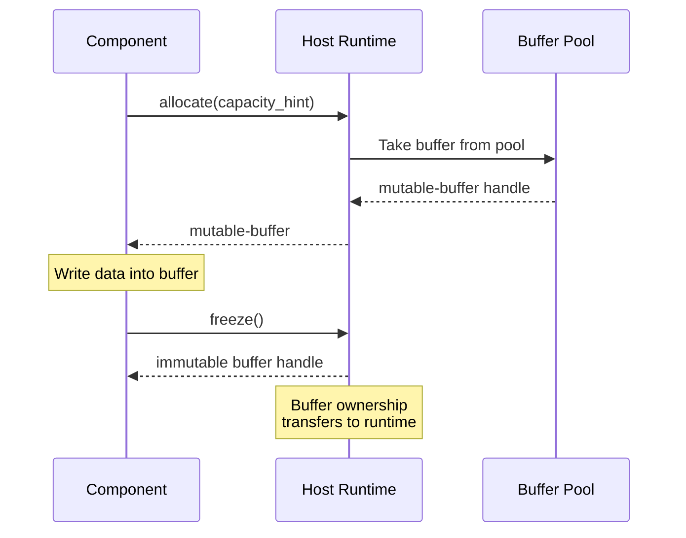
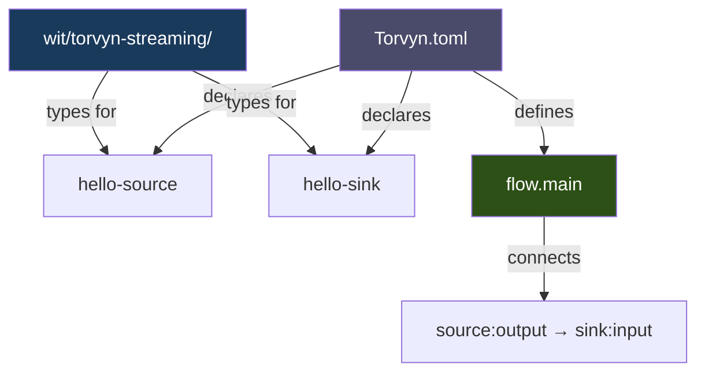
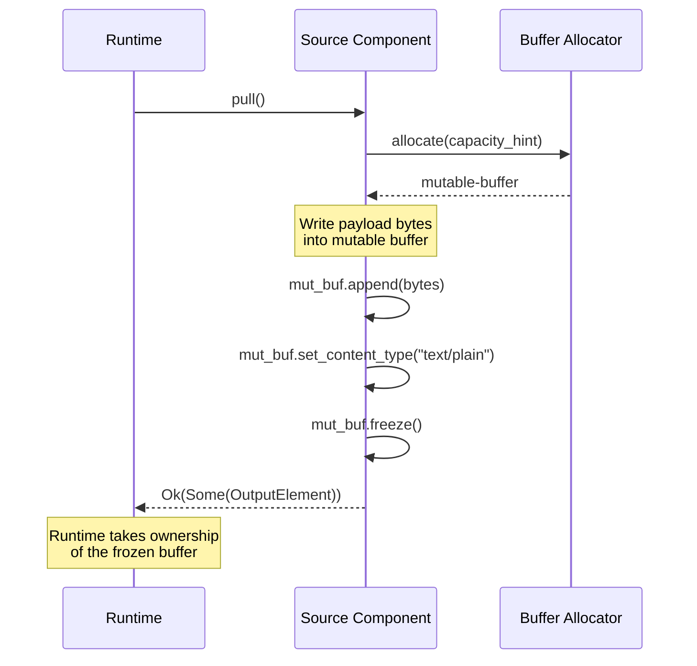
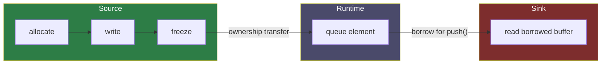
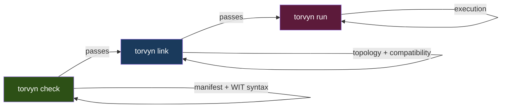
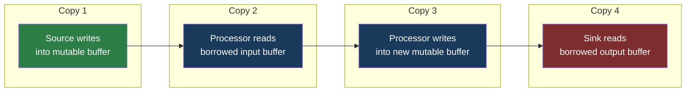
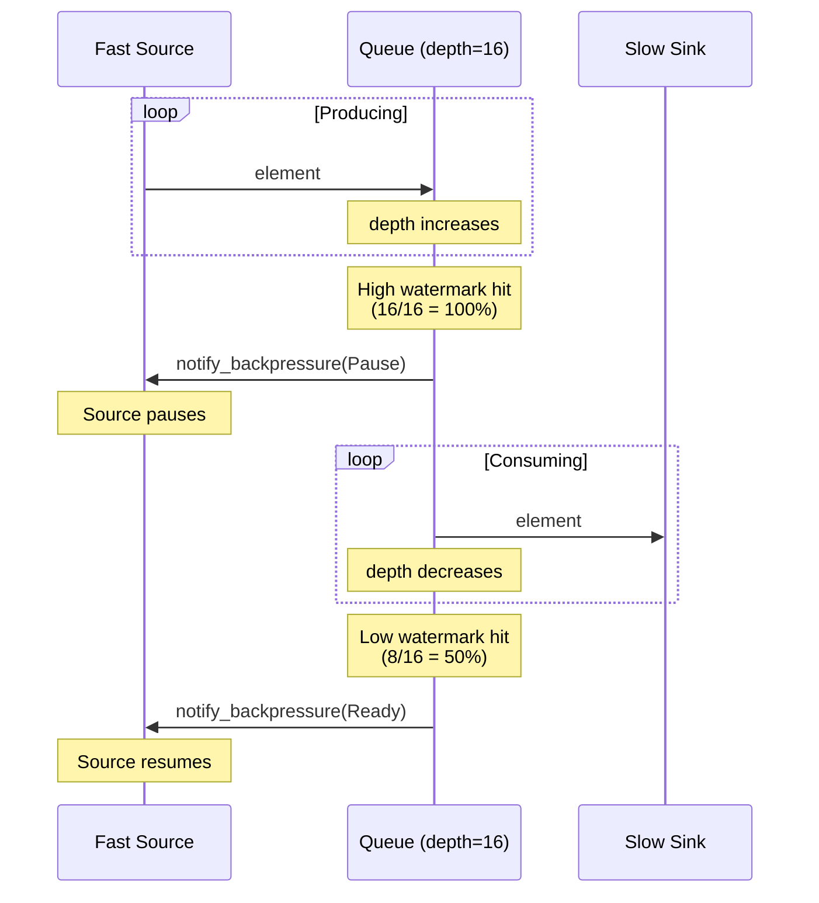

# Getting Started with Torvyn

This guide walks you from a fresh machine to a running Torvyn pipeline. By the end, you will have built, validated, and executed a streaming pipeline composed of sandboxed WebAssembly components, and you will understand the concepts behind each step.

---

## Table of Contents

- [Prerequisites](#prerequisites)
- [Install the Torvyn CLI](#install-the-torvyn-cli)
- [Verify Your Environment](#verify-your-environment)
- [Understanding the Programming Model](#understanding-the-programming-model)
- [Create Your First Pipeline](#create-your-first-pipeline)
- [Project Structure](#project-structure)
- [Understanding the Manifest](#understanding-the-manifest)
- [Understanding the WIT Contracts](#understanding-the-wit-contracts)
- [Writing a Source Component](#writing-a-source-component)
- [Writing a Sink Component](#writing-a-sink-component)
- [Build the Components](#build-the-components)
- [Validate and Link](#validate-and-link)
- [Run the Pipeline](#run-the-pipeline)
- [Trace the Pipeline](#trace-the-pipeline)
- [Benchmark the Pipeline](#benchmark-the-pipeline)
- [Adding a Processor Stage](#adding-a-processor-stage)
- [Understanding Backpressure](#understanding-backpressure)
- [What to Explore Next](#what-to-explore-next)

---

## Prerequisites

Torvyn components compile to WebAssembly and run inside the Torvyn host runtime. You need the following tools installed before proceeding.

| Tool | Minimum Version | Purpose |
|------|----------------|---------|
| [Rust](https://rustup.rs/) | 1.78 | Component implementation and CLI |
| `wasm32-wasip2` target | — | Compile Rust to Wasm Components |
| [cargo-component](https://github.com/bytecodealliance/cargo-component) | Latest | Build Wasm components from Cargo projects |
| Torvyn CLI | 0.1.0 | Project scaffolding, validation, execution |

### Install Rust

If you don't have Rust installed, use [rustup](https://rustup.rs/):

```bash
curl --proto '=https' --tlsv1.2 -sSf https://sh.rustup.rs | sh
```

### Add the WebAssembly Target

Torvyn components compile to the WASI Preview 2 target:

```bash
rustup target add wasm32-wasip2
```

### Install cargo-component

`cargo-component` extends Cargo to build WebAssembly components from standard Rust crate structures:

```bash
cargo install cargo-component
```

### Install the Torvyn CLI

```bash
cargo install torvyn-cli
```

Verify the installation:

```bash
torvyn --version
```

---

## Verify Your Environment

Torvyn includes a built-in environment checker that validates all prerequisites:

```bash
torvyn doctor
```

Expected output:

```
Torvyn Doctor
=============

  [PASS] Torvyn CLI .............. v0.1.0
  [PASS] Rust toolchain .......... rustc 1.78.0
  [PASS] wasm32-wasip2 target .... installed
  [PASS] cargo-component ......... installed
  [PASS] wasm-tools .............. installed

  All checks passed.
```

If any check fails, `torvyn doctor --fix` will attempt to install the missing tool automatically.

---

## Understanding the Programming Model

Before writing code, it helps to understand how Torvyn pipelines work. This section covers the essential concepts. You can skip to [Create Your First Pipeline](#create-your-first-pipeline) if you prefer to learn by building.

### Components and Flows

A Torvyn pipeline is a **flow** — a directed acyclic graph of **components** connected by **streams**. Each component is a sandboxed WebAssembly module that implements one of Torvyn's typed interfaces. The host runtime manages all data movement between components.


### Component Roles

Every component in Torvyn implements a specific role, each with different ownership semantics:

| Role | Produces Data | Consumes Data | Description |
|------|:---:|:---:|---|
| **Source** | Yes | No | Pulls data from an external origin (file, API, generator) |
| **Processor** | Yes | Yes | Transforms each element 1:1 (parse, enrich, convert) |
| **Sink** | No | Yes | Writes data to an external destination (stdout, database, file) |
| **Filter** | No | Yes | Accepts or rejects elements without allocating buffers |
| **Aggregator** | Yes | Yes | Collects elements into windows, emits aggregated results |

### Ownership and Buffers

All byte buffers in Torvyn are managed by the host runtime, not by the components. Components never allocate host-side memory directly — they request buffers from the host and access them through opaque handles.



This design gives the runtime complete visibility into every buffer allocation, every byte copy, and every ownership transfer. Nothing is hidden.

### Contracts

Components communicate through **WIT contracts** — typed interface definitions from the WebAssembly Component Model. WIT contracts specify exactly which functions a component exports, which functions it imports, and the types of all data exchanged. The runtime validates compatibility before a pipeline ever runs.

---

## Create Your First Pipeline

Torvyn's `init` command scaffolds a complete project. We'll create the simplest possible pipeline: a Source that produces messages and a Sink that prints them.

```bash
torvyn init hello-world --template source-sink
cd hello-world
```

> **Available templates:** `source`, `sink`, `transform`, `filter`, `aggregator`, `full-pipeline`, `empty`. Use `--template full-pipeline` to scaffold a three-stage Source + Processor + Sink pipeline.

---

## Project Structure

After scaffolding, the project contains:

```
hello-world/
├── Torvyn.toml                          # Project manifest and flow definition
├── Makefile                             # Build, run, and test commands
├── README.md                            # Project documentation
├── .gitignore
├── wit/
│   └── torvyn-streaming/                # WIT contract definitions
│       ├── types.wit                    # Core types: buffers, elements, errors
│       ├── source.wit                   # Source interface: pull()
│       ├── sink.wit                     # Sink interface: push(), complete()
│       ├── processor.wit                # Processor interface: process()
│       ├── lifecycle.wit                # Lifecycle: init(), teardown()
│       ├── buffer-allocator.wit         # Buffer allocation: allocate(), clone()
│       └── world.wit                    # Component world definitions
└── components/
    ├── hello-source/                    # Source component
    │   ├── Cargo.toml
    │   └── src/
    │       └── lib.rs
    └── hello-sink/                      # Sink component
        ├── Cargo.toml
        └── src/
            └── lib.rs
```



---

## Understanding the Manifest

The `Torvyn.toml` file is the central configuration for your project. It declares components, defines flows, and configures the pipeline topology.

```toml
[torvyn]
name = "hello-world"
version = "0.1.0"
contract_version = "0.1.0"
description = "The simplest possible Torvyn pipeline"

# Declare the components in this project.
[[component]]
name = "hello-source"
path = "components/hello-source"

[[component]]
name = "hello-sink"
path = "components/hello-sink"

# Define a flow — a pipeline topology.
[flow.main]
description = "Source produces greetings, sink prints them"

# Nodes: each node maps a logical name to a component + interface.
[flow.main.nodes.source]
component = "hello-source"
interface = "torvyn:streaming/source"
config = '{"count": 5}'

[flow.main.nodes.sink]
component = "hello-sink"
interface = "torvyn:streaming/sink"

# Edges: unidirectional stream connections between nodes.
[[flow.main.edges]]
from = { node = "source", port = "output" }
to = { node = "sink", port = "input" }
```

### Key sections

**`[torvyn]`** — Project metadata. The `contract_version` field specifies which WIT contract family this project targets (currently `0.1.0`).

**`[[component]]`** — Each component declaration maps a name to a directory containing its source code. The component is compiled independently and produces a `.wasm` binary.

**`[flow.main]`** — A flow definition. You can define multiple flows in a single project. Each flow has its own topology.

**`[flow.main.nodes.*]`** — Nodes are the stages in the pipeline. Each node references a component by name, the WIT interface it implements, and an optional JSON config string passed to `lifecycle.init()`.

**`[[flow.main.edges]]`** — Edges connect output ports to input ports, forming the stream topology. Each edge creates a bounded queue between the two nodes.

---

## Understanding the WIT Contracts

WIT (WebAssembly Interface Types) contracts define the typed API boundary between components and the Torvyn runtime. All Torvyn components share the `torvyn:streaming@0.1.0` package.

### Core Types

The `types.wit` file defines the fundamental data types that all components share:

```wit
package torvyn:streaming@0.1.0;

interface types {
    // Host-managed immutable byte buffer. Components read from it.
    resource buffer {
        size: func() -> u64;
        content-type: func() -> string;
        read: func(offset: u64, len: u64) -> list<u8>;
        read-all: func() -> list<u8>;
    }

    // Writable buffer. Components write into it, then freeze.
    resource mutable-buffer {
        write: func(offset: u64, bytes: list<u8>) -> result<_, buffer-error>;
        append: func(bytes: list<u8>) -> result<_, buffer-error>;
        size: func() -> u64;
        capacity: func() -> u64;
        set-content-type: func(content-type: string);
        freeze: func() -> buffer;
    }

    // Metadata attached to every element.
    record element-meta {
        sequence: u64,          // Monotonic, assigned by runtime
        timestamp-ns: u64,      // Wall-clock from runtime entry
        content-type: string,   // MIME type (e.g., "application/json")
    }

    // Input to consumers. Buffer and context are BORROWED.
    record stream-element {
        meta: element-meta,
        payload: borrow<buffer>,
        context: borrow<flow-context>,
    }

    // Output from producers. Buffer is OWNED — transfers to runtime.
    record output-element {
        meta: element-meta,
        payload: buffer,
    }

    // Processing outcome.
    variant process-result {
        emit(output-element),   // Produced new element
        drop,                   // Consumed input, no output
    }

    // Categorized errors for recovery policy.
    variant process-error {
        invalid-input(string),
        unavailable(string),
        internal(string),
        deadline-exceeded,
        fatal(string),
    }

    // Flow control signal.
    enum backpressure-signal {
        ready,
        pause,
    }
}
```

### Interface Definitions

Each component role has a small, focused interface:

**Source** — pull-based data producer:
```wit
interface source {
    pull: func() -> result<option<output-element>, process-error>;
    notify-backpressure: func(signal: backpressure-signal);
}
```

**Sink** — push-based data consumer:
```wit
interface sink {
    push: func(element: stream-element) -> result<backpressure-signal, process-error>;
    complete: func() -> result<_, process-error>;
}
```

**Processor** — stateless 1:1 transform:
```wit
interface processor {
    process: func(input: stream-element) -> result<process-result, process-error>;
}
```

**Lifecycle** — initialization and teardown (implemented by all components):
```wit
interface lifecycle {
    init: func(config: string) -> result<_, process-error>;
    teardown: func();
}
```

### Worlds

A WIT **world** defines the complete contract for a component — what it imports (calls from the host) and what it exports (functions the host calls). Each component role has a corresponding world:

```wit
world data-source {
    import types;
    import buffer-allocator;
    export source;
    export lifecycle;
}

world data-sink {
    import types;
    export sink;
    export lifecycle;
}

world managed-transform {
    import types;
    import buffer-allocator;
    export processor;
    export lifecycle;
}
```

Notice the asymmetry: sources and processors import `buffer-allocator` because they produce data and need to allocate buffers. Sinks only consume data (via borrowed handles) and don't need buffer allocation.

---

## Writing a Source Component

A source component implements the `source` and `lifecycle` interfaces. It produces data by allocating buffers from the host, writing payload data, and returning ownership to the runtime.

Here is the complete implementation of a hello-world source:

```rust
// components/hello-source/src/lib.rs

//! Hello World source component.
//!
//! Produces a configurable number of "Hello, World!" messages,
//! then signals stream exhaustion.

// Generate Rust bindings from the WIT contracts.
wit_bindgen::generate!({
    world: "data-source",
    path: "../../wit/torvyn-streaming",
});

use exports::torvyn::streaming::lifecycle::Guest as LifecycleGuest;
use exports::torvyn::streaming::source::Guest as SourceGuest;
use torvyn::streaming::buffer_allocator;
use torvyn::streaming::types::{
    BackpressureSignal, ElementMeta, OutputElement, ProcessError,
};

struct HelloSource {
    total_messages: u64,
    produced: u64,
}

// Component state. Wasm components are single-threaded with no
// reentrancy, so a mutable static is safe here.
static mut STATE: Option<HelloSource> = None;

fn state() -> &'static mut HelloSource {
    unsafe { STATE.as_mut().expect("component not initialized") }
}

impl LifecycleGuest for HelloSource {
    fn init(config: String) -> Result<(), ProcessError> {
        // Parse optional JSON config: {"count": N}
        let total = if config.is_empty() {
            5
        } else {
            config
                .trim()
                .strip_prefix("{\"count\":")
                .and_then(|s| s.strip_suffix('}'))
                .and_then(|s| s.trim().parse::<u64>().ok())
                .unwrap_or(5)
        };

        unsafe {
            STATE = Some(HelloSource {
                total_messages: total,
                produced: 0,
            });
        }
        Ok(())
    }

    fn teardown() {
        unsafe { STATE = None; }
    }
}

impl SourceGuest for HelloSource {
    fn pull() -> Result<Option<OutputElement>, ProcessError> {
        let s = state();

        if s.produced >= s.total_messages {
            // Returning None signals stream exhaustion.
            // The runtime calls complete() on downstream sinks.
            return Ok(None);
        }

        // Format the message payload.
        let message = format!("Hello, World! (message {})", s.produced + 1);
        let payload_bytes = message.as_bytes();

        // Step 1: Allocate a buffer from the host pool.
        let mut_buf = buffer_allocator::allocate(payload_bytes.len() as u64)
            .map_err(|e| ProcessError::Internal(
                format!("buffer allocation failed: {e:?}")
            ))?;

        // Step 2: Write data into the mutable buffer.
        mut_buf.append(payload_bytes)
            .map_err(|e| ProcessError::Internal(
                format!("buffer write failed: {e:?}")
            ))?;

        // Step 3: Set content type for downstream consumers.
        mut_buf.set_content_type("text/plain");

        // Step 4: Freeze into an immutable buffer.
        // Ownership transfers to the runtime when returned.
        let frozen = mut_buf.freeze();

        s.produced += 1;

        Ok(Some(OutputElement {
            meta: ElementMeta {
                sequence: s.produced - 1,
                timestamp_ns: 0,
                content_type: "text/plain".to_string(),
            },
            payload: frozen,
        }))
    }

    fn notify_backpressure(_signal: BackpressureSignal) {
        // This simple source ignores backpressure signals.
        // A production source would pause its data generation.
    }
}

// Register the component with the Wasm component model.
export!(HelloSource);
```

### What happens during `pull()`



The `Cargo.toml` for a source component:

```toml
[package]
name = "hello-source"
version = "0.1.0"
edition = "2021"

[lib]
crate-type = ["cdylib"]

[dependencies]
wit-bindgen = "0.36"

[package.metadata.component]
package = "torvyn:streaming"

[package.metadata.component.target]
world = "data-source"
path = "../../wit/torvyn-streaming"
```

Three things to note in `Cargo.toml`:
1. **`crate-type = ["cdylib"]`** — produces a dynamic library (required for Wasm components)
2. **`[package.metadata.component]`** — tells `cargo-component` which WIT package to use
3. **`world = "data-source"`** — specifies the WIT world this component targets

---

## Writing a Sink Component

A sink component implements the `sink` and `lifecycle` interfaces. It receives elements with **borrowed** buffer handles — valid only for the duration of the `push()` call.

```rust
// components/hello-sink/src/lib.rs

//! Hello World sink component.
//!
//! Prints each received message to stdout.

wit_bindgen::generate!({
    world: "data-sink",
    path: "../../wit/torvyn-streaming",
});

use exports::torvyn::streaming::lifecycle::Guest as LifecycleGuest;
use exports::torvyn::streaming::sink::Guest as SinkGuest;
use torvyn::streaming::types::{
    BackpressureSignal, ProcessError, StreamElement,
};

struct HelloSink {
    received: u64,
}

static mut STATE: Option<HelloSink> = None;

fn state() -> &'static mut HelloSink {
    unsafe { STATE.as_mut().expect("component not initialized") }
}

impl LifecycleGuest for HelloSink {
    fn init(_config: String) -> Result<(), ProcessError> {
        unsafe {
            STATE = Some(HelloSink { received: 0 });
        }
        Ok(())
    }

    fn teardown() {
        let s = state();
        println!("[hello-sink] Received {} messages total.", s.received);
        unsafe { STATE = None; }
    }
}

impl SinkGuest for HelloSink {
    fn push(element: StreamElement) -> Result<BackpressureSignal, ProcessError> {
        let s = state();

        // Read the payload from the borrowed buffer.
        // This handle is only valid during this push() call.
        let payload_bytes = element.payload.read_all();

        let text = String::from_utf8(payload_bytes)
            .map_err(|e| ProcessError::InvalidInput(
                format!("payload is not UTF-8: {e}")
            ))?;

        println!("[hello-sink] seq={}: {}", element.meta.sequence, text);

        s.received += 1;

        // Signal that we're ready for the next element.
        Ok(BackpressureSignal::Ready)
    }

    fn complete() -> Result<(), ProcessError> {
        println!("[hello-sink] Stream complete.");
        Ok(())
    }
}

export!(HelloSink);
```

### Key difference: ownership

Notice the difference between source and sink:

| | Source | Sink |
|---|---|---|
| Buffer handle | **Owned** (`buffer` in `output-element`) | **Borrowed** (`borrow<buffer>` in `stream-element`) |
| Buffer allocation | Source calls `buffer_allocator::allocate()` | Sink does not allocate |
| After function returns | Runtime takes ownership of output buffer | Borrowed handle becomes invalid |



---

## Build the Components

Each component is compiled independently to a WebAssembly binary using `cargo-component`:

```bash
cd components/hello-source && cargo component build --release
cd ../../components/hello-sink && cargo component build --release
cd ../..
```

Or, if your project includes a Makefile:

```bash
make build
```

This produces `.wasm` files in each component's `target/wasm32-wasip1/release/` directory.

---

## Validate and Link

Before running, validate the project structure, WIT contracts, and pipeline topology.

### Check

`torvyn check` validates the manifest and WIT contracts without running anything:

```bash
torvyn check
```

```
Check Results
=============

  Manifest:  Torvyn.toml .... valid
  WIT files: 7 parsed ....... 0 errors, 0 warnings

  All checks passed.
```

This verifies:
- `Torvyn.toml` syntax and semantic correctness
- All WIT files parse without errors
- World definitions resolve correctly

### Link

`torvyn link` goes further — it validates that the flow topology is valid and that components are compatible:

```bash
torvyn link
```

```
Link Results
============

  Flow: main
    Components: 2
    Edges:      1
    Topology:   valid (DAG, fully connected)
    Status:     linked

  All flows linked successfully.
```

This verifies:
- The flow forms a valid directed acyclic graph (DAG)
- All nodes are connected (no orphan components)
- Interface roles are consistent (sources produce, sinks consume)
- Capability grants are sufficient

### The validation pipeline



---

## Run the Pipeline

Execute the pipeline with `torvyn run`:

```bash
torvyn run
```

Expected output:

```
[hello-sink] seq=0: Hello, World! (message 1)
[hello-sink] seq=1: Hello, World! (message 2)
[hello-sink] seq=2: Hello, World! (message 3)
[hello-sink] seq=3: Hello, World! (message 4)
[hello-sink] seq=4: Hello, World! (message 5)
[hello-sink] Stream complete.
[hello-sink] Received 5 messages total.

Pipeline Summary
================
  Flow:       main
  Duration:   0.003s
  Elements:   5
  Throughput: 1,667 elem/s
  Errors:     0
```

### Useful options

Limit the number of elements processed:
```bash
torvyn run --limit 3
```

Set a maximum execution time:
```bash
torvyn run --timeout 10s
```

Override component configuration from the command line:
```bash
torvyn run --config 'hello-source={"count": 20}'
```

Run a specific flow (when the manifest defines multiple):
```bash
torvyn run --flow main
```

Output results as JSON for scripting:
```bash
torvyn run --format json
```

---

## Trace the Pipeline

`torvyn trace` runs the pipeline with full diagnostic instrumentation, producing a per-element breakdown:

```bash
torvyn trace --limit 3
```

```
Trace: flow=main
═══════════════

Element 0
  ├─ hello-source::pull()      12.3 µs   buffer=h0 size=28B type=text/plain
  ├─ [queue]                    0.4 µs   depth=0/16
  └─ hello-sink::push()         8.1 µs   read=28B
  total: 20.8 µs

Element 1
  ├─ hello-source::pull()      10.1 µs   buffer=h1 size=28B type=text/plain
  ├─ [queue]                    0.3 µs   depth=0/16
  └─ hello-sink::push()         7.4 µs   read=28B
  total: 17.8 µs

Element 2
  ├─ hello-source::pull()       9.8 µs   buffer=h2 size=28B type=text/plain
  ├─ [queue]                    0.3 µs   depth=0/16
  └─ hello-sink::push()         7.2 µs   read=28B
  total: 17.3 µs

Summary
───────
  Elements traced:  3
  Avg latency:      18.6 µs
  P50 latency:      17.8 µs
  P99 latency:      20.8 µs
  Total copies:     3
  Backpressure:     0 events
```

### Trace options

Show buffer contents alongside traces:
```bash
torvyn trace --show-buffers
```

Highlight backpressure events (useful for debugging slow consumers):
```bash
torvyn trace --show-backpressure
```

Export trace data as JSON or OpenTelemetry format:
```bash
torvyn trace --trace-format json --output-trace trace.json
torvyn trace --trace-format otlp --output-trace trace.otlp
```

---

## Benchmark the Pipeline

`torvyn bench` measures pipeline performance with a dedicated warmup phase and statistical reporting:

```bash
torvyn bench --duration 10s --warmup 2s
```

```
Benchmark Report: flow=main
════════════════════════════

Throughput
  Elements/sec:  42,350
  Bytes/sec:     1.18 MB/s

Latency (µs)
  P50:    4.2
  P90:    6.1
  P95:    7.8
  P99:   12.3
  P999:  28.7
  Max:   45.2

Per-Component Latency (µs)
  hello-source::pull()     P50: 2.1    P99: 5.4
  hello-sink::push()       P50: 1.8    P99: 4.9

Resources
  Buffer allocs:       423,500
  Pool reuse:          98.2%
  Total copies:        423,500
  Peak memory:         2.1 MB

Scheduling
  Wakeups:             423,500
  Backpressure events: 0
  Queue peak:          1/16
```

### Save and compare benchmarks

Save a benchmark as a named baseline:
```bash
torvyn bench --baseline "v1-initial" --report results.json
```

Compare against a previous run:
```bash
torvyn bench --compare results.json
```

Export in different formats:
```bash
torvyn bench --report-format markdown --report bench-results.md
torvyn bench --report-format csv --report bench-results.csv
```

---

## Adding a Processor Stage

Once you're comfortable with Source and Sink, the next step is adding a **Processor** — a component that reads input, transforms it, and produces output. This introduces the core concept of Torvyn's ownership model: the processor **borrows** the input buffer and **owns** the output buffer.

### Processor implementation

```rust
// components/json-transform/src/lib.rs

wit_bindgen::generate!({
    world: "managed-transform",
    path: "../../wit/torvyn-streaming",
});

use exports::torvyn::streaming::lifecycle::Guest as LifecycleGuest;
use exports::torvyn::streaming::processor::Guest as ProcessorGuest;
use torvyn::streaming::buffer_allocator;
use torvyn::streaming::types::*;

struct JsonTransform;
static mut INITIALIZED: bool = false;

impl LifecycleGuest for JsonTransform {
    fn init(_config: String) -> Result<(), ProcessError> {
        unsafe { INITIALIZED = true; }
        Ok(())
    }
    fn teardown() {
        unsafe { INITIALIZED = false; }
    }
}

impl ProcessorGuest for JsonTransform {
    fn process(input: StreamElement) -> Result<ProcessResult, ProcessError> {
        // Step 1: Read the borrowed input buffer (measured copy).
        let input_bytes = input.payload.read_all();

        // Step 2: Transform the data in component linear memory.
        let input_str = String::from_utf8(input_bytes)
            .map_err(|e| ProcessError::InvalidInput(format!("not UTF-8: {e}")))?;

        let transformed = input_str
            .replace("\"user\":", "\"username\":")
            .trim_end_matches('}')
            .to_string()
            + ",\"processed_at\":\"2025-01-15T10:30:00Z\"}";

        let out_bytes = transformed.as_bytes();

        // Step 3: Allocate a new output buffer from the host pool.
        let out_buf = buffer_allocator::allocate(out_bytes.len() as u64)
            .map_err(|e| ProcessError::Internal(format!("{e:?}")))?;
        out_buf.append(out_bytes)
            .map_err(|e| ProcessError::Internal(format!("{e:?}")))?;
        out_buf.set_content_type("application/json");

        // Step 4: Freeze and return. Ownership transfers to runtime.
        let frozen = out_buf.freeze();

        Ok(ProcessResult::Emit(OutputElement {
            meta: ElementMeta {
                sequence: input.meta.sequence,
                timestamp_ns: 0,
                content_type: "application/json".to_string(),
            },
            payload: frozen,
        }))
    }
}

export!(JsonTransform);
```

### Copy accounting for a three-stage pipeline

With a Source, Processor, and Sink, Torvyn produces exactly **4 measured payload copies** per element:



Every copy is instrumented by the resource manager. `torvyn trace` and `torvyn bench` report the exact count. This number is not an estimate — it is a runtime invariant.

### Updated manifest for three stages

```toml
[flow.main]
description = "Source -> Transform -> Sink"

[flow.main.nodes.source]
component = "json-source"
interface = "torvyn:streaming/source"

[flow.main.nodes.transform]
component = "json-transform"
interface = "torvyn:streaming/processor"

[flow.main.nodes.sink]
component = "json-sink"
interface = "torvyn:streaming/sink"

[[flow.main.edges]]
from = { node = "source", port = "output" }
to = { node = "transform", port = "input" }

[[flow.main.edges]]
from = { node = "transform", port = "output" }
to = { node = "sink", port = "input" }
```

---

## Understanding Backpressure

When a consumer is slower than a producer, data accumulates in the queue between them. Without bounds, this queue would grow without limit and exhaust host memory. Torvyn prevents this with built-in backpressure.

### How it works



### Configuration

Queue depth and watermarks are configured in the flow definition:

```toml
[flow.main]
default_queue_depth = 16    # Bounded queue capacity
```

The high watermark (100% of capacity) triggers `BackpressureSignal::Pause`. The low watermark (50% of capacity) triggers `BackpressureSignal::Ready`.

### Respecting backpressure in a source

A well-behaved source tracks the backpressure signal:

```rust
impl SourceGuest for FastSource {
    fn pull() -> Result<Option<OutputElement>, ProcessError> {
        let s = state();

        // Respect backpressure: if paused, produce nothing.
        if s.paused {
            return Ok(None);
        }

        // ... produce element normally ...
    }

    fn notify_backpressure(signal: BackpressureSignal) {
        let s = state();
        match signal {
            BackpressureSignal::Pause => s.paused = true,
            BackpressureSignal::Ready => s.paused = false,
        }
    }
}
```

> **Note:** Backpressure is advisory — the runtime will enforce queue bounds regardless. But respecting the signal avoids wasted CPU cycles from producing elements that cannot be enqueued.

### Observing backpressure

Use `torvyn trace --show-backpressure` to see backpressure activation cycles:

```
[trace] flow=main queue=source->sink depth=16/16 backpressure=ACTIVATED
[trace] flow=main source notified: PAUSE
[trace] flow=main queue=source->sink depth=8/16  backpressure=DEACTIVATED
[trace] flow=main source notified: READY
```

---

## What to Explore Next

You now understand the fundamentals of Torvyn: writing components, defining flows, and running pipelines with validation, tracing, and benchmarking.

### Example pipelines

The repository includes four complete examples, each demonstrating progressively more advanced concepts:

| Example | Components | Demonstrates |
|---------|-----------|-------------|
| `examples/hello-world/` | Source, Sink | Minimal pipeline, buffer allocation |
| `examples/stream-transform/` | Source, Processor, Sink | JSON transformation, ownership transfer |
| `examples/backpressure-demo/` | Fast Source, Slow Sink | Backpressure activation/deactivation cycles |
| `examples/token-streaming/` | Source, Filter, Aggregator, Sink | AI token pipeline, zero-allocation filtering, windowed aggregation |

### Documentation

- [Concepts](concepts.md) — Deep dive into contracts, ownership, streams, capabilities, and observability
- [Architecture Guide](ARCHITECTURE.md) — Crate structure, data flows, design rationale
- [CLI Reference](cli-reference.md) — Complete reference for all commands and options
- [FAQ](FAQ.md) — Common questions and honest answers
- [API Reference](https://docs.rs/torvyn) — Generated Rust API documentation

### Community

- [GitHub Discussions](https://github.com/torvyn/torvyn/discussions) — Questions, ideas, and conversation
- [Issue Tracker](https://github.com/torvyn/torvyn/issues) — Bug reports and feature requests
- [Contributing Guide](../CONTRIBUTING.md) — Code style, testing, and review process
